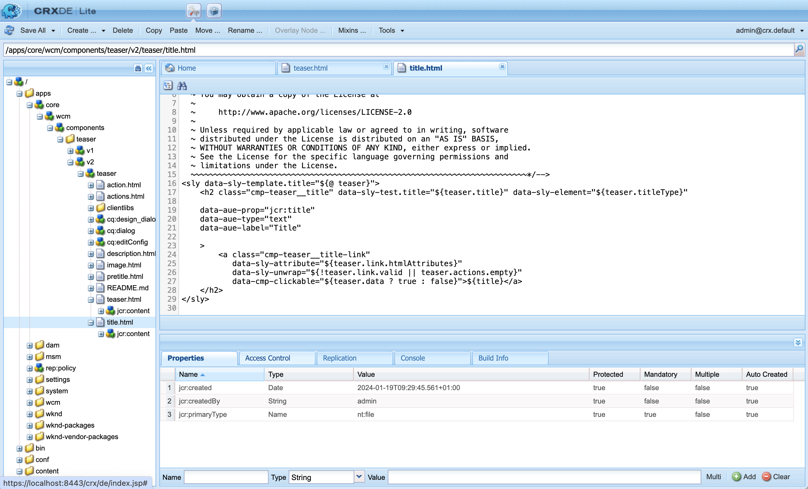

# Übersicht über den universellen Editor für AEM-Entwickler {#developer-overview}

Wenn Sie ein AEM Entwickler sind, der daran interessiert ist, wie der universelle Editor funktioniert und wie er in Ihrem Projekt verwendet wird, bietet Ihnen dieses Dokument eine durchgängige Einführung, indem es Sie durch die Anleitung des WKND-Projekts zur Verwendung mit dem universellen Editor führt.

## Zweck {#purpose}

Dieses Dokument dient als Einführung für Entwickler in die Funktionsweise des universellen Editors und die Instrumentierung Ihrer Anwendung, damit diese funktioniert.

Dies geschieht anhand eines Standardbeispiels, mit dem die meisten AEM Entwickler vertraut sind, der Kernkomponenten und der WKND-Site und mit dem Instrumentieren einiger Beispielkomponenten, die mit dem universellen Editor bearbeitbar sind.

>[!TIP]
>
>In diesem Dokument werden zusätzliche Schritte beschrieben, um zu veranschaulichen, wie der universelle Editor funktioniert. Außerdem soll das Verständnis des Entwicklers für den Editor vertieft werden. Es dauert daher nicht die direkteste Route zur Instrumentierung einer App, sondern die Illustration des universellen Editors und dessen Funktionsweise.
>
>Wenn Sie so schnell wie möglich anfangen möchten, lesen Sie bitte den Abschnitt [Erste Schritte mit dem Universal Editor in AEM](/help/implementing/universal-editor/getting-started.md) Dokument.

## Voraussetzungen {#prerequisites}

Um dieser Übersicht zu folgen, benötigen Sie die folgenden verfügbaren Informationen.

* [Lokale Entwicklungsinstanz AEM as a Cloud Service](https://experienceleague.adobe.com/docs/experience-cloud/software-distribution/home.html?lang=de)
   * Ihre lokale Entwicklungsinstanz muss [mit HTTPS für Entwicklungszwecke konfiguriert wurde `localhost`.](https://experienceleague.adobe.com/docs/experience-manager-learn/foundation/security/use-the-ssl-wizard.html?lang=de)
   * [Die WKND-Demosite muss installiert sein.](https://github.com/adobe/aem-guides-wknd)
* [Zugriff auf den universellen Editor](/help/implementing/universal-editor/getting-started.md#onboarding)
* [Lokaler Universal Editor-Dienst](/help/implementing/universal-editor/local-dev.md) für Entwicklungszwecke ausgeführt werden

Neben der allgemeinen Vertrautheit mit der Webentwicklung geht dieses Dokument von der grundlegenden Vertrautheit mit AEM Entwicklung aus. Wenn Sie nicht mit AEM Entwicklung vertraut sind, lesen Sie [das WKND-Tutorial , bevor Sie fortfahren.](/help/implementing/developing/introduction/develop-wknd-tutorial.md)

## Starten AEM und Anmelden beim universellen Editor {#sign-in}

Wenn Sie dies noch nicht getan haben, muss Ihre lokale AEM-Entwicklungsinstanz mit WKND installiert und HTTPS aktiviert sein als [werden in den Voraussetzungen beschrieben.](#prerequisites) In dieser Übersicht wird davon ausgegangen, dass Ihre Instanz unter `https://localhost:8443`.

1. Öffnen Sie die WKND-Masterseite für Englisch im AEM Editor.

   ```text
   https://localhost:8443/editor.html/content/wknd/language-masters/en.html
   ```

1. Im **Seiteninformationen** im Menü des Editors wählen Sie **Als veröffentlicht anzeigen**. Dadurch wird dieselbe Seite auf einer neuen Registerkarte geöffnet, auf der der AEM Editor deaktiviert ist.

   ```text
   https://localhost:8443/content/wknd/language-masters/en.html?wcmmode=disabled
   ```

1. Kopieren Sie diesen Link.

1. Melden Sie sich jetzt beim Universal Editor an.

   ```text
   https://experience.adobe.com/#/aem/editor
   ```

1. Fügen Sie den Link, den Sie zuvor aus dem WKND-Inhalt kopiert haben, in den **Site-URL** Feld des universellen Editors und klicken Sie auf **Öffnen**.

   

## Universal Editor versucht, den Inhalt zu laden {#sameorigin}

Der Universal Editor lädt Inhalte, die in einem Frame bearbeitet werden sollen. AEM Standardeinstellungen für X-Frame-Optionen verhindern dies, was im Browser eindeutig als Fehler angezeigt und in der Konsolenausgabe detailliert dargestellt werden kann, wenn versucht wird, Ihre lokale Kopie von WKND zu laden.


Die X-Frame-Option `sameorigin` verhindert das Rendern AEM Seiten in einem Frame. Sie müssen diese Kopfzeile entfernen, damit die Seiten im Universal Editor geladen werden können.

1. Öffnen Sie Configuration Manager.

   ```text
   https://localhost:8443/system/console/configMgr
   ```

1. Bearbeiten der OSGi-Konfiguration `org.apache.sling.engine.impl.SlingMainServlet`

   

1. Eigenschaft löschen `X-Frame-Options=SAMEORIGIN` der Eigenschaft **Zusätzliche Antwort-Header**.

1. Speichern Sie die Änderungen.

Wenn Sie jetzt den universellen Editor neu laden, sehen Sie, dass Ihre AEM Seite geladen wird.

>[!TIP]
>
>* Siehe Dokument . [Erste Schritte mit dem Universal Editor in AEM](/help/implementing/universal-editor/getting-started.md#sameorigin) Weitere Informationen zu dieser OSGi-Konfiguration.
>* Siehe Dokument . [Konfigurieren von OSGi für Adobe Experience Manager as a Cloud Service](/help/implementing/deploying/configuring-osgi.md) für Details zu OSGi in AEM.

## Umgang mit denselben Site-Cookies {#samesite-cookies}

Wenn der universelle Editor Ihre Seite lädt, wird sie auf die Anmeldeseite geladen, um sicherzustellen, dass Sie für Änderungen authentifiziert sind.

Sie können sich jedoch nicht erfolgreich anmelden. In der Browser-Konsole können Sie sehen, dass der Browser die Eingabe im Frame blockiert hat.


Das Anmeldetoken-Cookie wird als Drittanbieterdomäne an AEM gesendet. Daher müssen in AEM die gleichen Site-Cookies erlaubt sein.

1. Öffnen Sie Configuration Manager.

   ```text
   https://localhost:8443/system/console/configMgr
   ```

1. Bearbeiten der OSGi-Konfiguration `com.day.crx.security.token.impl.impl.TokenAuthenticationHandler`

   

1. Eigenschaft ändern **SameSite-Attribut für das Anmelde-Token-Cookie** nach `None`.

1. Speichern Sie die Änderungen.

Wenn Sie jetzt den Universal Editor neu laden, können Sie sich erfolgreich bei AEM anmelden und Ihre Zielseite wird geladen.

>[!TIP]
>
>* Siehe Dokument . [Erste Schritte mit dem Universal Editor in AEM](/help/implementing/universal-editor/getting-started.md#samesite-cookies) Weitere Informationen zu dieser OSGi-Konfiguration.
>* Siehe Dokument . [Konfigurieren von OSGi für Adobe Experience Manager as a Cloud Service](/help/implementing/deploying/configuring-osgi.md) für Details zu OSGi in AEM.

## Universelle Editoren stellen Verbindungen zum Remote-Frame her {#ue-connect-remote-frame}

Nachdem die Seite im universellen Editor geladen und Sie sich bei AEM angemeldet haben, versucht der universelle Editor, eine Verbindung zum Remote-Frame herzustellen. Dies erfolgt über eine JavaScript-Bibliothek, die im Remote-Frame geladen werden muss. Wenn die JavaScript-Bibliothek nicht vorhanden ist, erzeugt die Seite letztendlich einen Timeout-Fehler in der Konsole.


Sie müssen die erforderliche JavaScript-Bibliothek zur Seitenkomponente der WKND-App hinzufügen.

1. Öffnen Sie CRXDE Lite.

   ```text
   https://localhost:8443/crx/de
   ```

1. under `/apps/wknd/components/page`, bearbeiten Sie die Datei `customheaderlibs.html`.

   

1. Fügen Sie die JavaScript-Bibliothek am Ende der Datei hinzu.

   ```html
   <script src="https://cdn.jsdelivr.net/gh/adobe/universal-editor-cors/dist/universal-editor-embedded.js"></script>
   ```

1. Klicks **Alle speichern** und dann den universellen Editor neu laden.

Die Seite wird jetzt mit der richtigen JavaScript-Bibliothek geladen, damit der Universal Editor eine Verbindung zu Ihrer Seite herstellen kann und der Timeout-Fehler nicht mehr in der Konsole angezeigt wird.

>[!TIP]
>
>* Die Bibliothek kann entweder in die Kopfzeile oder in die Fußzeile geladen werden.
>* Die `universal-editor-embedded.js` Bibliothek [ist auf NPM verfügbar](https://www.npmjs.com/package/@adobe/universal-editor-cors) und Sie können es bei Bedarf selbst hosten oder direkt in Ihre Anwendung einfügen.

## Definieren einer Verbindung zu persistenten Änderungen {#connection}

Die WKND-Seite wird jetzt erfolgreich im universellen Editor geladen und die JavaScript-Bibliothek wird geladen, um den Editor mit Ihrer App zu verbinden.

Wahrscheinlich haben Sie jedoch schnell bemerkt, dass Sie im universellen Editor nicht mit der Seite interagieren können. Der Universal Editor kann Ihre Seite nicht bearbeiten. Damit der universelle Editor Ihren Inhalt bearbeiten kann, müssen Sie eine Verbindung definieren, damit er weiß, wo der Inhalt geschrieben werden soll. Für die lokale Entwicklung müssen Sie zurück in Ihre lokale AEM-Entwicklungsinstanz schreiben unter `https://localhost:8443`.

1. Öffnen Sie CRXDE Lite.

   ```text
   https://localhost:8443/crx/de
   ```

1. under `/apps/wknd/components/page`, bearbeiten Sie die Datei `customheaderlibs.html`.

   

1. Fügen Sie die erforderlichen Metadaten für die Verbindung zu Ihrer lokalen AEM-Instanz am Dateiende hinzu.

   ```html
   <meta name="urn:adobe:aue:system:aem" content="aem:https://localhost:8443">
   ```

1. Fügen Sie am Ende der Datei die erforderlichen Metadaten für die Verbindung mit Ihrem lokalen Universal Editor-Dienst hinzu.

   ```html
   <meta name="urn:adobe:aue:config:service" content="https://localhost:8000">
   ```

1. Klicks **Alle speichern** und dann den universellen Editor neu laden.

Jetzt kann der Universal Editor Ihre Inhalte nicht nur erfolgreich aus Ihrer lokalen AEM-Entwicklungsinstanz laden, sondern auch, wo Sie alle Änderungen beibehalten können, die Sie mit Ihrem lokalen Universal Editor-Dienst vornehmen. Dies ist der erste Schritt, mit dem Ihre App mit dem universellen Editor bearbeitet werden kann.

>[!TIP]
>
>* Siehe Dokument . [Erste Schritte mit dem Universal Editor in AEM](/help/implementing/universal-editor/getting-started.md#connection) Weitere Informationen zu den Verbindungsmetadaten.
>* Siehe Dokument . [Architektur des universellen Editors](/help/implementing/universal-editor/architecture.md#service) für weitere Informationen zur Struktur des universellen Editors.
>* Siehe Dokument . [Lokale AEM mit dem universellen Editor](/help/implementing/universal-editor/local-dev.md) Weitere Informationen zum Herstellen einer Verbindung zu einer selbst gehosteten Version des universellen Editors.

## Instrumentieren von Komponenten {#instrumenting-components}

Sie werden jedoch wahrscheinlich feststellen, dass Sie mit dem universellen Editor immer noch wenig tun können. Wenn Sie versuchen, im universellen Editor oben auf der WKND-Seite auf den Teaser zu klicken, können Sie ihn nicht auswählen (oder alles andere auf der Seite).

Ihre Komponenten müssen auch instrumentiert werden, um mit dem universellen Editor bearbeitbar zu sein. Dazu müssen Sie die Teaser-Komponente bearbeiten. Daher müssen Sie die Kernkomponenten überlagern, da sich die Kernkomponenten unter `/libs`, die unveränderlich ist.

1. Öffnen Sie CRXDE Lite.

   ```text
   https://localhost:8443/crx/de
   ```

1. Knoten auswählen `/libs/core/wcm/components` und klicken **Überlagerungsknoten** in der Symbolleiste.

1. Mit `/apps/` als **Überlagerungsort** klicken **OK**.

   

1. Wählen Sie die `teaser` Knoten unter `/libs/core/wcm/components` und klicken **Kopieren** in der Symbolleiste.

1. Wählen Sie den überlagerten Knoten unter `/apps/core/wcm/components` und klicken **Einfügen** in der Symbolleiste.

1. Doppelklicken Sie auf die Datei `/apps/core/wcm/components/teaser/v2/teaser/teaser.html` , um sie zu bearbeiten.

   

1. Am Ende des ersten `div` Fügen Sie in etwa Zeile 26 die Instrumentierungsdetails für die Komponente hinzu.

   ```text
   itemscope
   itemid="urn:aem:${resource.path}"
   itemtype="component"
   data-editor-itemlabel="Teaser"
   ```

1. Klicks **Alle speichern** in der Symbolleiste und laden Sie den universellen Editor neu.

1. Klicken Sie im universellen Editor oben auf der Seite auf die Teaser-Komponente und sehen Sie, dass Sie sie jetzt auswählen können.

1. Wenn Sie auf die **Inhaltsstruktur** in der Eigenschaftenleiste des universellen Editors können Sie sehen, dass der Editor alle Teaser auf der Seite erkannt hat, nachdem Sie sie instrumentiert haben. Der ausgewählte Teaser ist der hervorgehobene.

   

>[!TIP]
>
>Siehe Dokument . [Verwenden des Sling Resource Merger in Adobe Experience Manager as a Cloud Service](/help/implementing/developing/introduction/sling-resource-merger.md) Weitere Informationen zum Überlagern von Knoten.

## Instrumentenunterkomponenten des Teasers {#subcomponents}

Sie können jetzt den Teaser auswählen, ihn jedoch nicht bearbeiten. Der Grund dafür ist, dass der Teaser aus verschiedenen Komponenten besteht, z. B. der Bild- und der Titelkomponente. Sie müssen diese Unterkomponenten instrumentieren, um sie zu bearbeiten.

1. Öffnen Sie CRXDE Lite.

   ```text
   https://localhost:8443/crx/de
   ```

1. Knoten auswählen `/apps/core/wcm/components/teaser/v2/teaser/` und doppelklicken Sie auf die `title.html` -Datei.

   

1. Fügen Sie die folgenden Eigenschaften am Ende des `h2` Tag (nahe Zeile 17).

   ```text
   itemprop="jcr:title"
   itemtype="text"
   data-editor-itemlabel="Title"
   ```

1. Klicks **Alle speichern** in der Symbolleiste und laden Sie den universellen Editor neu.

1. Klicken Sie oben auf der Seite auf den Titel derselben Teaser-Komponente und sehen Sie, dass Sie sie jetzt auswählen können. Die Inhaltsstruktur zeigt auch den Titel als Teil der ausgewählten Teaser-Komponente an.

   

Sie können jetzt den Titel der Teaser-Komponente bearbeiten!

## Was bedeutet das alles? {#what-does-it-mean}

Nachdem Sie jetzt den Titel des Teasers bearbeiten können, sollten wir einen Moment Zeit nehmen, um zu überprüfen, was Sie erreicht haben und wie.

Sie haben die Teaser-Komponente im universellen Editor identifiziert, indem Sie sie instrumentieren.

* `itemscope` identifiziert es als Element für den universellen Editor.
* `itemid` identifiziert die Ressource in AEM, die bearbeitet wird.
* `itemtype` definiert, dass die Elemente als Seitenkomponente behandelt werden sollen (im Gegensatz zu Containern).
* `data-editor-itemlabel` zeigt eine benutzerfreundliche Beschriftung in der Benutzeroberfläche für den ausgewählten Teaser an.

Sie haben auch die Titelkomponente innerhalb der Teaser-Komponente instrumentiert.

* `itemprop` ist das geschriebene JCR-Attribut.
* `itemtype` ist die Art und Weise, wie das Attribut bearbeitet werden sollte. In diesem Fall mit dem Texteditor, da es sich um einen Titel handelt (im Gegensatz zum Rich-Text-Editor).

## Authentifizierungskopfzeilen definieren {#auth-header}

Jetzt können Sie den Titel des Teasers inline bearbeiten und Änderungen werden im Browser beibehalten.


Wenn Sie den Browser jedoch neu laden, wird der vorherige Titel neu geladen. Der Grund dafür ist, dass der Universal Editor zwar weiß, wie eine Verbindung zu Ihrer AEM-Instanz hergestellt werden kann, dass er sich jedoch noch nicht bei Ihrer AEM-Instanz authentifizieren kann, um Änderungen an der JCR-Instanz zurückzuschreiben.

Wenn Sie die Registerkarte &quot;Netzwerk&quot;der Browser-Entwickler-Tools anzeigen und nach `update`, sehen Sie, dass beim Versuch, den Titel zu bearbeiten, ein 500-Fehler auftritt.


Wenn Sie den universellen Editor verwenden, um Ihre Produktions-AEM-Inhalte zu bearbeiten, verwendet der universelle Editor dasselbe IMS-Token, das Sie zum Anmelden beim Editor verwendet haben, um sich bei AEM zu authentifizieren, um das Zurückschreiben an das JCR zu erleichtern.

Wenn Sie sich lokal entwickeln, können Sie den AEM Identitäts-Provider nicht verwenden. Daher müssen Sie manuell eine Authentifizierungsmethode bereitstellen, indem Sie explizit einen Authentifizierungs-Header festlegen.

1. Klicken Sie in der Benutzeroberfläche des universellen Editors auf die **Authentifizierungs-Header** in der Symbolleiste.

1. Kopieren Sie in den erforderlichen Authentifizierungs-Header, um sich bei Ihrer lokalen AEM zu authentifizieren, und klicken Sie auf **Speichern**.

   

1. Laden Sie den universellen Editor neu und bearbeiten Sie jetzt den Titel des Teasers.

In der Browser-Konsole werden keine Fehler mehr gemeldet und die Änderungen werden wieder in Ihrer lokalen AEM-Entwicklungsinstanz beibehalten.

Wenn Sie den Traffic in den Entwickler-Tools des Browsers untersuchen und nach der `update` -Ereignisse, können Sie die Details der Aktualisierung sehen.


```json
{
  "op": "patch",
  "connections": {
    "aem": "aem:https://localhost:8443"
  },
  "path": {
    "itemid": "urn:aem:/content/wknd/language-masters/en/jcr:content/root/container/carousel/item_1571954853062",
    "itemtype": "text",
    "itemprop": "jcr:title"
  },
  "value": "Tiny Toon Adventures"
}
```

* `op` ist der Vorgang, der in diesem Fall ein Patch des vorhandenen Inhalts des bearbeiteten Felds ist.
* `connections` ist die Verbindung zu Ihrer lokalen AEM-Instanz
* `path` ist der genaue Knoten und die Eigenschaften, die im JCR aktualisiert werden.
* `value` ist die von Ihnen vorgenommene Aktualisierung.

Sie können sehen, dass die Änderung im JCR beibehalten wurde.


>[!TIP]
>
>Online stehen viele Tools zur Verfügung, mit denen Sie die erforderlichen Authentifizierungskopfzeilen für Ihre Test- und Entwicklungszwecke generieren können.
>
>Beispiel für einen einfachen Authentifizierungs-Header `Basic YWRtaW46YWRtaW4=` ist für die Kombination aus Benutzer/Kennwort und `admin:admin` wie für die lokale AEM üblich ist.

## Instrumentieren der App für die Eigenschaftenleiste {#properties-rail}

Sie verfügen jetzt über eine App, die mit dem Universal Editor bearbeitbar ist!

Die Bearbeitung ist derzeit auf die Inline-Bearbeitung des Teaser-Titels beschränkt. Es gibt jedoch Fälle, in denen eine Bearbeitung nicht ausreicht. Text wie der Titel des Teasers kann an der Stelle bearbeitet werden, an der er mit Tastatureingaben vorliegt. Komplexere Elemente müssen jedoch in der Lage sein, strukturierte Daten separat von ihrer Darstellung im Browser anzuzeigen und zu bearbeiten. Hierfür dient die Eigenschaftenleiste.

Aktualisieren Sie Ihre App jetzt, um die Eigenschaftenleiste für die Bearbeitung zu verwenden. Hierfür kehren Sie zur Header-Datei der Seitenkomponente Ihrer App zurück, in der Sie bereits die Verbindungen zu Ihrer lokalen AEM-Entwicklungsinstanz und Ihrem lokalen Universal Editor-Dienst hergestellt haben. Hier müssen Sie die Komponenten definieren, die in der App bearbeitet werden können, sowie deren Datenmodelle.

1. Öffnen Sie CRXDE Lite.

   ```text
   https://localhost:8443/crx/de
   ```

1. under `/apps/wknd/components/page`, bearbeiten Sie die Datei `customheaderlibs.html`.

   

1. Fügen Sie das erforderliche Skript hinzu, um die Felder dem Ende der Datei zuzuordnen.

   ```html
   <script type="application/vnd.adobe.aem.editor.component-definition+json">
   {
     "groups": [
       {
         "title": "General Components",
         "id": "general",
         "components": [
           {
             "title": "Teaser",
             "id": "teaser",
             "plugins": {
               "aem": {
                 "page": {
                   "resourceType": "wknd/components/teaser"
                 }
               }
             },
             "model": {
               "id": "teaser",
               "fields": [
                 {
                   "component": "text-input",
                   "name": "jcr:title",
                   "label": "Title",
                   "valueType": "string"
                 },
                 {
                   "component": "text-area",
                   "name": "jcr:description",
                   "label": "Description",
                   "valueType": "string"
                 }
               ]
             }
           }
         ]
       }
     ]
   }
   </script>
   ```

1. Klicks **Alle speichern** in der Symbolleiste.

## Was bedeutet das alles? {#what-does-it-mean-2}

Damit die Komponenten in der Eigenschaftenleiste bearbeitet werden können, müssen sie `groups`verwendet, beginnt also jede Definition als Liste von Gruppen, die die Komponenten enthalten.

* `title` ist der Name der Gruppe.
* `id` ist die eindeutige Kennung der Gruppe, in diesem Fall allgemeine Komponenten, aus denen der Seiteninhalt besteht, im Gegensatz zu erweiterten Komponenten für das Seitenlayout.

Jede Gruppe verfügt dann über ein Array von `components`.

* `title` ist der Name der Komponente.
* `id` ist die eindeutige Kennung der Komponente, in diesem Fall ein Teaser.

Jede Komponente verfügt dann über eine Plug-in-Definition, die definiert, wie die Komponente AEM zugeordnet wird.

* `aem` ist das Plug-in, das die Bearbeitung verarbeitet. Dies kann als der Dienst betrachtet werden, der die Komponente verarbeitet.
* `page` definiert, welche Art von Komponente es ist, in diesem Fall eine Standardseitenkomponente.
* `resourceType` ist die Zuordnung zur eigentlichen AEM-Komponente.

Jede Komponente muss dann einer `model` , um die einzelnen bearbeitbaren Felder zu definieren.

* `id` ist die eindeutige Kennung des Modells, die mit der ID der Komponente übereinstimmen muss.
* `fields` ist ein Array der einzelnen Felder.
* `component` ist der Typ der Eingabe, z. B. Text oder Textbereich.
* `name` ist der Feldname im JCR, dem das Feld zugeordnet ist.
* `label` ist die Beschreibung des Felds, das in der Editor-Benutzeroberfläche angezeigt wird.
* `valueType` ist der Datentyp.

## Instrumentieren der Komponente für die Eigenschaftenleiste {#properties-rail-component}

Sie müssen auch auf Komponentenebene definieren, welches Modell die Komponente verwenden soll.

1. Öffnen Sie CRXDE Lite.

   ```text
   https://localhost:8443/crx/de
   ```

1. Doppelklicken Sie auf die Datei `/apps/core/wcm/components/teaser/v2/teaser/teaser.html` , um sie zu bearbeiten.

   

1. Am Ende des ersten `div` in etwa Zeile 32, nach der `itemscope` -Eigenschaften, die Sie zuvor hinzugefügt haben, die Instrumentierungsdetails für das Modell hinzufügen, das die Teaser-Komponente verwenden wird.

   ```text
   data-editor-itemmodel="teaser"
   ```

1. Klicks **Alle speichern** in der Symbolleiste und laden Sie den universellen Editor neu.

1. Klicken Sie auf den Titel des Teasers, um ihn erneut zu bearbeiten.

1. Klicken Sie auf die Leiste Eigenschaften , um die Registerkarte Eigenschaften anzuzeigen und die gerade instrumentierten Felder anzuzeigen.

   

Sie können jetzt den Titel des Teasers entweder direkt wie zuvor oder in der Eigenschaftenleiste bearbeiten. In beiden Fällen bleiben die Änderungen wieder in Ihrer lokalen AEM-Entwicklungsinstanz erhalten.

## Zusätzliche Felder zur Eigenschaftenleiste hinzufügen {#add-fields}

Mithilfe der grundlegenden Struktur des Datenmodells für die Komponente, die Sie bereits implementiert haben, können Sie zusätzliche Felder hinzufügen, die demselben Modell folgen.

Sie können beispielsweise ein Feld hinzufügen, um die Formatierung der Komponente anzupassen.

1. Öffnen Sie CRXDE Lite.

   ```text
   https://localhost:8443/crx/de
   ```

1. under `/apps/wknd/components/page`, bearbeiten Sie die Datei `customheaderlibs.html`.

   

1. Fügen Sie dem `fields` -Array für das Stilfeld. Denken Sie daran, vor dem Einfügen des neuen Felds ein Komma nach dem letzten Feld hinzuzufügen.

   ```json
   {
      "component": "select",
      "name": "cq:styleIds",
      "label": "Style",
      "valueType": "string",
        "multi": true,
      "options": [
        {"name": "hero", "value":"1555543212672"},
        {"name": "card", "value":"1605057868937"}
      ]
   }
   ```

1. Klicks **Alle speichern** in der Symbolleiste und laden Sie den universellen Editor neu.

1. Klicken Sie auf den Titel des Teasers, um ihn erneut zu bearbeiten.

1. Klicken Sie auf die Eigenschaftenleiste und sehen Sie, dass ein neues Feld vorhanden ist, um den Stil der Komponente anzupassen.

   

Jedes Feld im JCR für die Komponente kann auf diese Weise im universellen Editor angezeigt werden.

## Zusammenfassung {#summary}

Herzlichen Glückwunsch! Jetzt können Sie Ihre eigenen AEM-Apps für die Verwendung mit dem universellen Editor instrumentieren.

Beachten Sie beim Instrumentieren Ihrer eigenen App die grundlegenden Schritte, die Sie in diesem Beispiel ausgeführt haben.

1. [Sie richten Ihre Entwicklungsumgebung ein.](#prerequisites)
   * Lokales Ausführen von HTTPS mit installiertem WKND AEM
   * Universal Editor-Dienst, der lokal auf HTTPS ausgeführt wird
1. Sie haben AEM OSGi-Einstellungen aktualisiert, damit deren Inhalt remote geladen werden kann.
   * [`org.apache.sling.engine.impl.SlingMainServlet`](#sameorigin)
   * [`com.day.crx.security.token.impl.impl.TokenAuthenticationHandler`](#samesite-cookies)
1. [Sie haben ](#ue-connect-remote-frame)
1. [Sie haben eine Verbindung definiert, um Änderungen in der ](#connection)
   * Sie haben eine Verbindung zur lokalen AEM-Entwicklungsinstanz definiert.
   * Sie haben auch eine Verbindung zum lokalen Universal Editor-Dienst definiert.
1. [Sie haben die Teaser-Komponente instrumentiert.](#instrumenting-components)
1. [Sie instrumentierten die Unterkomponenten des Teasers.](#subcomponents)
1. [Sie haben einen benutzerdefinierten Authentifizierungs-Header definiert, damit Sie Änderungen mit Ihrem lokalen Universal Editor-Dienst speichern können.](#auth-header)
1. [Sie haben der App die Verwendung der Eigenschaftenleiste empfohlen.](#properties-rail)
1. [Sie haben die Teaser-Komponente instrumentiert, um die Eigenschaftenleiste zu verwenden.](#properties-rail-component)

Sie können dieselben Schritte ausführen, um Ihre eigene App für die Verwendung mit dem universellen Editor zu instrumentieren. Alle Eigenschaften im JCR können für den universellen Editor verfügbar gemacht werden.

## Zusätzliche Ressourcen {#additional-resources}

In den folgenden Dokumenten finden Sie weitere Informationen und Details zu den Funktionen des universellen Editors.

* Wenn Sie so schnell wie möglich anfangen möchten, lesen Sie bitte den Abschnitt [Erste Schritte mit dem Universal Editor in AEM](/help/implementing/universal-editor/getting-started.md) Dokument.
* Siehe Dokument . [Erste Schritte mit dem Universal Editor in AEM](/help/implementing/universal-editor/getting-started.md#sameorigin) Weitere Informationen zu den erforderlichen OSGi-Konfigurationen.
* Siehe Dokument . [Erste Schritte mit dem Universal Editor in AEM](/help/implementing/universal-editor/getting-started.md#connection) Weitere Informationen zu den Verbindungsmetadaten.
* Siehe Dokument . [Architektur des universellen Editors](/help/implementing/universal-editor/architecture.md#service) für weitere Informationen zur Struktur des universellen Editors.
* Siehe Dokument . [Lokale AEM mit dem universellen Editor](/help/implementing/universal-editor/local-dev.md) Weitere Informationen zum Herstellen einer Verbindung zu einer selbst gehosteten Version des universellen Editors.
* Siehe Dokument . [Verwenden des Sling Resource Merger in Adobe Experience Manager as a Cloud Service](/help/implementing/developing/introduction/sling-resource-merger.md) Weitere Informationen zum Überlagern von Knoten.
