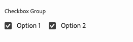

# Modelldefinitionen, Felder und Komponententypen {#field-types}

Erfahren Sie anhand von Beispielen mehr über Felder und die Komponententypen, die der universelle Editor im Bedienfeld „Eigenschaften“ bearbeiten kann. Erfahren Sie, wie Sie Ihre eigene App instrumentieren können, indem Sie eine Modelldefinition erstellen und mit der Komponente verknüpfen.

## Überblick {#overview}

Wenn Sie Ihre eigenen Apps für die Verwendung mit dem universellen Editor anpassen, müssen Sie die Komponenten instrumentieren und definieren, welche Felder und Komponententypen sie im Bedienfeld „Eigenschaften“ des Editors bearbeiten können.  Erstellen Sie dazu ein Modell und verknüpfen Sie es über die Komponente mit diesem.

Dieses Dokument bietet einen Überblick über eine Modelldefinition sowie über die verfügbaren Felder und Komponententypen sowie Beispielkonfigurationen.

>[!TIP]
>
>Wenn Sie nicht wissen, wie Sie Ihre Anwendung für den universellen Editor instrumentieren, lesen Sie bitte das Dokument [Übersicht über den universellen Editor für AEM-Entwicklerinnen und -Entwickler](/help/implementing/universal-editor/developer-overview.md).

## Modelldefinitionsstruktur {#model-structure}

Um eine Komponente über das Bedienfeld „Eigenschaften“ im universellen Editor zu konfigurieren, muss eine Modelldefinition vorhanden und mit der Komponente verknüpft sein.

Die Modelldefinition ist eine JSON-Struktur, die mit einem Array von Modellen beginnt.

```json
[
  {
    "id": "model-id",        // must be unique
    "fields": []             // array of fields which shall be rendered in the properties panel
  }
]
```

Im Abschnitt **[Felder](#fields)** in diesem Dokument finden Sie weitere Informationen zum Definieren des `fields`-Arrays.

Sie können ein Modell auf zwei Arten mit einer Komponente verknüpfen: mit der [Komponentendefinition](#component-definition) oder [über die Instrumentierung](#instrumentation).

### Verknüpfen mit der Komponentendefinition {#component-definition}

Dies ist die bevorzugte Methode zum Verknüpfen des Modells mit der Komponente. Sie können so die Verknüpfung zentral in der Komponentendefinition verwalten und Komponenten per Drag-and-Drop über Container hinweg ziehen.

Schließen Sie einfach die Eigenschaft `model` in das Komponentenobjekt im Array `components` in der Datei `component-definition.json` ein.

Weitere Informationen finden Sie im Dokument [Komponentendefinition](/help/implementing/universal-editor/component-definition.md).

### Verknüpfen über die Instrumentierung {#instrumentation}

Um die Modelldefinition mit einer Komponente zu verwenden, kann das Attribut `data-aue-model` verwendet werden.

```html
<div data-aue-resource="urn:datasource:/content/path" data-aue-type="component"  data-aue-model="model-id">Click me</div>
```

>[!NOTE]
>
>Der universelle Editor prüft zunächst, ob ein Modell über die Instrumentierung verknüpft ist, und verwendet dieses Modell, bevor er die Komponentendefinition überprüft. Das bedeutet:
>
>* Projekte, bei denen die Verknüpfung mit dem Modell über die Instrumentierung implementiert wurde, funktionieren weiterhin unverändert, ohne dass Änderungen erforderlich sind.
>* Wenn Sie das Modell in der [Komponentendefinition](#component-definition) und in der Instrumentierung definieren, wird immer die Instrumentierung verwendet.

## Laden einer Modelldefinition {#loading-model}

Sobald ein Modell erstellt wurde, kann es als externe Datei referenziert werden.

```html
<script type="application/vnd.adobe.aue.model+json" src="<url-of-model-definition>"></script>
```

Alternativ können Sie das Modell auch inline definieren.

```html
<script type="application/vnd.adobe.aue.model+json">
  { ... model definition ... }
</script>
```

## Felder {#fields}

Ein Feldobjekt hat die folgende Typdefinition.

| Konfiguration | Werttyp | Beschreibung | Erforderlich |
|---|---|---|---|
| `component` | `ComponentType` | Renderer der Komponente | Ja |
| `name` | `string` | Eigenschaft [oder Pfad](#nesting), in der bzw. dem die Daten beibehalten werden sollen | Ja |
| `label` | `FieldLabel` | Titel des Felds | Ja |
| `description` | `FieldDescription` | Beschreibung des Felds | Nein |
| `value` | `FieldValue` | Dies ist ein Standardwert, der als Platzhalter dient. Dieser Wert bestimmt keine Inhaltsaktualisierungen. Dies ist nur eine Darstellung in der Benutzeroberfläche. | Nein |
| `valueType` | `ValueType` | Standardvalidierung, kann `string`, `string[]`, `number`, `date`, `boolean` sein. | Nein |
| `required` | `boolean` | Ist das Feld erforderlich? | Nein |
| `readOnly` | `boolean` | Ist das Feld schreibgeschützt? | Nein |
| `hidden` | `boolean` | Ist das Feld standardmäßig ausgeblendet? | Nein |
| `condition` | `RulesLogic` | Regel zum Anzeigen oder Ausblenden des Felds basierend auf einer [Bedingung](/help/implementing/universal-editor/customizing.md#conditionally-hide). | Nein |
| `multi` | `boolean` | Ist das Feld ein Mehrfachfeld<br/>Beachten Sie, dass eine Container-Verschachtelung für Mehrfachfelder im Panel „Eigenschaften“ nicht zulässig ist | Nein |
| `validation` | `ValidationType` | Validierungsregeln oder Regeln für das Feld | Nein |
| `raw` | `unknown` | Rohdaten, die von der Komponente verwendet werden können. | Nein |

### Feld „Name“ und Verschachtelung {#nesting}

Das Feld `name` kann direkt auf eine Eigenschaft der aktuellen Ressource verweisen oder im Falle von Komponenten in `cq:Pages` auch einen Pfad zu einer verschachtelten Eigenschaft verwenden. Beispiel:

```json
"name": "teaser/image/fileReference"
```

### Komponententypen {#component-types}

Im Folgenden finden Sie die Komponententypen, die für das Rendern von Feldern verwendet werden können.

| Beschreibung | Komponententyp |
|---|---|
| [AEM-Tag](#aem-tag) | `aem-tag` |
| [AEM-Inhalt](#aem-content) | `aem-content` |
| [Boolesch](#boolean) | `boolean` |
| [Kontrollkästchen-Gruppe](#checkbox-group) | `checkbox-group` |
| [Container](#container) | `container` |
| [Inhaltsfragment](#content-fragment) | `aem-content-fragment` |
| [Datum und Uhrzeit](#date-time) | `date-time` |
| [Experience Fragment](#experience-fragment) | `aem-experience-fragment` |
| [Mehrfachauswahl](#multiselect) | `multiselect` |
| [Zahl](#number) | `number` |
| [Optionsfeldgruppe](#radio-group) | `radio-group` |
| [Verweis](#reference) | `reference` |
| [Rich-Text](#rich-text) | `richtext` |
| [Auswählen](#select) | `select` |
| [Registerkarte](#tab) | `tab` |
| [Text](#text) | `text` |

#### AEM-Tag {#aem-tag}

Ein AEM Tag-Komponententyp aktiviert eine AEM Tag-Auswahl, die zum Anhängen von Tags an die Komponente verwendet werden kann.

>[!BEGINTABS]

>[!TAB Beispiel]

```json
{
  "id": "aem-tag-picker",
  "fields": [
    {
      "component": "aem-tag",
      "label": "AEM Tag Picker",
      "name": "cq:tags",
      "valueType": "string"
    }
  ]
}
```

>[!TAB Screenshot]


>[!ENDTABS]

>[!TIP]
>
>Im Dokument [Verwalten von Taxonomiedaten](https://www.aem.live/docs/authoring-taxonomy) finden Sie weitere Informationen dazu, wie Sie Tabellen zur Verwaltung Ihrer Taxonomiedaten für Ihr Edge Delivery Services-Projekt verwenden können.

#### AEM-Inhalte {#aem-content}

Ein AEM-Inhaltskomponententyp aktiviert eine AEM-Inhaltsauswahl, die zum Auswählen von beliebigen AEM-Ressourcen verwendet werden kann. Im Gegensatz zur [Referenzkomponente](#reference), die nur Assets auswählen kann, kann die AEM-Inhaltskomponente auf jeden AEM-Inhalt verweisen. Sie bietet einen zusätzlichen Validierungstyp.

| Validierungstyp | Werttyp | Beschreibung | Erforderlich |
|---|---|---|---|
| `rootPath` | `string` | Pfad, den die Inhaltsauswahl für die Benutzenden öffnet, um AEM-Inhalte auszuwählen, wobei die Auswahl auf dieses Verzeichnis und die Unterverzeichnisse beschränkt ist. | Nein |

>[!BEGINTABS]

>[!TAB Beispiel]

```json
{
  "id": "aem-content-picker",
  "fields": [
    {
      "component": "aem-content",
      "name": "reference",
      "value": "",
      "label": "AEM Content Picker",
      "valueType": "string",
      "validation": {
            "rootPath": "/content/refresh"
        }
    }
  ]
}
```

>[!TAB Screenshot]


>[!ENDTABS]

#### Boolescher Wert {#boolean}

Ein boolescher Komponententyp speichert einen einfachen true/false-Wert, der als Umschalter gerendert wird.  Sie bietet einen zusätzlichen Validierungstyp.

| Validierungstyp | Werttyp | Beschreibung | Erforderlich |
|---|---|---|---|
| `customErrorMsg` | `string` | Meldung, die angezeigt wird, wenn der eingegebene Wert kein boolescher Wert ist | Nein |

>[!BEGINTABS]

>[!TAB Beispiel 1]

```json
{
  "id": "boolean",
  "fields": [
    {
      "component": "boolean",
      "label": "Boolean",
      "name": "boolean",
      "valueType": "boolean"
    }
  ]
}
```

>[!TAB Beispiel 2]

```json
{
  "id": "another-boolean",
  "fields": [
    {
      "component": "boolean",
      "label": "Boolean",
      "name": "boolean",
      "valueType": "boolean",
      "validation": {
        "customErrorMsg": "Think, McFly. Think!"
      }
    }
  ]
}
```

>[!TAB Screenshot]


>[!ENDTABS]

#### Kontrollkästchengruppe {#checkbox-group}

Ähnlich wie bei einem booleschen Wert ermöglicht ein Kontrollkästchengruppen-Komponententyp die Auswahl mehrerer true/false-Elemente, die als mehrere Kontrollkästchen gerendert werden.

>[!BEGINTABS]

>[!TAB Beispiel]

```json
{
  "id": "checkbox-group",
  "fields": [
    {
      "component": "checkbox-group",
      "label": "Checkbox Group",
      "name": "checkbox",
      "valueType": "string[]",
      "options": [
        { "name": "Option 1", "value": "option1" },
        { "name": "Option 2", "value": "option2" }
      ]
    }
  ]
}
```

>[!TAB Screenshot]



>[!ENDTABS]

#### Container {#container}

Ein Container-Komponententyp ermöglicht die Gruppierung von Komponenten, einschließlich Mehrfachfeld-Unterstützung. Er bietet eine zusätzliche Konfiguration. Beachten Sie, dass eine Container-Verschachtelung für Mehrfachfelder im Panel „Eigenschaften“ nicht zulässig ist

| Konfiguration | Werttyp | Beschreibung | Erforderlich |
|---|---|---|---|
| `collapsible` | `boolean` | Ist der Container ausblendbar? | Nein |

>[!BEGINTABS]

>[!TAB Beispiel]

```json
 {
  "id": "container",
  "fields": [
    {
      "component": "container",
      "label": "Container",
      "name": "container",
      "valueType": "string",
      "collapsible": true,
      "fields": [
        {
          "component": "text-input",
          "label": "Simple Text 1",
          "name": "text",
          "valueType": "string"
        },
        {
          "component": "text-input",
          "label": "Simple Text 2",
          "name": "text2",
          "valueType": "string"
        }
      ]
    }
  ]
}
```

>[!TAB Screenshot]


>[!TAB Mehrfachfeld-Unterstützung]

```json
{
  "component": "container",
  "name": "test",
  "label": "Multi Text",
  "multi": true,
  "fields": [
    {
      "component": "reference",
      "name": "image",
      "value": "",
      "label": "Sample Image",
      "valueType": "string"
    },
    {
      "component": "text",
      "name": "alt",
      "value": "",
      "label": "Alt Text",
      "valueType": "string"
    }
  ]
}
```

>[!ENDTABS]


#### Inhaltsfragment {#content-fragment}

Mit der Auswahl für Inhaltsfragmente können Sie ein [Inhaltsfragment](/help/sites-cloud/authoring/fragments/content-fragments.md) und dessen Varianten (falls erforderlich) auswählen. Er bietet eine zusätzliche Konfiguration.

| Konfiguration | Werttyp | Beschreibung | Erforderlich |
|---|---|---|---|
| `variationName` | `string` | Variablenname, um auf die ausgewählte Variante zu speichern.  Wenn nicht definiert, wird keine Variantenauswahl angezeigt. | Nein |

Er bietet außerdem einen zusätzlichen Validierungstyp.

| Validierungstyp | Werttyp | Beschreibung | Erforderlich |
|---|---|---|---|
| `rootPath` | `string` | Pfad, den die Inhaltsauswahl öffnet, damit die Benutzenden das Inhaltsfragment auswählen können, wodurch die Auswahl auf diesen Ordner und Unterverzeichnisse beschränkt wird. | Nein |

>[!NOTE]
>
>Der universelle Editor [validiert Inhaltsfragmentfelder anhand ihrer Modelle](/help/assets/content-fragments/content-fragments-models.md#validation), wodurch Sie Datenintegrationsregeln wie Regex-Muster und Eindeutigkeitsbeschränkungen erzwingen können.
>
>So wird sichergestellt, dass Ihre Inhalte bestimmten Geschäftsanforderungen entsprechen, bevor sie veröffentlicht werden.

>[!BEGINTABS]

>[!TAB Beispiel 1]

```json
[
  {
    "id": "aem-content-fragment",
    "fields": [
      {
        "component": "aem-content-fragment",
        "name": "picker",
        "label": "Content Fragment Picker",
        "valueType": "string",
        "variationName": "contentFragmentVariation",
        "validation": {
            "rootPath": "/content/refresh"
        }
      }
    ]
  }
]
```

>[!TAB Screenshot]


>[!ENDTABS]

#### Datum und Uhrzeit {#date-time}

Ein Datums-/Uhrzeitkomponententyp ermöglicht die Angabe eines Datums, einer Uhrzeit oder einer Kombination davon.  Er bietet zusätzliche Konfigurationen.

| Konfiguration | Werttyp | Beschreibung | Erforderlich |
|---|---|---|---|
| `displayFormat` | `string` | Format für das Anzeigen der Datums-Zeichenfolge | Ja |
| `valueFormat` | `string` | Format für das Speichern der Datums-Zeichenfolge | Ja |

Er bietet außerdem einen zusätzlichen Validierungstyp.

| Validierungstyp | Werttyp | Beschreibung | Erforderlich |
|---|---|---|---|
| `customErrorMsg` | `string` | Meldung, die angezeigt wird, wenn `valueFormat` nicht respektiert wird. | Nein |

>[!BEGINTABS]

>[!TAB Beispiel 1]

```json
{
  "id": "date-time",
  "fields": [
    {
      "component": "date-time",
      "label": "Date & Time",
      "name": "date",
      "valueType": "date"
    }
  ]
}
```

>[!TAB Beispiel 2]

```json
{
  "id": "another-date-time",
  "fields": [
    {
      "component": "date-time",
       "valueType": "date-time",
      "name": "field1",
      "label": "Date Time",
      "description": "This is a date time field that stores both date and time.",
      "required": true,
      "placeholder": "YYYY-MM-DD HH:mm:ss",
      "displayFormat": null,
      "valueFormat": null,
      "validation": {
        "customErrorMsg": "Marty! You have to come back with me!"
      }
    },
    {
      "component": "date-time",
      "valueType": "date",
      "name": "field2",
      "label": "Another Date Time",
      "description": "This is another date time field that only stores the date.",
      "required": true,
      "placeholder": "YYYY-MM-DD",
      "displayFormat": null,
      "valueFormat": null,
      "validation": {
        "customErrorMsg": "Back to the future!"
      }
    },
    {
      "component": "date-time",
      "valueType": "time",
      "name": "field3",
      "label": "Yet Another Date Time",
      "description": "This is another date time field that only stores the time.",
      "required": true,
      "placeholder": "HH:mm:ss",
      "displayFormat": null,
      "valueFormat": null,
      "validation": {
        "customErrorMsg": "Great Scott!"
      }
    }
  ]
}
```

>[!TAB Screenshot]


>[!ENDTABS]

#### Experience Fragment {#experience-fragment}

Mit der Experience Fragment-Auswahl können Sie ein [Experience Fragment](/help/sites-cloud/authoring/fragments/experience-fragments.md) und dessen Varianten (falls erforderlich) auswählen. Er bietet eine zusätzliche Konfiguration.

| Konfiguration | Werttyp | Beschreibung | Erforderlich |
|---|---|---|---|
| `variationName` | `string` | Variablenname, um auf die ausgewählte Variante zu speichern.  Wenn nicht definiert, wird keine Variantenauswahl angezeigt. | Nein |

Er bietet außerdem einen zusätzlichen Validierungstyp.

| Validierungstyp | Werttyp | Beschreibung | Erforderlich |
|---|---|---|---|
| `rootPath` | `string` | Pfad, den die Inhaltsauswahl öffnet, damit die Benutzenden das Experience Fragment auswählen können, wodurch die Auswahl auf diesen Ordner und Unterverzeichnisse beschränkt wird. | Nein |

>[!BEGINTABS]

>[!TAB Beispiel 1]

```json
[
  {
    "id": "experience-fragment",
    "fields": [
      {
        "component": "aem-experience-fragment",
        "valueType": "string",
        "name": "experience-fragment",
        "label": "experience-fragment",
        "variationName": "experienceFragmentVariation",
        "validation": {
            "rootPath": "/content/refresh"
        }
      }
    ]
  }
]
```

>[!TAB Screenshot]


>[!ENDTABS]


#### Mehrfachauswahl {#multiselect}

Ein Mehrfachauswahl-Komponententyp zeigt mehrere Elemente zur Auswahl in einer Dropdown-Liste an, einschließlich der Möglichkeit, die auswählbaren Elemente zu gruppieren.

>[!BEGINTABS]

>[!TAB Beispiel 1]

```json
{
  "id": "multiselect",
  "fields": [
    {
      "component": "multiselect",
      "name": "multiselect",
      "label": "Multi Select",
      "valueType": "string",
      "options": [
        { "name": "Option 1", "value": "option1" },
        { "name": "Option 2", "value": "option2" }
      ]
    }
  ]
}
```

>[!TAB Beispiel 2]

```json
{
  "id": "multiselect-grouped",
  "fields": [
    {
      "component": "multiselect",
      "name": "property",
      "label": "Multiselect field",
      "valueType": "string",
      "required": true,
      "maxSize": 2,
      "options": [
        {
          "name": "Theme",
          "children": [
            { "name": "Light", "value": "light" },
            { "name": "Dark",  "value": "dark" }
          ]
        },
        {
          "name": "Type",
          "children": [
            { "name": "Alpha", "value": "alpha" },
            { "name": "Beta", "value": "beta" },
            { "name": "Gamma", "value": "gamma" }
          ]
        }
      ]
    }
  ]
}
```

>[!TAB Screenshots]


>[!ENDTABS]

#### Zahl {#number}

Ein Zahl-Komponententyp ermöglicht die Eingabe einer Zahl.  Er bietet zusätzliche Validierungstypen.

| Validierungstyp | Werttyp | Beschreibung | Erforderlich |
|---|---|---|---|
| `numberMin` | `number` | Zulässige Mindestanzahl | Nein |
| `numberMax` | `number` | Zulässige maximale Anzahl | Nein |
| `customErrorMsg` | `string` | Meldung, die angezeigt wird, wenn `numberMin` oder `numberMax` nicht erfüllt ist. | Nein |

>[!BEGINTABS]

>[!TAB Beispiel 1]

```json
{
  "id": "number",
  "fields": [
    {
      "component": "number",
      "name": "number",
      "label": "Number",
      "valueType": "number",
      "value": 0
    }
  ]
}
```

>[!TAB Beispiel 2]

```json
{
  "id": "another-number",
  "fields": [
   {
      "component": "number",
      "valueType": "number",
      "name": "field1",
      "label": "Number Field",
      "description": "This is a number field.",
      "required": true,
      "placeholder": null,
      "validation": {
        "numberMin": 0,
        "numberMax": 88,
        "customErrorMsg": "You also need 1.21 gigawatts."
      }
    }
  ]
}
```

>[!TAB Screenshot]


>[!ENDTABS]

#### Optionsfeldgruppe {#radio-group}

Ein Optionsfeldgruppen-Komponententyp ermöglicht eine einander ausschließende Auswahl aus mehreren Optionen, die als Gruppe ähnlich einer Kontrollkästchengruppe gerendert werden.

>[!BEGINTABS]

>[!TAB Beispiel]

```json
{
  "id": "radio-group",
  "fields": [
    {
      "component": "radio-group",
      "label": "Radio Group",
      "name": "radio",
      "valueType": "string",
      "options": [
        { "name": "Option 1", "value": "option1" },
        { "name": "Option 2", "value": "option2" }
      ]
    }
  ]
}
```

>[!TAB Screenshot]


>[!ENDTABS]

#### Referenz {#reference}

Ein Referenzkomponententyp aktiviert einen AEM Asset-Wähler, der zur Auswahl beliebiger zu referenzierender AEM-Assets verwendet werden kann. Im Gegensatz zur [AEM-Inhaltskomponente](#aem-content), die eine beliebige AEM-Ressource auswählen kann, kann die Referenzkomponente nur auf Assets verweisen. Sie bietet einen zusätzlichen Validierungstyp.

Ein Referenz-Komponententyp ermöglicht einen Verweis auf ein anderes Datenobjekt aus dem aktuellen Objekt.

>[!BEGINTABS]

>[!TAB Beispiel]

```json
{
  "id": "reference",
  "fields": [
    {
      "component": "reference",
      "label": "Reference",
      "name": "reference",
      "valueType": "string"
    }
  ]
}
```

>[!TAB Screenshot]


>[!ENDTABS]

#### Rich-Text {#rich-text}

Rich-Text ermöglicht eine mehrzeilige Rich-Text-Eingabe. 

>[!BEGINTABS]

>[!TAB Beispiel 1]

```json
{
  "id": "richtext",
  "fields": [
    {
      "component": "richtext",
      "name": "rte",
      "label": "Rich Text",
      "valueType": "string"
    }
  ]
}
```

>[!TAB Screenshot]


>[!ENDTABS]

#### Auswahl {#select}

Ein Auswahl-Komponententyp ermöglicht die Auswahl einer einzelnen Option aus einer Liste vordefinierter Optionen in einem Dropdown-Menü.

>[!BEGINTABS]

>[!TAB Beispiel]

```json
{
  "id": "select",
  "fields": [
    {
      "component": "select",
      "label": "Select",
      "name": "select",
      "valueType": "string",
      "options": [
        { "name": "Option 1", "value": "option1" },
        { "name": "Option 2", "value": "option2" }
      ]
    }
  ]
}
```

>[!TAB Screenshot]


>[!ENDTABS]

#### Registerkarte {#tab}

Ein Registerkarten-Komponententyp ermöglicht das Gruppieren anderer Eingabefelder auf mehreren Registerkarten, um die Layout-Organisation für Autorinnen und Autoren zu verbessern.

Eine `tab`-Definition kann als Trennzeichen in einer Reihe von `fields` betrachtet werden. Alles, was nach einem `tab` kommt, wird auf dieser Registerkarte platziert, bis auf einen neuen `tab` gestoßen wird, woraufhin die folgenden Elemente auf der neuen Registerkarte platziert werden.

Wenn Sie Elemente haben möchten, die oberhalb von allen Registerkarten angezeigt werden, müssen diese vor allen Registerkarten definiert werden.

>[!BEGINTABS]

>[!TAB Beispiel]

```json
{
  "id": "tab",
  "fields": [
    {
      "component": "tab",
      "label": "Tab 1",
      "name": "tab1"
    },
    {
      "component": "text-input",
      "label": "Text 1",
      "name": "text1",
      "valueType": "string"
    },
    {
      "component": "tab",
      "label": "Tab 2",
      "name": "tab2"
    },
    {
      "component": "text-input",
      "label": "Text 2",
      "name": "text2",
      "valueType": "string"
    }
  ]
}
```

>[!TAB Screenshot]


>[!ENDTABS]

#### Text {#text}

Text ermöglicht die Eingabe einer einzelnen Textzeile.   Er enthält zusätzliche Validierungstypen.

| Validierungstyp | Werttyp | Beschreibung | Erforderlich |
|---|---|---|---|
| `minLength` | `number` | Zulässige Mindestanzahl von Zeichen | Nein |
| `maxLength` | `number` | Zulässige maximale Zeichenanzahl | Nein |
| `regExp` | `string` | Regulärer Ausdruck, der dem Eingabetext entsprechen muss. | Nein |
| `customErrorMsg` | `string` | Meldung, die angezeigt wird, wenn gegen `minLength`, `maxLength` und/oder `regExp` verstoßen wird, | Nein |

>[!BEGINTABS]

>[!TAB Beispiel 1]

```json
{
  "id": "simpletext",
  "fields": [
    {
      "component": "text",
      "name": "text",
      "label": "Simple Text",
      "valueType": "string"
    }
  ]
}
```

>[!TAB Beispiel 2]

```json
{
  "id": "another simpletext",
  "fields": [
    {
      "component": "text",
      "name": "text",
      "label": "Simple Text",
      "valueType": "string",
      "valueFormat": "regexp",
      "description": "This is a text input with validation.",
      "required": true,
      "validation": {
        "minLength": 1955,
        "maxLength": 1985,
        "regExp": "^foo:.*",
        "customErrorMsg": "Why don't you make like a tree and get outta here?"
      }
    }
  ]
}
```

>[!TAB Screenshot]


>[!ENDTABS]
