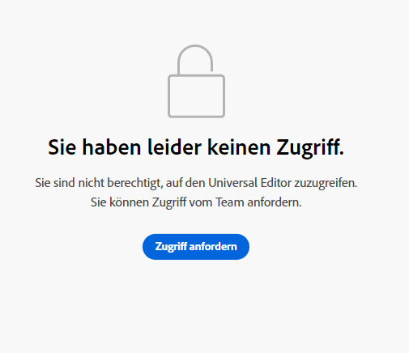

# Erste Schritte mit dem universellen Editor in AEM {#getting-started}

Erfahren Sie, wie Sie Zugriff auf den universellen Editor erhalten und wie Sie mit der Instrumentierung Ihrer ersten AEM-App beginnen, um ihn zu verwenden.

>[!TIP]
>
>Wenn Sie lieber direkt in ein Beispiel eintauchen möchten, können Sie die [Beispielanwendung des universellen Editors auf GitHub ansehen.](https://github.com/adobe/universal-editor-sample-editable-app)

## Onboarding-Schritte {#onboarding}

Obwohl der universelle Editor Inhalte aus jeder Quelle bearbeiten kann, verwendet dieses Dokument eine AEM-App als Beispiel.

Es gibt eine Reihe von Schritten, um Ihre AEM-App zu integrieren und sie für die Verwendung des universellen Editors zu instrumentieren.

1. [Fordern Sie Zugriff auf den universellen Editor an.](#request-access)
1. [Schließen Sie die Hauptbibliothek des universellen Editors ein.](#core-library)
1. [Fügen Sie die erforderliche OSGi-Konfiguration hinzu.](#osgi-configurations)
1. [Instrumentieren Sie die Seite.](#instrument-page)

Dieses Dokument führt Sie durch diese Schritte.

## Anfordern des Zugriffs auf den universellen Editor {#request-access}

Zunächst müssen Sie den Zugriff auf den universellen Editor anfordern. Bitte navigieren Sie zu [https://experience.adobe.com/#/aem/editor](https://experience.adobe.com/#/aem/editor), melden Sie sich an und bestätigen Sie, ob Sie Zugriff auf den universellen Editor haben.

Wenn Sie keinen Zugriff haben, können Sie ihn über ein Formular anfordern, das auf derselben Seite verlinkt ist.



Klicken Sie auf **Zugriff anfordern** und füllen Sie das Formular wie angewiesen aus, um Zugriff anzufordern. Eine Adobe-Kontaktperson wird Ihre Anfrage überprüfen und sich an Sie wenden, um Ihren Anwendungsfall zu besprechen.

## Einschließen der Hauptbibliothek des universellen Editors {#core-library}

Bevor Ihre App für die Verwendung mit dem universellen Editor instrumentiert werden kann, muss sie die folgende Abhängigkeit enthalten.

```javascript
@adobe/universal-editor-cors
```

Um die Instrumentierung zu aktivieren, muss der folgende Import zu Ihrer `index.js` hinzugefügt werden.

```javascript
import "@adobe/universal-editor-cors";
```

### Alternative für Nicht-React-Apps {#alternative}

Wenn Sie keine React-App implementieren und/oder Server-seitiges Rendering erforderlich ist, besteht eine alternative Methode darin, Folgendes in den Hauptteil des Dokuments einzuschließen.

```html
<script src="https://cdn.jsdelivr.net/gh/adobe/universal-editor-cors/dist/universal-editor-embedded.js" async></script>
```

## Hinzufügen der erforderlichen OSGi-Konfigurationen {#osgi-configurations}

Um AEM-Inhalte mit Ihrer App mithilfe des Universal Editors bearbeiten zu können, müssen die CORS- und Cookie-Einstellungen in AEM vorgenommen werden.

Die folgenden [OSGi-Konfigurationen müssen in der AEM-Autoreninstanz festgelegt werden.](/help/implementing/deploying/configuring-osgi.md)

* `SameSite Cookies = None` in `com.day.crx.security.token.impl.impl.TokenAuthenticationHandler`
* Entfernen Sie die Kopfzeile X-FRAME-OPTIONS: SAMEORIGIN in `org.apache.sling.engine.impl.SlingMainServlet`

### com.day.crx.security.token.impl.impl.TokenAuthenticationHandler {#samesite-cookies}

Das Anmelde-Token-Cookie muss als Drittanbieter-Domain an AEM gesendet werden. Daher muss das same-site-Cookie explizit auf `None` gesetzt werden.

Diese Eigenschaft muss in der OSGi-Konfiguration `com.day.crx.security.token.impl.impl.TokenAuthenticationHandler` eingestellt werden.

```xml
<?xml version="1.0" encoding="UTF-8"?>
<jcr:root xmlns:sling="http://sling.apache.org/jcr/sling/1.0"
          xmlns:jcr="http://www.jcp.org/jcr/1.0" jcr:primaryType="sling:OsgiConfig"
          token.samesite.cookie.attr="None" />
```

### org.apache.sling.engine.impl.SlingMainServlet {#sameorigin}

X-Frame-Optionen: SAMEORIGIN verhindert das Rendern von AEM-Seiten in einem iFrame. Wenn Sie die Kopfzeile entfernen, können die Seiten geladen werden.

Diese Eigenschaft muss in der OSGi-Konfiguration `org.apache.sling.engine.impl.SlingMainServlet` eingestellt werden.

```xml
<?xml version="1.0" encoding="UTF-8"?>
<jcr:root xmlns:sling="http://sling.apache.org/jcr/sling/1.0"
          xmlns:jcr="http://www.jcp.org/jcr/1.0"
          jcr:primaryType="sling:OsgiConfig"
          sling.additional.response.headers="[X-Content-Type-Options=nosniff]"/>
```

## Instrumentieren der Seite {#instrument-page}

Der Service des universellen Editors erfordert einen [Uniform Resource Name (URN)](https://de.wikipedia.org/wiki/Uniform_Resource_Name), um das richtige Backend-System für den Inhalt in der bearbeiteten App zu identifizieren und zu verwenden. Daher ist ein URN-Schema erforderlich, um Inhalte wieder Inhaltsressourcen zuzuordnen.

Die der Seite hinzugefügten Instrumentierungsattribute bestehen hauptsächlich aus [HTML Microdata](https://developer.mozilla.org/en-US/docs/Web/HTML/Microdata), einem Branchenstandard, der auch verwendet werden kann, um HTML semantischer zu gestalten, HTML-Dokumente zu indexieren, usw.

### Erstellen von Verbindungen {#connections}

Verbindungen, die in der App verwendet werden, werden als `<meta>`-Tags im `<head>` der Seite gespeichert.

```html
<meta name="urn:adobe:aem:editor:<referenceName>" content="<protocol>:<url>">
```

* `<referenceName>` – Dies ist ein Kurzname, der im Dokument zur Identifizierung der Verbindung wiederverwendet wird. Z. B. `aemconnection`
* `<protocol>` – Dies gibt an, welches Persistenz-Plug-in des Universal Editor Persistence Service verwendet werden soll. Z. B. `aem`
* `<url>` – Dies ist die URL zum System, in dem die Änderungen persistiert werden sollen. Z. B. `http://localhost:4502`

Die Kennung `adobe:aem:editor` stellt die Verbindung für den Adobe Universal Editor dar.

`itemid`s verwenden das Präfix `urn`, um die Kennung zu verkürzen.

```html
itemid="urn:<referenceName>:<resource>"
```

* `<referenceName>` – Dies ist die im `<meta>`-Tag erwähnte Referenz. Z. B. `aemconnection`
* `<resource>` – Dies ist ein Zeiger auf die Ressource im Zielsystem. Z. B. ein AEM Inhaltspfad, wie `/content/page/jcr:content`

>[!TIP]
>
>Siehe das Dokument [Attribute und Typen](attributes-types.md) für weitere Details zu den Datenattributen und -typen, die der universelle Editor erfordert.

### Beispielverbindung {#example}

```html
<html>
<head>
    <meta name="urn:adobe:aem:editor:aemconnection" content="aem:https://localhost:4502">
    <meta name="urn:adobe:aem:editor:fcsconnection" content="fcs:https://example.franklin.adobe.com/345fcdd">
</head>
<body>
        <aside>
          <ul itemscope itemid="urn:aemconnection:/content/example/list" itemtype="container">
            <li itemscope itemid="urn:aemconnection/content/example/listitem" itemtype="component">
              <p itemprop="name" itemtype="text">Jane Doe</p>
              <p itemprop="title" itemtype="text">Journalist</p>
              
            </li>
 
...
 
            <li itemscope itemid="urn:fcsconnection:/documents/mytext" itemtype="component">
              <p itemprop="name" itemtype="text">John Smith</p>
              <p itemid="urn:aemconnection/content/example/another-source" itemprop="title" itemtype="text">Photographer</p>
              
            </li>
          </ul>
        </aside>
</body>
</html>
```

## Sie können den universellen Editor nun verwenden {#youre-ready}

Ihre App ist jetzt für die Verwendung des universellen Editors instrumentiert!

Weitere Informationen finden Sie im Dokument [Inhaltserstellung mit dem universellen Editor](authoring.md), um zu erfahren, wie einfach und intuitiv es für Inhaltsautorinnen und -autoren ist, Inhalte mit dem universellen Editor zu erstellen.

## Zusätzliche Ressourcen {#additional-resources}

Weitere Informationen zum universellen Editor finden Sie in diesen Dokumenten.

* [Einführung in den universellen Editor](introduction.md) – Erfahren Sie, wie der universelle Editor die Bearbeitung beliebiger Inhalte in jeder Implementierung ermöglicht, um außergewöhnliche Erlebnisse bereitzustellen, die Inhaltsgeschwindigkeit zu erhöhen und ein modernes Entwicklererlebnis zu bieten.
* [Inhaltserstellung mit dem universellen Editor](authoring.md) – Erfahren Sie, wie einfach und intuitiv es für Inhaltsautorinnen und -autoren ist, Inhalte mit dem universellen Editor zu erstellen.
* [Veröffentlichen von Inhalten mit dem universellen Editor](publishing.md) – Erfahren Sie, wie der universelle visuelle Editor Inhalte veröffentlicht und wie Ihre Apps mit den veröffentlichten Inhalten umgehen können.
* [Architektur des universellen Editors](architecture.md) – Erfahren Sie mehr über die Architektur des universellen Editors und darüber, wie Daten zwischen seinen Diensten und Ebenen fließen.
* [Attribute und Typen](attributes-types.md) – Erfahren Sie mehr über die Datenattribute und -typen, die der universelle Editor erfordert.
* [Authentifizierung beim universellen Editor](authentication.md) – Erfahren Sie, wie beim universellen Editor authentifiziert wird.
