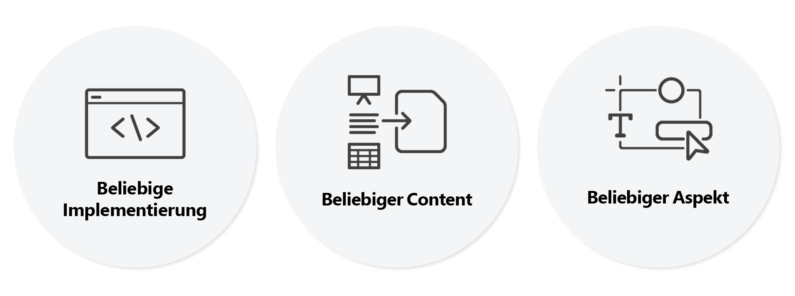

# Universal Visual Editor - Einführung {#introduction}

Erfahren Sie, wie der universelle Visual Editor (auch als universeller Editor bezeichnet) die Bearbeitung von Headless- und Headful-Erlebnissen (WYSIWYG) ermöglicht. Erfahren Sie, wie sie Autoren dabei helfen kann, außergewöhnliche Erlebnisse bereitzustellen, die Geschwindigkeit ihrer Inhalte zu erhöhen und wie sie ein modernes Entwicklererlebnis bieten.

## Hintergrund {#background}

Das leistungsfähigste Tool für den AEM Inhaltsautor war der Seiteneditor. Der Seiteneditor bietet ein intuitives, visuelles, kontextbezogenes WYSIWYG-Authoring-Erlebnis, das eine minimale Schulung erfordert und Autoren genau anzeigt, wie der Inhalt aussehen wird.

Der Seiteneditor kann jedoch nur AEM Seiteninhalt, die Struktur und die darin enthaltenen Komponenten bearbeiten. Heute werden Inhalte jedoch nur selten von einem Ort bezogen. Der universelle Editor bietet dieselbe integrierte Bearbeitungserfahrung wie der Seiten-Editor, jedoch für alle Aspekte von Inhalten in jeder Implementierung.

## wahrhaftig universell {#universal}

Der universelle Editor kann für jede Implementierung, für jeden Inhalt und für jeden Aspekt des Inhalts instrumentiert werden.

### Jegliche Implementierung {#any-implementation}

Da Erlebnisse auf viele verschiedene Arten erstellt werden können, kann jede Implementierung den universellen Editor nutzen, damit Autoren kontextbezogene Bearbeitungen durchführen können.

Benutzer glauben oft, dass eine Headless-Implementierung die Autoren daran hindert, alle Inhalte in einer formularbasierten Benutzeroberfläche zu bearbeiten. Dies trifft jedoch im universellen Editor nicht zu

Die Anforderungen für eine Implementierung zur Nutzung des universellen Editors sind sehr unkompliziert und unterstützen:

* **Beliebige Architektur** - Server-seitiges Rendering, Edge-seitiges Rendering, Client-seitiges Rendering usw.
* **Jegliches Framework** - Vanilla-AEM oder Drittanbieter-Frameworks wie React, Next.js, Angular usw.
* **Beliebiges Hosting** - kann lokal AEM oder auf einer Remote-Domäne gehostet werden

### Beliebiger Inhalt {#any-content}

Ein Inhaltsautor sollte über dasselbe leistungsstarke Bearbeitungserlebnis verfügen, das zuvor vom AEM Seiteneditor angeboten wurde. Der universelle Editor ermöglicht es Inhaltsautoren jedoch, **any** Inhalt visuell und kontextbezogen und unterstützt:

* **AEM Seitenstrukturen** - verschachtelt `cq:Components` von `cq:Pages`, einschließlich Experience Fragments
* **AEM Inhaltsfragmente** - Bearbeiten Sie Inhalte aus Inhaltsfragmenten so, wie sie im Kontext des Erlebnisses erscheinen.
* **Dokumente** - Der Machbarkeitsnachweis hat gezeigt, dass auch Word-, Excel-, Google-Dokumente oder Markdown-Dokumente auf die gleiche Weise bearbeitet werden können (dies ist WIP).

### Beliebiger Aspekt {#any-aspect}

Für einen Inhaltsautor bezieht sich Inhalt nicht nur auf die enthaltenen Informationen, sondern darauf, wie sie gerendert und empfangen werden. Der Inhalt enthält zusätzliche Meta-Daten- und Instrumentierungsregeln, die der universelle Editor verstehen und bearbeiten kann, darunter:

* **Anwenden von Layout und Stil** - Mit einem Stilsystem können Marketing-Experten und Inhaltsautoren unterschiedliche Stile auf ihren Inhalt anwenden und unterschiedliche Layouts für den Inhalt erstellen, z. B. Spalten, Karussells, Registerkarten, Akkordeons usw.

## Wert  {#value}

Durch die Entkopplung des Inhaltserstellungserlebnisses von einem beliebigen Inhaltsbereitstellungssystem wird der Editor wirklich universell und flexibel, sodass der Inhaltsautor außergewöhnliche Erlebnisse bereitstellen, die Inhaltsgeschwindigkeit erhöhen und ein modernes Entwicklererlebnis bieten kann.

* **Bereitstellen außergewöhnlicher Erlebnisse** - Damit Praktiker ein überzeugendes Erlebnis für Besucher schaffen können, können im universellen Editor Praktiker den Inhalt im Kontext der Vorschau erstellen und bearbeiten. Auf diese Weise können sie Inhalte erstellen, die dem Design des Erlebnisses entsprechen und eine aussagekräftige Journey für Besucher darstellen.
* **Content-Geschwindigkeit erhöhen** - Um den Verwaltungsarbeitsablauf für Praktiker zu optimieren, ermöglicht der universelle Editor die Bearbeitung von Inhalten in der Vorschau, um die Praktiker zu führen, indem nur die Optionen angezeigt werden, die für diesen Kontext relevant sind, und der Workflow von den Inhaltsquellen unabhängig wird.
* **Modernstes Entwicklererlebnis** - Zur Unterstützung der heterogenen Anwendungslandschaft in der realen Welt ist der Universal Editor vollständig entkoppelt und technologieunabhängig, sodass Entwickler ihren bevorzugten Technologiestapel zur Implementierung des Erlebnisses nutzen können.

## Universal Visual Editor und der Inhaltsfragment-Editor {#universal-editor-content-fragment-editor}

Auf den ersten Blick sieht es so aus, als ob der universelle Visual Editor und der Inhaltsfragment-Editor ähnliche Bearbeitungsfunktionen bieten. Diese Editoren bieten jedoch sehr unterschiedliche Funktionen und erledigen unterschiedliche Aufgaben für Marketingfachleute.

### Inhaltsfragmente-Editor {#content-fragment-editor}

Ein Marketing-Anwender möchte Inhalte erstellen, ohne sich um das Layout kümmern zu müssen, damit sie in zahlreichen Kontexten des Erlebnisses wiederverwendet werden können.

* Die zugrunde liegende Aufgabe besteht darin, die Inhaltsstrategie zu skalieren.

### Universal Visual Editor {#universal-editor}

Ein Marketing-Anwender möchte Inhalte erstellen, die auf das Layout eines bestimmten Kontexts zugeschnitten sind, um ein außergewöhnliches Erlebnis zu bieten.

* Die zugrunde liegende Aufgabe besteht darin, eine überzeugende Verbindung mit den Lesern herzustellen.

## Roadmap {#road-map}

Es ist wichtig zu beachten, dass der universelle Editor in Bearbeitung ist und dass einige der in diesem Dokument beschriebenen Funktionen eine Vision des endgültigen Editors darstellen und nicht notwendigerweise für seine aktuellen Funktionen repräsentativ sind.

Wenden Sie sich an Ihren Ansprechpartner bei der Adobe, um mehr über die für den universellen Editor geplanten Funktionen zu erfahren.

## Zusätzliche Ressourcen {#additional-resources}

Weitere Informationen zum universellen Editor finden Sie in diesen Dokumenten.

* [Inhaltserstellung mit dem universellen Editor](authoring.md) - Erfahren Sie, wie einfach und intuitiv es für Inhaltsautoren ist, Inhalte mit dem universellen Editor zu erstellen.
* [Veröffentlichen von Inhalten mit dem universellen Editor](publishing.md) - Erfahren Sie, wie der universelle Visual Editor Inhalte veröffentlicht und wie Ihre Apps mit den veröffentlichten Inhalten umgehen können.
* [Erste Schritte mit dem universellen Editor in AEM](getting-started.md) - Erfahren Sie, wie Sie Zugriff auf den universellen Editor erhalten und wie Sie mit der Instrumentierung Ihrer ersten AEM App beginnen, um ihn zu verwenden.
* [Architektur des universellen Editors](architecture.md) - Erfahren Sie mehr über die Architektur des universellen Editors und darüber, wie Daten zwischen seinen Diensten und Ebenen fließen.
* [Attribute und Typen](attributes-types.md) - Erfahren Sie mehr über die Datenattribute und -typen, die der universelle Editor erfordert.
* [Universelle Editor-Authentifizierung](authentication.md) - Erfahren Sie, wie der universelle Editor authentifiziert wird.
