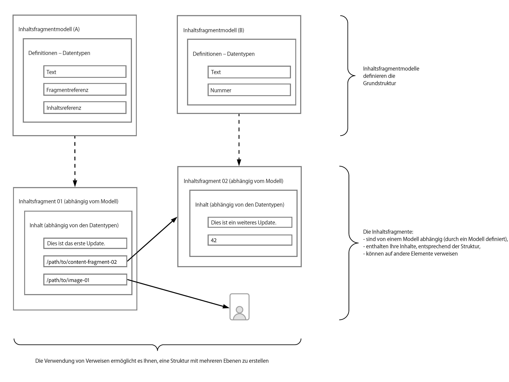

# Lernen Sie die Grundlagen der Inhaltsmodellierung für Headless mit AEM kennen. {#content-modeling-headless-basics}

## Die bisherige Entwicklung {#story-so-far}

Am Anfang der [AEM Headless-Inhaltsarchitekten-Tour](overview.md) wurden in der [Einführung](introduction.md) die grundlegenden Konzepte und die Terminologie behandelt, die für die Modellierung von Inhalten für Headless relevant sind.

Dieser Artikel baut auf diesen Grundlagen auf, damit Sie verstehen, wie Sie Ihre Inhalte für Ihr AEM Headless-Projekt modellieren können.

## Ziel {#objective}

* **Zielgruppe**: Anfänger
* **Ziel**: Einführung in die Konzepte der Inhaltsmodellierung für Headless-CMS.

## Inhaltsmodellierung mit Inhaltsfragmentmodellen {#architect-content-fragment-models}

Die Inhalts-(Daten) modellierung ist eine Reihe etablierter Techniken, die häufig bei der Entwicklung von relationalen Datenbanken verwendet werden. Was bedeutet die Inhaltsmodellierung also für AEM Headless?

### Vorteile {#why}

Um sicherzustellen, dass Ihr Programm die erforderlichen Inhalte konsistent und effizient von AEM anfragen und empfangen kann, müssen diese Inhalte strukturiert sein.

Das bedeutet, dass Ihr Programm die Form der Antwort im Voraus kennt und daher weiß, wie sie verarbeitet wird. Dies ist viel einfacher als das Empfangen von Freiforminhalten, die geparst werden müssen, um festzustellen, was sie enthalten und wie sie daraus folgend verwendet werden können.

### Einführung in das Wie? {#how}

AEM verwendet Inhaltsfragmente, um die Strukturen bereitzustellen, die für die Headless-Bereitstellung Ihrer Inhalte an Ihre Programme erforderlich sind.

Die Struktur Ihres Inhaltsmodells wird:

* durch die Definition Ihres Inhaltsfragmentmodells umgesetzt,
* als Grundlage der Inhaltsfragmente verwendet, die für die Inhaltserstellung verwendet werden.

>[!NOTE]
>
>Die Inhaltsfragmentmodelle werden auch als Grundlage für die AEM-GraphQL-Schemata verwendet, die zum Abrufen Ihrer Inhalte verwendet werden – mehr dazu in der Entwickler-Tour.

Anfragen für Ihre Inhalte werden mit der AEM-GraphQL-API gestellt, einer angepassten Implementierung der standardmäßigen GraphQL-API. Mit der AEM-GraphQL-API können Anwendungen (komplexe) Abfragen für Inhaltsfragmente durchführen, wobei jede Abfrage einem bestimmten Modelltyp entspricht.

Die zurückgegebenen Inhalte können dann von Ihren Programmen verwendet werden.

## Erstellen der Struktur mit Inhaltsfragmentmodellen {#create-structure-content-fragment-models}

Inhaltsfragmentmodelle bieten verschiedene Mechanismen, mit denen Sie die Struktur Ihrer Inhalte definieren können.

Ein Inhaltsfragmentmodell beschreibt eine Entität.

>[!NOTE]
>Die Funktion für Inhaltsfragmente muss im Konfigurations-Browser aktiviert sein, damit Sie neue Modelle erstellen können.

>[!TIP]
>
>Das Modell sollte so benannt werden, dass der Inhaltsautor weiß, welches Modell er beim Erstellen eines Inhaltsfragments auswählen soll.

Innerhalb eines Modells:

1. Mit **Datentypen** können Sie die einzelnen Attribute definieren.
Definieren Sie beispielsweise das Feld mit dem Namen eines Lehrers als **Text** und dessen Dienstjahre als **Zahl**.
1. Mit den Datentypen **Inhaltsreferenz** und **Fragmentreferenz** können Sie Beziehungen zu anderen Inhalten in AEM erstellen.
1. Mit dem Datentyp **Fragmentreferenz** können Sie mehrere Ebenen der Struktur umsetzen, indem Sie die Inhaltsfragmente verschachteln (je nach Modelltyp). Dies ist für Ihre Inhaltsmodellierung von entscheidender Bedeutung.

Beispiel:

## Datentypen {#data-types}

AEM stellt die folgenden Datentypen bereit, mit denen Sie Ihren Inhalt modellieren können:

* Einzeilentext
* Mehrzeilentext
* Zahl
* Boolescher Wert
* Datum und Uhrzeit
* Aufzählung
* Tags
* Fragmentreferenz
* Fragmentreferenz (UUID)
* Inhaltsreferenz
* Inhaltsreferenz (UUID)
* JSON-Objekt
* Registerkartenplatzhalter

>[!NOTE]
>
>Weitere Informationen finden Sie unter „Inhaltsfragmentmodelle – Datentypen“.

## Verweise und verschachtelte Inhalte {#references-nested-content}

Zwei Datentypen bieten Verweise auf Inhalte außerhalb eines bestimmten Fragments:

* **Inhaltsreferenz**/**Inhaltsreferenz (UUID)**
Diese bietet eine einfache Referenz zu anderen Inhalten beliebigen Typs.
Sie können beispielsweise auf ein Bild an einer bestimmten Stelle verweisen.

* **Fragmentreferenz**/**Fragmentreferenz (UUID)**
Diese bietet Verweise auf andere Inhaltsfragmente.
Dieser Referenztyp wird verwendet, um verschachtelte Inhalte zu erstellen und die Beziehungen einzuführen, die zum Modellieren Ihres Inhalts erforderlich sind.
Der Datentyp kann so konfiguriert werden, dass Fragmentautoren folgende Möglichkeiten haben:
   * Direktes Bearbeiten des referenzierten Fragments
   * Erstellen eines neuen Inhaltsfragments basierend auf dem entsprechenden Modell

>[!NOTE]
>
>Sie können auch improvisierte Referenzen auch über Links in Textblöcken erstellen.

>[!NOTE]
>
>Im Editor geben die UUID-Referenzen den Pfad zur referenzierten Ressource an. Intern wird eine solche Referenz als Universally Unique ID (UUID) gespeichert, die auf die Ressource verweist.

## Strukturebenen (verschachtelte Fragmente) {#levels-of-structure-nested-fragments}

Bei der Inhaltsmodellierung ermöglicht der Datentyp **Fragmentreferenz** die Erstellung mehrerer Strukturebenen und Beziehungen.

Mit diesem Verweis können Sie verschiedene Inhaltsfragmentmodelle *verbinden*, um Zusammenhänge darzustellen. Dadurch kann die Headless-Anwendung den Verbindungen folgen und bei Bedarf auf die Inhalte zugreifen.

>[!NOTE]
>
>Dies sollte mit Vorsicht angewendet werden und als Best Practice kann definiert werden, *so viel wie nötig, aber so wenig wie möglich zu verschachteln*.

Fragmentverweise tun genau das – sie ermöglichen es Ihnen, auf ein anderes Fragment zu verweisen.

Zum Beispiel könnten bei Ihnen die folgenden Inhaltsfragmentmodelle definiert sein:

* Stadt
* Unternehmen
* Person
* Auszeichnungen

Es scheint ziemlich einfach, aber ein Unternehmen hat sowohl einen CEO als auch Angestellte …und dies sind alles Leute, die jeweils als Person definiert sind.

Und eine Person kann eine Auszeichnung bekommen (oder vielleicht zwei).

* Meine Firma – Firma
   * CEO – Person
   * Mitarbeiter – Person
      * Persönliche Auszeichnungen – Auszeichnung

Und das ist nur für den Einstieg. Je nach Komplexität kann eine Auszeichnung firmenspezifisch sein oder eine Firma könnte ihre Hauptverwaltung in einer bestimmten Stadt haben.

Die Repräsentation dieser Beziehungen kann mit Fragmentverweisen erreicht werden, so wie sie von Ihnen (dem Architekten), Ihrem Inhaltsautor und den Headless-Anwendungen verstanden werden.

## Wie geht es weiter {#whats-next}

Nachdem Sie nun die Grundlagen gelernt haben, lautet der nächste Schritt [Erfahren Sie mehr über das Erstellen von Inhaltsfragmentmodellen in AEM](model-structure.md). In diesem Abschnitt werden die verschiedenen verfügbaren Verweise vorgestellt und diskutiert und wie mit den Fragmentverweisen Strukturebenen erstellt werden – ein zentraler Bestandteil der Modellierung für Headless.

## Zusätzliche Ressourcen {#additional-resources}

* [Inhaltsfragmentmodelle](/help/sites-cloud/administering/content-fragments/managing-content-fragment-models.md)

   * [Inhaltsfragmentmodelle – Datentypen](/help/sites-cloud/administering/content-fragments/content-fragment-models.md#data-types)

* [Authoring – Konzepte](/help/sites-cloud/authoring/author-publish.md)

* [Grundlegende Handhabung](/help/sites-cloud/authoring/basic-handling.md) – Diese Seite basiert hauptsächlich auf der **Sites**-Konsole, aber viele / die meisten Funktionen sind auch für das Authoring von **Inhaltsfragmenten** unter der **Assets**-Konsole relevant.

* [Arbeiten mit Inhaltsfragmenten](/help/sites-cloud/administering/content-fragments/overview.md)
