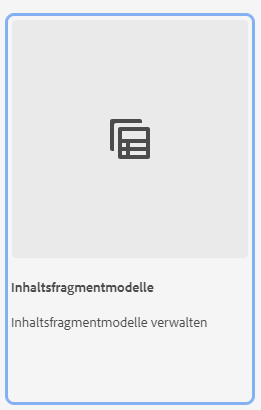

# Erfahren Sie mehr über das Erstellen von Inhaltsfragmentmodellen in AEM {#architect-headless-content-fragment-models}

## Die bisherige Entwicklung {#story-so-far}

Am Anfang der [AEM Headless-Inhaltsautoren-Tour](overview.md) wurden in den [Grundlagen der Inhaltsmodellierung für Headless mit AEM](basics.md) die grundlegenden Konzepte und die Terminologie behandelt, die für das Authoring für Headless relevant sind.

Dieser Artikel baut auf diesen auf, damit Sie verstehen, wie Sie Ihre eigenen Inhaltsfragmentmodelle für Ihr AEM Headless-Projekt erstellen können.

## Ziel {#objective}

* **Zielgruppe**: Anfänger
* **Ziel**: Konzepte und Methoden zur Modellierung von Inhalten für Ihr Headless-CMS mithilfe von Inhaltsfragmentmodellen.

<!-- which persona does this? -->
<!-- and who allows the configuration on the folders? -->

<!--
## Enabling Content Fragment Models {#enabling-content-fragment-models}

At the very start you need to enable Content Fragment Models for your site, this is done in the Configuration Browser; under Tools > General > Configuration Browser. You can either select to configure the global entry, or create a configuration. For example:

>[!NOTE]
>
>See Additional Resources - Content Fragments in the Configuration Browser
-->

## Erstellen von Inhaltsfragmentmodellen {#creating-content-fragment-models}

Anschließend können die Inhaltsfragmentmodelle erstellt und die Struktur definiert werden. Dies kann unter **Tools** > **Allgemein** > **Inhaltsfragmentmodelle** erfolgen. 

Nachdem Sie diese Option ausgewählt haben, gehen Sie zum Speicherort für Ihr Modell und klicken Sie auf **Erstellen**. Hier können Sie verschiedene wichtige Details eingeben.

Die Option **Modell aktivieren** ist standardmäßig aktiviert. Das bedeutet, dass Ihr Modell zur Verwendung verfügbar ist (beim Erstellen von Inhaltsfragmenten), sobald Sie es gespeichert haben. Sie können dies bei Bedarf deaktivieren – es gibt auch später Möglichkeiten, ein vorhandenes Modell zu aktivieren (oder zu deaktivieren).

Bestätigen Sie mit **Erstellen** und Sie können Ihr Modell **Öffnen**, um mit der Definition der Struktur zu beginnen.

## Definieren von Inhaltsfragmentmodellen {#defining-content-fragment-models}

Wenn Sie ein neues Modell zum ersten Mal öffnen, sehen Sie einen großen leeren Bereich links und eine lange Liste von **Datentypen** rechts:

Was ist also zu tun?

Sie können Instanzen der **Datentypen** in den linken Bereich ziehen – Sie definieren bereits Ihr Modell!

Nachdem Sie einen Datentyp hinzugefügt haben, müssen Sie die **Eigenschaften** für dieses Feld definieren. Diese hängen vom verwendeten Typ ab. Zum Beispiel:

Sie können beliebig viele Felder hinzufügen. Zum Beispiel:

### Ihre Inhaltsautoren {#your-content-authors}

Ihre Inhaltsautorinnen und -autoren sehen nicht die tatsächlichen Datentypen und -eigenschaften, die Sie zum Erstellen Ihrer Modelle verwendet haben. Dies bedeutet, dass Sie möglicherweise Hilfe und Informationen dazu bereitstellen müssen, wie bestimmte Felder ausgefüllt werden. Für grundlegende Informationen können Sie die Feldbeschriftung und den Standardwert verwenden. In komplexeren Fällen sollte jedoch eine projektspezifische Dokumentation in Betracht gezogen werden.

>[!NOTE]
>
>Siehe „Zusätzliche Ressourcen – Inhaltsfragmentmodelle“.

## Verwalten von Inhaltsfragmentmodellen {#managing-content-fragment-models}

<!-- needs more details -->

Die Verwaltung Ihrer Inhaltsfragmentmodelle umfasst Folgendes:

* Aktivieren (oder Deaktivieren) der Modelle – Dadurch werden sie für Autoren beim Erstellen von Inhaltsfragmenten verfügbar.
* Löschen – Eine Löschung kann immer erforderlich sein, aber Sie müssen sich bewusst sein, ob Sie ein Modell löschen, das bereits für Inhaltsfragmente verwendet wird, insbesondere für Fragmente, die bereits veröffentlicht wurden.

## Veröffentlichung {#publishing}

<!-- needs more details -->

Inhaltsfragmentmodelle müssen zeitgleich mit oder im Vorfeld der Veröffentlichung abhängiger Inhaltsfragmente veröffentlicht werden.

>[!NOTE]
>
>Wenn eine Autorin bzw. ein Autor versucht, Inhaltsfragmente zu veröffentlichen, deren Modell noch nicht veröffentlicht wurde, wird dies in der Auswahlliste angezeigt und das Modell wird mit dem Fragment veröffentlicht.

Sobald ein Modell veröffentlicht wird, wird es auf der Autoreninstanz in einen SCHREIBGESCHÜTZTEN Modus versetzt und *gesperrt*. Dadurch soll verhindert werden, dass Änderungen zu Fehlern an vorhandenen GraphQL-Schemata und -Abfragen führen, insbesondere in der Veröffentlichungsumgebung. Dies wird in der Konsole durch **Gesperrt** angezeigt.

Wenn das Modell **Gesperrt** ist (im schreibgeschützten Modus), können Sie den Inhalt und die Struktur der Modelle anzeigen, sie jedoch nicht direkt bearbeiten. Sie können **Gesperrte** Modelle aus der Konsole oder dem Modell-Editor heraus verwalten.

## Wie geht es weiter {#whats-next}

Nachdem Sie die Grundlagen gelernt haben, besteht der nächste Schritt darin, Ihre eigenen Inhaltsfragmentmodelle zu erstellen.

## Zusätzliche Ressourcen {#additional-resources}

* [Authoring – Konzepte](/help/sites-cloud/authoring/author-publish.md)

* [Grundlegende Handhabung](/help/sites-cloud/authoring/basic-handling.md) – diese Seite basiert hauptsächlich auf der **Sites**-Konsole, aber viele/die meisten Funktionen sind auch für die Navigation zu und die Ausführung von Aktionen mit **Inhaltsfragmentmodellen** auf der **Allgemein**-Konsole relevant.

* [Arbeiten mit Inhaltsfragmenten](/help/sites-cloud/administering/content-fragments/overview.md)

   * [Inhaltsfragmentmodelle](/help/sites-cloud/administering/content-fragments/managing-content-fragment-models.md)

      * [Definieren des Inhaltsfragmentmodells](/help/sites-cloud/administering/content-fragments/content-fragment-models.md)

      * [Aktivieren oder Deaktivieren von Inhaltsfragmentmodellen](/help/sites-cloud/administering/content-fragments/managing-content-fragment-models.md#enabling-disabling-a-content-fragment-model)

      * [Zulassen von Inhaltsfragmentmodellen im Asset-Ordner](/help/sites-cloud/administering/content-fragments/managing-content-fragment-models.md#allowing-content-fragment-models-assets-folder)

      * [Löschen eines Inhaltsfragmentmodells](/help/sites-cloud/administering/content-fragments/managing-content-fragment-models.md#deleting-a-content-fragment-model)

      * [Veröffentlichen eines Inhaltsfragmentmodells](/help/sites-cloud/administering/content-fragments/managing-content-fragment-models.md#publishing-a-content-fragment-model)

      * [Rückgängigmachen der Veröffentlichung eines Inhaltsfragmentmodells](/help/sites-cloud/administering/content-fragments/managing-content-fragment-models.md#unpublishing-a-content-fragment-model)

      * [Gesperrte Inhaltsfragmentmodelle](/help/sites-cloud/administering/content-fragments/managing-content-fragment-models.md#locked-content-fragment-models)

* Anleitungen für den Einstieg

   * [Erstellen einer Headless-Einrichtung für Inhaltsfragmentmodelle](/help/headless/setup/create-content-model.md)
