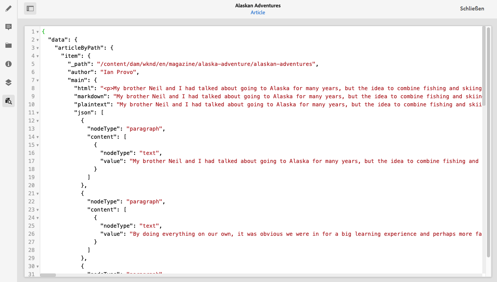
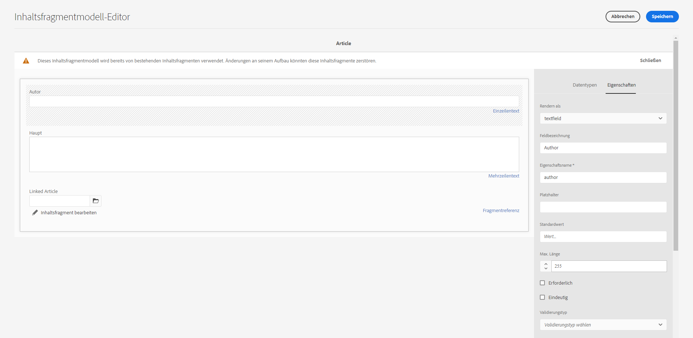

# Zugreifen auf Ihre Inhalte über AEM-Bereitstellungs-APIs {#access-your-content}

In diesem Teil der [AEM Headless Developer Journey](overview.md) erfahren Sie, wie Sie mit GraphQL-Abfragen auf die Inhalte Ihrer Inhaltsfragmente zugreifen und diese in Ihr Programm einfließen lassen können (Headless-Bereitstellung).

## Die bisherige Entwicklung {#story-so-far}

Im vorherigen Dokument der AEM Headless-Tour, [So modellieren Sie Ihre Inhalte](model-your-content.md), haben Sie die Grundlagen der Inhaltsmodellierung in AEM gelernt. Daher sollten Sie jetzt verstehen, wie Sie Ihre Inhaltsstruktur modellieren und dann diese Struktur mithilfe von AEM-Inhaltsfragmentmodellen und -Inhaltsfragmenten umsetzen:

* Machen Sie sich mit den Konzepten und der Terminologie zur Inhaltsmodellierung vertraut.
* Erfahren Sie, warum Inhaltsmodellierung für die Headless-Bereitstellung von Inhalten erforderlich ist.
* Verstehen Sie, wie Sie diese Struktur mit AEM-Inhaltsfragmentmodellen umsetzen und Inhalte mit Inhaltsfragmenten erstellen können.
* Machen Sie sich damit vertraut, wie Sie Inhalte modellieren können, und erfahren Sie anhand einfacher Beispiele mehr über Prinzipien.

Dieser Artikel baut auf diesen Grundlagen auf, damit Sie verstehen, wie Sie in AEM auf Ihren vorhandenen Headless-Content mithilfe der AEM-GraphQL-API zugreifen können.

* **Zielgruppe**: Anfänger
* **Ziele**: Erfahren Sie, wie Sie mithilfe AEM-GraphQL-Abfragen auf den Inhalt Ihrer Inhaltsfragmente zugreifen können:
   * Einführung in GraphQL und die AEM-GraphQL-API.
   * Machen Sie sich mit den Details der AEM-GraphQL-API vertraut.
   * Sehen Sie sich einige Beispielabfragen an, um mehr über den Einsatz in der Praxis zu erfahren.

## Sie möchten also auf Ihre Inhalte zugreifen? {#so-youd-like-to-access-your-content}

Sie haben all diese Inhalte, sauber strukturiert (in Inhaltsfragmenten) und möchten sie nun in Ihre neue App aufnehmen. Doch wie bekommen Sie sie dorthin?

Sie benötigen eine Möglichkeit, bestimmte Inhalte gezielt anzusprechen, auszuwählen, was Sie benötigen, und sie zur weiteren Verarbeitung an Ihr Programm zurückzugeben.

Mit Adobe Experience Manager (AEM) as a Cloud Service können Sie mithilfe der AEM-GraphQL-API selektiv auf Ihre Inhaltsfragmente zugreifen, um nur die benötigten Inhalte zurückzugeben. Dies bedeutet, dass Sie die Headless-Bereitstellung von strukturierten Inhalten zur Verwendung in Ihren Programmen umsetzen können.

>[!NOTE]
>
>Die AEM-GraphQL-API ist eine anwenderdefinierte Implementierung, die auf der standardmäßigen GraphQL-API-Spezifikation basiert.

## GraphQL – eine Einführung {#graphql-introduction}

GraphQL ist eine Open-Source-Spezifikation, mit der Ihnen Folgendes zur Verfügung steht:

* eine Abfragesprache, mit der Sie bestimmte Inhalte aus strukturierten Objekten auswählen können,
* eine Laufzeit, um diese Abfragen mit Ihren strukturierten Inhalten auszuführen.

GraphQL ist eine stark typisierte API. Das bedeutet, dass *alle* Inhalte klar strukturiert und nach Typ organisiert sein müssen, damit GraphQL *versteht*, auf was zugegriffen wird und wie. Die Datenfelder werden in GraphQL-Schemata definiert, die die Struktur Ihrer Inhaltsobjekte definieren.

GraphQL-Endpunkte geben dann die Pfade an, die GraphQL-Abfragen ausführen.

Das bedeutet, dass Ihr Programm genau, zuverlässig und effizient die benötigten Inhalte auswählen kann – genau das, was Sie bei Verwendung mit AEM brauchen.

>[!NOTE]
>
>Siehe *GraphQL*.org und *GraphQL*.com.

<!--
## AEM and GraphQL {#aem-graphql}

GraphQL is used in various locations in AEM; for example:

* Content Fragments
  * A customized API has been developed for this use-case (Headless Delivery to your app).
    * This is the AEM GraphQL API.
* Commerce
  * AEM Commerce consumes data from a Commerce platform via GraphQL.
  * There are GraphQL integrations between AEM and various third-party commerce solutions, used with the extension hooks provided by the CIF Core Components.
    * This does not use the AEM GraphQL API.

>[!NOTE]
>
>This step of the Headless Journey is only concerned with the AEM GraphQL API and Content Fragments.
-->

## AEM-GraphQL-API {#aem-graphql-api}

Die AEM-GraphQL-API ist eine angepasste Version, die auf der standardmäßigen GraphQL-API-Spezifikation basiert und speziell so konfiguriert wurde, dass Sie (komplexe) Abfragen in Inhaltsfragmenten durchführen können.

Inhaltsfragmente werden verwendet, da der Inhalt nach Inhaltsfragmentmodellen strukturiert ist. Dies erfüllt eine Grundanforderung von GraphQL.

* Ein Inhaltsfragmentmodell besteht aus einem oder mehreren Feldern.
   * Jedes Feld wird anhand eines Datentyps definiert.
* Inhaltsfragmentmodelle werden verwendet, um die entsprechenden AEM-GraphQL-Schemata zu generieren.

Für den Zugriff auf GraphQL für AEM (und die Inhalte) wird ein Endpunkt verwendet, um den Zugriffspfad bereitzustellen.

Die über die AEM-GraphQL-API zurückgegebenen Inhalte können dann von Ihren Programmen verwendet werden.

Um Ihnen beim direkten Eingeben und Testen von Abfragen zu helfen, ist auch eine Implementierung der standardmäßigen GraphQL-Schnittstelle für die Verwendung mit AEM-GraphQL verfügbar (kann mit AEM installiert werden). Dies bietet Funktionen wie Syntaxhervorhebung, automatische Vervollständigung, automatische Vorschläge sowie einen Verlauf und eine Online-Dokumentation.

>[!NOTE]
>
>Die Implementierung der AEM-GraphQL-API basiert auf den GraphQL-Java-Bibliotheken.

<!--
### Use Cases for Author and Publish Environments {#use-cases-author-publish-environments}

The use cases for the AEM GraphQL API can depend on the type of AEM as a Cloud Service environment:

* Publish environment; used to: 
  * Query content for JS application (standard use-case)

* Author environment; used to: 
  * Query content for "content management purposes":
    * GraphQL in AEM as a Cloud Service is currently a read-only API.
    * The REST API can be used for CR(u)D operations.
-->

## Inhaltsfragmente zur Verwendung mit der AEM-GraphQL-API {#content-fragments-use-with-aem-graphql-api}

Inhaltsfragmente können als Grundlage für GraphQL-Abfragen für AEM-Schemata verwendet werden:

* Sie ermöglichen es Ihnen, seitenunabhängige Inhalte zu entwerfen, zu erstellen, zu kuratieren und zu veröffentlichen, die sich für die Headless-Bereitstellung eignen.
* Sie basieren auf einem Inhaltsfragmentmodell, das die Struktur für das daraus entstehende Fragment mithilfe einer Auswahl von Datentypen vordefiniert.
* Zusätzliche Strukturebenen können mit dem Fragmentreferenz-Datentyp erstellt werden, der beim Definieren eines Modells verfügbar ist.

### Inhaltsfragmentmodelle {#content-fragments-models}

Diese Inhaltsfragmentmodelle:

* werden verwendet, um die Schemata zu erzeugen, sobald sie **aktiviert** sind.
* stellen die für GraphQL erforderlichen Datentypen und Felder bereit. Sie stellen sicher, dass Ihr Programm nur das anfordert, was möglich ist, und das erhält, was erwartet wird.
* Der Datentyp **Fragmentreferenzen** kann in Ihrem Modell verwendet werden, um auf ein anderes Inhaltsfragment zu verweisen und so zusätzliche Strukturebenen einzuführen.

### Fragmentreferenzen {#fragment-references}

Die **Fragmentreferenz**:

* ist ein bestimmter Datentyp, der beim Definieren eines Inhaltsfragmentmodells verfügbar ist,
* verweist auf ein anderes Fragment, abhängig von einem bestimmten Inhaltsfragmentmodell,
* Ermöglicht es Ihnen, strukturierte Daten zu erstellen und dann abzurufen.

   * Wenn als **multifeed** definiert, können mehrere Unterfragmente vom primären Fragment referenziert (abgerufen) werden.

### JSON-Vorschau {#json-preview}

Um Sie beim Entwerfen und Entwickeln Ihrer Inhaltsfragmentmodelle zu unterstützen, können Sie die JSON-Ausgabe im Inhaltsfragment-Editor in der Vorschau anzeigen.



<!--
## GraphQL Schema Generation from Content Fragments {#graphql-schema-generation-content-fragments}

GraphQL is a strongly-typed API, which means that content must be clearly structured and organized by type. The GraphQL specification provides a series of guidelines on how to create a robust API for interrogating content on a certain instance. To do this, a client must fetch the Schema, which contains all the types necessary for a query. 

For Content Fragments, the GraphQL schemas (structure and types) are based on **Enabled** Content Fragment Models and their data types.

>[!CAUTION]
>
>All the GraphQL schemas (derived from Content Fragment Models that have been **Enabled**) are readable through the GraphQL endpoint.
>
>This means that you need to ensure that no sensitive content is available, to ensure that no sensitive data is exposed via GraphQL endpoints; for example, this includes information that could be present as field names in the model definition.

For example, if a user created a Content Fragment Model called `Article`, then AEM generates the object `article` that is of a type `ArticleModel`. The fields within this type correspond to the fields and data types defined in the model.

1. A Content Fragment Model:

   

1. The corresponding GraphQL schema (output from GraphiQL automatic documentation):
   

   This shows that the generated type `ArticleModel` contains several [fields](#fields). 
   
   * Three of them have been controlled by the user: `author`, `main` and `referencearticle`.

   * The other fields were added automatically by AEM, and represent helpful methods to provide information about a certain Content Fragment; in this example, `_path`, `_metadata`, `_variations`. These [helper fields](#helper-fields) are marked with a preceding `_` to distinguish between what has been defined by the user and what has been auto-generated.

1. After a user creates a Content Fragment based on the Article model, it can then be interrogated through GraphQL. For examples, see the Sample Queries.md#graphql-sample-queries) (based on a sample Content Fragment structure for use with GraphQL.

In GraphQL for AEM, the schema is flexible. This means that it is auto-generated each and every time a Content Fragment Model is created, updated or deleted. The data schema caches are also refreshed when you update a Content Fragment Model.

The Sites GraphQL service listens (in the background) for any modifications made to a Content Fragment Model. When updates are detected, only that part of the schema is regenerated. This optimization saves time and provides stability.

So for example, if you:

1. Install a package containing `Content-Fragment-Model-1` and `Content-Fragment-Model-2`:
 
   1. GraphQL types for `Model-1` and `Model-2` are generated.

1. Then modify `Content-Fragment-Model-2`:

   1. Only the `Model-2` GraphQL type will get updated.

   1. Whereas `Model-1` will remain the same. 

>[!NOTE]
>
>This is important to note in case you want to do bulk updates on Content Fragment Models through the REST api, or otherwise.

The schema is served through the same endpoint as the GraphQL queries, with the client handling the fact that the schema is called with the extension `GQLschema`. For example, performing a simple `GET` request on `/content/cq:graphql/global/endpoint.GQLschema` will result in the output of the schema with the Content-type: `text/x-graphql-schema;charset=iso-8859-1`.

### Schema Generation - Unpublished Models {#schema-generation-unpublished-models}

When Content Fragments are nested it can happen that a parent Content Fragment Model is published, but a referenced model is not.

>[!NOTE]
>
>The AEM UI prevents this happening, but if publishing is made programmatically, or with content packages, it can occur.

When this happens, AEM generates an *incomplete* Schema for the parent Content Fragment Model. This means that the Fragment Reference, which is dependent on the unpublished model, is removed from the schema.

## AEM GraphQL Endpoints {#aem-graphql-endpoints}

An endpoint is the path used to access GraphQL for AEM. Using this path you (or your app) can:

* access the GraphQL schemas,
* send your GraphQL queries,
* receive the responses (to your GraphQL queries).

AEM allows for:

* A global endpoint - available for use by all sites.
* Endpoints for specific Sites configurations - that you can configure (in the Configuration Browser), specific to a specified site/project.

## Permissions {#permissions}

The permissions are those required for accessing Assets.

## The AEM GraphiQL Interface {#aem-graphiql-interface}

To help you directly input, and test queries, an implementation of the standard GraphiQL interface is available for use with AEM GraphQL. This can be installed with AEM.

>[!NOTE]
>
>GraphiQL is bound the global endpoint (and does not work with other endpoints for specific Sites configurations).

It provides features such as syntax-highlighting, auto-complete, auto-suggest, together with a history and online documentation.


-->

## Verwenden der AEM-GraphQL-API {#actually-using-aem-graphiql}

### Ersteinrichtung {#initial-setup}

Bevor Sie mit Abfragen zu Ihren Inhalten beginnen, müssen Sie Folgendes tun:

* Aktivieren des Endpunkts
   * Verwenden von „Tools“ > „Allgemein“ > „GraphQL“
   * [Aktivieren des GraphQL-Endpunkts](/help/headless/graphql-api/graphql-endpoint.md)
      * Dadurch wird auch die GraphiQL-IDE aktiviert.

### Beispielstruktur {#sample-structure}

Um die AEM-GraphQL-API in einer Abfrage zu verwenden, können die beiden sehr einfachen Strukturen des Inhaltsfragmentmodells verwendet werden:

* Unternehmen
   * Name – Text
   * CEO (Person) – Fragmentreferenz
   * Arbeitnehmer (Personen) – Fragmentreferenz(en)
* Person
   * Name – Text
   * Vorname – Text

Wie Sie sehen können, verweisen die Felder für CEO und Mitarbeiter auf die Personenfragmente.

Die Fragmentmodelle werden verwendet:

* beim Erstellen von Inhalten im Inhaltsfragment-Editor
* für die Generierung der von Ihnen abgefragten GraphQL-Schemata

### Testen von Abfragen {#where-to-test-your-queries}

Die Abfragen können in der GraphiQL-Benutzeroberfläche eingegeben werden. Sie können auf den Abfrage-Editor wie folgt zugreifen:

* **Tools** > **Allgemein** > **GraphQL-Abfrage-Editor**
* Direkt, zum Beispiel: `http://localhost:4502/aem/graphiql.html`


### Erste Schritte mit Abfragen {#getting-Started-with-queries}

Eine einfache Abfrage besteht darin, die Namen aller Einträge im Unternehmensschema zurückzugeben. Hier fordern Sie eine Liste aller Unternehmensnamen an:

```xml
query {
  companyList {
    items {
      name
    }
  }
}
```

Eine etwas komplexere Abfrage ist es, alle Personen auszuwählen, die nicht den Namen „Jobs“ haben. Dadurch wird unter allen Personen nach den Personen gefiltert, die nicht den Namen „Jobs“ haben. Dies wird mit dem Operator EQUALS_NOT erreicht (es gibt viele weitere):

```xml
query {
  personList(filter: {
    name: {
      _expressions: [
        {
          value: "Jobs"
          _operator: EQUALS_NOT
        }
      ]
    }
  }) {
    items {
      name
      firstName
    }
  }
}
```

Sie können auch komplexere Abfragen erstellen. Fragen Sie z. B. ab nach allen Firmen, die mindestens einen Mitarbeiter mit dem Namen „Smith“ haben. Diese Abfrage veranschaulicht die Filterung nach allen Personen namens „Smith“, wobei Informationen aus verschachtelten Fragmenten zurückgegeben werden.

```xml
query {
  companyList(filter: {
    employees: {
      _match: {
        name: {
          _expressions: [
            {
              value: "Smith"
            }
          ]
        }
      }
    }
  }) {
    items {
      name
      ceo {
        name
        firstName
      }
      employees {
        name
        firstName
      }
    }
  }
}
```

<!-- need code / curl / cli examples-->

Ausführliche Informationen zur Verwendung der AEM-GraphQL-API sowie zur Konfiguration der erforderlichen Elemente finden Sie unter:

* Verwendung von GraphQL mit AEM
* Beispielstruktur für Inhaltsfragmente
* Verwendung von GraphQL mit AEM – Beispielinhalt und Abfragen

## Wie geht es weiter {#whats-next}

Nachdem Sie nun erfahren haben, wie Sie mit der AEM-GraphQL-API auf Ihren Headless-Content zugreifen und ihn abfragen können, können Sie sich nun damit vertraut machen, [wie Sie mit einer REST-API auf die Inhalte Ihrer Inhaltsfragmente zugreifen und diese aktualisieren](update-your-content.md).

## Zusätzliche Ressourcen {#additional-resources}

* [Adobe Experience Manager as a Cloud Service-APIs](https://developer.adobe.com/experience-cloud/experience-manager-apis/)
* [GraphQL.org](https://graphql.org)
   * [Schemata](https://graphql.org/learn/schema/)
   * [Variablen](https://graphql.org/learn/queries/#variables)
   * [GraphQL-Java-Bibliotheken](https://graphql.org/code/#java)
* [GraphiQL](https://graphql.org/learn/serving-over-http/#graphiql)
* [Verwendung von GraphQL mit AEM](/help/headless/graphql-api/content-fragments.md)
   * [Aktivieren des GraphQL-Endpunkts](/help/headless/graphql-api/graphql-endpoint.md)
   * [Installieren der AEM-GraphiQL-Schnittstelle](/help/headless/graphql-api/graphiql-ide.md)
* [Beispielstruktur für Inhaltsfragmente](/help/headless/graphql-api/sample-queries.md#content-fragment-structure-graphql)
* [Verwendung von GraphQL mit AEM – Beispielinhalt und Abfragen](/help/headless/graphql-api/sample-queries.md)
   * [Beispielabfrage – ein Einzelstadtfragment](/help/headless/graphql-api/sample-queries.md#sample-single-specific-city-fragment)
   * [Beispielabfrage für Metadaten – Liste der Metadaten für Auszeichnungen mit dem Titel „GB“](/help/headless/graphql-api/sample-queries.md#sample-metadata-awards-gb)
   * [Beispielabfrage – alle Städte mit einer gegebenen Variante](/help/headless/graphql-api/sample-queries.md#sample-cities-named-variation)
* [Aktivieren der Funktionen für Inhaltsfragmente im Konfigurations-Browser](/help/sites-cloud/administering/content-fragments/setup.md#enable-content-fragment-functionality-configuration-browser)
* [Arbeiten mit Inhaltsfragmenten](/help/sites-cloud/administering/content-fragments/overview.md)
   * [Inhaltsfragmentmodelle](/help/sites-cloud/administering/content-fragments/content-fragment-models.md)
   * [JSON-Ausgabe](/help/assets/content-fragments/content-fragments-json-preview.md)
* [Verstehen von Cross-Origin Resource Sharing (CORS)](https://experienceleague.adobe.com/docs/experience-manager-learn/foundation/security/understand-cross-origin-resource-sharing.html?lang=de#understand-cross-origin-resource-sharing-(cors))
* [Persistierte GraphQL-Abfragen – Aktivieren der Caching-Funktion im Dispatcher](/help/headless/deployment/dispatcher-caching.md)
* [Erstellen von Zugriffs-Tokens für Server-seitige APIs](/help/implementing/developing/introduction/generating-access-tokens-for-server-side-apis.md)
* [Erste Schritte mit AEM Headless](https://experienceleague.adobe.com/docs/experience-manager-learn/getting-started-with-aem-headless/graphql/overview.html?lang=de) – eine kurze Video-Tutorial-Reihe, die einen Überblick über die Verwendung AEM Headless-Funktionen bietet, einschließlich Inhaltsmodellierung und GraphQL.
