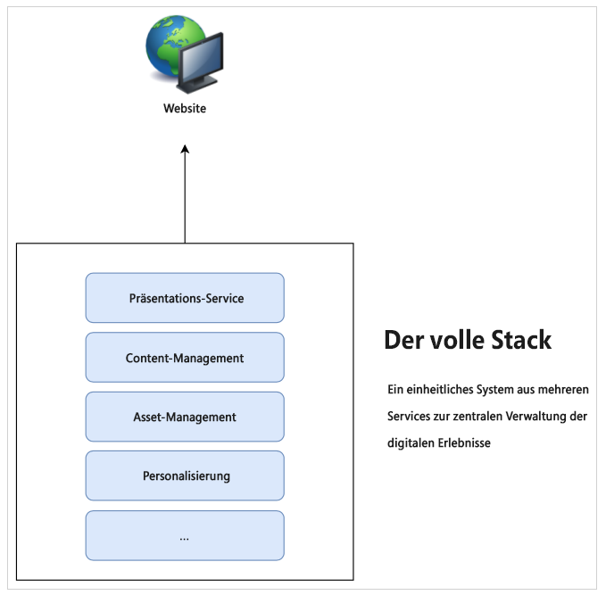
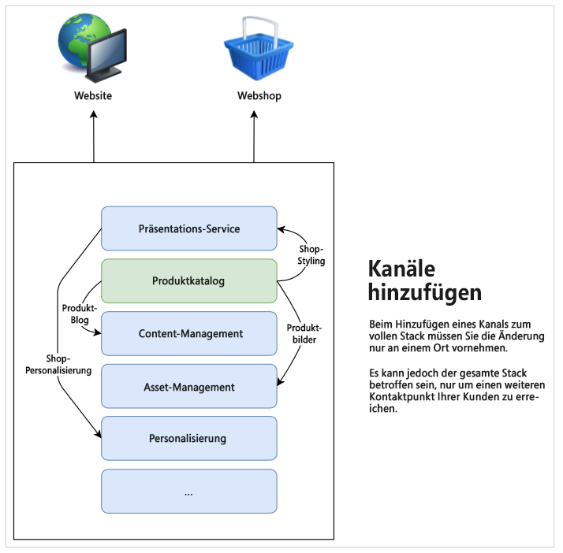
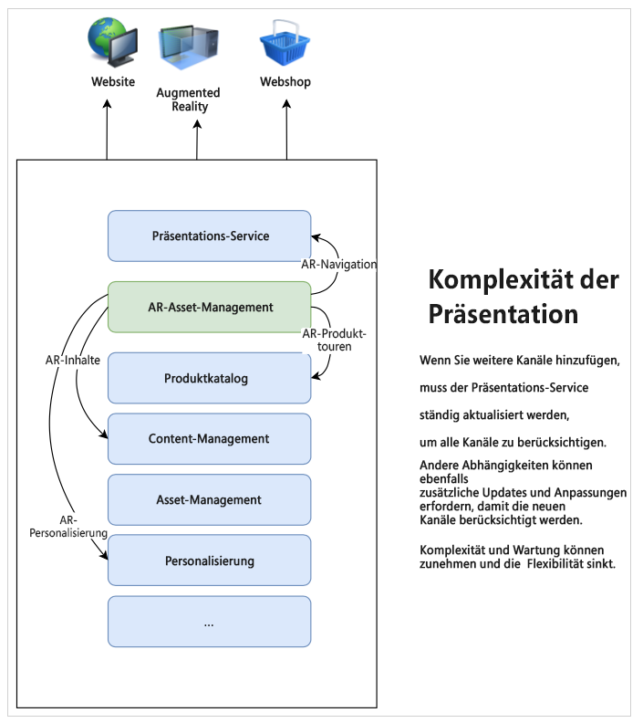
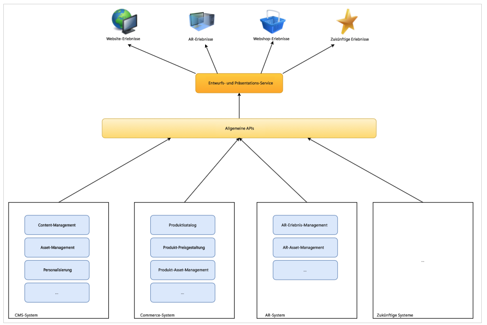

# Grundlegendes zur CMS-Headless-Entwicklung {#learn-about}

In diesem Teil der [AEM Headless-Entwickler-Journey](overview.md) erfahren Sie mehr über die Headless-Technologie und darüber, warum Sie sie verwenden sollten.

## Ziel {#objective}

Dieses Dokument hilft Ihnen, die Headless-Bereitstellung von Inhalten und Gründe für ihre Verwendung zu verstehen. Nach dem Lesen sollten Sie:

* die grundlegenden Konzepte und die Terminologie der Headless-Bereitstellung von Inhalten verstehen,
* verstehen, warum und wann Headless erforderlich ist,
* grundsätzlich wissen, wie Headless-Konzepte verwendet werden und wie sie miteinander zusammenhängen.

## Full-Stack-Inhaltsbereitstellung {#full-stack}

Seit der Einführung benutzerfreundlicher, umfangreicher Content-Management-Systeme (CMS) haben Unternehmen diese als zentralen Ort für die Verwaltung von Messaging, Branding und Kommunikation genutzt. Die Verwendung des CMS als zentraler Punkt für die Verwaltung von Erlebnissen verbessert die Effizienz, da Aufgaben in unterschiedlichen Systemen nicht mehr dupliziert werden müssen.

Bei einem Full-Stack-CMS befindet sich die gesamte Funktionalität zum Bearbeiten Ihrer Inhalte im CMS. Die Funktionen des Systems bilden die verschiedenen Komponenten des CMS-Stacks. Die Full-Stack-Lösung hat viele Vorteile.

* Sie haben nur ein System zu verwalten.
* Inhalte werden zentral verwaltet.
* Alle Services des Systems sind integriert.
* Die Inhaltsbearbeitung ist nahtlos.

Wenn Sie also einen neuen Kanal hinzufügen oder neue Erlebnistypen unterstützen möchten, können Sie eine (oder mehrere) neue Komponenten in Ihren Stack einfügen und Sie haben nur einen Ort, an dem Sie Ihre Änderungen vornehmen.

Die Komplexität der Abhängigkeiten innerhalb des Stacks wird schnell deutlich, da Sie sehen, dass andere Elemente im Stack möglicherweise angepasst werden müssen, um die Änderungen zu berücksichtigen.

## Beschränkungen für die Bereitstellung im Full-Stack-Modus {#limits}

Der Full-Stack-Ansatz erzeugt von Natur aus ein Silo, in dem alle Erlebnisse in einem System landen. Änderungen oder Ergänzungen einer Komponente des Silos erfordern Änderungen an anderen Komponenten, was Änderungen zeit- und kostenintensiv macht.

Dies gilt insbesondere für das Präsentationssystem, das in traditionellen Setups oft eng an das CMS gebunden ist. Jeder neue Kanal bedeutet im Allgemeinen eine Aktualisierung des Präsentationssystems, die sich auf alle anderen Kanäle auswirken kann.

Die Einschränkungen dieses natürlichen Silos können deutlich werden, wenn Sie mehr Aufwand betreiben müssen, um Änderungen über alle Komponenten Ihres Stacks hinweg zu koordinieren.

Benutzer erwarten Interaktionen, unabhängig von der Plattform oder dem Kontaktpunkt, was Agilität bei der Bereitstellung Ihrer Erlebnisse erfordert.  Dieser Multi-Channel-Ansatz ist der Standard digitaler Erlebnisse, und ein Full-Stack-Ansatz kann sich unter bestimmten Umständen als unflexibel erweisen.

## Das „Head“ in Headless {#the-head}

Der Kopf (engl. „head“) eines Systems ist im Allgemeinen der Ausgabe-Renderer dieses Systems, in der Regel in Form einer GUI oder einer anderen grafischen Ausgabe.

Ein Headless-Server beispielsweise befindet sich wahrscheinlich in einem Rack irgendwo in einem Server-Raum und hat keinen angeschlossenen Monitor. Um darauf zuzugreifen, müssen Sie sich per Fernzugriff damit verbinden. In diesem Fall ist der Monitor der Kopf, da er das Rendering der Ausgabe des Servers übernimmt. Als Verbraucher des Services stellen Sie Ihren eigenen Kopf (den Monitor) bereit, wenn Sie per Fernzugriff eine Verbindung mit ihm herstellen.

Wenn wir über ein Headless-CMS sprechen, verwaltet das CMS die Inhalte und stellt sie in der Folge für die Verbraucher bereit. Indem ein Headless-CMS jedoch nur die **Inhalte** standardisiert bereitstellt, lässt es das endgültige Ausgabe-Rendering aus, sodass die **Präsentation** des Inhalts dem verbrauchenden Service überlassen bleibt.

Die verbrauchenden Dienste – seien es AR-Erlebnisse, ein Webshop, mobile Erlebnisse oder Progressive Web Apps (PWAs) usw. – nehmen Inhalte aus dem Headless-CMS auf und stellen ihr eigenes Rendering bereit. Sie sorgen für die Bereitstellung eigener Köpfe für Ihre Inhalte.

Das Auslassen des Kopfes vereinfacht das CMS, indem es die Komplexität beseitigt. Dadurch wird auch die Verantwortung für das Rendering der Inhalte auf die Services verlagert, die den Inhalt tatsächlich benötigen und oft besser für dieses Rendering geeignet sind.

## Entkopplung {#decoupling}

Die Headless-Bereitstellung wird möglich, indem eine Reihe robuster und flexibler Anwendungs-Programmierschnittstellen (Application Programming Interfaces, APIs) zur Verfügung gestellt wird, auf die alle Ihre Erlebnisse zugreifen können. Die API dient als gemeinsame Sprache für die Services, bindet sie auf Inhaltsebene durch standardisierte Inhaltsbereitstellung zusammen, ermöglicht ihnen jedoch die Flexibilität, eigene Lösungen zu implementieren.

Headless ist ein Beispiel für die Entkopplung Ihrer Inhalte von ihrer Präsentation. Oder in einem allgemeineren Sinne, die Entkopplung des Frontend vom Backend Ihres Service-Stacks. Bei einem Headless-Setup wird das Präsentationssystem (der Kopf) vom Content-Management (dem Schwanz) entkoppelt. Die beiden interagieren nur über API-Aufrufe.

Diese Entkopplung bedeutet, dass jeder konsumierende Service (das Frontend) sein Erlebnis auf Grundlage derselben Inhalte aufbauen kann, die über die APIs bereitgestellt werden, und so die Wiederverwendung und Konsistenz der Inhalte gewährleistet ist. Verbrauchende Services können dann ihre eigenen Präsentationssysteme implementieren, sodass der Content-Management-Stack (das Back-End) einfach horizontal skaliert werden kann.

## Technologische Untermauerung {#technology}

Mit einem Headless-Ansatz können Sie einen Technologie-Stack aufbauen, der sich einfach und schnell an zukünftige Anforderungen an das digitale Erlebnis anpassen lässt.

Früher waren APIs für CMS normalerweise REST-basiert. Representational State Transfer (REST) stellt Ressourcen als Text ohne Status bereit. Dadurch können die Ressourcen mit einem vordefinierten Satz von Vorgängen gelesen und geändert werden. REST ermöglichte eine große Interoperabilität zwischen Services im Internet, indem es eine statuslose Darstellung der Inhalte sicherstellte.

Robuste REST-APIs werden weiterhin benötigt. Allerdings können REST-Anfragen groß und umfangreich sein. Wenn Sie mehrere Verbraucher haben, die REST-Aufrufe für alle Ihre Kanäle tätigen, kann sich diese Fülle summieren und die Leistung beeinträchtigen.

Bei der Headless-Bereitstellung von Inhalten werden häufig GraphQL-APIs verwendet. GraphQL ermöglicht eine ähnliche statuslose Übertragung, ermöglicht jedoch zielgerichtetere Abfragen, reduziert die Gesamtzahl der erforderlichen Abfragen und verbessert die Leistung. Häufig sieht man Lösungen, die eine Mischung aus REST und GraphQL verwenden, wobei im Wesentlichen das beste Tool für die jeweilige Aufgabe gewählt wird.

Unabhängig von der gewählten API können Sie durch die Definition eines Headless-Systems auf der Basis gängiger APIs den neuesten Browser und andere Web-Technologien wie progressive Web-Apps (PWA) nutzen. APIs erstellen eine Standardschnittstelle, die einfach erweiterbar und anpassbar ist.

Normalerweise werden Inhalte Client-seitig gerendert. Das bedeutet in der Regel, dass jemand Ihre Inhalte auf einem Mobilgerät aufruft, Ihr CMS die Inhalte bereitstellt und das Mobilgerät (der Client) dann für das Rendern der von Ihnen bereitgestellten Inhalte verantwortlich ist. Wenn das Gerät alt oder anderweitig langsam ist, ist auch Ihr digitales Erlebnis langsam.

Die Entkopplung von Inhalten von der Präsentation bedeutet, dass es mehr Kontrolle über diese Client-seitigen Leistungsaspekte geben kann. Server-seitiges Rendering (SSR) überträgt die Verantwortung für das Rendering der Inhalte vom Browser des Clients auf den Server. Dadurch können Sie als Anbieter der Inhalte Ihrer Zielgruppe ein garantiertes Leistungsniveau bieten, sofern dies erforderlich ist.

## Organisatorische Herausforderungen {#organization}

Headless eröffnet Ihnen eine Welt der Flexibilität für die Bereitstellung digitaler Erlebnisse. Aber diese Flexibilität kann auch ihre eigene Herausforderung mit sich bringen.

Viele verschiedene Kanäle zu haben, kann bedeuten, dass diese jeweils ihre eigenen Präsentationssysteme haben. Obwohl sie alle dieselben Inhalte über dieselben APIs nutzen, kann das Erlebnis aufgrund der verschiedenen Präsentationen unterschiedlich sein. Die Konsistenz des Kundenerlebnisses muss sorgfältig sichergestellt werden.

Durch die Implementierung sorgfältiger Design-Systeme, die Freigabe von Musterbibliotheken und die Nutzung wiederverwendbarer Design-Komponenten sowie etablierter, offener Client-seitiger Frameworks können konsistente Erlebnisse sichergestellt werden. Dies muss jedoch geplant werden.

## Die Zukunft ist Headless und die Zukunft ist jetzt {#future}

Digitale Erlebnisse werden weiterhin bestimmen, wie Marken mit Kunden interagieren. Was am Headless-Design aufregend ist, ist die Flexibilität, die es uns gibt, um auf sich verändernde Kundenerwartungen zu reagieren.

Es ist unmöglich, die Zukunft vorherzusagen, aber Headless gibt Ihnen die Agilität, auf alles zu reagieren, was die Zukunft bringt.

## AEM und Headless {#aem-and-headless}

Wenn Sie mit dieser Entwickler-Tour fortfahren, erfahren Sie, wie AEM die Headless-Bereitstellung neben den Funktionen für die Full-Stack-Bereitstellung unterstützt.

Als Branchenführer im Bereich Digital Experience Management hat Adobe erkannt, dass die ideale Lösung für die Herausforderungen der realen Welt, vor denen Entwickler von Erlebnissen stehen, selten eine binäre Wahl ist. Aus diesem Grund unterstützt AEM nicht nur beide Modelle, sondern ermöglicht auf einzigartige Weise die nahtlose hybride Kombination der beiden, die die Vorteile von Headless und Full-Stack vereint, damit Sie die Konsumenten Ihrer Inhalte optimal bedienen können, egal wo sie sich befinden.

Diese Tour konzentriert sich auf das reine Headless-Modell der Inhaltsbereitstellung. Sobald Sie jedoch über dieses Grundwissen verfügen, können Sie weiter erkunden, wie Sie die Leistungsfähigkeit beider Modelle nutzen können.

## Wie geht es weiter {#what-is-next}

Danke für Ihren Einstieg in die AEM Headless-Tour! Nachdem Sie dieses Dokument gelesen haben, sollten Sie:

* die grundlegenden Konzepte und die Terminologie der Headless-Inhaltsbereitstellung verstehen,
* verstehen, warum und wann Headless erforderlich ist,
* grundsätzlich wissen, wie Headless-Konzepte verwendet werden und wie sie miteinander zusammenhängen.

Bauen Sie auf diesem Wissen auf und setzen Sie Ihre AEM-Headless-Tour fort, indem Sie als Nächstes das Dokument [Erste Schritte mit AEM Headless as a Cloud Service](getting-started.md) lesen, in dem Sie erfahren, wie Sie die erforderlichen Tools einrichten und wie Sie damit beginnen können, darüber nachzudenken, wie AEM an die Headless-Bereitstellung von Inhalten herangeht und welche Voraussetzungen dafür gelten.

## Zusätzliche Ressourcen {#additional-resources}

Es wird zwar empfohlen, mit dem nächsten Teil der Headless-Entwicklungs-Journey fortzufahren, indem Sie das Dokument [Erste Schritte mit AEM Headless as a Cloud Service](getting-started.md) lesen. Im Folgenden finden Sie jedoch einige zusätzliche optionale Ressourcen, die einige der in diesem Dokument erwähnten Konzepte vertiefen, die aber nicht erforderlich sind, um mit der Headless-Journey fortzufahren.

* [Einführung in die Architektur von Adobe Experience Manager as a Cloud Service](/help/overview/architecture.md) – Grundlegendes zur Struktur von AEM as a Cloud Service
* [Einführung in AEM als Headless-CMS](/help/headless/introduction.md)
* Das [AEM-Entwicklerportal](https://experienceleague.adobe.com/landing/experience-manager/headless/developer.html?lang=de)
* [AEM Headless-Tutorials](https://experienceleague.adobe.com/docs/experience-manager-learn/getting-started-with-aem-headless/overview.html?lang=de) – Nutzen Sie diese praxisnahen Tutorials, um herauszufinden, wie Sie die verschiedenen Optionen für die Bereitstellung von Inhalten an Headless-Endpunkte mit AEM verwenden können, und wählen Sie aus, was für Sie am besten geeignet ist.
