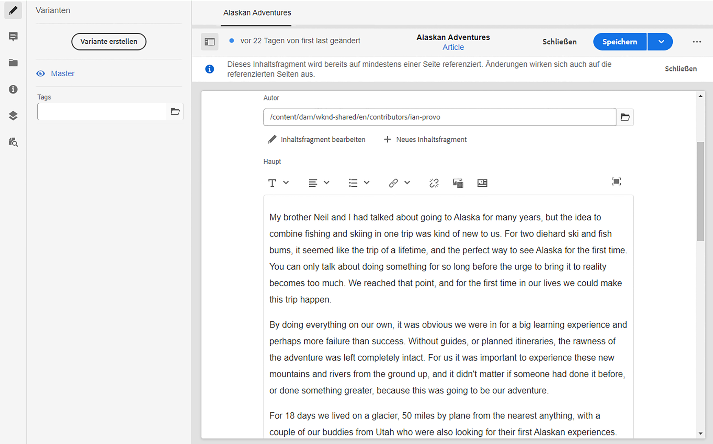

# Modell Ihres Inhalts {#model-your-content}

In diesem Teil des [AEM Headless Developer Journey](overview.md) können Sie lernen, wie Sie Ihre Inhaltsstruktur modellieren. Machen Sie sich dann mit dieser Struktur für Adobe Experience Manager (AEM) vertraut, die Inhaltsfragmentmodelle und Inhaltsfragmente verwendet, um sie kanalübergreifend wiederzuverwenden.

## Die Geschichte bisher {#story-so-far}

Am Anfang [Erfahren Sie mehr über die Headless-Entwicklung von CMS](learn-about.md) wurde die Bereitstellung von Headless-Inhalten behandelt und warum sie verwendet werden sollte. Dann [Erste Schritte mit AEM Headless als Cloud Service](getting-started.md) beschrieben AEM Headless im Kontext Ihres eigenen Projekts

Im vorherigen Dokument der AEM Headless-Journey [Pfad zu Ihrem ersten Erlebnis mit AEM Headless](/help/implementing/developing/headless-journey/path-to-first-experience.md) haben Sie dann die Schritte gelernt, die zur Implementierung Ihres ersten Projekts erforderlich sind. Nach dem Lesen sollten Sie Folgendes tun:

* Wichtige Planungsüberlegungen für die Erstellung Ihres Inhalts
* Machen Sie sich mit den Schritten zur Implementierung von Headless abhängig von Ihren Integrationsanforderungen vertraut.
* Richten Sie die erforderlichen Tools und AEM Konfigurationen ein.
* Machen Sie sich mit Best Practices vertraut, um die Headless-Journey reibungslos zu gestalten, die Inhaltsgenerierung effizient zu gestalten und sicherzustellen, dass Inhalte schnell bereitgestellt werden.

Dieser Artikel baut auf diesen Grundlagen auf, sodass Sie verstehen, wie Sie Ihr eigenes AEM Headless-Projekt vorbereiten.

## Vorgabe {#objective}

* **Zielgruppe**: Anfänger
* **Zielsetzung**: Erfahren Sie, wie Sie Ihre Inhaltsstruktur modellieren und diese Struktur dann mithilfe von AEM Inhaltsfragmentmodellen und Inhaltsfragmenten realisieren:
   * Einführung von Konzepten und Terminologie für die Daten-/Inhaltsmodellierung.
   * Erfahren Sie, warum eine Inhaltsmodellierung für die Bereitstellung Headless-Inhalts erforderlich ist.
   * Erfahren Sie, wie Sie diese Struktur mit AEM Inhaltsfragmentmodellen (und Inhaltsfragmenten erstellen) realisieren.
   * Erfahren Sie, wie Sie Ihren Inhalt modellieren können. Grundprinzipien mit Grundproben.

>[!NOTE]
>
>Die Datenmodellierung ist ein sehr großes Feld, da sie bei der Entwicklung von relationalen Datenbanken verwendet wird. Es gibt viele Bücher und Online-Informationsquellen.
>
>Wir werden nur die Aspekte berücksichtigen, die bei der Modellierung von Daten für die Verwendung mit AEM Headless von Interesse sind.

## Inhaltsmodellierung {#content-modeling}

*Es ist eine große, schlechte Welt da draußen*.

Vielleicht nicht, aber es ist sicherlich eine große ***komplizierte*** Welt da draußen, und die Datenmodellierung wird verwendet, um eine vereinfachte Darstellung eines sehr (sehr) kleinen Unterabschnitts zu definieren, wobei die spezifischen Informationen verwendet werden, die für einen bestimmten Zweck benötigt werden.

>[!NOTE]
>
>AEM befasst sich mit Inhalten. Wir bezeichnen Datenmodellierung als Inhaltsmodellierung.

Beispiel:

Es gibt viele Schulen, aber alle haben verschiedene Gemeinsamkeiten:

* Ein Ort
* Schulleiter/innen
* Viele Lehrkräfte
* Viele Lehrkräfte/innen
* Viele Schüler
* Viele Exlehrer/innen
* Viele Exil-Schüler
* Viele Klassenzimmer
* Viele (viele) Bücher
* Viele (viele) Ausrüstungsgegenstände
* Viele Aktivitäten außerhalb des Lehrplans
* und so weiter....

Selbst in einem so kleinen Beispiel kann die Liste endlos erscheinen. Wenn Ihre Anwendung jedoch nur eine einfache Aufgabe ausführen soll, müssen Sie die Informationen auf die Grundlagen beschränken.

Beispielsweise Werbung für Sonderveranstaltungen für alle Schulen in der Region:

* Schulname
* Schulort
* Schulleiter
* Ereignistyp
* Ereignisdatum
* Lehrkraft, die das Ereignis organisiert

### Konzepte  {#concepts}

Was Sie beschreiben möchten, werden als **Entitäten** bezeichnet - im Grunde die &quot;Dinge&quot;, über die wir Informationen speichern möchten.

Die Informationen, die wir über sie speichern möchten, sind die **Attribute** (Eigenschaften) wie Name und Qualifikationen für die Lehrer.

Dann gibt es verschiedene **Relationships** zwischen den Entitäten. Beispielsweise hat eine Schule in der Regel nur einen Schulleiter und viele Lehrer (und normalerweise ist der Schulleiter auch Lehrer).

Der Prozess der Analyse und Definition dieser Informationen zusammen mit den Beziehungen zwischen ihnen wird als **Inhaltsmodellierung** bezeichnet.

### Grundlagen {#basics}

Häufig müssen Sie zunächst ein **Konzeptschema** erstellen, in dem die Entitäten und ihre Beziehungen beschrieben werden. Normalerweise handelt es sich hierbei um einen allgemeinen (konzeptionellen) Ansatz.

Sobald dies stabil ist, können Sie die Modelle in ein **Logisches Schema** übersetzen, das die Entitäten zusammen mit den Attributen und den Beziehungen beschreibt. Auf dieser Ebene sollten Sie die Definitionen genau untersuchen, um Duplikate zu vermeiden und Ihr Design zu optimieren.

>[!NOTE]
>
>Manchmal werden diese beiden Schritte zusammengeführt, was häufig von der Komplexität Ihres Szenarios abhängt.

Benötigen Sie beispielsweise separate Entitäten für `Head Teacher` und `Teacher` oder einfach ein zusätzliches Attribut im `Teacher`-Modell?

### Gewährleistung der Datenintegrität {#data-integrity}

Datenintegrität ist erforderlich, um die Genauigkeit und Konsistenz Ihrer Inhalte über den gesamten Lebenszyklus hinweg zu gewährleisten. Dazu gehört auch, sicherzustellen, dass Autoren von Inhalten leicht verstehen können, was dort gespeichert werden soll. Daher ist Folgendes wichtig:

* klare Struktur
* eine möglichst knappe Struktur (ohne Genauigkeit zu opfern)
* Validierung einzelner Felder
* beschränken Sie gegebenenfalls den Inhalt bestimmter Felder auf die aussagekräftige

### Datenredundanz wird beseitigt {#data-redundancy}

Datenredundanz tritt auf, wenn dieselben Informationen zweimal in der Inhaltsstruktur gespeichert werden. Dies sollte vermieden werden, da dies zu Verwirrung bei der Erstellung des Inhalts und zu Fehlern bei der Abfrage führen kann. die missbräuchliche Nutzung von Speicherplatz zu erwähnen.

### Optimierung und Leistung {#optimization-and-performance}

Durch die Optimierung Ihrer Struktur können Sie die Leistung sowohl bei der Inhaltserstellung als auch bei der Abfrage verbessern.

Alles ist ein Balanceakt, aber das Erstellen einer Struktur, die zu komplex ist oder zu viele Ebenen hat, kann Folgendes bewirken:

* Verwirrend für Autoren, die den Inhalt generieren.

* Schwere Auswirkung auf die Leistung, wenn die Abfrage auf mehrere verschachtelte (referenzierte) Inhaltsfragmente zugreifen muss, um den erforderlichen Inhalt abzurufen.

## Inhaltsmodellierung für AEM Headless {#content-modeling-for-aem-headless}

Die Datenmodellierung ist eine Reihe etablierter Techniken, die häufig bei entwickelten Beziehungsdatenbanken verwendet werden. Was bedeutet die Inhaltsmodellierung also für AEM Headless?

### Vorteile {#why}

Um sicherzustellen, dass Ihre Anwendung die erforderlichen Inhalte konsistent und effizient von AEM anfordern und empfangen kann, muss dieser Inhalt strukturiert sein.

Das bedeutet, dass Ihre Anwendung die Form der Antwort im Voraus kennt und daher weiß, wie sie verarbeitet wird. Dies ist viel einfacher als das Empfangen von Freiforminhalten, die analysiert werden müssen, um zu bestimmen, was sie enthält und daher, wie sie verwendet werden können.

### Einführung in Wie? {#how}

AEM verwendet Inhaltsfragmente, um die Strukturen bereitzustellen, die für die Headless-Bereitstellung Ihrer Inhalte an Ihre Anwendungen erforderlich sind.

Die Struktur Ihres Inhaltsmodells lautet:

* durch die Definition Ihres Inhaltsfragmentmodells realisiert werden,
* wird als Grundlage der Inhaltsfragmente verwendet, die für die Inhaltserstellung verwendet werden.

>[!NOTE]
>
>Die Inhaltsfragmentmodelle werden auch als Grundlage für die AEM GraphQL-Schemas verwendet, die zum Abrufen Ihres Inhalts verwendet werden - mehr dazu in einer späteren Sitzung.

Anfragen für Ihren Inhalt werden mit der AEM GraphQL-API gestellt, einer benutzerdefinierten Implementierung der standardmäßigen GraphQL-API. Mit AEM GraphQL-API können Sie (komplexe) Abfragen Ihrer Inhaltsfragmente durchführen, wobei jede Abfrage einem bestimmten Modelltyp entspricht.

Die zurückgegebenen Inhalte können dann von Ihren Programmen verwendet werden.

## Erstellen der Struktur mit Inhaltsfragmentmodellen {#create-structure-content-fragment-models}

Inhaltsfragmentmodelle bieten verschiedene Mechanismen, mit denen Sie die Struktur Ihres Inhalts definieren können.

Ein Inhaltsfragmentmodell beschreibt eine Entität.

>[!NOTE]
>Sie müssen die Funktion für Inhaltsfragmente im Konfigurationsbrowser aktivieren, damit Sie neue Modelle erstellen können.

>[!TIP]
>
>Das Modell sollte so benannt werden, dass der Inhaltsautor weiß, welches Modell beim Erstellen eines Inhaltsfragments ausgewählt werden soll.

In einem Modell:

1. **Mit Datentypen** können Sie die einzelnen Attribute definieren.
Definieren Sie beispielsweise das Feld mit dem Namen eines Lehrers als **Text** und dessen Dienstjahre als **Zahl**.
1. Mit den Datentypen **Inhaltsreferenz** und **Fragmentverweis** können Sie Beziehungen zu anderen Inhalten in AEM erstellen.
1. Mit dem Datentyp **Fragmentverweis** können Sie mehrere Ebenen der Struktur realisieren, indem Sie Ihre Inhaltsfragmente verschachteln (je nach Modelltyp). Dies ist für Ihre Inhaltsmodellierung von entscheidender Bedeutung.

Beispiel:

### Datentypen {#data-types}

AEM stellt die folgenden Datentypen bereit, mit denen Sie Ihren Inhalt modellieren können:

* Einzeilentext
* Mehrzeilentext
* Zahl
* Boolesch
* Datum und Uhrzeit
* Aufzählung
* Tags
* Inhaltsreferenz
* Fragmentreferenz
* JSON-Objekt

### Verweise und verschachtelte Inhalte {#references-nested-content}

Zwei Datentypen bieten Verweise auf Inhalte außerhalb eines bestimmten Fragments:

* **Content**
ReferenceDies bietet eine einfache Referenz zu anderen Inhalten beliebigen Typs.
Sie können beispielsweise ein Bild an einer bestimmten Stelle referenzieren.

* **Fragmentverweis**
Dies bietet Verweise auf andere Inhaltsfragmente.
Dieser Referenztyp wird verwendet, um verschachtelte Inhalte zu erstellen und die Beziehungen einzuführen, die zum Modellieren Ihres Inhalts erforderlich sind.
Der Datentyp kann so konfiguriert werden, dass Fragmentautoren folgende Möglichkeiten haben:
   * Direktes Bearbeiten des referenzierten Fragments
   * Erstellen eines neuen Inhaltsfragments basierend auf dem entsprechenden Modell

### Erstellen von Inhaltsfragmentmodellen {#creating-content-fragment-models}

Am Anfang müssen Sie Inhaltsfragmentmodelle für Ihre Site aktivieren. Dies erfolgt im Konfigurationsbrowser. unter Tools > Allgemein > Konfigurationsbrowser. Sie können entweder den globalen Eintrag konfigurieren oder eine neue Konfiguration erstellen. Beispiel:

>[!NOTE]
>
>Siehe Zusätzliche Ressourcen - Inhaltsfragmente im Konfigurationsbrowser .

Anschließend können die Inhaltsfragmentmodelle erstellt und die Struktur definiert werden. Dies kann unter Tools > Assets > Inhaltsfragmentmodelle erfolgen. Beispiel:

>[!NOTE]
>
>Siehe Zusätzliche Ressourcen - Inhaltsfragmentmodelle .

## Verwenden des Modells zum Erstellen von Inhalten mit Inhaltsfragmenten {#use-content-to-author-content}

Inhaltsfragmente basieren immer auf einem Inhaltsfragmentmodell. Das Modell stellt die Struktur bereit, das Fragment enthält den Inhalt.

### Auswählen des entsprechenden Modells {#select-model}

Der erste Schritt zur tatsächlichen Erstellung Ihres Inhalts besteht darin, ein Inhaltsfragment zu erstellen. Dazu verwenden Sie Erstellen -> Inhaltsfragment im erforderlichen Ordner unter Assets -> Dateien . Der Assistent führt Sie durch die Schritte.

Ein Inhaltsfragment basiert auf einem bestimmten Inhaltsfragmentmodell, das Sie als ersten Schritt des Erstellungsprozesses auswählen.

### Erstellen und Bearbeiten von strukturierten Inhalten {#create-edit-structured-content}

Nachdem das Fragment erstellt wurde, können Sie es im Inhaltsfragment-Editor öffnen. Folgende Informationen/Optionen sind verfügbar:

* Bearbeiten Sie den Inhalt im normalen oder im Vollbildmodus.
* Formatieren Sie Ihren Inhalt entweder als Volltext, Nur Text oder Markdown.
* Erstellen und verwalten Sie Varianten Ihres Inhalts.
* Inhalt verknüpfen.
* Bearbeiten Sie die Metadaten.
* Anzeigen der Baumstruktur.
* Vorschau der JSON-Darstellung

### Erstellen von Inhaltsfragmenten  {#creating-content-fragments}

Nach Auswahl des entsprechenden Modells wird ein Inhaltsfragment zur Bearbeitung im Inhaltsfragment-Editor geöffnet:

>[!NOTE]
>
>Siehe Zusätzliche Ressourcen - Arbeiten mit Inhaltsfragmenten .

## Erste Schritte mit einigen Beispielen {#getting-started-examples}

<!--
tbc...
...and/or see the structures covered for the GraphQL samples...
...will those (ever) be delivered as an official sample package?
-->

Eine grundlegende Struktur als Beispiel finden Sie unter Struktur von Beispielinhalten.

## Wie geht es weiter {#whats-next}

Nachdem Sie nun gelernt haben, wie Sie Ihre Struktur modellieren und abhängig davon Inhalte erstellen, besteht der nächste Schritt darin, [Erfahren Sie, wie Sie mit GraphQL-Abfragen auf Ihre Inhaltsfragmente zugreifen und diese abrufen können](access-your-content.md). Dadurch wird GraphQL eingeführt und besprochen und dann werden einige Beispielabfragen angezeigt, um zu sehen, wie die Dinge in der Praxis funktionieren.

## Zusätzliche Ressourcen {#additional-resources}

* [Arbeiten mit Inhaltsfragmenten](/help/assets/content-fragments/content-fragments.md)  - die Lead-in-Seite für Inhaltsfragmente
   * [Inhaltsfragmente im Konfigurationsbrowser](/help/assets/content-fragments/content-fragments-configuration-browser.md)  - Aktivieren Sie die Funktion &quot;Inhaltsfragment&quot;im Konfigurationsbrowser
   * [Inhaltsfragmentmodelle](/help/assets/content-fragments/content-fragments-models.md)  - Erstellen und Bearbeiten von Inhaltsfragmentmodellen
   * [Verwalten von Inhaltsfragmenten](/help/assets/content-fragments/content-fragments-managing.md)  - Erstellen und Bearbeiten von Inhaltsfragmenten; Diese Seite führt Sie zu anderen detaillierten Abschnitten
* [AEM GraphQL-Schemas](/help/implementing/developing/headless-journey/access-your-content.md)  - So realisiert GraphQL Modelle
* [Die Struktur von Beispielinhaltsfragmenten](/help/assets/content-fragments/content-fragments-graphql-samples.md#content-fragment-structure-graphql)
* [Erste Schritte mit AEM Headless](https://experienceleague.adobe.com/docs/experience-manager-learn/getting-started-with-aem-headless/graphql/overview.html?lang=de)  - Eine kurze Video-Tutorial-Reihe, die einen Überblick über die Verwendung AEM Headless-Funktionen bietet, einschließlich Inhaltsmodellierung und GraphQL
