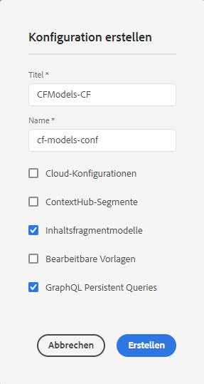

# Erfahren Sie, wie Sie Ihre Inhalte modellieren {#model-your-content}

In diesem Teil der [AEM Headless-Entwickler-Tour](overview.md) erfahren Sie, wie Sie Ihre Inhaltsstruktur modellieren. Setzen Sie dann diese Struktur für Adobe Experience Manager (AEM) mithilfe von Inhaltsfragmentmodellen und Inhaltsfragmenten um, um sie kanalübergreifend wiederzuverwenden.

## Die bisherige Entwicklung {#story-so-far}

Zunächst wurde unter [Grundlegendes zur CMS-Headless-Entwicklung](learn-about.md) die Bereitstellung von Headless-Inhalten behandelt und beschrieben, warum sie verwendet werden. Dann wurde in [Erste Schritte mit AEM Headless as a Cloud Service](getting-started.md) AEM Headless im Kontext Ihres eigenen Projekts beschrieben.

Im vorherigen Dokument der AEM Headless-Tour, [Der Weg zu Ihrem ersten Erlebnis mit AEM Headless](path-to-first-experience.md), haben Sie dann die Schritte kennengelernt, die zur Implementierung Ihres ersten Projekts erforderlich waren. Nach dem Lesen sollten Sie zu Folgendem imstande sein:

* Verstehen und Erklären wichtiger Planungsüberlegungen für die Gestaltung Ihrer Inhalte
* Verstehen und Erklären der Schritte zur Implementierung von Headless, je nach Ihren Anforderungen an die Integrationsebene.
* Einrichten der erforderlichen Tools und AEM-Konfigurationen.
* Kenntnis der Best Practices, mit denen Sie für reibungslose Headless-Abläufe sorgen, die Inhaltsgenerierung effizient gestalten und die schnelle Bereitstellung von Inhalten sicherstellen können

Dieser Artikel baut auf diesen Grundlagen auf, sodass Sie verstehen, wie Sie Ihr eigenes AEM Headless-Projekt vorbereiten.

## Ziel {#objective}

* **Zielgruppe**: Anfänger
* **Ziele**: Sie erfahren, wie Sie Ihre Inhaltsstruktur modellieren und diese Struktur dann mithilfe von AEM-Inhaltsfragmentmodellen und Inhaltsfragmenten umsetzen:
   * Einführung von Konzepten und Terminologie für die Daten-/Inhaltsmodellierung.
   * Erfahren Sie, warum eine Inhaltsmodellierung für die Headless-Bereitstellung von Inhalten erforderlich ist.
   * Erfahren Sie, wie Sie diese Struktur mit AEM-Inhaltsfragmentmodellen (und Autoreninhalten mit Inhaltsfragmenten) umsetzen können.
   * Erfahren Sie, wie Sie Ihre Inhalte modellieren können. Grundprinzipien mit einfachen Beispielen.

>[!NOTE]
>
>Die Datenmodellierung ist ein weites Feld, da sie bei der Entwicklung von relationalen Datenbanken verwendet wird. Es gibt viele Bücher und Online-Informationsquellen dazu.
>
>In dieser Journey werden nur die Aspekte berücksichtigt, die bei der Modellierung von Daten für die Verwendung mit AEM Headless von Interesse sind.

## Inhaltsmodellierung {#content-modeling}

*Die Welt da draußen ist groß und schlecht*.

Vielleicht, aber vielleicht auch nicht. Es ist sicherlich eine ***komplizierte*** Welt da draußen, und die Datenmodellierung wird verwendet, um eine vereinfachte Darstellung eines sehr (sehr) kleinen Unterabschnitts zu definieren, wobei die spezifischen Informationen verwendet werden, die für einen bestimmten Zweck benötigt werden.

>[!NOTE]
>
>Da sich AEM mit Inhalten beschäftigt, wird die Datenmodellierung auf dieser Journey als Inhaltsmodellierung bezeichnet.

Zum Beispiel:

Es gibt viele Schulen, aber alle haben verschiedene Gemeinsamkeiten:

* Ein Standort
* Ein(e) Schulleiter(in)
* Viele Lehrkräfte
* Viele Mitarbeiter, die nicht zum Lehrpersonal gehören
* Viele Schüler/innen
* Viele Ex-Lehrkräfte
* Viele Ex-Schüler/innen
* Viele Klassenzimmer
* Viele (viele) Bücher
* Viele (viele) Ausrüstungsgegenstände
* Viele Aktivitäten außerhalb des Lehrplans
* und so weiter....

Selbst in einem so kleinen Beispiel kann die Liste endlos erscheinen. Wenn Ihre Anwendung jedoch nur eine einfache Aufgabe ausführen soll, können Sie die Informationen auf das Wichtigste beschränken.

Beispielsweise Werbung für Sonderveranstaltungen für alle Schulen in der Region:

* Schulname
* Schulort
* Schulleiter(in)
* Veranstaltungstyp
* Veranstaltungsdatum
* Lehrkraft, die die Veranstaltung organisiert

### Konzepte {#concepts}

Was Sie beschreiben möchten, wird als **Entitäten** bezeichnet – im Grunde die „Dinge“, über die Informationen gespeichert werden sollen.

Die Informationen, die über sie gespeichert werden sollen, sind die **Attribute** (Eigenschaften), z. B. die Namen und Qualifikationen der Lehrkräfte.

Dann gibt es verschiedene **Beziehungen** zwischen den Entitäten. Beispielsweise hat eine Schule in der Regel nur eine(n) Schulleiter(in) und viele Lehrkräfte (und normalerweise ist der Schulleiter auch Lehrer).

Der Prozess der Analyse und Definition dieser Informationen zusammen mit den Beziehungen zwischen ihnen wird als **Inhaltsmodellierung** bezeichnet.

### Grundlagen {#basics}

Oft müssen Sie zunächst ein **Konzeptschema** erstellen, in dem die Entitäten und ihre Beziehungen beschrieben werden. Normalerweise handelt es sich hierbei um einen allgemeinen (konzeptionellen) Ansatz.

Sobald dies stabil ist, können Sie die Modelle in ein **logisches Schema** übersetzen, das die Entitäten zusammen mit den Attributen und den Beziehungen beschreibt. Auf dieser Ebene prüfen Sie die Definitionen genau, um Duplikate zu vermeiden und Ihren Entwurf zu optimieren.

>[!NOTE]
>
>Manchmal werden diese beiden Schritte zusammengeführt, was häufig von der Komplexität Ihres Szenarios abhängt.

Benötigen Sie beispielsweise separate Entitäten für `Head Teacher` und `Teacher` oder einfach ein zusätzliches Attribut im `Teacher`-Modell?

### Gewährleistung der Datenintegrität {#data-integrity}

Datenintegrität ist erforderlich, um die Genauigkeit und Konsistenz Ihrer Inhalte über den gesamten Lebenszyklus hinweg zu gewährleisten. Dazu gehört auch, sicherzustellen, dass Autoren von Inhalten leicht verstehen können, was wo gespeichert werden soll. Daher ist Folgendes wichtig:

* eine klare Struktur
* eine möglichst knappe Struktur (ohne Genauigkeit zu opfern)
* Validierung einzelner Felder
* beschränken Sie gegebenenfalls den Inhalt bestimmter Felder auf das, was aussagekräftig ist

### Beseitigen von Datenredundanz {#data-redundancy}

Datenredundanz tritt auf, wenn dieselben Informationen zweimal in der Inhaltsstruktur gespeichert werden. Dies sollte vermieden werden, da es zu Verwirrung bei der Erstellung des Inhalts und zu Fehlern bei Abfragen führen kann, ganz zu schweigen von der schlechten Nutzung des Speicherplatzes.

### Optimierung und Leistung {#optimization-and-performance}

Durch die Optimierung Ihrer Struktur können Sie die Leistung sowohl bei der Inhaltserstellung als auch bei Abfragen verbessern.

Alles ist ein Balanceakt, aber eine zu komplexe Struktur oder eine Struktur mit zu vielen Ebenen kann für die Autorinnen und Autoren, die die Inhalte erstellen, verwirrend sein. Weiterhin kann es die Leistung stark beeinträchtigen, wenn die Abfrage auf mehrere verschachtelte (referenzierte) Inhaltsfragmente zugreifen muss, um die gewünschten Inhalte abzurufen.

## Inhaltsmodellierung für AEM Headless {#content-modeling-for-aem-headless}

Die Datenmodellierung ist eine Reihe etablierter Techniken, die häufig bei der Entwicklung von relationalen Datenbanken verwendet werden. Was bedeutet die Inhaltsmodellierung also für AEM Headless?

### Vorteile {#why}

Um sicherzustellen, dass Ihr Programm die erforderlichen Inhalte konsistent und effizient von AEM anfragen und empfangen kann, müssen diese Inhalte strukturiert sein.

Das bedeutet, dass Ihr Programm die Form der Antwort im Voraus kennt und daher weiß, wie sie verarbeitet wird. Dies ist einfacher als das Empfangen von Freiforminhalten, die geparst werden müssen, um festzustellen, was sie enthalten und wie sie daraufhin verwendet werden können.

### Einführung in das Wie? {#how}

AEM verwendet Inhaltsfragmente, um die Strukturen bereitzustellen, die für die Headless-Bereitstellung Ihrer Inhalte an Ihre Programme erforderlich sind.

Die Struktur Ihres Inhaltsmodells wird:

* durch die Definition Ihres Inhaltsfragmentmodells umgesetzt,
* als Grundlage der Inhaltsfragmente verwendet, die für die Inhaltserstellung verwendet werden.

>[!NOTE]
>
>Die Inhaltsfragmentmodelle werden auch als Grundlage für die AEM-GraphQL-Schemata verwendet, die zum Abrufen Ihres Inhalts verwendet werden – mehr dazu in einer späteren Sitzung.

Anfragen für Ihre Inhalte werden mit der AEM-GraphQL-API gestellt, einer angepassten Implementierung der standardmäßigen GraphQL-API. Mit der AEM GraphQL-API können Sie (komplexe) Abfragen für Ihre Inhaltsfragmente durchführen, wobei jede Abfrage einem bestimmten Modelltyp entspricht.

Die zurückgegebenen Inhalte können dann von Ihren Programmen verwendet werden.

## Erstellen der Struktur mit Inhaltsfragmentmodellen {#create-structure-content-fragment-models}

Inhaltsfragmentmodelle bieten verschiedene Mechanismen, mit denen Sie die Struktur Ihrer Inhalte definieren können.

Ein Inhaltsfragmentmodell beschreibt eine Entität.

>[!NOTE]
>Um Modelle erstellen zu können, müssen Sie die Funktionalität für Inhaltsfragmente im Konfigurations-Browser aktivieren.

>[!TIP]
>
>Das Modell sollte so benannt werden, dass der Inhaltsautor weiß, welches Modell er beim Erstellen eines Inhaltsfragments auswählen soll.

Innerhalb eines Modells:

1. Mit **Datentypen** können Sie die einzelnen Attribute definieren.
Definieren Sie beispielsweise das Feld mit dem Namen eines Lehrers als **Text** und dessen Dienstjahre als **Zahl**.
1. Mit den Datentypen **Inhaltsreferenz** und **Fragmentreferenz** können Sie Beziehungen zu anderen Inhalten in AEM erstellen.
1. Mit dem Datentyp **Fragmentreferenz** können Sie mehrere Ebenen der Struktur umsetzen, indem Sie die Inhaltsfragmente verschachteln (je nach Modelltyp). Dies ist für Ihre Inhaltsmodellierung von entscheidender Bedeutung.

Beispiel:

### Datentypen {#data-types}

AEM stellt die folgenden Datentypen bereit, mit denen Sie Ihren Inhalt modellieren können:

* Einzeilentext
* Mehrzeilentext
* Zahl
* Boolesch
* Datum und Uhrzeit
* Aufzählung
* Tags
* Fragmentreferenz/Fragmentreferenz-UUID
* Inhaltsreferenz/Inhaltsreferenz-UUID
* JSON-Objekt
* Registerkartenplatzhalter

### Verweise und verschachtelte Inhalte {#references-nested-content}

Zwei Datentypen bieten Verweise auf Inhalte außerhalb eines bestimmten Fragments:

* **Inhaltsreferenz**
Dies bietet einen einfachen Verweis auf andere Inhalte beliebigen Typs.
Sie können beispielsweise auf ein Bild an einer bestimmten Stelle verweisen.

* **Fragmentreferenz**
Dies bietet Verweise auf andere Inhaltsfragmente.
Dieser Referenztyp wird verwendet, um verschachtelte Inhalte zu erstellen und die Beziehungen einzuführen, die zum Modellieren Ihres Inhalts erforderlich sind.
Der Datentyp kann so konfiguriert werden, dass Fragmentautoren folgende Möglichkeiten haben:
   * Direktes Bearbeiten des referenzierten Fragments
   * Erstellen eines neuen Inhaltsfragments basierend auf dem entsprechenden Modell

### Erstellen von Inhaltsfragmentmodellen {#creating-content-fragment-models}

Zunächst müssen Sie Inhaltsfragmentmodelle für Ihre Site aktivieren. Dies geschieht im Konfigurations-Browser unter **Tools** > **Allgemein** > **Konfigurations-Browser**. Sie können entweder den globalen Eintrag konfigurieren oder eine Konfiguration erstellen. Zum Beispiel:

>[!NOTE]
>
>Siehe „Zusätzliche Ressourcen – Inhaltsfragmente im Konfigurations-Browser“

Anschließend können die Inhaltsfragmentmodelle erstellt und die Struktur definiert werden. Dies kann alles in der Inhaltsfragmentkonsole erfolgen. Wählen Sie in der -Konsole das Bedienfeld für Inhaltsfragmentmodelle aus, navigieren Sie zum entsprechenden Ordner und verwenden Sie **Erstellen**, um das Dialogfeld **Neues Inhaltsfragmentmodell** zu öffnen.

Nach der Erstellung können Sie Ihr Modell bearbeiten. Zum Beispiel:

>[!NOTE]
>
>Siehe „Zusätzliche Ressourcen – Inhaltsfragmentmodelle“.

## Verwenden des Modells zum Erstellen von Inhalten mit Inhaltsfragmenten {#use-content-to-author-content}

Inhaltsfragmente basieren immer auf einem Inhaltsfragmentmodell. Das Modell stellt die Struktur bereit, das Fragment enthält den Inhalt.

### Auswählen des entsprechenden Modells {#select-model}

Der erste Schritt zur tatsächlichen Erstellung Ihrer Inhalte besteht darin, ein Inhaltsfragment zu erstellen. Dazu verwenden Sie **Erstellen** auf der Registerkarte **Inhaltsfragmente** der Inhaltsfragmentkonsole.

### Erstellen und Bearbeiten von strukturierten Inhalten {#create-edit-structured-content}

Nachdem das Fragment erstellt wurde, können Sie es im Inhaltsfragmenteditor öffnen. Hier haben Sie folgende Möglichkeiten:

* Bearbeiten der Inhalte im normalen oder im Vollbildmodus
* Formatieren der Inhalte entweder als Volltext, Nur-Text oder Markdown
* Erstellen und Verwalten von Inhaltsvarianten
* Verknüpfen von Inhalten.
* Bearbeiten von Metadaten.
* Anzeigen der Baumstruktur.
* Vorschau der JSON-Darstellung.

### Erstellen von Inhaltsfragmenten {#creating-content-fragments}

Nach Auswahl des entsprechenden Modells wird ein Inhaltsfragment zur Bearbeitung im Inhaltsfragment-Editor geöffnet:

>[!NOTE]
>
>Siehe „Zusätzliche Ressourcen – Arbeiten mit Inhaltsfragmenten“.

## Erste Schritte mit einigen Beispielen {#getting-started-examples}

<!--
tbc...
...and/or see the structures covered for the GraphQL samples...
...will those (ever) be delivered as an official sample package?
-->

Eine einfache Struktur als Beispiel finden Sie unter „Beispielstruktur für Inhaltsfragmente“.

## Wie geht es weiter {#whats-next}

Nachdem Sie nun gelernt haben, wie Sie Ihre Struktur modellieren und abhängig davon Inhalte erstellen, besteht der nächste Schritt darin, zu [erfahren, wie Sie mit GraphQL-Abfragen auf Ihre Inhaltsfragmente zugreifen und diese abrufen können](access-your-content.md). Hier wird GraphQL eingeführt und beschrieben. Außerdem werden einige Beispielabfragen gezeigt, um zu demonstrieren, wie die Dinge in der Praxis funktionieren.

## Zusätzliche Ressourcen {#additional-resources}

* [Arbeiten mit Inhaltsfragmenten](/help/sites-cloud/administering/content-fragments/overview.md) – die Einführungsseite für Inhaltsfragmente
   * [Inhaltsfragmente im Konfigurations-Browser](/help/sites-cloud/administering/content-fragments/setup.md#enable-content-fragment-functionality-configuration-browser) – Aktivieren der Funktion „Inhaltsfragment“ im Konfigurations-Browser
   * [Inhaltsfragmentmodelle](/help/sites-cloud/administering/content-fragments/managing-content-fragment-models.md) – Erstellen und Bearbeiten von Inhaltsfragmentmodellen
   * [Verwalten von Inhaltsfragmenten](/help/sites-cloud/administering/content-fragments/managing.md) – Erstellen und Bearbeiten von Inhaltsfragmenten. Diese Seite führt Sie zu anderen detaillierten Abschnitten.
* [AEM-GraphQL-Schemata](access-your-content.md) – So setzt GraphQL Modelle um
* [Beispielstruktur für Inhaltsfragmente](/help/headless/graphql-api/sample-queries.md#content-fragment-structure-graphql)
* [Erste Schritte mit AEM Headless](https://experienceleague.adobe.com/docs/experience-manager-learn/getting-started-with-aem-headless/graphql/overview.html?lang=de) – Eine kurze Video-Tutorial-Reihe, die einen Überblick über die Verwendung von AEM Headless-Funktionen bietet, einschließlich Inhaltsmodellierung und GraphQL
   * [Grundlagen der GraphQL-Modellierung](https://experienceleague.adobe.com/docs/experience-manager-learn/getting-started-with-aem-headless/graphql/video-series/modeling-basics.html?lang=de) –- Erfahren Sie, wie Sie Inhaltsfragmente in Adobe Experience Manager (AEM) für die Verwendung mit GraphQL definieren und verwenden.
