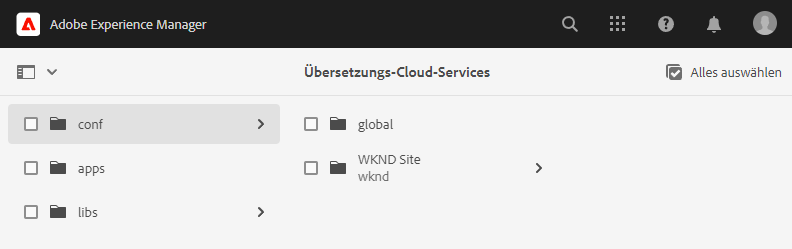
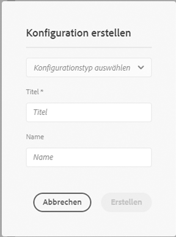
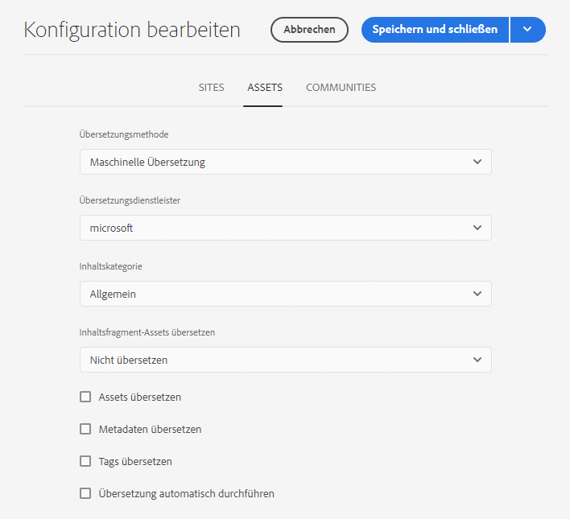
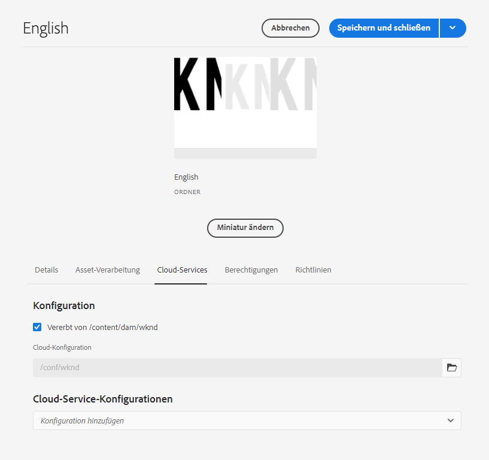

# Konfigurieren des Übersetzungs-Connectors {#configure-connector}

Erfahren Sie, wie Sie AEM mit einem Übersetzungsdienst verbinden.

## Die bisherige Entwicklung {#story-so-far}

Im vorherigen Dokument der AEM Headless Translation Journey, [Erste Schritte mit AEM Headless Translation](learn-about.md) haben Sie gelernt, wie Sie Headless Content organisieren und wie AEM Übersetzungs-Tools funktionieren. Jetzt sollten Sie:

* Machen Sie sich mit der Bedeutung der Inhaltsstruktur für die Übersetzung vertraut.
* Erfahren Sie, wie AEM Headless-Inhalte speichert.
* Machen Sie sich mit AEM Übersetzungstools vertraut.

Dieser Artikel baut auf diesen Grundlagen auf, damit Sie den ersten Konfigurationsschritt durchführen und einen Übersetzungsdienst einrichten können, den Sie später im Journey verwenden werden, um Ihre Inhalte zu übersetzen.

## Ziele {#objective}

In diesem Dokument erfahren Sie, wie Sie einen AEM Connector für Ihren ausgewählten Übersetzungsdienst einrichten. Nach dem Lesen sollten Sie:

* Machen Sie sich mit den wichtigen Parametern des Translation Integration Framework in AEM vertraut.
* Sie können Ihre eigene Verbindung zu Ihrem Übersetzungsdienst einrichten.

## Das Framework für die Übersetzungsintegration {#tif}

AEM Translation Integration Framework (TIF) ist mit Übersetzungsdiensten von Drittanbietern integriert, um die Übersetzung AEM Inhalts zu koordinieren. Dies umfasst drei grundlegende Schritte.

1. Verbinden Sie sich mit Ihrem Übersetzungsdienstleister.
1. Erstellen Sie eine Framework-Konfiguration für die Übersetzungsintegration.
1. Verknüpfen Sie die Konfiguration mit Ihrem Inhalt.

Die folgenden Abschnitte beschreiben diese Schritte detaillierter.

## Herstellen einer Verbindung zu einem Übersetzungsdienstleister {#connect-translation-provider}

Der erste Schritt besteht darin, den gewünschten Übersetzungsdienst auszuwählen. Es gibt viele Möglichkeiten für menschliche und maschinelle Übersetzungen, die AEM zur Verfügung stehen. Die meisten Anbieter bieten ein Übersetzungspaket zur Installation an. Eine Auswahl der verfügbaren Optionen finden Sie im Abschnitt [Zusätzliche Ressourcen](#additional-resources) .

>[!NOTE]
>
>Der Übersetzungsspezialist ist in der Regel für die Auswahl des zu verwendenden Übersetzungsdienstes verantwortlich, der Administrator ist jedoch in der Regel für die Installation des erforderlichen Übersetzungs-Connector-Pakets zuständig.

Für diese Journey verwenden wir den Microsoft Translator, der AEM eine Testlizenz vorkonfiguriert bietet. Weitere Informationen zu diesem Provider finden Sie im Abschnitt [Zusätzliche Ressourcen](#additional-resources) .

Wenn Sie einen anderen Anbieter auswählen, muss Ihr Administrator das Connector-Paket gemäß den Anweisungen des Übersetzungsdienstes installieren.

>[!NOTE]
>
>Die Verwendung des vordefinierten Microsoft Translator in AEM erfordert keine zusätzliche Einrichtung und funktioniert wie gewohnt ohne zusätzliche Connector-Konfiguration.
>
>Wenn Sie den Microsoft Translator-Connector zu Testzwecken verwenden möchten, müssen Sie die Schritte in den folgenden beiden Abschnitten nicht ausführen: [Erstellen einer Konfiguration für die Übersetzungsintegration](#create-config) und [Verknüpfen Sie die Konfiguration mit Ihrem Inhalt.](#associate) Es wird jedoch empfohlen, sie zu lesen, damit Sie mit den Schritten vertraut sind, mit denen Sie Ihren bevorzugten Connector konfigurieren müssen.
>
>Die Testlizenz des Microsoft Translator-Connectors ist nicht für Produktionszwecke bestimmt. Wenn Sie sich für eine Lizenzierung entscheiden, muss der Systemadministrator die im Abschnitt [Zusätzliche Ressourcen](#additional-resources) am Ende dieses Dokuments beschriebenen Schritte ausführen, um diese Lizenz zu konfigurieren.

## Erstellen einer Konfiguration für die Übersetzungsintegration {#create-config}

Nachdem das Connector-Paket für Ihren bevorzugten Übersetzungsdienst installiert wurde, müssen Sie eine Konfiguration für das Framework für die Übersetzungsintegration für diesen Dienst erstellen. Die Konfiguration enthält die folgenden Informationen:

* welcher Übersetzungsanbieter eingesetzt werden soll
* ob eine menschliche oder maschinelle Übersetzung erfolgen soll
* Ob andere Inhalte, die mit dem Inhaltsfragment verknüpft sind, übersetzt werden sollen, z. B. Tags

So erstellen Sie eine neue Übersetzungskonfiguration:

1. Klicken oder tippen Sie im globalen Navigationsmenü auf **Tools** -> **Cloud Services** -> **Übersetzungs-Cloud Services**.
1. Navigieren Sie zu der Stelle in Ihrer Inhaltsstruktur, an der Sie die Konfiguration erstellen möchten. Dies basiert häufig auf einem bestimmten Projekt oder kann global sein.
   * In diesem Fall kann beispielsweise eine Konfiguration global vorgenommen werden, um sie auf alle Inhalte oder nur auf das WKND-Projekt anzuwenden.

   

1. Geben Sie die folgenden Informationen in die Felder ein und klicken oder tippen Sie auf **Erstellen**.
   1. Wählen Sie **Konfigurationstyp** in der Dropdown-Liste aus. Wählen Sie **Übersetzungsintegration** aus der Liste aus.
   1. Geben Sie einen **Titel** für Ihre Konfiguration ein. Mit dem **Titel** wird die Konfiguration auf der **Cloud Services**-Konsole und in Dropdown-Listen mit den Seiteneigenschaften identifiziert.
   1. Geben Sie optional einen **Namen** für den Repository-Knoten ein, auf dem die Konfiguration gespeichert wird.

   

1. Tippen oder klicken Sie auf **Erstellen** und das Fenster **Konfiguration bearbeiten** wird angezeigt, in dem Sie die Konfigurationseigenschaften konfigurieren können.

1. Denken Sie daran, dass Inhaltsfragmente in AEM als Assets gespeichert werden. Tippen oder klicken Sie auf die Registerkarte **Assets** .



1. Geben Sie die folgenden Informationen ein.

   1. **Übersetzungsmethode**  - Wählen Sie je nach Übersetzungsanbieter  **Maschinelle** Übersetzung oder  **menschliche** Übersetzung aus. Für diese Journey übernehmen wir die maschinelle Übersetzung.
   1. **Übersetzungsanbieter**  - Wählen Sie in der Liste den Connector aus, den Sie für Ihren Übersetzungsdienst installiert haben.
   1. **Inhaltskategorie**  - Wählen Sie die am besten geeignete Kategorie aus, um die Übersetzung gezielter durchzuführen (nur für maschinelle Übersetzung).
   1. **Inhaltsfragment-Assets übersetzen**  - Aktivieren Sie diese Option, um Assets zu übersetzen, die mit Inhaltsfragmenten verknüpft sind.
   1. **Assets übersetzen**  - Aktivieren Sie diese Option, um die Assets zu übersetzen.
   1. **Metadaten übersetzen**  - Aktivieren Sie diese Option, um Asset-Metadaten zu übersetzen.
   1. **Tags übersetzen**  - Aktivieren Sie diese Option, um Tags zu übersetzen, die mit dem Asset verknüpft sind.
   1. **Übersetzung automatisch ausführen**  - Aktivieren Sie diese Eigenschaft, wenn Übersetzungen automatisch an Ihren Übersetzungsdienst gesendet werden sollen.

1. Tippen oder klicken Sie auf **Speichern und schließen**.

Sie haben jetzt den Connector für Ihren Übersetzungsdienst konfiguriert.

## Verknüpfen der Konfiguration mit Ihrem Inhalt {#associate}

AEM ist ein flexibles und leistungsstarkes Tool und unterstützt mehrere, gleichzeitige Übersetzungsdienste über mehrere Connectoren und mehrere Konfigurationen. Die Einrichtung einer solchen Konfiguration geht über den Rahmen dieser Journey hinaus. Diese Flexibilität bedeutet jedoch, dass Sie angeben müssen, welche Connectoren und Konfigurationen für die Übersetzung Ihrer Inhalte verwendet werden sollen, indem Sie diese Konfiguration mit Ihren Inhalten verknüpfen.

Navigieren Sie dazu zum Sprachstamm Ihres Inhalts. Für unsere Beispielzwecke ist dies

```text
/content/dam/<your-project>/en
```

1. Navigieren Sie zur globalen Navigation und navigieren Sie zu **Navigation** -> **Assets** -> **Dateien**.
1. Wählen Sie in der Assets-Konsole den zu konfigurierenden Sprachstamm aus und klicken oder tippen Sie auf **Eigenschaften**.
1. Tippen oder klicken Sie auf die Registerkarte **Cloud Services** .
1. Wählen Sie unter **Cloud Service Configurations** in der Dropdown-Liste **Konfiguration hinzufügen** den Connector aus. Sie sollte in der Dropdown-Liste angezeigt werden, wenn Sie das Paket als [beschrieben haben.](#connect-translation-provider)
1. Wählen Sie unter **Cloud Service Configurations** in der Dropdown-Liste **Konfiguration hinzufügen** auch Ihre Konfiguration aus.
1. Tippen oder klicken Sie auf **Speichern und schließen**.



## Wie geht es weiter {#what-is-next}

Nachdem Sie nun diesen Teil der Headless-Übersetzungs-Journey abgeschlossen haben, sollten Sie:

* Machen Sie sich mit den wichtigen Parametern des Translation Integration Framework in AEM vertraut.
* Sie können Ihre eigene Verbindung zu Ihrem Übersetzungsdienst einrichten.

Erstellen Sie auf diesem Wissen und fahren Sie mit dem Journey der AEM Headless-Übersetzung fort, indem Sie sich das Dokument [Übersetzungsregeln konfigurieren](translation-rules.md) ansehen. Hier erfahren Sie, wie Sie festlegen, welche Inhalte übersetzt werden sollen.

## Zusätzliche Ressourcen {#additional-resources}

Es wird zwar empfohlen, zum nächsten Teil des Journey-Headless-Übersetzung zu wechseln, indem Sie das Dokument [Übersetzungsregeln konfigurieren](translation-rules.md) lesen. Im Folgenden finden Sie einige zusätzliche optionale Ressourcen, die einen tieferen Einblick in einige der in diesem Dokument erwähnten Konzepte bieten, aber sie müssen nicht mit dem Headless-Journey weitermachen.

* [Konfigurieren des Übersetzungsintegrations-Frameworks](/help/sites-cloud/administering/translation/integration-framework.md) : Überprüfen Sie eine Liste ausgewählter Übersetzungs-Connectoren und erfahren Sie, wie Sie das Übersetzungsintegrations-Framework konfigurieren, um es mit Übersetzungsdiensten von Drittanbietern zu integrieren.
* [Verbindung zu Microsoft Translator](/help/sites-cloud/administering/translation/connect-ms-translator.md)  - AEM stellt zu Testzwecken ein Microsoft Translation-Testkonto bereit.
