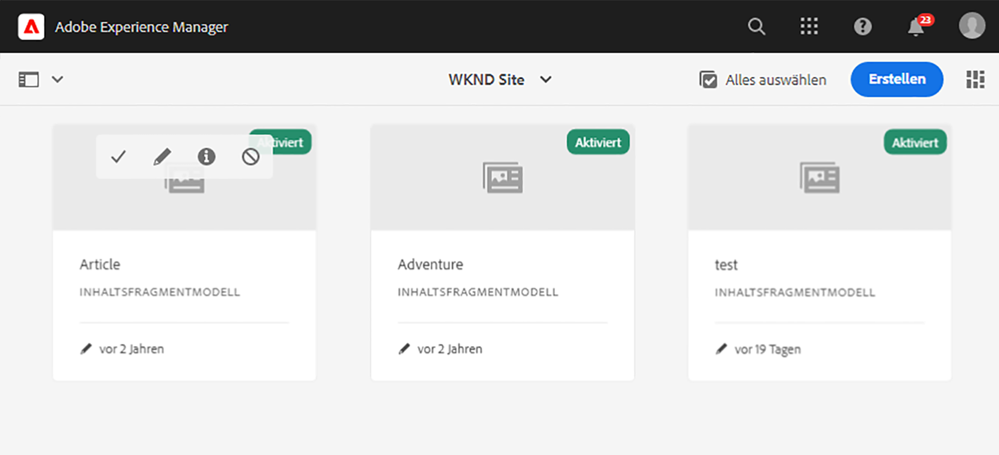
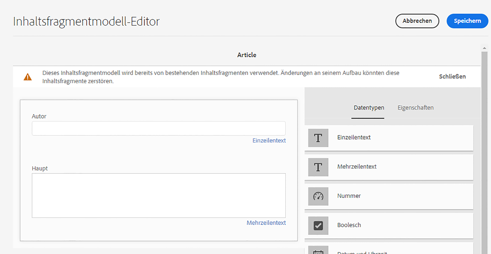
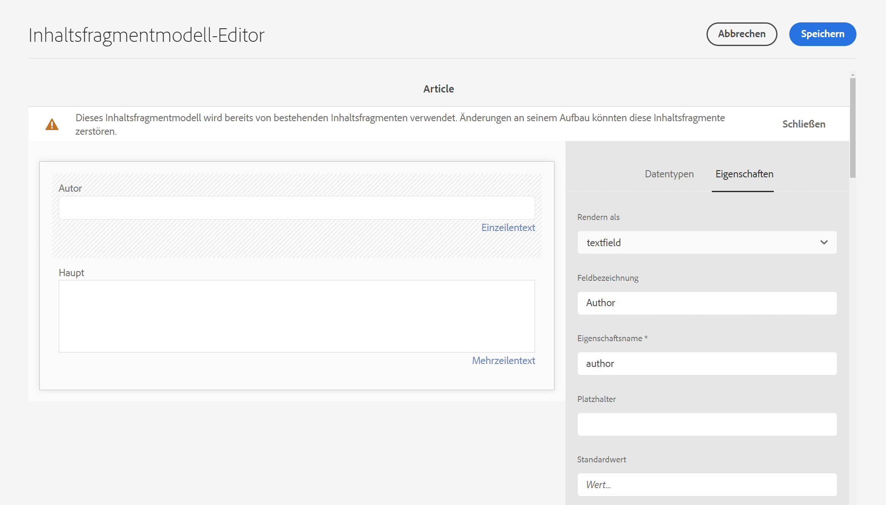

# Erste Schritte mit AEM Headless-Übersetzung {#getting-started}

Lernen Sie, wie Sie Ihre Headless Content organisieren und wie AEM Übersetzungs-Tools funktionieren.

## Die bisherige Entwicklung {#story-so-far}

Im vorherigen Dokument der AEM Headless Translation Journey haben Sie [Erfahren Sie mehr über Headless Content und die Übersetzung in AEM](learn-about.md) die grundlegende Theorie gelernt, was ein Headless-CMS ist und Sie sollten jetzt:

* Machen Sie sich mit den grundlegenden Konzepten der Headless Content-Bereitstellung vertraut.
* Machen Sie sich damit vertraut, wie AEM Headless und Übersetzung unterstützt.

Dieser Artikel baut auf diesen Grundlagen auf, sodass Sie verstehen, wie AEM Headless Content speichert und verwaltet und wie Sie AEM Übersetzungs-Tools verwenden können, um diesen Inhalt zu übersetzen.

## Ziele {#objective}

In diesem Dokument erfahren Sie, wie Sie mit der Übersetzung von Headless Content in AEM beginnen. Nach dem Lesen sollten Sie:

* Machen Sie sich mit der Bedeutung der Inhaltsstruktur für die Übersetzung vertraut.
* Erfahren Sie, wie AEM Headless-Inhalte speichert.
* Machen Sie sich mit AEM Übersetzungstools vertraut.

## Anforderungen und Vorbedingungen {#requirements-prerequisites}

Es gibt eine Reihe von Anforderungen, bevor Sie mit der Übersetzung Ihres Headless AEM Content beginnen.

### Kenntnisse {#knowledge}

* Erlebnis beim Übersetzen von Inhalten in ein CMS
* Erfahrung mit den grundlegenden Funktionen eines großen CMS
* Sie verfügen über Kenntnisse AEM grundlegenden Handhabung
* Grundlegendes zum verwendeten Übersetzungsdienst
* Grundlegendes zu den Inhalten, die Sie übersetzen

>[!TIP]
>
>Wenn Sie nicht mit der Verwendung eines umfangreichen CMS wie AEM vertraut sind, sollten Sie die [Grundlegende Handhabung](/help/sites-cloud/authoring/getting-started/basic-handling.md)-Dokumentation lesen, bevor Sie fortfahren. Die Grundlegende Handling-Dokumentation ist nicht Teil des Journey, daher kehren Sie nach Abschluss des Vorgangs zu dieser Seite zurück.

### Tools {#tools}

* Sandbox-Zugriff zum Testen der Übersetzung Ihres Inhalts
* Anmeldedaten für die Verbindung mit Ihrem bevorzugten Übersetzungsdienst
* Seien Sie Mitglied der Gruppe `project-administrators` in AEM

## Struktur ist der Schlüssel {#content-structure}

AEM Inhalte, sei es per Headless oder herkömmliche Webseiten, werden durch ihre Struktur gesteuert. AEM stellt nur wenige Anforderungen an die Inhaltsstruktur, doch kann eine sorgfältige Berücksichtigung Ihrer Inhaltshierarchie im Rahmen der Projektplanung die Übersetzung erheblich vereinfachen.

>[!TIP]
>
>Planen Sie die Übersetzung am Anfang des Headless-Projekts. Arbeiten Sie frühzeitig mit dem Projektmanager und den Inhaltsarchitekten zusammen.
>
>Ein Internationalisierungsprojekt-Manager kann als eigenständige Person erforderlich sein, deren Aufgabe es ist zu definieren, welche Inhalte übersetzt werden sollen und welche nicht und welche übersetzten Inhalte von regionalen oder lokalen Inhaltserstellern geändert werden können.

## Wie AEM Headless-Inhalte speichert {#headless-content-in-aem}

Für den Übersetzer ist es nicht wichtig, sich eingehend damit vertraut zu machen, wie AEM Headless Content verwaltet. Die Kenntnis der grundlegenden Konzepte und Terminologie ist jedoch hilfreich, wenn Sie später AEM Übersetzungstools verwenden. Vor allem müssen Sie Ihre eigenen Inhalte und ihre Struktur verstehen, um sie effektiv übersetzen zu können.

### Inhaltsmodelle {#content-models}

Damit Headless-Inhalte konsistent über verschiedene Kanäle, Regionen und Sprachen bereitgestellt werden können, müssen die Inhalte stark strukturiert sein. AEM verwendet Inhaltsmodelle, um diese Struktur zu erzwingen. Denken Sie an Inhaltsmodelle als eine Art Vorlage oder Muster zum Erstellen von Headless-Inhalten. Da jedes Projekt seine eigenen Anforderungen hat, definiert jedes Projekt seine eigenen Inhaltsfragmentmodelle. AEM hat keine festen Anforderungen oder Strukturen für solche Modelle.

Der Inhaltsarchitekt arbeitet zu Beginn des Projekts, um diese Struktur zu definieren. Als Übersetzungsspezialist sollten Sie eng mit dem Inhaltsarchitekten zusammenarbeiten, um den Inhalt zu verstehen und zu organisieren.

>[!NOTE]
>
>Es liegt in der Verantwortung des Inhaltsarchitekten, die Inhaltsmodelle zu definieren. Der Übersetzungsspezialist sollte nur mit seiner Struktur vertraut sein, wie in den folgenden Schritten beschrieben.

Da die Inhaltsmodelle die Struktur Ihres Inhalts definieren, müssen Sie wissen, welche Felder Ihrer Modelle übersetzt werden müssen. Im Allgemeinen arbeiten Sie mit dem Inhaltsarchitekten zusammen, um dies zu definieren. Gehen Sie wie folgt vor, um die Felder Ihrer Inhaltsmodelle zu durchsuchen.

1. Navigieren Sie zu **Tools** -> **Assets** -> **Inhaltsfragmentmodelle**.
1. Inhaltsfragmentmodelle werden im Allgemeinen in einer Ordnerstruktur gespeichert. Tippen oder klicken Sie auf den Ordner für Ihr Projekt.
1. Die Modelle werden aufgelistet. Tippen oder klicken Sie auf das Modell, um die Details anzuzeigen.
   
1. Der **Inhaltsfragmentmodell-Editor** wird geöffnet.
   1. Die linke Spalte enthält die Felder des Modells. Diese Spalte interessiert uns.
   1. Die rechte Spalte enthält die Felder, die dem Modell hinzugefügt werden können. Diese Spalte können wir ignorieren.
      
1. Tippen oder klicken Sie auf eines der Felder des Modells. AEM markiert es und die Details dieses Felds werden in der rechten Spalte angezeigt.
   

Notieren Sie sich das Feld **Eigenschaftsname** für alle Felder, die übersetzt werden müssen. Sie werden diese Informationen später im Journey benötigen. Diese **Eigenschaftsnamen** s sind erforderlich, um AEM zu informieren, welche Felder Ihres Inhalts übersetzt werden müssen.

>[!TIP]
>
>Im Allgemeinen stellt der Inhaltsarchitekte dem Übersetzungsspezialisten die **Eigenschaftsname** s aller für die Übersetzung erforderlichen Felder zur Verfügung. Diese Feldnamen werden für einen späteren Zeitpunkt im Journey benötigt. Die vorherigen Schritte werden für das Verständnis des Übersetzungsspezialisten bereitgestellt.

### Inhaltsfragmente {#content-fragments}

Inhaltsmodelle werden von den Inhaltsautoren verwendet, um den tatsächlichen Headless-Inhalt zu erstellen. Inhaltsautoren wählen das Modell aus, auf dem ihr Inhalt basieren soll, und erstellen dann Inhaltsfragmente. Inhaltsfragmente sind Instanzen der Modelle und stellen tatsächliche Inhalte dar, die Headless bereitgestellt werden.

Wenn die Inhaltsmodelle die Muster für den Inhalt sind, sind die Inhaltsfragmente der tatsächliche Inhalt, der auf diesen Mustern basiert. Die Inhaltsfragmente stellen den Inhalt dar, der übersetzt werden muss.

Inhaltsfragmente werden als Assets in AEM im Rahmen des Digital Asset Management (DAM) verwaltet. Dies ist wichtig, da sie sich alle unter dem Pfad `/content/dam` befinden.

## Empfohlene Inhaltsstruktur {#recommended-structure}

Arbeiten Sie wie zuvor empfohlen mit Ihrem Inhaltsarchitekten zusammen, um die geeignete Inhaltsstruktur für Ihr eigenes Projekt zu ermitteln. Das Folgende ist jedoch eine bewährte, einfache und intuitive Struktur, die sehr effektiv ist.

Definieren Sie einen Basisordner für Ihr Projekt unter `/content/dam`.

```text
/content/dam/<your-project>
```

Die Sprache, in der Ihr Inhalt erstellt wird, wird als Sprachstamm bezeichnet. In unserem Beispiel ist es Englisch und sollte unter diesem Pfad liegen.

```text
/content/dam/<your-project>/en
```

Alle Projektinhalte, die möglicherweise lokalisiert werden müssen, sollten im Sprachstamm platziert werden.

```text
/content/dam/<your-project>/en/<your-project-content>
```

Übersetzungen sollten als gleichrangige Ordner neben dem Sprachstamm erstellt werden, wobei ihr Ordnername den ISO-2-Sprachcode der Sprache darstellt. Beispielsweise hätte Deutsch den folgenden Pfad.

```text
/content/dam/<your-project>/de
```

>[!NOTE]
>
>Der Inhaltsarchitekt ist im Allgemeinen für die Erstellung dieser Sprachordner verantwortlich. Wenn sie nicht erstellt werden, können AEM später keine Übersetzungsaufträge erstellen.

Die endgültige Struktur kann etwa wie folgt aussehen:

```text
/content
    |- dam
        |- your-project
            |- en
                |- some
                |- exciting
                |- headless
                |- content
            |- de
            |- fr
            |- it
            |- ...
        |- another-project
        |- ...
```

Beachten Sie den spezifischen Pfad Ihres Inhalts, da er später zur Konfiguration Ihrer Übersetzung erforderlich ist.

>[!NOTE]
>
>In der Regel ist es Aufgabe des Inhaltsarchitekten, die Inhaltsstruktur zu definieren, kann jedoch mit dem Übersetzungsanbieter zusammenarbeiten.
>
>Sie wird hier zur Vollständigkeit detailliert beschrieben.

## AEM Übersetzungswerkzeuge {#translation-tools}

Nachdem Sie nun wissen, was Inhaltsfragmente sind und wie wichtig die Inhaltsstruktur ist, können wir uns ansehen, wie Sie diesen Inhalt übersetzen können. Die Übersetzungs-Tools in AEM sind sehr leistungsstark, aber einfach zu verstehen auf einer hohen Ebene.

* **Übersetzungs-Connector**  - Der Connector ist die Verknüpfung zwischen AEM und dem von Ihnen verwendeten Übersetzungsdienst.
* **Übersetzungsregeln**  - Regeln definieren, welche Inhalte unter bestimmten Pfaden übersetzt werden sollen.
* **Übersetzungsprojekte** : Übersetzungsprojekte sammeln Inhalte, die als einziger Übersetzungsprozess angesprochen werden sollten, und verfolgen den Fortschritt der Übersetzung, stellen eine Verbindung mit dem Connector her, um die zu übersetzenden Inhalte zu übertragen und sie vom Übersetzungsdienst zurückzuerhalten.

Im Allgemeinen richten Sie Ihren Connector nur einmal für Ihre Instanz und Regeln pro Headless-Projekt ein. Dann verwenden Sie Übersetzungsprojekte, um Ihre Inhalte zu übersetzen und die Übersetzungen laufend auf dem neuesten Stand zu halten.

## Wie geht es weiter {#what-is-next}

Nachdem Sie nun diesen Teil der Headless-Übersetzungs-Journey abgeschlossen haben, sollten Sie:

* Machen Sie sich mit der Bedeutung der Inhaltsstruktur für die Übersetzung vertraut.
* Erfahren Sie, wie AEM Headless-Inhalte speichert.
* Machen Sie sich mit AEM Übersetzungstools vertraut.

Erstellen Sie auf diesem Wissen und fahren Sie mit dem Journey der AEM Headless-Übersetzung fort, indem Sie sich das Dokument [Konfigurieren des Übersetzungs-Connectors](configure-connector.md) ansehen. Hier erfahren Sie, wie Sie AEM mit einem Übersetzungsdienst verbinden.|

## Zusätzliche Ressourcen {#additional-resources}

Es wird zwar empfohlen, zum nächsten Teil der Journey für die Headless-Übersetzung zu wechseln, indem Sie das Dokument [Konfigurieren des Übersetzungs-Connectors](configure-connector.md) lesen. Im Folgenden finden Sie einige zusätzliche optionale Ressourcen, die einen tieferen Einblick in einige der in diesem Dokument erwähnten Konzepte bieten, aber sie müssen nicht mit der Headless-Journey weitermachen.

* [AEM Grundlegende Handhabung](/help/sites-cloud/authoring/getting-started/basic-handling.md)  - Lernen Sie die Grundlagen der AEM Benutzeroberfläche kennen, um bequem zu navigieren und wichtige Aufgaben wie das Auffinden von Inhalten durchzuführen.
* [Identifizieren von zu übersetzenden Inhalten](/help/sites-cloud/administering/translation/rules.md)  - Erfahren Sie, wie Übersetzungsregeln Inhalte identifizieren, die übersetzt werden müssen.
* [Konfigurieren des Übersetzungsintegrations-Frameworks](/help/sites-cloud/administering/translation/integration-framework.md)  - Erfahren Sie, wie Sie das Übersetzungsintegrations-Framework konfigurieren, um es in Übersetzungsdienste von Drittanbietern zu integrieren.
* [Verwalten von Übersetzungsprojekten](/help/sites-cloud/administering/translation/managing-projects.md)  - Erfahren Sie, wie Sie in AEM Übersetzungsprojekte für Übersetzer und Übersetzer erstellen und verwalten.
