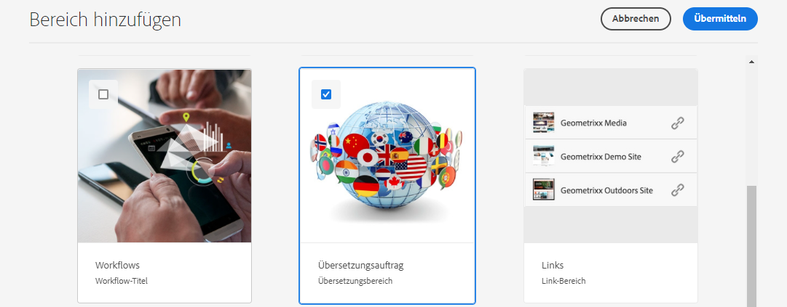

# Publish Translated Content {#publish-content}

Learn how to publish your translated content and update the translations as the content updates.

## Die bisherige Entwicklung {#story-so-far}

[](configure-connector.md) You should now:

* Understand what a translation project is.
* Be able to create new translation projects.
* Use translation projects to translate your headless content.

Now that your initial translation is complete, this article takes you through the next step of publishing that content and what to do to update your translations as the underlying content in the language root  changes.

## Ziel {#objective}

This document helps you understand how to publish headless content in AEM and how to create a continual workflow to keep your translations up-to-date. Nach Lesen dieses Dokuments sollten Sie Folgendes können:

* Understand the author-publish model of AEM.
* Know how to publish your translated content.
* Be able to implement a continual update model for your translated content.

## AEM&#39;s Author-Publish Model {#author-publish}

Before you publish your content, it is a good idea to understand AEM&#39;s author-publish model. In simplified terms, AEM divides users of the system into two groups.

1. Those who create and manage the content and the system
1. Those who consume the content from the system

AEM is therefore physically separated into two instances.

1. Die **author** -Instanz ist das System, in dem Autoren und Administratoren von Inhalten Inhalte erstellen und verwalten.
1. Die **publish** instance ist das System, das den Inhalt für die Verbraucher bereitstellt.

Sobald Inhalte in der Autoreninstanz erstellt wurden, müssen sie in die Veröffentlichungsinstanz übertragen werden, damit sie zur Verwendung verfügbar sind. ****

## Publishing Your Translated Content {#publishing}

Once you are happy with the state of your translated content, it must be published so headless services can consume it. Diese Aufgabe fällt normalerweise nicht in die Zuständigkeit des Übersetzungsanbieters, sondern wird hier dokumentiert, um den gesamten Workflow zu veranschaulichen.

>[!NOTE]
>
>Nach Abschluss der Übersetzung informiert der Übersetzungs-Spezialist den Inhaltsverantwortlichen im Allgemeinen, dass die Übersetzungen veröffentlicht werden können. Die Inhaltsverantwortlichen veröffentlichen sie dann.
>
>Die folgenden Schritte werden zur Vollständigkeit bereitgestellt.

Die einfachste Möglichkeit, die Übersetzungen zu veröffentlichen, besteht darin, zum Ordner mit den Projekt-Assets zu navigieren.

```text
/content/dam/<your-project>/
```

Unter diesem Pfad befinden sich Unterordner für jede Übersetzungssprache und können auswählen, welche veröffentlicht werden soll.

1. ************
1. Here you see the language root folder and all other language folders. Select the localized language or languages that you wish to publish.
   
1. ****
1. ******************** Tippen oder klicken Sie auf **Weiter**.
   
1. **** ****
   
1. AEM confirms the publish action with a pop-up message at the bottom of the screen.
   

Your translated headless content is now published! It can now be accessed and consumed by your headless services.

>[!TIP]
>
>You can select multiple items (i.e. multiple language folders) when publishing in order to publish multiple translations at one time.

There are additional options when publishing your content, such as scheduling a publication time, which are beyond the scope of this journey. [](#additional-resources)

## Updating Your Translated Content {#updating-translations}

Translation is rarely a one-off exercise. Typically your content authors continue to add to and modify your content in the language root after initial translation is complete. This means that you need to also update your translated content.

Specific project requirements define how often you need to update your translations and what decision process is followed before performing an update. Once you have decided to update your translations, the process in AEM is very simple. As the initial translation was based on a translation project, so too are any updates.

However as before, the process differs slightly if you chose to automatically create your translation project or manually create your translation project.

### Updating an Automatically Created Translation Project {#updating-automatic-project}

1. ************ Remember that headless content in AEM is stored as assets known as Content Fragments.
1. Select the language root of your project. `/content/dam/wknd/en`
1. ****
1. ****
1. ****
1. ****
1. ********
1. ****
1. ****


The content is added to the existing translation project. To view the translation project:

1. ********
1. Tap or click the project that you just updated.
1. Tap or click the language or one of the languages that you updated.

You see that a new job card was added to the project. In this example, another Spanish translation was added.


You may notice that the statistics listed on the new card (number of assets and content fragments) is different. This is because AEM recognizes what has changed since the last translation and only includes the content that needs to be translated. This includes re-translation of updated content as well as the first-time translation of new content.

[](translate-content.md#using-translation-project)

### Updating a Manually Created Translation Project {#updating-manual-project}

To update a translation you can add a new job to your existing project that is responsible for translating the updated content.

1. ********
1. Tap or click the project that you need to update.
1. ****
1. ************

   

1. Tippen oder klicken Sie auf der Karte des neuen Übersetzungsauftrags auf die Pfeilschaltfläche oben auf der Karte und wählen Sie **Target aktualisieren** , um die Zielsprache des neuen Auftrags zu definieren.

   

1. ********

   

1. Once your new translation job&#39;s target language is set, tap or click on the ellipsis button at the bottom of the job card to view the details of the job.
1. Der Auftrag ist beim ersten Erstellen leer. Fügen Sie Inhalt zum Auftrag hinzu, indem Sie auf die **Hinzufügen** und unter Verwendung des Pfad-Browsers [wie Sie es bei der ursprünglichen Erstellung des Übersetzungsprojekts getan haben.](translate-content.md##manually-creating)

>[!TIP]
>
>Die leistungsstarken Filter des Pfad-Browsers können wieder nützlich sein, um nur den aktualisierten Inhalt zu finden.
>
>Weitere Informationen zum Pfad-Browser finden Sie im [Abschnitt mit zusätzlichen Ressourcen.](#additional-resources)

An dieser Stelle [Starten und verwalten Sie Ihren Übersetzungsauftrag genauso wie das Original.](translate-content.md#using-translation-project)

## Ende der Journey? {#end-of-journey}

Herzlichen Glückwunsch! You have completed the headless translation journey! You should now:

* Have an overview of what headless content delivery is.
* Have a basic Understanding AEM&#39;s headless features.
* Understand AEM&#39;s translation features and how they related to headless content.
* Have the ability to start translating your own headless content.

Jetzt können Sie Ihre eigenen Headless Content in AEM übersetzen. AEM ist jedoch ein leistungsstarkes Tool und es gibt viele zusätzliche Optionen. Sehen Sie sich einige der zusätzlichen Ressourcen an, die im Abschnitt [Abschnitt &quot;Zusätzliche Ressourcen&quot;](#additional-resources) um mehr über die Funktionen zu erfahren, die Sie auf dieser Journey gesehen haben.

## Zusätzliche Ressourcen {#additional-resources}

* [Verwalten von Übersetzungsprojekten](/help/sites-cloud/administering/translation/managing-projects.md) - Erfahren Sie mehr über die Einzelheiten von Übersetzungsprojekten und zusätzliche Funktionen wie Workflows für menschliche Übersetzung und mehrsprachige Projekte.
* [](/help/sites-cloud/authoring/getting-started/concepts.md) This document is focused on authoring pages rather than Content Fragments, but the theory still applies.
* [Veröffentlichen von Seiten](/help/sites-cloud/authoring/fundamentals/publishing-pages.md) - Erfahren Sie mehr über die zusätzlichen Funktionen, die beim Veröffentlichen von Inhalten verfügbar sind. Dieses Dokument konzentriert sich nicht auf Inhaltsfragmente, sondern auf das Erstellen von Seiten, aber die Theorie gilt weiterhin.
* [Autorenumgebung und Tools](/help/sites-cloud/authoring/fundamentals/environment-tools.md##path-selection) - AEM bietet verschiedene Mechanismen für die Organisation und Bearbeitung von Inhalten, einschließlich eines robusten Pfadbrowsers.
