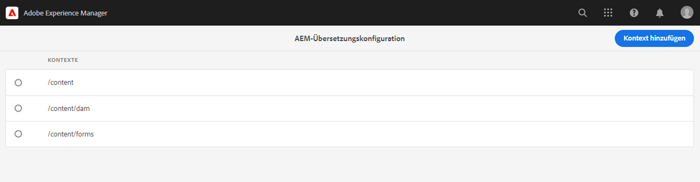
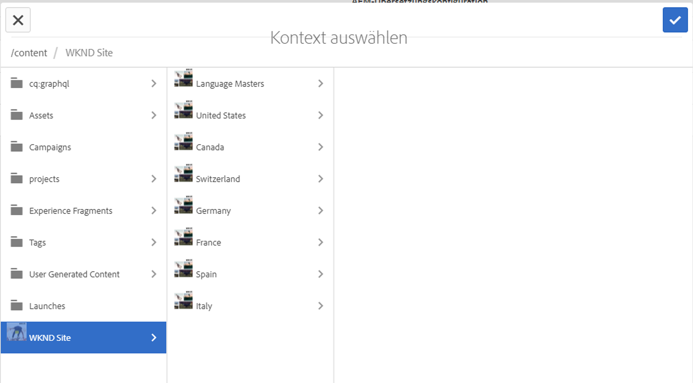
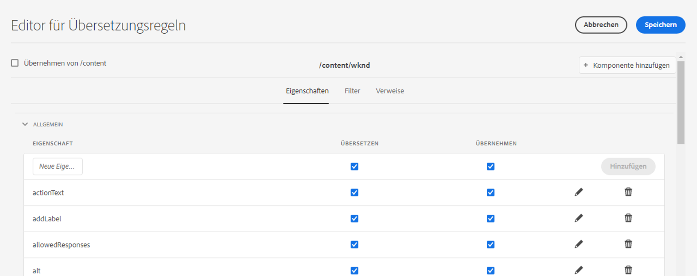

# Konfigurieren von Übersetzungsregeln {#configure-translation-rules}

Erfahren Sie, wie Sie Übersetzungsregeln definieren, um zu übersetzende Inhalte zu identifizieren.

## Die bisherige Entwicklung {#story-so-far}

Im vorherigen Dokument der AEM Headless-Übersetzungs-Tour, [Konfigurieren des Übersetzungs-Connectors](configure-connector.md), haben Sie gelernt, wie Sie Ihren Übersetzungs-Connector installieren und konfigurieren. Sie sollten jetzt:

* die wichtigen Parameter des Translation Integration Framework in AEM verstehen.
* in der Lage sein, Ihre eigene Verbindung zu Ihrem Übersetzungs-Service einzurichten.

Nachdem Sie Ihren Connector eingerichtet haben, führt Sie dieser Artikel durch den nächsten Schritt, um herauszufinden, welche Inhalte übersetzt werden müssen.

>[!CAUTION]
>
>Dieser Schritt der Dokumentations-Journey ist nur erforderlich, wenn Sie sich nicht im Vorabversionskanal von AEM as a Cloud Service befinden.
>
>* Wenn Sie sich im Vorabversionskanal befinden, fahren Sie mit dem nächsten Schritt des Journey fort [Übersetzen Sie Inhalte.](translate-content.md)
>* Wenn Sie sich nicht im Kanal der Vorabversion befinden, lesen Sie bitte dieses Dokument weiter.
>
>Siehe [Abschnitt &quot;Zusätzliche Ressourcen&quot;](#additional-resources) für weitere Informationen zum Kanal für die Vorabversion.

## Ziel {#objective}

In diesem Dokument erfahren Sie, wie Sie die Übersetzungsregeln von AEM zur Identifizierung Ihres Übersetzungsinhalts nutzen. Nach Lesen dieses Dokuments sollten Sie Folgendes können:

* Verstehen, was die Übersetzungsregeln bewirken.
* Eigene Übersetzungsregeln definieren können.

## Übersetzungsregeln {#translation-rules}

Inhaltsfragmente, die Ihre Headless-Inhalte darstellen, können viele Informationen enthalten, die durch strukturierte Felder organisiert sind. Je nach Ihren Projektanforderungen müssen wahrscheinlich nicht alle Felder in einem Inhaltsfragment übersetzt werden.

Übersetzungsregeln identifizieren die Inhalte, die in Übersetzungsprojekten enthalten oder von diesen ausgeschlossen sind. Wenn Inhalte übersetzt werden, extrahiert AEM den Inhalt oder sammelt ihn anhand dieser Regeln. Auf diese Weise werden nur Inhalte an den Übersetzungs-Service gesendet, die übersetzt werden müssen.

Die Übersetzungsregeln umfassen die folgenden Informationen:

* Den Pfad der Inhalte, auf die die Regel angewendet wird
   * Die Regel gilt auch für die nachfolgenden Elemente der Inhalte
* Die Namen der Eigenschaften, die die zu übersetzenden Inhalte enthalten
   * Die Eigenschaft kann sich speziell auf einen bestimmten Ressourcentyp oder auf alle Ressourcentypen beziehen

Da Inhaltsfragmentmodelle, die die Struktur Ihrer Inhaltsfragmente definieren, für Ihr eigenes Projekt eindeutig sind, ist es wichtig, Übersetzungsregeln einzurichten. So weiß AEM, welche Elemente Ihrer Inhaltsmodelle übersetzt werden sollen.

>[!TIP]
>
>Im Allgemeinen stellt der Inhaltsarchitekt dem Übersetzungsanbieter die **Eigenschaftsnamen** aller Felder zur Verfügung, die für die Übersetzung benötigt werden. Diese Namen sind erforderlich, um Übersetzungsregeln zu konfigurieren. Als Übersetzungsspezialist [können Sie diese **Eigenschaftsnamen** selbst finden](getting-started.md#content-modlels), wie zuvor in dieser Tour beschrieben.

## Erstellen von Übersetzungsregeln {#creating-rules}

Sie können mehrere Regeln erstellen, um komplexe Übersetzungsanforderungen zu unterstützen. Beispielsweise müssen für ein Projekt, an dem Sie arbeiten, alle Felder des Modells übersetzt werden, für ein anderes müssen nur Beschreibungsfelder übersetzt werden, während Titel unübersetzt bleiben.

Übersetzungsregeln sind für solche Szenarien konzipiert. In diesem Beispiel veranschaulichen wir jedoch, wie Regeln erstellt werden, indem wir uns auf eine einfache, einzelne Konfiguration konzentrieren.

Es gibt eine **Übersetzungskonfigurations**-Konsole, die zum Konfigurieren von Übersetzungsregeln verfügbar ist. So können Sie darauf zugreifen:

1. Gehen Sie zu **Tools** > **Allgemein**.
1. Tippen oder klicken Sie auf **Übersetzungskonfiguration**.

In der Benutzeroberfläche der **Übersetzungskonfiguration** gibt es eine Reihe von Optionen für Ihre Übersetzungsregeln. Hier werden die wichtigsten und typischsten Schritte hervorgehoben, die für eine einfache Headless-Lokalisierungskonfiguration erforderlich sind.

1. Tippen oder klicken Sie auf **Kontext hinzufügen**, damit Sie einen Pfad hinzufügen können. Dies ist der Pfad der Inhalte, die von der Regel betroffen sind.
   
1. Verwenden Sie den Pfad-Browser, um den erforderlichen Pfad auszuwählen, und tippen oder klicken Sie zum Speichern auf die Schaltfläche **Bestätigen**. Denken Sie daran, dass Inhaltsfragmente, die Headless-Inhalte enthalten, sich im Allgemeinen unter `/content/dam/<your-project>` befinden.
   
1. AEM speichert die Konfiguration.
1. Sie müssen den soeben erstellten Kontext auswählen und dann auf **Bearbeiten** tippen oder klicken. Dadurch wird der **Editor für Übersetzungsregeln** geöffnet, in dem die Eigenschaften konfiguriert werden können.
   
1. Standardmäßig werden alle Konfigurationen vom übergeordneten Pfad übernommen, in diesem Fall `/content/dam`. Deaktivieren Sie die Option **Übernehmen von`/content/dam`**, um der Konfiguration zusätzliche Felder hinzuzufügen.
1. Ist diese Option deaktiviert, fügen Sie im Abschnitt **Allgemein** der Liste die Eigenschaftsnamen der Inhaltsfragmentmodelle hinzu, die Sie [zuvor als zu übersetzende Felder identifiziert haben.](getting-started.md#content-models)
   1. Geben Sie den Eigenschaftsnamen im Feld **Neue Eigenschaft** ein.
   1. Die Optionen **Übersetzen** und **Übernehmen** werden automatisch aktiviert.
   1. Tippen oder klicken Sie auf **Hinzufügen**.
   1. Wiederholen Sie diese Schritte für alle Felder, die Sie übersetzen müssen.
   1. Tippen oder klicken Sie auf **Speichern**.
      

Sie haben jetzt Ihre Übersetzungsregeln konfiguriert.

## Erweiterte Verwendung {#advanced-usage}

Es gibt eine Reihe weiterer Eigenschaften, die als Teil Ihrer Übersetzungsregeln konfiguriert werden können. Darüber hinaus können Sie Ihre Regeln manuell als XML spezifizieren, was mehr Spezifität und Flexibilität ermöglicht.

Solche Funktionen sind im Allgemeinen nicht erforderlich, um mit der Lokalisierung Ihrer Headless-Inhalte zu beginnen. Sie finden jedoch weitere Informationen dazu im Abschnitt [Zusätzliche Ressourcen](#additional-resources), wenn Sie Interesse haben.

## Wie geht es weiter {#what-is-next}

Nachdem Sie nun diesen Teil der Headless-Übersetzungs-Tour abgeschlossen haben, sollten Sie:

* Verstehen, was die Übersetzungsregeln bewirken.
* Eigene Übersetzungsregeln definieren können.

Bauen Sie auf diesem Wissen auf und setzen Sie die AEM Headless-Übersetzungs-Tour fort, indem Sie als Nächstes das Dokument [Inhalte übersetzen](translate-content.md) lesen, in dem Sie erfahren, wie Ihr Connector und Ihre Regeln zusammenarbeiten, um Headless-Inhalte zu übersetzen.

## Zusätzliche Ressourcen {#additional-resources}

Es wird empfohlen, mit dem nächsten Teil der Headless-Übersetzungs-Tour fortzufahren, indem Sie das Dokument [Inhalte übersetzen](translate-content.md) lesen. Im Folgenden finden Sie einige zusätzliche optionale Ressourcen, die einige in diesem Dokument erwähnte Konzepte vertiefen. Sie sind jedoch nicht erforderlich, um mit der Headless-Tour fortzufahren.

* [Ermitteln von zu übersetzenden Inhalten](/help/sites-cloud/administering/translation/rules.md): Erfahren Sie, wie Übersetzungsregeln Inhalte ermitteln, die übersetzt werden müssen.
* [AEM as a Cloud Service Vorabversionskanal](/help/release-notes/prerelease.md#enable-prerelease) - Erfahren Sie, wie Sie sich für den Vorabversionskanal von AEM anmelden können, um neue und künftige Funktionen auszuprobieren.
