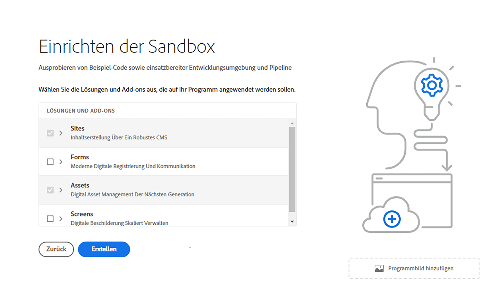

# Erstellen eines Programms {#create-program}

In diesem Teil der [Onboarding-Tour](overview.md) erfahren Sie, wie Sie mit Cloud Manager Ihr erstes Programm erstellen.

## Ziel {#objective}

Nachdem Sie in dieser Onboarding-Tour das vorherige Dokument [Zugreifen auf Cloud Manager](cloud-manager.md) durchgelesen haben, haben Sie sichergestellt, dass Sie angemessenen Zugriff auf Cloud Manager haben. Jetzt können Sie Ihr erstes Programm erstellen.

Nach dem Lesen dieses Dokuments können Sie Folgendes:

* Verstehen und erklären, was ein Programm ist.
* Den Unterschied zwischen Produktions- und Sandbox-Programmen erkennen.
* Ihr eigenes Programm erstellen.

## Was ist ein Programm? {#programs}

Programme sind die höchste Organisationsebene in Cloud Manager. Abhängig von Ihrer Lizenz mit Adobe können Sie mithilfe von Programmen Ihre Lösung organisieren und bestimmten Team-Mitgliedern Zugriff auf diese Programme gewähren.

Cloud Manager-Programme stellen eine Reihe von Cloud Manager-Umgebungen dar. Diese Programme unterstützen logische Gruppen von Geschäftsinitiativen, die normalerweise einem lizenzierten Service Level Agreement (SLA) entsprechen. Beispielsweise kann ein Programm die Adobe Experience Manager(AEM)-Ressourcen zur Unterstützung einer globalen öffentlichen Website für eine Organisation darstellen, während ein anderes Programm ein internes zentrales DAM darstellt.

Vielleicht erinnern Sie sich an das Beispiel von WKND Travel and Adventure Enterprises, welches als Mandant im Bereich Reisemedien agiert. In diesem Kontext könnte es beispielsweise zwei Programme geben. Ein AEM Sites-Programm für den WKND-Magazinbereich und ein AEM Assets-Programm für den WKND-Medienbereich. Verschiedene Team-Mitglieder hätten dann aufgrund ihrer eigenen Arbeitsteilung Zugang zu den verschiedenen Programmen.

Es gibt zwei verschiedene Arten von Programmen:

* Ein **Produktionsprogramm** wird erstellt, um Live-Traffic für Ihre Site zu ermöglichen. Dies ist Ihre „echte“ Umgebung.
* Ein **Sandbox-Programm** wird normalerweise für Schulungen, Ausführungen von Demos, Aktivierungen, Konzeptnachweise oder Dokumentation erstellt.

Da sie für unterschiedliche Zwecke eingesetzt werden, haben die verschiedenen Umgebungen unterschiedliche Optionen. Die Erstellung erfolgt jedoch ähnlich. Für diese Onboarding-Tour erstellen Sie eine Sandbox-Umgebung.

>[!TIP]
>
>Wenn Sie ein Produktionsprogramm erstellen müssen, finden Sie im Abschnitt [Zusätzliche Ressourcen](#additional-resources) einen Link zu einer ausführlichen Beschreibung der Programme.

## Erstellen eines Sandbox-Programms {#create-sandbox}

1. Melden Sie sich unter [my.cloudmanager.adobe.com](https://my.cloudmanager.adobe.com/) bei Cloud Manager an und wählen Sie die entsprechende Organisation aus.

1. Klicken Sie auf der Landingpage von Cloud Manager in der rechten oberen Ecke des Bildschirms auf **Programm hinzufügen**.

   

1. Wählen Sie im Assistenten zum Erstellen von Programmen die Option **Sandbox einrichten**, geben Sie einen Programmnamen ein und wählen Sie **Weiter** aus.

   

1. Im Dialogfeld **Sandbox einrichten** können Sie auswählen, welche Lösungen Sie in Ihrem Sandbox-Programm aktivieren möchten. Die Lösungen **Sites** und **Assets** sind immer in Sandbox-Programmen enthalten und werden automatisch ausgewählt. Dies reicht für das Onboarding-Beispiel aus. Klicken Sie auf **Erstellen**.

   

Auf der Landingpage wird eine neue Sandbox-Programmkarte mit einer Statusanzeige angezeigt, während der Einrichtungsprozess fortgesetzt wird.

Sobald das Programm abgeschlossen ist, können sich Mitglieder Ihrer Organisation, die dem Produktprofil **Entwickler** zugewiesen sind, bei Cloud Manager anmelden und Cloud Manager-Git-Repositories verwalten.

## So geht es weiter {#whats-next}

Nachdem Ihr erstes Programm erstellt wurde, können Sie Umgebungen dafür erstellen. Sie sollten Ihre Onboarding-Tour fortsetzen, indem Sie das Dokument [Erstellen von Umgebungen](create-environments.md) lesen.

## Zusätzliche Ressourcen {#additional-resources}

Im Folgenden finden Sie zusätzliche optionale Ressourcen, wenn Sie über den Inhalt der Onboarding-Tour hinausgehen möchten.

* [Programme und Programmtypen](/help/implementing/cloud-manager/getting-access-to-aem-in-cloud/program-types.md) – Erfahren Sie mehr über die Hierarchie von Cloud Manager und darüber, wie die verschiedenen Arten von Programmen in die Struktur passen und wie sie sich unterscheiden
* [Erstellen von Sandbox-Programmen](/help/implementing/cloud-manager/getting-access-to-aem-in-cloud/creating-sandbox-programs.md) – Erfahren Sie, wie Sie mit Cloud Manager Ihr eigenes Sandbox-Programm für Schulungs-, Demo-, POC- oder andere produktionsfremde Zwecke erstellen
* [Erstellen von Produktionsprogrammen](/help/implementing/cloud-manager/getting-access-to-aem-in-cloud/creating-production-programs.md) – Erfahren Sie, wie Sie mit Cloud Manager Ihr eigenes Produktionsprogramm für das Hosten von Live-Traffic erstellen.
* [Verwenden von Adobe Cloud Manager – Programme](https://experienceleague.adobe.com/docs/experience-manager-learn/cloud-service/cloud-manager/programs.html?lang=de) – Cloud Manager-Programme stellen eine Reihe von AEM-Umgebungen dar, die logische Gruppen von Geschäftsinitiativen unterstützen, die in der Regel einem erworbenen Service Level Agreement (SLA) entsprechen.
* [AEM as a Cloud Service-Team und Produktprofile](/help/onboarding/aem-cs-team-product-profiles.md) – Erfahren Sie, wie Sie mit dem AEM as a Cloud Service-Team und Produktprofilen den Zugriff auf Ihre lizenzierten Adobe-Lösungen gewähren und einschränken kann.
