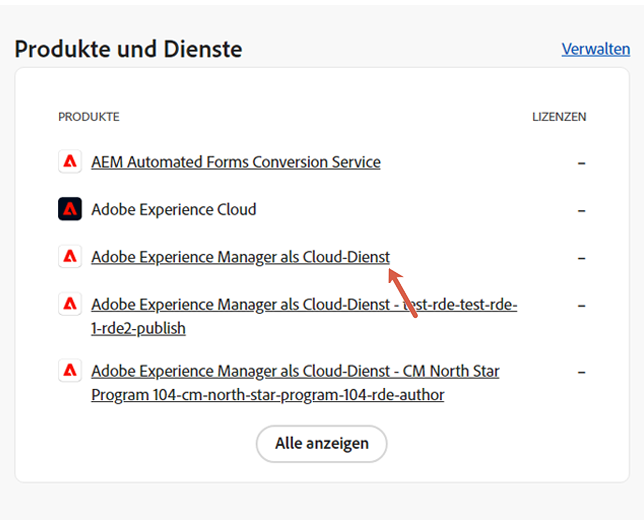
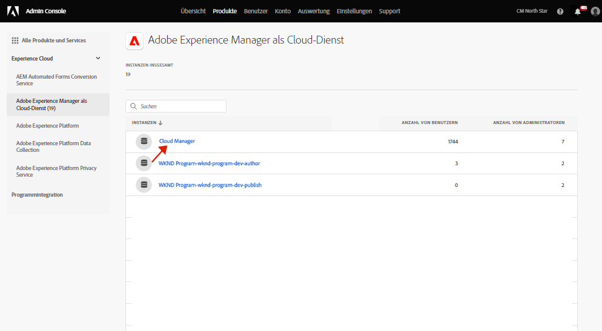
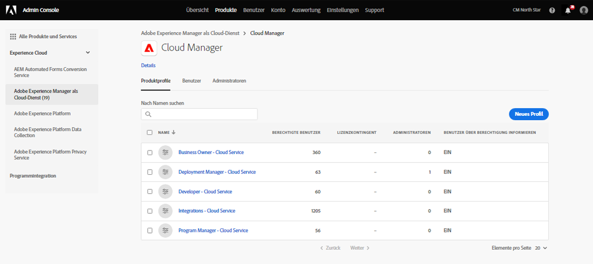
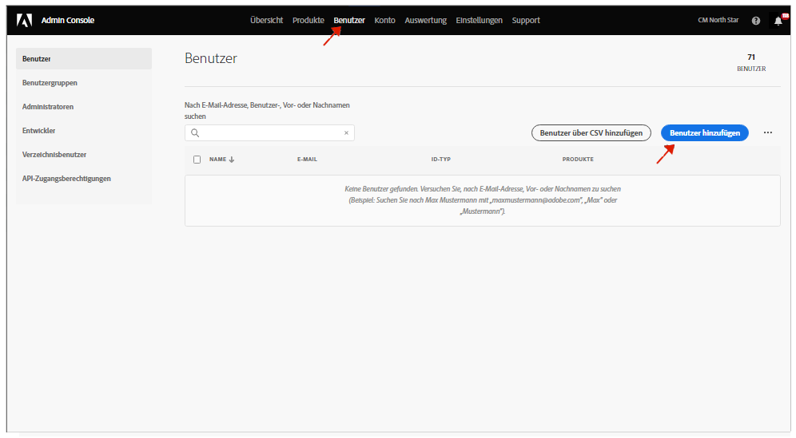

# Benachrichtigungsprofile {#notification-profiles}

Erfahren Sie, wie Sie in der Admin Console Benutzerprofile erstellen, um den Empfang wichtiger E-Mail-Benachrichtigungen zu verwalten.

## Überblick {#overview}

Von Zeit zu Zeit kontaktiert Adobe Benutzende bezüglich ihrer AEM as a Cloud Service-Umgebung. Neben produktinternen Benachrichtigungen verwendet Adobe gelegentlich auch E-Mails für Benachrichtigungen. Es gibt zwei Arten von E-Mail-Benachrichtigungen:

* **Benachrichtigung bei Vorfällen**: Diese Benachrichtigungen werden während eines Vorfalls gesendet oder wenn Adobe ein potenzielles Verfügbarkeitsproblem bei Ihrer AEM as a Cloud Service-Umgebung erkannt hat.
* **Proaktive Benachrichtigung**: Diese Benachrichtigungen werden gesendet, wenn ein Mitglied des Adobe-Support-Teams Anleitungen zu einer potenziellen Optimierung oder Empfehlung bereitstellen möchte, die für Ihre AEM as a Cloud Service-Umgebung von Vorteil sein kann.

Benutzende können diese Benachrichtigungen abhängig von ihren [benutzerdefinierten Gruppenberechtigungen](/help/implementing/cloud-manager/custom-permissions.md) auch für bestimmte Programme erhalten.

Darüber hinaus wird die Zuweisung von Gruppen zu proaktiven Benachrichtigungen unterstützt und Benutzende und Gruppen können den Produktprofilen direkt zugewiesen werden.

* Benutzende in den Gruppen für Benachrichtigung bei Vorfällen und für proaktive Benachrichtigungen erhalten standardmäßig Benachrichtigungen für alle Programme.
* Wenn Benutzende jedoch nicht alle Benachrichtigungen erhalten möchten, können sie mithilfe benutzerdefinierter READ-Berechtigungen festlegen, welche Programmbenachrichtigungen sie erhalten möchten.

Damit die richtigen Personen diese Benachrichtigungen erhalten, müssen Sie Benutzerprofile konfigurieren und zuweisen, wie in diesem Dokument beschrieben.

## Voraussetzungen {#prerequisites}

Da Benutzergruppen in der Admin Console erstellt und gepflegt werden, müssen vor dem Erstellen von Profilen für Benachrichtigungen folgende Bedingungen erfüllt sein:

* Sie verfügen über Berechtigungen zum Hinzufügen und Bearbeiten von Profilmitgliedschaften.
* Sie verfügen über ein gültiges Adobe Admin Console-Profil.

## Erstellen neuer Cloud Manager-Produktprofile {#create-profiles}

Um den Empfang von Benachrichtigungen ordnungsgemäß einzurichten, müssen Sie zwei Benutzerprofile erstellen. Diese Schritte werden nur einmal ausgeführt.

1. Melden Sie sich bei der Admin Console unter [`https://adminconsole.adobe.com`](https://adminconsole.adobe.com) an.

1. Stellen Sie sicher, dass Sie sich in der richtigen Organisation befinden.

1. Wählen Sie auf der Seite **Übersicht** und auf der Karte **Produkte und Services** die Option **Adobe Experience Manager as a Cloud Service** aus.

   

1. Gehen Sie in der Liste aller Instanzen zur **Cloud Manager**-Instanz.

   

1. Es wird Ihnen eine Liste aller konfigurierten Cloud Manager-Produktprofile angezeigt.

   

1. Klicken Sie auf **Neues Profil** und geben Sie die folgenden Details an:

   * **Name des Produktprofils**: `Incident Notification - Cloud Service`
   * **Anzeigename**: `Incident Notification - Cloud Service`
   * **Beschreibung**: Cloud Manager-Profil für die Benutzenden, die Benachrichtigungen während eines Vorfalls oder dann erhalten, wenn Adobe ein potenzielles Verfügbarkeitsproblem in Ihrer AEM as a Cloud Service-Umgebung festgestellt hat.
      * Benutzende mit benutzerdefinierten READ-Berechtigungen für bestimmte Programme erhalten nur dann Benachrichtigungen für diese Programme, wenn sie sich für benutzerdefinierte Berechtigungen entschieden haben.

1. Klicken Sie auf **Speichern**.

1. Klicken Sie noch einmal auf **Neues Profil** und geben Sie die folgenden Details an:

   * **Name des Produktprofils**: `Proactive Notification - Cloud Service`
   * **Anzeigename**: `Proactive Notification - Cloud Service`
   * **Beschreibung**: Cloud Manager-Profil für Benutzer, die Benachrichtigungen erhalten, wenn ein Mitglied des Adobe Support-Teams Anleitungen zu einer potenziellen Optimierung oder Empfehlung für Ihre AEM as a Cloud Service-Umgebungskonfiguration bereitstellen möchte
      * Benutzende mit benutzerdefinierten READ-Berechtigungen für bestimmte Programme erhalten nur dann Benachrichtigungen für diese Programme, wenn sie sich für benutzerdefinierte Berechtigungen entschieden haben.

1. Klicken Sie auf **Speichern**.

Ihre beiden neuen Benachrichtigungsprofile werden erstellt.

>[!NOTE]
>
>Es ist wichtig, dass der Name des Cloud Manager-**Produktprofils** genau mit dem angegebenen Namen übereinstimmt. Kopieren Sie den angegebenen Profilnamen und fügen Sie ihn ein, um Fehler zu vermeiden. Abweichungen oder Tippfehler führen dazu, dass Benachrichtigungen nicht wie gewünscht gesendet werden.
>
>Wenn Fehler auftreten oder die Profile nicht definiert wurden, benachrichtigt Adobe standardmäßig vorhandene Benutzer, die den Profilen **Cloud Manager-Entwickler** oder **Bereitstellungs-Manager** zugewiesen wurden.

## Zuweisen von Benutzenden zu den Benachrichtigungsprofilen {#add-users}

Nachdem die Profile erstellt wurden, müssen Sie die entsprechenden Benutzenden zuweisen. Dies ist beim Erstellen neuer oder durch Aktualisierung vorhandener Benutzerinnen und Benutzer möglich.

### Hinzufügen von neuen Benutzenden zu Profilen {#new-user}

Führen Sie diese Schritte aus, um Benutzende hinzuzufügen, für die noch keine Federated IDs eingerichtet wurden.

1. Identifizieren Sie die Benutzenden oder Gruppen, die Benachrichtigungen zu Vorfällen oder proaktive Benachrichtigungen erhalten sollen.

1. Melden Sie sich unter [`https://adminconsole.adobe.com`](https://adminconsole.adobe.com) bei der Admin Console an, wenn Sie noch nicht angemeldet sind.

1. Stellen Sie sicher, dass Sie die entsprechende Organisation ausgewählt haben.

1. Wählen Sie auf der Seite **Übersicht** die Option **Adobe Experience Manager as a Cloud Service** auf der Karte **Produkte und Services** aus.

   

1. Wenn die Federated ID für Ihre Team-Mitglieder noch nicht eingerichtet wurde, klicken Sie in der oberen Navigationsleiste auf die Registerkarte **Benutzer** und wählen dann **Benutzer hinzufügen** aus. Andernfalls gehen Sie zum Abschnitt [Hinzufügen von vorhandenen Benutzenden zu Profilen](#existing-users).

   

1. Geben Sie im Dialogfeld **Benutzer zum Team hinzufügen** die E-Mail-ID des Benutzers ein, den Sie hinzufügen möchten, und wählen Sie `Adobe ID` als **ID-Typ** aus.

1. Klicken Sie auf das Pluszeichen unter der Überschrift **Produkte auswählen**, um mit der Produktauswahl zu beginnen.

1. Wählen Sie **Adobe Experience Manager as a Cloud Service** aus und weisen Sie der bzw. dem Benutzenden eines oder beide der neuen Profile zu.

   * **Benachrichtigung bei Vorfällen − Cloud Service**
   * **Proaktive Benachrichtigung − Cloud Service**

1. Klicken Sie auf **Speichern**, und dem hinzugefügten Benutzer wird eine Begrüßungs-E-Mail gesendet.

Der eingeladene Benutzer erhält jetzt die Benachrichtigungen. Benutzende mit benutzerdefinierten READ-Berechtigungen für bestimmte Programme erhalten nur dann Benachrichtigungen für diese Programme, wenn sie sich für benutzerdefinierte Berechtigungen entschieden haben.

Wiederholen Sie diese Schritte für die Benutzenden in Ihrem Team, die Benachrichtigungen erhalten sollen.

### Hinzufügen von vorhandenen Benutzenden zu Profilen {#existing-user}

Führen Sie diese Schritte aus, um Benutzende hinzuzufügen, für die bereits Federated IDs vorhanden sind.

1. Identifizieren Sie die Benutzenden oder Gruppen, die Benachrichtigungen zu Vorfällen oder proaktive Benachrichtigungen erhalten sollen.

1. Melden Sie sich unter [`https://adminconsole.adobe.com`](https://adminconsole.adobe.com) bei der Admin Console an, wenn Sie noch nicht angemeldet sind.

1. Stellen Sie sicher, dass Sie die entsprechende Organisation ausgewählt haben.

1. Wählen Sie auf der Seite **Übersicht** die Option **Adobe Experience Manager as a Cloud Service** auf der Karte **Produkte und Services** aus.

1. Wählen Sie in der oberen Navigationsleiste die Registerkarte **Benutzer** aus.

1. Wenn die Federated ID bereits für das Team-Mitglied vorhanden ist, das Sie zu einem Benachrichtigungsprofil hinzufügen möchten, suchen Sie diese Person in der Liste und klicken Sie auf sie. Andernfalls fahren Sie mit dem Abschnitt [Hinzufügen von neuen Benutzenden zu Profilen](#add-user) fort.

1. Klicken Sie im Abschnitt **Produkte** auf die Schaltfläche mit den Auslassungspunkten und wählen Sie **Bearbeiten** aus.

1. Klicken Sie im Fenster **Produkte bearbeiten** auf die Schaltfläche mit dem Stift unter der Überschrift **Produkte auswählen**, um die Produktauswahl zu starten.

1. Wählen Sie **Adobe Experience Manager as a Cloud Service** aus und weisen Sie der bzw. dem Benutzenden eines oder beide der neuen Profile zu.

   * **Benachrichtigung bei Vorfällen − Cloud Service**
   * **Proaktive Benachrichtigung − Cloud Service**

1. Klicken Sie auf **Speichern**, und dem hinzugefügten Benutzer wird eine Begrüßungs-E-Mail gesendet.

Der eingeladene Benutzer erhält jetzt die Benachrichtigungen. Benutzende mit benutzerdefinierten READ-Berechtigungen für bestimmte Programme erhalten nur dann Benachrichtigungen für diese Programme, wenn sie sich für benutzerdefinierte Berechtigungen entschieden haben.

Wiederholen Sie diese Schritte für die Benutzenden in Ihrem Team, die Benachrichtigungen erhalten sollen.

## Zusätzliche Ressourcen {#additional-resources}

Im Folgenden finden Sie zusätzliche optionale Ressourcen, wenn Sie über den Inhalt der Onboarding-Tour hinausgehen möchten.

* [Aktionszentrum](/help/operations/actions-center.md) – Nutzen Sie das Aktionszentrum, um bequem auf Vorfälle und andere wichtige Informationen reagieren zu können.
