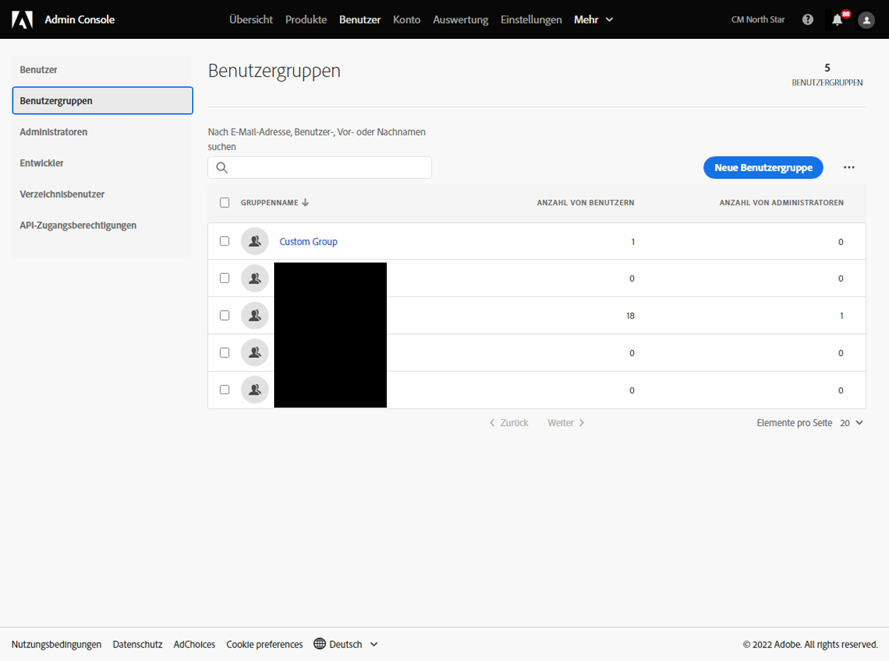
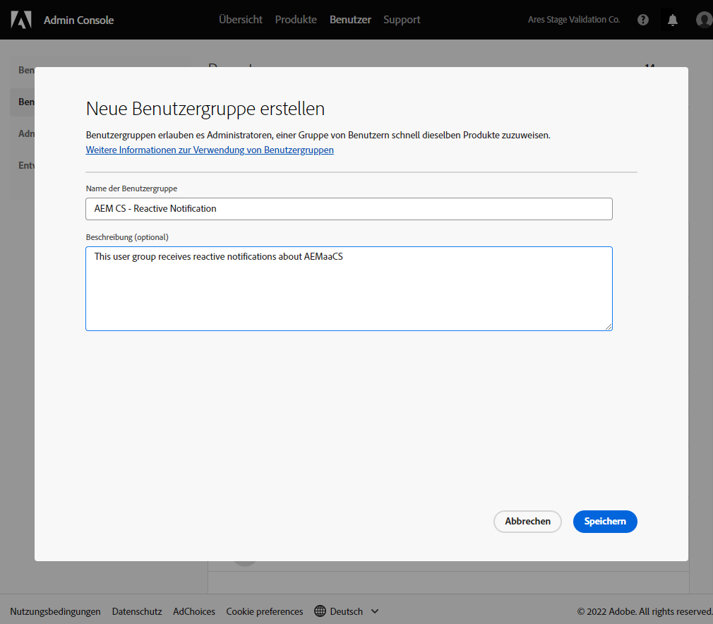
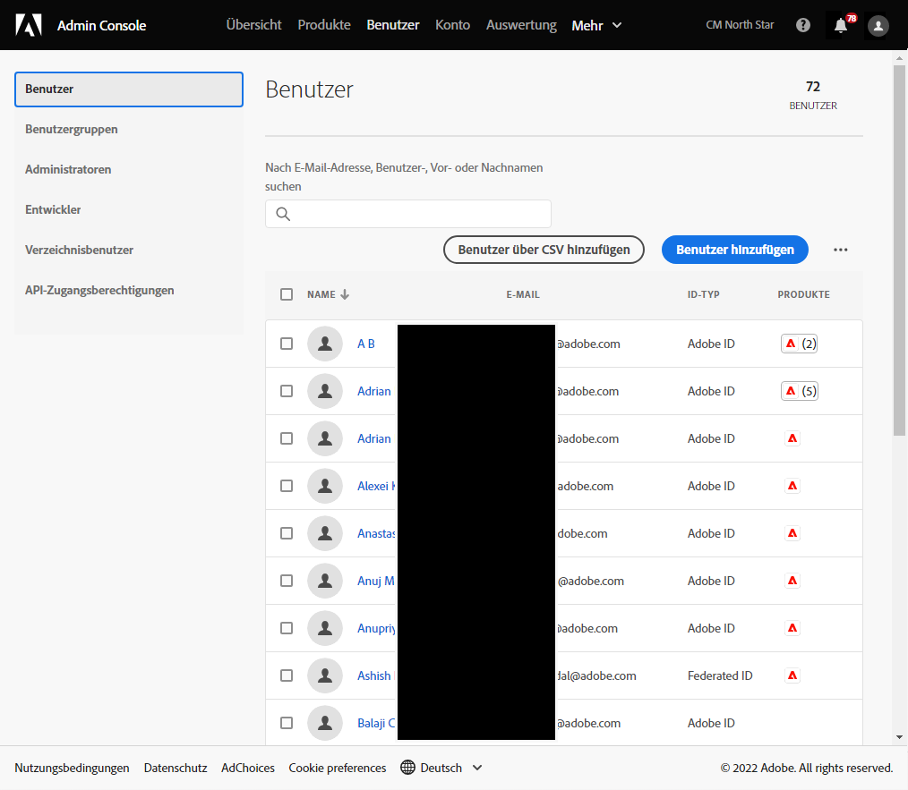
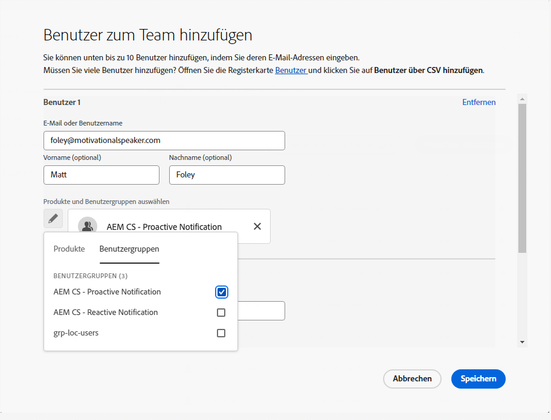
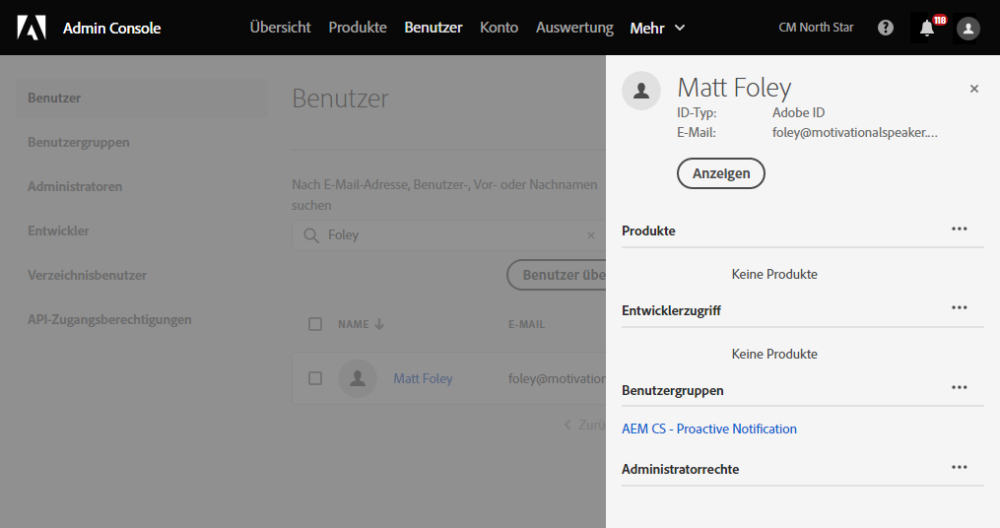

# Benutzergruppen für Benachrichtigungen {#user-groups}

Erfahren Sie, wie Sie in der Admin Console eine Benutzergruppe erstellen, um den Empfang wichtiger E-Mail-Benachrichtigungen zu verwalten.

## Übersicht {#overview}

Von Zeit zu Zeit muss sich die Adobe bezüglich ihrer AEM as a Cloud Service Umgebungen in Verbindung setzen. Zusätzlich zur Benachrichtigung innerhalb des Produkts verwendet Adobe gelegentlich auch E-Mails für solche Benachrichtigungen. Es gibt zwei Arten von Benachrichtigungen:

* **Reaktive Benachrichtigung** - Diese Benachrichtigungen werden während eines Vorfalls gesendet oder wenn Adobe ein potenzielles Verfügbarkeitsproblem mit Ihrer AEM as a Cloud Service Umgebung erkannt hat.
* **Proaktive Benachrichtigung** - Diese Benachrichtigungen werden gesendet, wenn ein Mitglied des Adobe-Support-Teams Anleitungen zu einer potenziellen Optimierung oder Empfehlung bereitstellen möchte, die für Ihre AEM as a Cloud Service Umgebung von Vorteil sein kann.

Damit die richtigen Benutzer diese Benachrichtigungen erhalten, müssen Sie Benutzergruppen konfigurieren.

## Voraussetzungen {#prerequisites}

Da Benutzergruppen in der Admin Console erstellt und gepflegt werden, müssen Sie vor dem Erstellen von Benutzergruppen für Benachrichtigungen:

* Sie können Gruppenmitgliedschaften hinzufügen und bearbeiten.
* Sie verfügen über ein gültiges Adobe Admin Console-Profil.

## Benutzergruppen für Benachrichtigungen erstellen {#create-groups}

Um den Erhalt von Benachrichtigungen ordnungsgemäß einzurichten, müssen Sie zwei Benutzergruppen erstellen. Diese Schritte dürfen nur einmal ausgeführt werden.

1. Bei Admin Console anmelden unter [`https://adminconsole.adobe.com`.](https://adminconsole.adobe.com)

1. Klicken Sie auf **Benutzer** und dann die **Benutzergruppen** im linken Navigationsbereich.

   

1. Klicken Sie auf **Neue Benutzergruppe** und geben Sie eine **Benutzergruppenname** genau wie angegeben und optional **Beschreibung**.

   * Die Gruppennamen müssen mit dem folgenden übereinstimmen. Ändern Sie die Gruppennamen in keiner Weise.
      * `AEM CS - Reactive Notification`
      * `AEM CS - Proactive Notification`

   

1. Klicken Sie auf **Speichern**.

1. Wiederholen Sie die Schritte für die zweite Gruppe.

Wenn die Gruppen nicht definiert sind, benachrichtigt Adobe bestehende Benutzer mit Cloud Manager. **Entwickler** oder **Implementierung** Profile.

## Benutzer zu Gruppen hinzufügen {#add-users}

Nachdem die Gruppen erstellt wurden, müssen Sie die entsprechenden Benutzer zuweisen. Dies ist beim Erstellen neuer Benutzer oder durch Aktualisieren vorhandener Benutzer möglich.

### Hinzufügen neuer Benutzer zu Gruppen {#new-user}

1. Bei Admin Console anmelden unter [`https://adminconsole.adobe.com`](https://adminconsole.adobe.com) wenn Sie noch nicht angemeldet sind.

1. Klicken Sie auf **Benutzer** und dann die **Benutzer** im linken Navigationsbereich.

   

1. Klicken Sie auf **Benutzer hinzufügen** und geben Sie die E-Mail-Adresse des Benutzers an. Optional können Sie auch einen Vor- und Nachnamen angeben.

   * Wenn der Benutzer bereits vorhanden ist, stimmt die Admin Console mit der E-Mail-Adresse überein und füllt die Felder vorab aus.

1. Klicken Sie auf das Pluszeichen unter den Benutzernamenfeldern und klicken Sie dann auf das **Benutzergruppen** im Popup-Fenster, um die Gruppen für den Benutzer auszuwählen.

   

1. Klicken **Speichern** , um den neuen Benutzer zu speichern.

Wiederholen Sie diese Schritte für jeden Benutzer, für den Sie die Benachrichtigungsgruppen zuweisen müssen.

### Hinzufügen vorhandener Benutzer zu Gruppen {#existing-user}

1. Bei Admin Console anmelden unter [`https://adminconsole.adobe.com`](https://adminconsole.adobe.com) wenn Sie noch nicht angemeldet sind.

1. Klicken Sie auf **Benutzer** und dann die **Benutzer** im linken Navigationsbereich.

   

1. Klicken Sie auf die Zeile des Benutzers, den Sie einer Benachrichtigungsgruppe hinzufügen möchten. Ein Bedienfeld, in dem die Benutzerdetails angezeigt werden, wird geöffnet.

1. Klicken Sie auf das Auslassungssymbol rechts neben dem **Benutzergruppen** im Detailbereich.