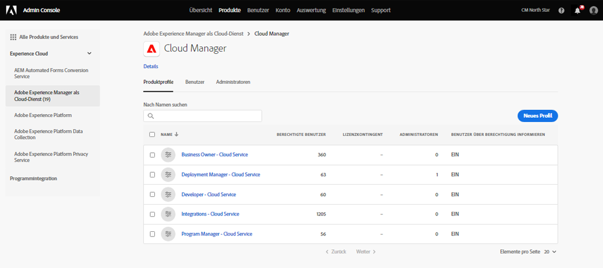

# Benutzergruppen für Benachrichtigungen {#user-groups}

Erfahren Sie, wie Sie in der Admin Console eine Benutzergruppe erstellen, um den Empfang wichtiger E-Mail-Benachrichtigungen zu verwalten.

## Übersicht {#overview}

Von Zeit zu Zeit muss sich die Adobe bezüglich ihrer AEM as a Cloud Service Umgebungen in Verbindung setzen. Zusätzlich zur Benachrichtigung innerhalb des Produkts verwendet Adobe gelegentlich auch E-Mails für solche Benachrichtigungen. Es gibt zwei Arten von Benachrichtigungen:

* **Incident Notification - Cloud Service** - Diese Benachrichtigungen werden während eines Vorfalls gesendet oder wenn Adobe ein potenzielles Verfügbarkeitsproblem mit Ihrer AEM as a Cloud Service Umgebung erkannt hat.
* **Proaktive Benachrichtigung - Cloud Service** - Diese Benachrichtigungen werden gesendet, wenn ein Mitglied des Adobe-Support-Teams Anleitungen zu einer potenziellen Optimierung oder Empfehlung bereitstellen möchte, die für Ihre AEM as a Cloud Service Umgebung von Vorteil sein kann.

Damit die richtigen Benutzer diese Benachrichtigungen erhalten, müssen Sie Benutzergruppen konfigurieren.

## Voraussetzungen {#prerequisites}

Da Benutzergruppen in der Admin Console erstellt und gepflegt werden, müssen Sie vor dem Erstellen von Benutzergruppen für Benachrichtigungen:

* Sie können Gruppenmitgliedschaften hinzufügen und bearbeiten.
* Sie verfügen über ein gültiges Adobe Admin Console-Profil.

## Neue Cloud Manager-Produktprofile erstellen {#create-groups}

Um den Erhalt von Benachrichtigungen ordnungsgemäß einzurichten, müssen Sie zwei Benutzergruppen erstellen. Diese Schritte dürfen nur einmal ausgeführt werden.

1. Bei Admin Console anmelden unter [`https://adminconsole.adobe.com`.](https://adminconsole.adobe.com)

1. Wählen Sie auf der Seite **Überblick** die Option **Adobe Experience Manager as a Cloud Service** aus der Karte **Produkte und Services**.

   

1. Gehen Sie in der Liste aller Instanzen zur Instanz **Cloud Manager**.

   

1. Daraufhin wird die Liste aller konfigurierten Cloud Manager-Produktprofile angezeigt. Beispiel:

   

1. Klicken Sie auf Neues Profil und fügen Sie die folgenden Details ein:

* Produktprofilname: Benachrichtigung bei Vorfällen - Cloud Service
* Anzeigename: Benachrichtigung bei Vorfällen - Cloud Service
* Beschreibung: Cloud Manager-Profil für die Benutzer, die Benachrichtigungen während eines Vorfalls erhalten oder wenn Adobe ein potenzielles Verfügbarkeitsproblem mit Ihrer AEM as a Cloud Service Umgebung identifiziert hat.

1. Klicken Sie auf Speichern und wiederholen Sie Schritt 4 mit den folgenden Details:

* Produktprofilname: Proaktive Benachrichtigung - Cloud Service
* Anzeigename: Proaktive Benachrichtigung - Cloud Service
* Beschreibung: Cloud Manager-Profil für die Benutzer, die Benachrichtigungen erhalten, wenn ein Mitglied des Adobe-Support-Teams Anleitungen zu einer potenziellen Optimierung oder Empfehlung für Ihre AEM as a Cloud Service Umgebungskonfiguration bereitstellen möchte.

>[!NOTE]
>
>Es ist wichtig, dass der Cloud Manager-Profilname genau mit dem oben stehenden übereinstimmt. Kopieren Sie den Profilnamen Produkt und fügen Sie ihn aus der angegebenen Beschreibung ein. Abweichungen oder Tippfehler führen dazu, dass Benachrichtigungen nicht wie gewünscht gesendet werden. Bei Fehlern oder nicht definierten Profilen benachrichtigt Adobe standardmäßig bestehende, Cloud Manager-Entwicklerprofile zugewiesene Benutzer (oder , oder und).

## Weisen Sie die Benutzer den neuen Benachrichtigungs-Produktprofilen zu. {#add-users}

Nachdem die Gruppen erstellt wurden, müssen Sie die entsprechenden Benutzer zuweisen. Dies ist beim Erstellen neuer Benutzer oder durch Aktualisieren vorhandener Benutzer möglich.

### Hinzufügen neuer Benutzer zu Gruppen {#new-user}

1. Identifizieren Sie die Benutzer, die entweder Vorfälle oder aktive Benachrichtigungen erhalten sollen.

1. Bei Admin Console anmelden unter [`https://adminconsole.adobe.com`](https://adminconsole.adobe.com) wenn Sie noch nicht angemeldet sind.

1. Wählen Sie auf der Seite **Überblick** die Option **Adobe Experience Manager as a Cloud Service** aus der Karte **Produkte und Services**.

   

1. Wählen Sie in der oberen Navigation die Registerkarte **Benutzer** und dann **Benutzer hinzufügen** aus.

1. Geben Sie im Dialogfeld Benutzer zum Team hinzufügen die E-Mail-ID des Benutzers ein, den Sie hinzufügen möchten.

* Wenn die Federated ID für Ihre Teammitglieder noch nicht eingerichtet wurde, wählen Sie Adobe ID für den ID-Typ aus.
* Wenn der Benutzer bereits vorhanden ist, siehe Schritt 7.

1. Klicken Sie auf das Pluszeichen unter **Produkte auswählen** Überschrift zur Produktauswahl und Auswahl **Adobe Experience Manager as a Cloud Service** und weisen Sie entweder **Benachrichtigung bei Vorfällen - Cloud Service** oder **Proaktive Benachrichtigung - Cloud Service** oder beides an den Benutzer.

1. Klicken Sie auf **Speichern** und dem hinzugefügten Benutzer wird eine Begrüßungs-E-Mail gesendet. Der eingeladene Benutzer erhält jetzt die Benachrichtigungen.

1. Wiederholen Sie diese Schritte für die Benutzer in Ihrem Team, die die Benachrichtigungen erhalten sollen.

1. Wenn der Benutzer bereits vorhanden ist, suchen Sie den Namen des Benutzers und:

* Klicken Sie auf den Namen des Benutzers.
* Im **Produkte** Abschnitt, klicken Sie auf **Bearbeiten**.
* Klicken Sie auf die Stiftsymbolleiste **Produkte auswählen** Überschrift zur Produktauswahl und Auswahl **Adobe Experience Manager as a Cloud Service** und weisen Sie entweder **Benachrichtigung bei Vorfällen - Cloud Service** oder **Proaktive Benachrichtigung - Cloud Service** oder beides an den Benutzer.
* Klicken Sie auf **Speichern** und dem hinzugefügten Benutzer wird eine Begrüßungs-E-Mail gesendet. Der eingeladene Benutzer erhält jetzt die Benachrichtigungen.
