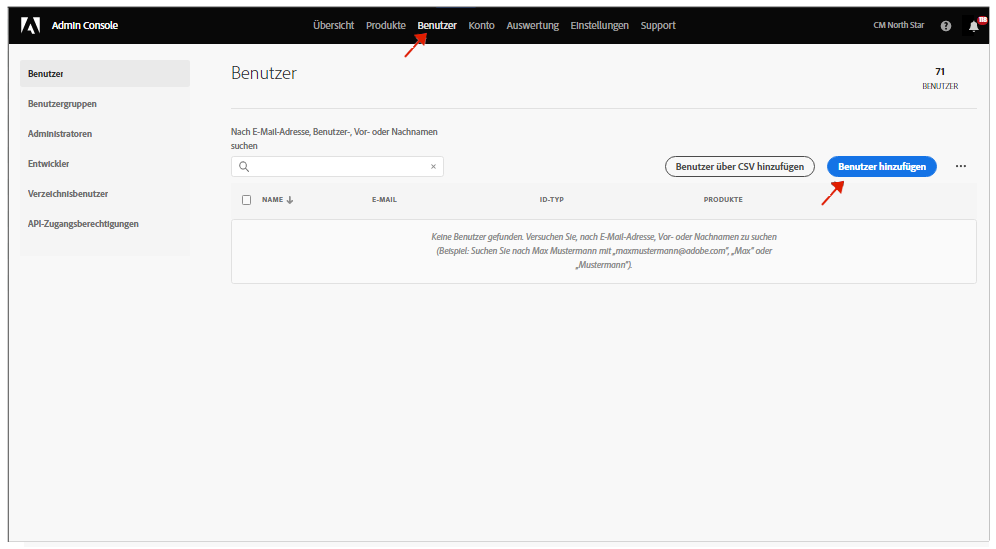

# Benutzergruppen für Benachrichtigungen {#user-groups}

Erfahren Sie, wie Sie in der Admin Console eine Benutzergruppe erstellen, um den Empfang wichtiger E-Mail-Benachrichtigungen zu verwalten.

## Übersicht {#overview}

Von Zeit zu Zeit muss sich die Adobe mit den Benutzern in Bezug auf ihre AEM as a Cloud Service Umgebungen in Verbindung setzen. Neben produktinternen Benachrichtigungen verwendet Adobe gelegentlich auch E-Mails für Benachrichtigungen. Es gibt zwei Arten von E-Mail-Benachrichtigungen:

* **Benachrichtigung bei Vorfällen** - Diese Benachrichtigungen werden während eines Vorfalls gesendet oder wenn Adobe ein potenzielles Verfügbarkeitsproblem mit Ihrer AEM as a Cloud Service Umgebung erkannt hat.
* **Proaktive Benachrichtigung** - Diese Benachrichtigungen werden gesendet, wenn ein Mitglied des Adobe-Support-Teams Anleitungen zu einer potenziellen Optimierung oder Empfehlung bereitstellen möchte, die für Ihre AEM as a Cloud Service Umgebung von Vorteil sein kann.

Damit die richtigen Benutzer diese Benachrichtigungen erhalten, müssen Sie Benutzergruppen konfigurieren und zuweisen, die in diesem Dokument beschrieben werden.

## Voraussetzungen {#prerequisites}

Da Benutzergruppen in der Admin Console erstellt und gepflegt werden, müssen Sie vor dem Erstellen von Benutzergruppen für Benachrichtigungen:

* Sie können Gruppenmitgliedschaften hinzufügen und bearbeiten.
* Sie verfügen über ein gültiges Adobe Admin Console-Profil.

## Neue Cloud Manager-Produktprofile erstellen {#create-groups}

Um den Erhalt von Benachrichtigungen ordnungsgemäß einzurichten, müssen Sie zwei Benutzergruppen erstellen. Diese Schritte dürfen nur einmal ausgeführt werden.

1. Bei Admin Console anmelden unter [`https://adminconsole.adobe.com`.](https://adminconsole.adobe.com)

1. Wählen Sie auf der Seite **Überblick** die Option **Adobe Experience Manager as a Cloud Service** aus der Karte **Produkte und Services**.

   

1. Gehen Sie in der Liste aller Instanzen zur Instanz **Cloud Manager**.

   

1. Daraufhin wird die Liste aller konfigurierten Cloud Manager-Produktprofile angezeigt.

   

1. Klicken **Neues Profil** und geben Sie die folgenden Details an:

   * **Name des Produktprofils**: `Incident Notification - Cloud Service`
   * **Anzeigename**: `Incident Notification - Cloud Service`
   * **Beschreibung**: Cloud Manager-Profil für die Benutzer, die Benachrichtigungen während eines Vorfalls erhalten oder wenn Adobe ein potenzielles Verfügbarkeitsproblem mit Ihrer AEM as a Cloud Service Umgebung identifiziert hat

1. Klicken Sie auf **Speichern**.

1. Klicken **Neues Profil** und geben Sie die folgenden Details an:

   * **Name des Produktprofils**: `Proactive Notification - Cloud Service`
   * **Anzeigename**: `Proactive Notification - Cloud Service`
   * **Beschreibung**: Cloud Manager-Profil für Benutzer, die Benachrichtigungen erhalten, wenn ein Mitglied des Adobe-Support-Teams Anleitungen zu einer potenziellen Optimierung oder Empfehlung für Ihre AEM as a Cloud Service Umgebungskonfiguration bereitstellen möchte

1. Klicken Sie auf **Speichern**.

Ihre beiden neuen Benachrichtigungsgruppen werden erstellt.

>[!NOTE]
>
>Es ist wichtig, dass Cloud Manager **Produktprofilname** ist mit dem angegebenen identisch. Kopieren Sie den angegebenen Profilnamen und fügen Sie ihn ein, um Fehler zu vermeiden. Abweichungen oder Tippfehler führen dazu, dass Benachrichtigungen nicht wie gewünscht gesendet werden.
>
>Wenn Fehler auftreten oder die Profile nicht definiert wurden, benachrichtigt die Adobe standardmäßig bestehende Benutzer, die der **Cloud Manager-Entwickler** oder **Bereitstellungsmanager** Profile.

## Weisen Sie die Benutzer den neuen Benachrichtigungs-Produktprofilen zu. {#add-users}

Nachdem die Gruppen erstellt wurden, müssen Sie die entsprechenden Benutzer zuweisen. Dies ist beim Erstellen neuer Benutzer oder durch Aktualisieren vorhandener Benutzer möglich.

### Hinzufügen neuer Benutzer zu Gruppen {#new-user}

Führen Sie diese Schritte aus, um Benutzer hinzuzufügen, für die noch keine Federated IDs eingerichtet wurden.

1. Identifizieren Sie die Benutzer, die Vorkommnisse oder proaktive Benachrichtigungen erhalten sollen.

1. Bei Admin Console anmelden unter [`https://adminconsole.adobe.com`](https://adminconsole.adobe.com) wenn Sie noch nicht angemeldet sind.

1. Wählen Sie auf der Seite **Überblick** die Option **Adobe Experience Manager as a Cloud Service** aus der Karte **Produkte und Services**.

   

1. Wenn die Federated ID für Ihre Teammitglieder noch nicht eingerichtet wurde, wählen Sie die **Benutzer** Registerkarte in der oberen Navigation und wählen Sie **Benutzer hinzufügen**. Andernfalls zum Abschnitt springen [Hinzufügen vorhandener Benutzer zu Gruppen.](#existing-users)

   

1. Im **Benutzer zu Ihrem Team hinzufügen** eingeben, die E-Mail-Adresse des Benutzers eingeben, den Sie hinzufügen möchten, und wählen Sie `Adobe ID` für **ID-Typ**.

1. Klicken Sie auf das Pluszeichen unter **Produkte auswählen** -Überschrift, um die Produktauswahl zu starten.

1. Auswählen **Adobe Experience Manager as a Cloud Service** und weisen dem Benutzer eine oder beide der neuen Gruppen zu.

   * **Benachrichtigung bei Vorfällen - Cloud Service**
   * **Proaktive Benachrichtigung - Cloud Service**

1. Klicken Sie auf **Speichern** und dem hinzugefügten Benutzer wird eine Begrüßungs-E-Mail gesendet.

Der eingeladene Benutzer erhält jetzt die Benachrichtigungen. Wiederholen Sie diese Schritte für die Benutzer in Ihrem Team, die Benachrichtigungen erhalten möchten.

### Hinzufügen vorhandener Benutzer zu Gruppen {#existing-user}

Führen Sie diese Schritte aus, um Benutzer hinzuzufügen, für die bereits Federated IDs vorhanden sind.

1. Identifizieren Sie die Benutzer, die Vorkommnisse oder proaktive Benachrichtigungen erhalten sollen.

1. Bei Admin Console anmelden unter [`https://adminconsole.adobe.com`](https://adminconsole.adobe.com) wenn Sie noch nicht angemeldet sind.

1. Wählen Sie auf der Seite **Überblick** die Option **Adobe Experience Manager as a Cloud Service** aus der Karte **Produkte und Services**.

1. Wählen Sie die **Benutzer** in der oberen Navigationsleiste.

1. Wenn die Federated ID bereits für das Team-Mitglied vorhanden ist, das Sie einer Benachrichtigungsgruppe hinzufügen möchten, haben Sie diesen Benutzer in der Liste gefunden und klicken Sie darauf. Andernfalls zum Abschnitt springen [Neue Benutzer zu Gruppen hinzufügen.](#add-user)

1. Im **Produkte** auf die Schaltfläche mit den Auslassungspunkten und wählen Sie **Bearbeiten**.

1. Im **Produkte bearbeiten** Klicken Sie im Fenster auf die Stiftsymbolleiste unter dem **Produkte auswählen** -Überschrift, um die Produktauswahl zu starten.

1. Auswählen **Adobe Experience Manager as a Cloud Service** und weisen dem Benutzer eine oder beide der neuen Gruppen zu.

   * **Benachrichtigung bei Vorfällen - Cloud Service**
   * **Proaktive Benachrichtigung - Cloud Service**

1. Klicken Sie auf **Speichern** und dem hinzugefügten Benutzer wird eine Begrüßungs-E-Mail gesendet.

Der eingeladene Benutzer erhält jetzt die Benachrichtigungen. Wiederholen Sie diese Schritte für die Benutzer in Ihrem Team, die Benachrichtigungen erhalten möchten.
