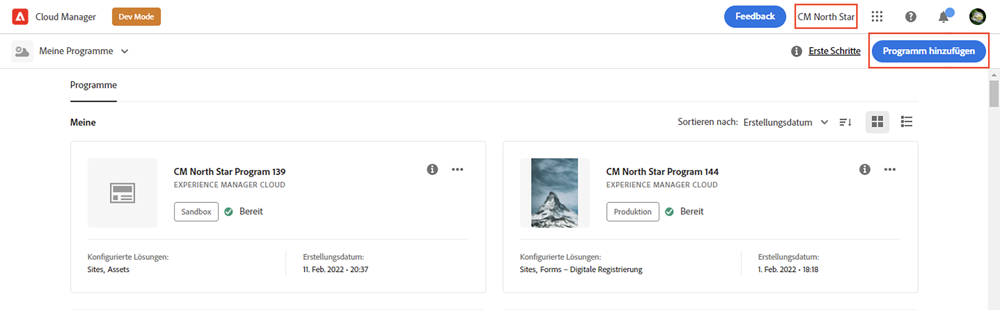
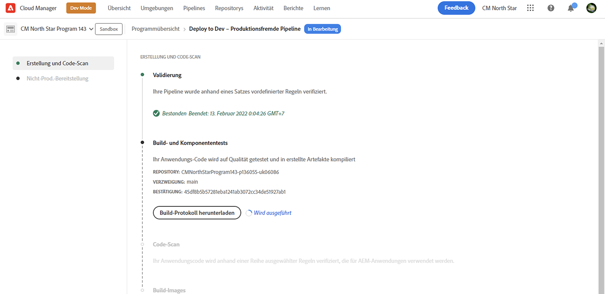

# Erstellen eines Programms {#creating-a-program}

Erfahren Sie, wie Sie ein neues Programm und eine neue Pipeline einrichten, um das Add-on bereitzustellen.

## Die bisherige Entwicklung {#story-so-far}

Im vorherigen Dokument der Referenz-Demo-Add-on-Journey zu Adobe Experience Manager (AEM), [Grundlegendes zur Installation des Referenz-Demo-Add-ons](installation.md), haben Sie gelernt, wie der Installationsprozess des Referenz-Demo-Add-ons funktioniert. Dabei wurde gezeigt, wie die verschiedenen Teile zusammenarbeiten. Sie sollten jetzt folgende Punkte erfüllen:

* Sollten Sie über grundlegende Kenntnisse zu Cloud Manager verfügen.
* Wissen Sie, wie Pipelines Inhalte und Konfigurationen für AEM bereitstellen.
* Sehen, wie mit Vorlagen in nur wenigen Klicks neue Sites erstellt werden können, die mit Demo-Inhalten gefüllt sind.

Dieser Artikel baut auf diesen Grundlagen auf und führt den ersten Konfigurationsschritt durch, um ein Programm für Testzwecke zu erstellen. Dabei wird eine Pipeline zum Bereitstellen des Add-on-Inhalts verwendet.

## Ziel {#objective}

In diesem Dokument erfahren Sie, wie Sie ein neues Programm und eine neue Pipeline einrichten, um das Add-on bereitzustellen. Nach dem Lesen sollten Sie zu Folgendem instande sein:

* Verstehen, wie Sie mit Cloud Manager ein neues Programm erstellen.
* Das Referenzdemo-Add-on für das neue Programm aktivieren.
* Eine Pipeline ausführen, um den Add-On-Inhalt bereitzustellen.

## Erstellen eines Programms {#create-program}

Nach der Anmeldung bei Cloud Manager können Sie ein Sandbox-Programm für Ihre Test- und Demozwecke erstellen.

>[!NOTE]
>
>Ihre Benutzerin bzw. Ihr Benutzer muss in Cloud Manager in Ihrem Unternehmen die Rolle **Geschäftsinhaber** innehaben, um Programme zu erstellen.

1. Melden Sie sich unter [my.cloudmanager.adobe.com](https://my.cloudmanager.adobe.com/) bei Adobe Cloud Manager an.

1. Stellen Sie nach der Anmeldung sicher, dass Sie sich in der richtigen Organisation befinden, indem Sie diese in der oberen rechten Ecke des Bildschirms prüfen. Wenn Sie Mitglied nur einer Organisation sind, ist dieser Schritt nicht erforderlich.

   

1. Wählen Sie **Programm hinzufügen** oben rechts im Fenster.

1. Tun Sie Folgendes im Dialogfeld **Erstellen wir Ihr Programm**:

   1. Geben Sie einen **Programmnamen** zur Beschreibung Ihres Programms an.
   1. Wählen Sie **Sandbox einrichten** für Ihr **Programmziel**
   1. Wählen Sie **Weiter**.

   

1. Erweitern Sie im Dialogfeld **Sandbox einrichten** in der Tabelle **Lösungen und Add-ons** den Eintrag **Sites** durch Tippen bzw. Klicken darauf und kreuzen Sie dann **Referenzdemos** an.

   * Wenn Sie auch Demos für AEM Screens erstellen möchten, setzen Sie ebenfalls ein Häkchen bei der Option **Screens** in der Liste. Wählen Sie **Aktualisieren**.

   

1. Wählen Sie **Erstellen**, und Cloud Manager beginnt mit der Einrichtung Ihres Sandbox-Programms. Sie gelangen zum Bildschirm mit der Programmübersicht. Eine kurze Bannerbenachrichtigung zeigt an, dass der Prozess gestartet wurde. Auf der Übersichtsseite für Ihr neues Programm wurde eine Karte hinzugefügt. Der Einrichtungsprozess dauert einige Minuten.

1. Sobald die Einrichtung abgeschlossen ist, zeigt die Karte für die Umgebung auf der Übersichtsseite den Status **Bereit**. Wählen Sie die Karte aus, damit Sie die Umgebung öffnen können.

   

1. Ihre Umgebung ist bereit und das Add-on ist jetzt als Option aktiviert, aber die Inhalte der Demo müssen erst in AEM bereitgestellt werden, damit sie verfügbar sind. Wählen Sie dazu die Schaltfläche mit den Auslassungspunkten neben der Pipeline „Für Entwicklung bereitstellen“ in der **Pipelines**-Karte und wählen Sie **Ausführen**.

   

1. Die Pipeline wird gestartet und Sie gelangen zu einer Seite, auf der der Fortschritt der Bereitstellung detailliert beschrieben wird. Sie können von diesem Bildschirm weg navigieren, während das Programm erstellt wird, und bei Bedarf später zurückkehren.

   

Die Fertigstellung der Pipeline kann mehrere Minuten dauern. Sobald die Pipeline abgeschlossen ist, sind das Add-on und der zugehörige Demoinhalt für die Verwendung in der Authoring-Umgebung von AEM verfügbar.

## Wie geht es weiter {#what-is-next}

Nachdem Sie nun diesen Teil der Tour durch das AEM-Referenzdemo-Add-on abgeschlossen haben, sollten Sie:

* Verstehen, wie Sie mit Cloud Manager ein neues Programm erstellen können.
* Wissen, wie Sie das Referenzdemo-Add-on für das neue Programm aktivieren.
* In der Lage sein, eine Pipeline zum Bereitstellen des Add-on-Inhalts ausführen.

Auf Basis dieses Wissens setzen Sie Ihre Tour zum AEM-Referenzdemo-Add-on fort, indem Sie sich [Erstellen einer Demosite](create-site.md) ansehen. Hier erfahren Sie, wie Sie in AEM eine Demosite erstellen, die auf einer Bibliothek vorkonfigurierter Vorlagen basiert, die von der Pipeline bereitgestellt wurden.

## Zusätzliche Ressourcen {#additional-resources}

* [Dokumentation zu Cloud Manager](https://experienceleague.adobe.com/docs/experience-manager-cloud-service/content/onboarding/onboarding-concepts/cloud-manager-introduction.html?lang=de) – Wenn Sie an weiteren Details zu den Funktionen von Cloud Manager interessiert sind, sehen Sie sich die ausführlichen technischen Dokumente an.
