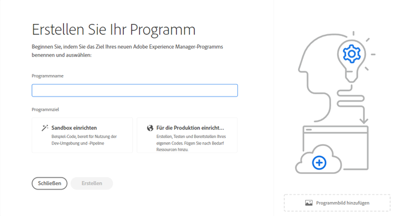
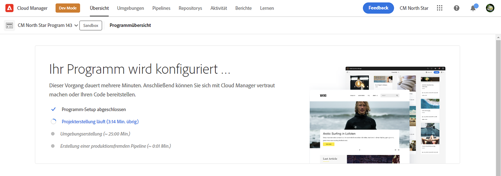
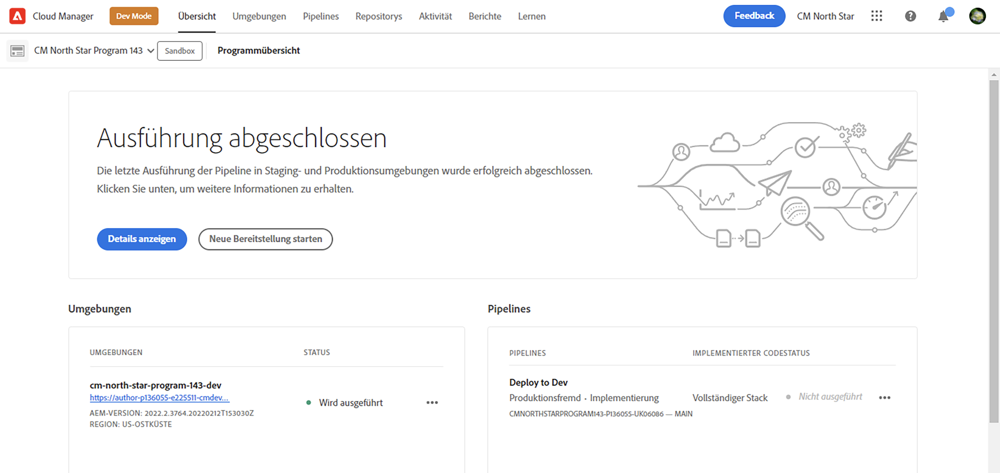
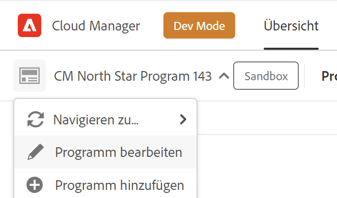
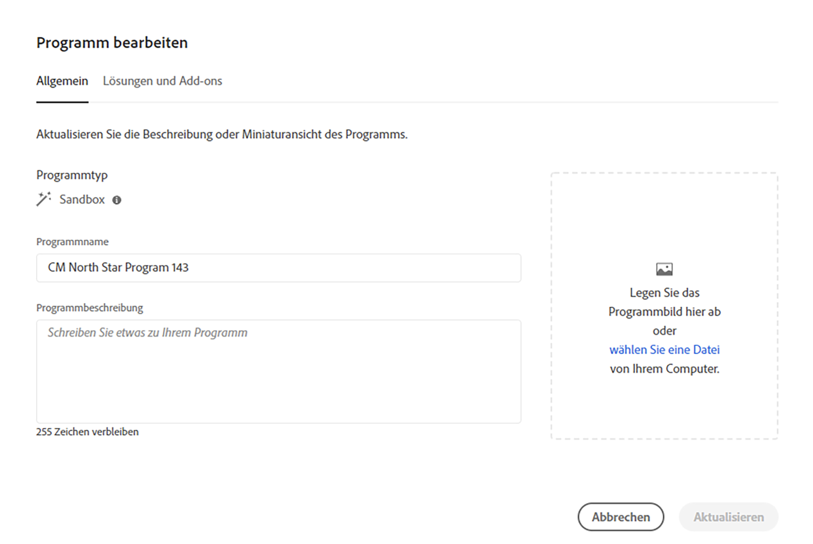
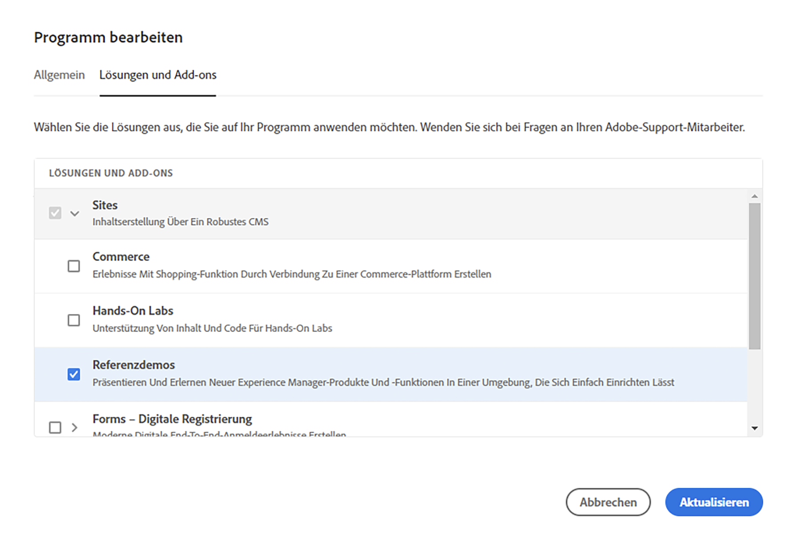
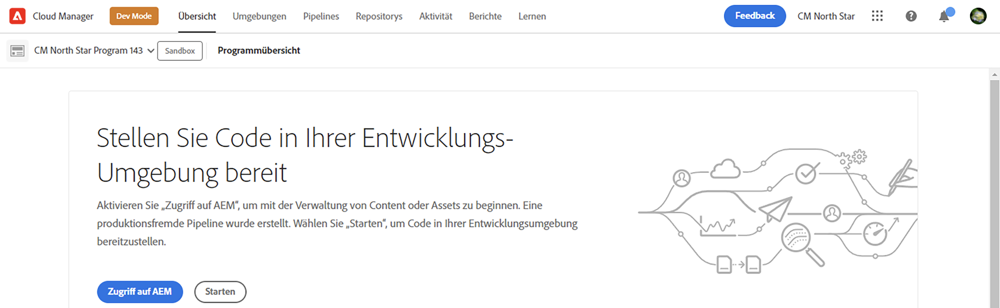

# Erstellen eines Programms {#creating-a-program}

Erfahren Sie, wie Sie ein neues Programm und eine neue Pipeline einrichten, um das Add-on bereitzustellen.

## Die bisherige Entwicklung {#story-so-far}

Im vorherigen Dokument der AEM-Referenz-Demos-Add-On-Journey, [Grundlegendes zur Installation des Referenz-Demo-Add-ons,](installation.md) Sie haben gelernt, wie der Installationsprozess des Referenz-Demos-Add-ons funktioniert, und haben gezeigt, wie die verschiedenen Teile zusammenarbeiten. Sie sollten jetzt folgende Punkte erfüllen:

* Sollten Sie über grundlegende Kenntnisse zu Cloud Manager verfügen.
* Wissen Sie, wie Pipelines Inhalte und Konfigurationen für AEM bereitstellen.
* Wissen Sie, wie mit Vorlagen mit nur wenigen Klicks neue Sites erstellt werden können, die mit Demo-Inhalten gefüllt sind.

Dieser Artikel baut auf diesen Grundlagen auf und führt den ersten Konfigurationsschritt durch, um ein Programm für Testzwecke zu erstellen. Dabei wird eine Pipeline zum Bereitstellen des Add-on-Inhalts verwendet.

## Ziel {#objective}

In diesem Dokument erfahren Sie, wie Sie ein neues Programm und eine neue Pipeline einrichten, um das Add-on bereitzustellen. Nach dem Lesen sollten Sie folgende Punkte erfüllen:

* Sie sollten verstehen, wie Sie mit Cloud Manager ein neues Programm erstellen können.
* Sie sollten nun wissen, wie Sie das Referenzdemo-Add-on für das neue Programm aktivieren.
* Sie sollten in der Lage sein, eine Pipeline zum Bereitstellen des Add-on-Inhalts ausführen.

## Erstellen eines Programms {#create-program}

Nach der Anmeldung bei Cloud Manager können Sie ein neues Sandbox-Programm für Ihre Test- und Demozwecke erstellen.

>[!NOTE]
>
>Ihr Benutzer muss in Cloud Manager in Ihrem Unternehmen die Rolle **Geschäftsinhaber** innehaben, um Programme zu erstellen.

1. Melden Sie sich unter [my.cloudmanager.adobe.com](https://my.cloudmanager.adobe.com/) bei Adobe Cloud Manager an.

1. Stellen Sie nach der Anmeldung sicher, dass Sie sich in der richtigen Organisation befinden, indem Sie diese in der oberen rechten Ecke des Bildschirms prüfen. Wenn Sie nur Mitglied einer Organisation sind, ist dieser Schritt nicht erforderlich.

   

1. Tippen oder klicken oben rechts im Fenster Sie auf **Programm hinzufügen**.

1. Stellen Sie im Dialogfeld **Erstellen Sie Ihr Programm** sicher, dass **Adobe Experience Manager** unter **Produkte** ausgewählt ist, und tippen oder klicken Sie dann auf **Weiter**.

   

1. Führen Sie im Dialogfeld Folgendes durch:

   * Geben Sie einen **Programmnamen** zur Beschreibung Ihres Programms an.
   * Tippen oder klicken Sie auf **Sandbox einrichten** für Ihr **Programmziel**.

   Tippen oder klicken Sie dann auf **Erstellen**.

   

1. Sie gelangen in den Bildschirm mit der Programmübersicht, wo Sie den Prozess der Programmerstellung beobachten können. Cloud Manager zeigt Ihnen dort die geschätzte verbleibende Zeit an. Sie können von diesem Bildschirm weg navigieren, während das Programm erstellt wird, und bei Bedarf später zurückkehren.

   

1. Nach Abschluss des Vorgangs bietet Cloud Manager eine Übersicht, in der auch die automatisch erstellten Umgebungen und Pipelines zu sehen sind.

   

1. Bearbeiten Sie die Programmdetails, indem Sie auf den Programmnamen oben links auf der Seite klicken und im Dropdown-Menü die Option **Programm bearbeiten** auswählen.

   

1. Wechseln Sie im Dialogfeld **Programm bearbeiten** zur Registerkarte **Lösungen und Add-ons**.

   

1. Erweitern Sie auf der Registerkarte **Lösungen und Add-ons** den Eintrag **Sites** auf der Liste und setzen Sie dann ein Häkchen bei **Referenzdemos**. Wenn Sie auch Demos für AEM Screens erstellen möchten, überprüfen Sie die **Screens** in der Liste. Tippen oder klicken Sie auf **Aktualisieren**.

   

1. Das Add-on ist jetzt als Option aktiviert, seine Inhalte müssen jedoch in Adobe Experience Manager bereitgestellt werden, damit sie verfügbar sind. Tippen oder klicken Sie auf der Programmübersichtsseite auf **Starten**, um die Pipeline zu starten und den Add-on-Inhalt für Adobe Experience Manager bereitzustellen.

   

1. Die Pipeline wird gestartet und Sie gelangen zu einer Seite, auf der der Fortschritt der Implementierung detailliert beschrieben wird. Sie können von diesem Bildschirm weg navigieren, während das Programm erstellt wird, und bei Bedarf später zurückkehren.

   

Sobald die Pipeline abgeschlossen ist, sind das Add-on und der zugehörige Demoinhalt für die Verwendung in der Authoring-Umgebung von Adobe Experience Manager verfügbar.

## Wie geht es weiter {#what-is-next}

Nachdem Sie nun diesen Teil der Tour zum Referenzdemo-Add-on von Adobe Experience Manager abgeschlossen haben, sollten Sie Folgendes können:

* Sie sollten verstehen, wie Sie mit Cloud Manager ein neues Programm erstellen können.
* Sie sollten nun wissen, wie Sie das Referenzdemo-Add-on für das neue Programm aktivieren.
* Sie sollten in der Lage sein, eine Pipeline zum Bereitstellen des Add-on-Inhalts ausführen.

Bauen Sie auf diesem Wissen auf und fahren Sie mit der Tour zum Referenzdemo-Add-on von Adobe Experience Manager fort, indem Sie sich das Dokument [Erstellen einer Demo-Site](create-site.md) erneut ansehen. Darin erfahren Sie, wie Sie basierend auf einer Bibliothek vorkonfigurierter Vorlagen, die von der Pipeline bereitgestellt wurden, eine Demo-Site in Adobe Experience Manager erstellen.

## Zusätzliche Ressourcen {#additional-resources}

* [Dokumentation zu Cloud Manager](https://experienceleague.adobe.com/docs/experience-manager-cloud-service/content/onboarding/onboarding-concepts/cloud-manager-introduction.html?lang=de) – Wenn Sie an weiteren Details zu den Funktionen von Cloud Manager interessiert sind, sehen Sie sich die ausführlichen technischen Dokumente an.
