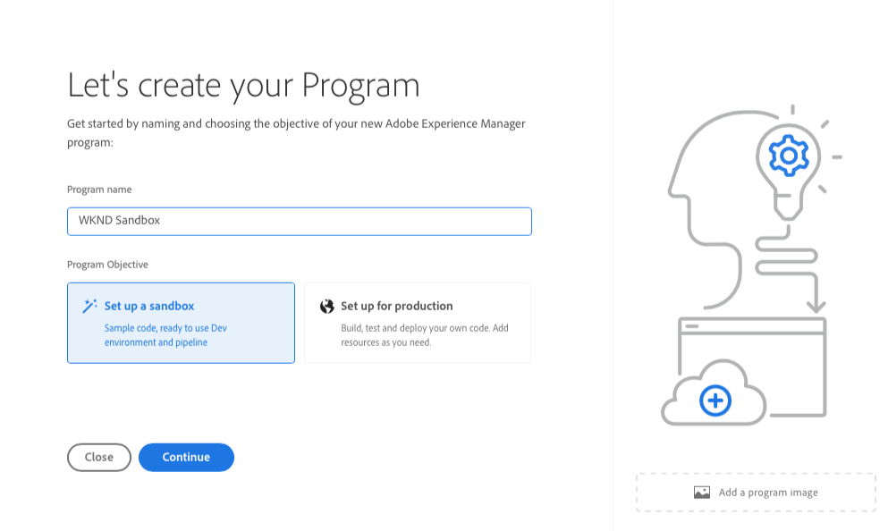

# Erstellen eines Programms {#creating-a-program}

Erfahren Sie, wie Sie ein neues Programm und eine neue Pipeline einrichten, um das Add-on bereitzustellen.

## Die bisherige Entwicklung {#story-so-far}

Im vorherigen Dokument der Tour zum AEM-Referenz-Demo-Add-on, [Grundlagen zur Installation des Referenz-Demo-Add-ons](installation.md), haben Sie gelernt, wie der Installationsprozess des Referenz-Demo-Add-ons funktioniert. Dabei wurde gezeigt, wie die verschiedenen Teile zusammenarbeiten. Sie sollten jetzt folgende Punkte erfüllen:

* Sollten Sie über grundlegende Kenntnisse zu Cloud Manager verfügen.
* Wissen Sie, wie Pipelines Inhalte und Konfigurationen für AEM bereitstellen.
* Wissen Sie, wie mit Vorlagen mit nur wenigen Klicks neue Sites erstellt werden können, die mit Demo-Inhalten gefüllt sind.

Dieser Artikel baut auf diesen Grundlagen auf und führt den ersten Konfigurationsschritt durch, um ein Programm für Testzwecke zu erstellen. Dabei wird eine Pipeline zum Bereitstellen des Add-on-Inhalts verwendet.

## Ziel {#objective}

In diesem Dokument erfahren Sie, wie Sie ein neues Programm und eine neue Pipeline einrichten, um das Add-on bereitzustellen. Nach dem Lesen sollten Sie folgende Punkte erfüllen:

* Sie sollten verstehen, wie Sie mit Cloud Manager ein neues Programm erstellen können.
* Sie sollten nun wissen, wie Sie das Referenzdemo-Add-on für das neue Programm aktivieren.
* Sie sollten in der Lage sein, eine Pipeline zum Bereitstellen des Add-on-Inhalts ausführen.

## Erstellen eines Programms {#create-program}

Nach der Anmeldung bei Cloud Manager können Sie ein neues Sandbox-Programm für Ihre Test- und Demozwecke erstellen.

>[!NOTE]
>
>Ihr Benutzer muss Mitglied der **Business Owner** Rolle in Cloud Manager in Ihrem Unternehmen bei der Erstellung von Programmen.

1. Melden Sie sich unter [my.cloudmanager.adobe.com](https://my.cloudmanager.adobe.com/) bei Adobe Cloud Manager an.

1. Stellen Sie nach der Anmeldung sicher, dass Sie sich in der richtigen Organisation befinden, indem Sie diese in der oberen rechten Ecke des Bildschirms prüfen. Wenn Sie nur Mitglied einer Organisation sind, ist dieser Schritt nicht erforderlich.

   

1. Tippen oder klicken oben rechts im Fenster Sie auf **Programm hinzufügen**.

1. Im **Erstellen wir Ihr Programm** dialog:

   1. Geben Sie einen **Programmnamen** zur Beschreibung Ihres Programms an.
   1. Tippen oder klicken Sie auf **Sandbox einrichten** für Ihr **Programmziel**.
   1. Tippen oder klicken Sie auf **Weiter**.

   

1. Im **Sandbox einrichten** im Dialogfeld **Lösungen und Add-ons** Tabelle, erweitern Sie die **Sites** durch Tippen oder Klicken auf einen Eintrag in der Liste und dann **Referenz-Demos**.

   * Wenn Sie auch Demos für AEM Screens erstellen möchten, setzen Sie auch ein Häkchen bei der Option **Screens** in der Liste. Tippen oder klicken Sie auf **Aktualisieren**.

   

1. Tippen oder klicken Sie auf **Erstellen** und Cloud Manager beginnt mit der Einrichtung Ihres Sandbox-Programms. Sie gelangen zum Bildschirm mit der Programmübersicht. Eine kurze Bannerbenachrichtigung zeigt an, dass der Prozess gestartet wurde. Auf der Übersichtsseite für Ihr neues Programm wurde eine Karte hinzugefügt. Der Einrichtungsprozess dauert einige Minuten.

1. Sobald die Einrichtung abgeschlossen ist, zeigt die Karte für die Umgebung auf der Übersichtsseite ihren Status als **Bereit**. Tippen oder klicken Sie auf die Karte, um die Umgebung zu öffnen.

   

1. Ihre Umgebung ist bereit und das Add-on ist jetzt als Option aktiviert, aber die Inhalte der Demo müssen in bereitgestellt AEM werden, damit sie verfügbar sind. Tippen oder klicken Sie dazu auf die Suchschaltfläche neben der Pipeline In der **Pipelines** Karte und wählen Sie **Ausführen**.

   

1. Die Pipeline wird gestartet und Sie gelangen zu einer Seite, auf der der Fortschritt der Bereitstellung detailliert beschrieben wird. Sie können von diesem Bildschirm weg navigieren, während das Programm erstellt wird, und bei Bedarf später zurückkehren.

   

Die Fertigstellung der Pipeline kann mehrere Minuten dauern. Nach dem Abschluss sind das Add-on und der zugehörige Demoinhalt für die Verwendung in der AEM Authoring-Umgebung verfügbar.

## Wie geht es weiter {#what-is-next}

Nachdem Sie nun diesen Teil der Tour zum Referenzdemo-Add-on von Adobe Experience Manager abgeschlossen haben, sollten Sie Folgendes können:

* Sie sollten verstehen, wie Sie mit Cloud Manager ein neues Programm erstellen können.
* Sie sollten nun wissen, wie Sie das Referenzdemo-Add-on für das neue Programm aktivieren.
* Sie sollten in der Lage sein, eine Pipeline zum Bereitstellen des Add-on-Inhalts ausführen.

Bauen Sie auf diesem Wissen auf und fahren Sie mit der Tour zum Referenzdemo-Add-on von Adobe Experience Manager fort, indem Sie sich das Dokument [Erstellen einer Demo-Site](create-site.md) erneut ansehen. Darin erfahren Sie, wie Sie basierend auf einer Bibliothek vorkonfigurierter Vorlagen, die von der Pipeline bereitgestellt wurden, eine Demo-Site in Adobe Experience Manager erstellen.

## Zusätzliche Ressourcen {#additional-resources}

* [Dokumentation zu Cloud Manager](https://experienceleague.adobe.com/docs/experience-manager-cloud-service/content/onboarding/onboarding-concepts/cloud-manager-introduction.html?lang=de) – Wenn Sie an weiteren Details zu den Funktionen von Cloud Manager interessiert sind, sehen Sie sich die ausführlichen technischen Dokumente an.
