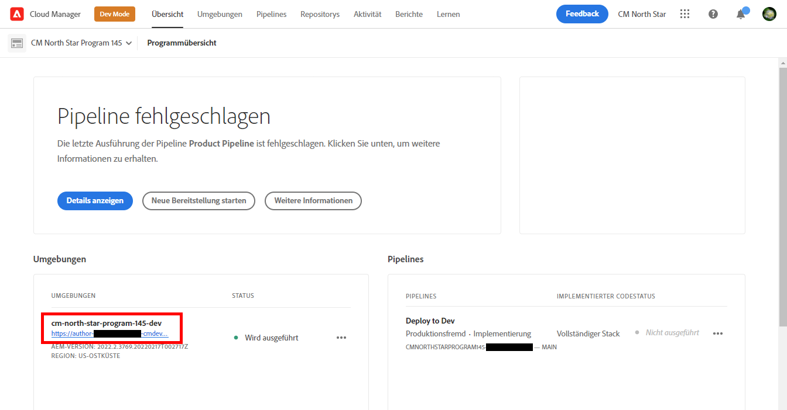
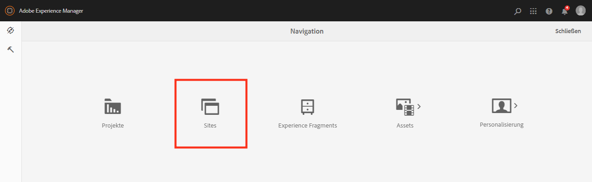
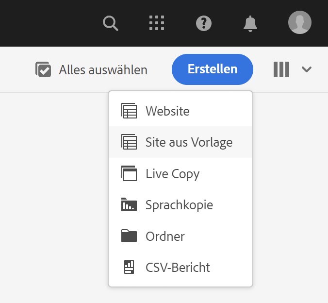
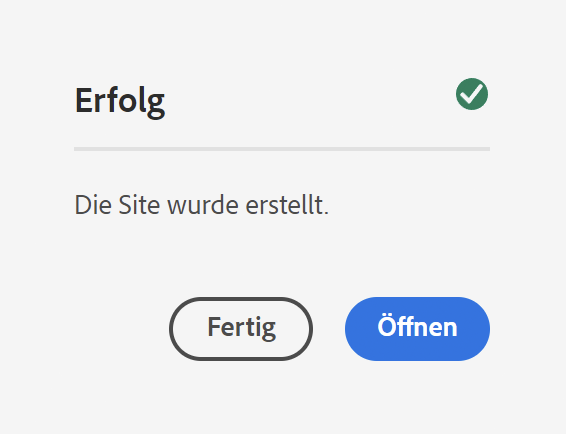
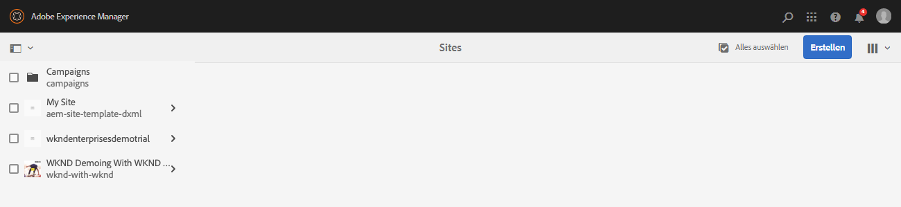
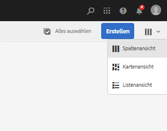
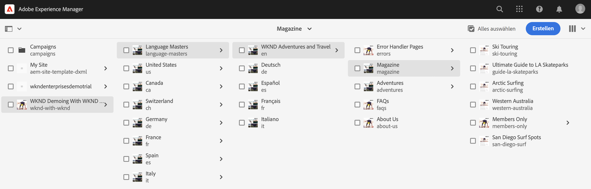
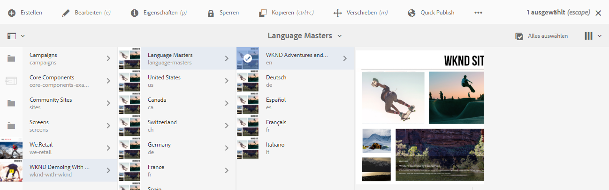
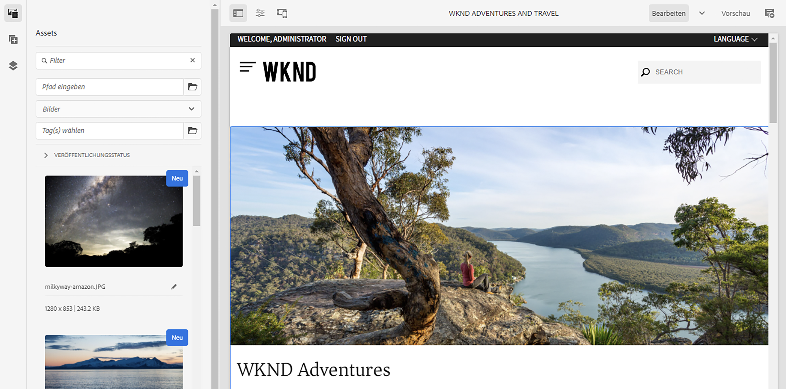

# Erstellen einer Demo-Site {#creating-a-site}

Erstellen Sie eine Demosite in AEM basierend auf einer Bibliothek vorkonfigurierter Vorlagen.

## Die bisherige Entwicklung {#story-so-far}

Im vorherigen Dokument der AEM-Referenzdemo-Add-on-Journey, [Erstellen eines Programms](create-program.md), haben Sie den ersten Konfigurationsschritt ausgeführt, um ein Programm zu Testzwecken zu erstellen, und eine Pipeline verwendet, um den Add-on-Inhalt bereitzustellen. Sie sollten jetzt zu Folgendem in der Lage sein:

* Verstehen, wie Sie mit Cloud Manager ein neues Programm erstellen können.
* Sie sollten nun wissen, wie Sie das Referenzdemo-Add-on für das neue Programm aktivieren.
* Sie sollten in der Lage sein, eine Pipeline zum Bereitstellen des Add-on-Inhalts ausführen.

In diesem Artikel wird der nächste Schritt des Prozesses beschrieben, in dem basierend auf den Vorlagen des Referenzdemo-Add-ons eine Site oder ein AEM Screens-Projekt in AEM erstellt wird.

## Ziel {#objective}

In diesem Dokument erfahren Sie, wie Sie eine Site basierend auf den Vorlagen des Referenzdemo-Add-ons erstellen. Nach dem Lesen sollten Sie Folgendes können:

* Verstehen, wie Sie auf die AEM Authoring-Umgebung zugreifen.
* Wissen, wie Sie eine Site basierend auf einer Vorlage erstellen.
* Die Grundlagen der Navigation in der Site-Struktur und der Bearbeitung einer Seite verstehen.

## Erstellen einer Demo-Site oder eines Screens-Projekts {#create-site}

Nachdem die Pipeline das Referenzdemo-Add-on bereitgestellt hat, können Sie auf die Autorenumgebung in AEM zugreifen, um Demo-Sites basierend auf dem Inhalt des Add-ons zu erstellen.

1. Wählen Sie auf der Seite mit der Programmübersicht in Cloud Manager den Link zur AEM-Autorenumgebung aus.

   

1. Wählen Sie im Hauptmenü von AEM die Option **Sites** aus.

   

1. Wählen Sie in der Sites-Konsole **Erstellen** oben rechts im Bildschirm und anschließend **Site aus Vorlage** in der Dropdown-Liste aus.

   

1. Der Assistent zur Site-Erstellung wird gestartet. In der linken Spalte sehen Sie die Demovorlagen, die die Pipeline für Ihre Authoring-Instanz bereitgestellt hat. Wählen Sie einen Ordner aus, um Details in der rechten Spalte anzuzeigen. Wenn Sie AEM Screens testen oder vorführen möchten, wählen Sie unbedingt die **We.Cafe-Site-Vorlage** aus. Wählen Sie **Weiter** aus.

   

1. Geben Sie im nächsten Bildschirm einen Titel für Ihre Site oder Ihr Screens-Projekt an. Der Name der Site kann angegeben oder aus dem Titel generiert werden, falls er weggelassen wird. Wählen Sie **Erstellen** aus.

   * Der Titel der Site wird in der Titelleiste des Browsers angezeigt.
   * Der Site-Name wird Teil der URL.
   * Der Site-Name muss den Seitenbenennungskonventionen von AEM entsprechen, die im Abschnitt [Zusätzliche Ressourcen](#additional-resources) detailliert beschrieben sind.

   

1. Die Site-Erstellung wird mit einem Dialogfeld bestätigt. Wählen Sie **Fertig**.

   

Sie haben jetzt Ihre eigene Demo-Site erstellt!

## Verwenden der Demo-Site {#use-site}

Nachdem Sie Ihre Demo-Site erstellt haben, können Sie sie wie jede andere Site in AEM verwenden.

1. Die Site wird jetzt in der Sites-Konsole angezeigt.

   

1. Vergewissern Sie sich in der rechten oberen Ecke des Bildschirms, dass die Konsolenansicht auf **Spaltenansicht** eingestellt ist.

   

1. Wählen Sie die Site aus, um deren Struktur und Inhalt zu erkunden. Die Spaltenansicht wird beim Navigieren in der Inhaltsstruktur der Demo-Site kontinuierlich erweitert.

   

1. Wählen Sie eine Seite und anschließend die Option **Bearbeiten** in der Symbolleiste aus.

   

1. Sie können die Seite wie jede andere AEM-Inhaltsseite bearbeiten, indem Sie beispielsweise Komponenten oder Assets hinzufügen oder bearbeiten, und die Funktionalität von AEM testen.

   

Herzlichen Glückwunsch! Sie können nun den Inhalt Ihrer Demo-Site weiter untersuchen und alles, was AEM zu bieten hat, durch den Inhalt der Best Practices des Referenz-Demo-Add-ons entdecken.

Erstellen Sie zusätzliche Sites basierend auf anderen Vorlagen, um weitere Funktionen von AEM zu erkunden.

## Wie geht es weiter {#what-is-next}

Nachdem Sie nun diesen Teil der Tour zum Referenzdemo-Add-on von Adobe Experience Manager abgeschlossen haben, sollten Sie Folgendes können:

* Verstehen, wie Sie auf die AEM Authoring-Umgebung zugreifen.
* Wissen, wie Sie eine Site basierend auf einer Vorlage erstellen.
* Die Grundlagen der Navigation in der Site-Struktur und der Bearbeitung einer Seite verstehen.

Sie können jetzt die Funktionen von AEM mithilfe von Add-On-Inhalten testen. Sie haben zwei Möglichkeiten, um mit der Tour fortzufahren:

* Wenn Sie AEM Screens-Inhalte vollständig demonstrieren und testen möchten, stellen Sie sicher, dass Sie, wie zuvor beschrieben, eine Site basierend auf der **We.Cafe-Site** bereitgestellt haben und [AEM Screens für Ihre Demo-Site aktivieren](screens.md).
* Wenn Sie nur Inhalte von Demo-Sites zeigen möchten, fahren Sie mit dem Abschnitt [Verwalten Ihrer Demo-Sites](manage.md) fort, in dem Sie mehr über die Tools erfahren, die Ihnen bei der Verwaltung Ihrer Demo-Sites zur Verfügung stehen und wie Sie sie entfernen können.

## Zusätzliche Ressourcen {#additional-resources}

* [Dokumentation zu Cloud Manager](https://experienceleague.adobe.com/docs/experience-manager-cloud-service/content/onboarding/onboarding-concepts/cloud-manager-introduction.html?lang=de): Wenn Sie an weiteren Details zu den Funktionen von Cloud Manager interessiert sind, sollten Sie sich die ausführlichen technischen Dokumente direkt ansehen.
* [Site erstellen](/help/sites-cloud/administering/site-creation/create-site.md): Erfahren Sie, wie Sie AEM verwenden, um eine Site mithilfe von Site-Vorlagen zu erstellen, um den Stil und die Struktur Ihrer Site zu definieren.
* [Seitenbenennungskonventionen in AEM](/help/sites-cloud/authoring/sites-console/organizing-pages.md#page-name-restrictions-and-best-practices). Auf dieser Seite finden Sie die Konventionen zum Organisieren von AEM-Seiten.
* [AEM – Grundlegende Handhabung](/help/sites-cloud/authoring/basic-handling.md): Lesen Sie sich dieses Dokument durch, wenn Sie noch nicht mit AEM vertraut sind, um grundlegende Konzepte wie z. B. die Navigation in der Konsole und ihre Organisation zu verstehen.
