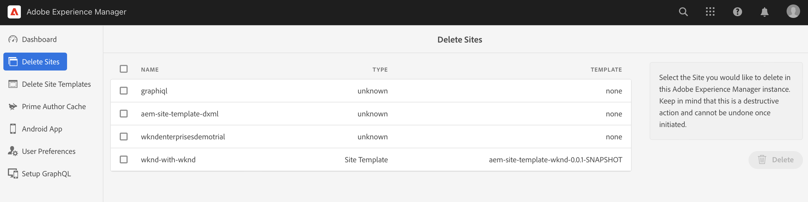

# Verwalten Ihrer Demo-Sites {#manage-demo-sites}

Erfahren Sie mehr über die Tools, die Ihnen bei der Verwaltung Ihrer Demo-Sites helfen, und wie Sie diese entfernen können.

## Ihre bisherige Tour {#story-so-far}

Im vorherigen Dokument der Tour zum AEM-Referenz-Demo-Add-on, [Site erstellen](create-site.md), haben Sie eine neue Demo-Site basierend auf den Vorlagen des Referenz-Demo-Add-ons erstellt. Sie sollten jetzt:

* Verstehen, wie Sie auf die AEM Authoring-Umgebung zugreifen.
* Wissen, wie Sie eine Site basierend auf einer Vorlage erstellen.
* Die Grundlagen der Navigation in der Site-Struktur und der Bearbeitung einer Seite verstehen.

Wenn Sie auch [AEM Screens für Ihre Demo-Site aktiviert haben](screens.md), sollten Sie ebenfalls:

* Die Grundlagen von AEM Screens kennen.
* Den Demoinhalt von We.Cafe verstehen.
* wissen, wie man AEM Screens für We.Cafe konfiguriert.

Nachdem Sie nun Ihre eigene Deo-Sites zur Verfügung haben, werden in diesem Artikel die verfügbaren Tools beschrieben, mit denen Sie Ihre Demo-Sites verwalten und sie entfernen können.

## Ziel {#objective}

In diesem Dokument erfahren Sie, wie Sie die von Ihnen erstellten Demo-Sites verwalten können. Nach dem Lesen sollten Sie:

* Verstehen, wie man auf die Demo-Dienstprogramme zur Selbstbedienung zugreift.
* Wissen, welche Dienstprogramme Ihnen zur Verfügung stehen.
* Löschen einer vorhandenen Demo-Site oder Vorlage.

## Zugriff auf die Demo-Dienstprogramme zur Selbstbedienung {#accessing-utilities}

Da Sie nun über eigene Demo-Sites verfügen, möchten Sie wahrscheinlich wissen, wie Sie diese verwalten können. Die Pipeline hat nicht nur die Site-Vorlagen bereitgestellt, um Ihnen Inhalte für die Demo-Sites zur Verfügung zu stellen, sondern auch eine Reihe von Dienstprogrammen zur Verwaltung dieser Sites bereitgestellt.

1. Wählen Sie in der globalen AEM-Navigationsleiste **Tools** > **Referenzdemos** > **Referenzdemo-Dienstprogramme**.

   

1. „Referenz-Demo-Dienstprogramme“ ist eine Sammlung nützlicher Funktionen, mit denen Sie Ihre Adobe Experience Manager-Umgebung einrichten und überwachen können. Die erste Ansicht ist das **Dashboard**, das zur Statusüberprüfung der Umgebung und ihrer Demo-Funktionalität dient.

   

Self-Service-Demo-Dienstprogramme bieten mehrere Tools.

* **Löschen von Sites**: Wählen Sie die Site aus, die Sie in dieser Adobe Experience Manager-Instanz löschen möchten. Beachten Sie, dass es sich um eine destruktive Aktion handelt, die nach ihrer Einleitung nicht rückgängig gemacht werden kann.
* **Löschen von Site-Vorlagen**: Wählen Sie die Site-Vorlage aus, die Sie in dieser Adobe Experience Manager-Instanz löschen möchten. Stellen Sie sicher, dass auch alle Sites, die auf die Vorlage verweisen, vor dem Löschen der Site-Vorlage gelöscht werden. Beachten Sie, dass es sich um eine destruktive Aktion handelt, die nach ihrer Einleitung nicht rückgängig gemacht werden kann.
* **Grundlegender Autoren-Cache**: Dadurch werden mehrere Ressourcen innerhalb der Adobe Experience Manager-Instanz abgerufen, wodurch die Abrufzeiten verkürzt werden. Dies kann mehrere Sekunden dauern.
* **Android-App**: Tools zum Installieren und Starten der Demo-App unter Android. Erstellen Sie eine Site basierend auf der **WKND Single Page App**, um diese Seite zu füllen. Verwendung von einem Android-Gerät, Emulator oder Bluestacks.
* **Benutzereinstellungen**: Popup-Dialogfelder für Tutorial deaktivieren.
* **GraphQL einrichten**: Richten Sie den globalen GraphQL-Endpunkt schnell ein.

## Löschen von Demo-Sites und Vorlagen {#deleting}

Nachdem Sie eine Reihe von AEM-Funktionen getestet haben, benötigen Sie Ihre Demo-Site oder sogar die Vorlage, auf der sie basiert, möglicherweise nicht mehr. Es ist einfach, sowohl Demo-Sites als auch Site-Vorlagen zu löschen.

1. Greifen Sie auf **Referenzdemo-Dienstprogramme** zu und wählen Sie **Sites löschen** aus.

   

1. Die verfügbaren Sites werden in einer Liste dargestellt. Markieren Sie die Site oder Sites, die Sie löschen möchten, und wählen Sie **Löschen** aus.

   >[!CAUTION]
   >
   >Das Löschen von Sites und Vorlagen ist eine destruktive Aktion und kann nach seiner Einleitung nicht rückgängig gemacht werden.

1. Bestätigen Sie den Löschvorgang der Site im Dialogfeld.

   

1. AEM löscht die ausgewählte(n) Site(s) und zeigt den Fortschritt an der Stelle an, an der sich zuvor die Schaltfläche **Löschen** befand.

   

Die Site ist jetzt gelöscht.

Sie können Vorlagen auf die gleiche Weise wie unter der Überschrift **Löschen von Site-Vorlagen** in **Referenzdemo-Dienstprogramme** löschen.

>[!CAUTION]
>
>Stellen Sie sicher, dass auch alle Sites, die auf die Vorlage verweisen, vor dem Löschen der Site-Vorlage gelöscht werden.

## Tour beendet? {#end-of-journey}

Herzlichen Glückwunsch! Sie haben die Tour zum AEM-Referenzdemo-Add-on abgeschlossen! Sie sollten jetzt:

* Über grundlegende Kenntnisse zu Cloud Manager verfügen und verstehen, wie Pipelines Inhalte und Konfigurationen für AEM bereitstellen.
* Verstehen, wie Sie mit Cloud Manager ein neues Programm erstellen können.
* Wissen, wie Sie das Referenzdemo-Add-on für das neue Programm aktivieren und eine Pipeline zum Bereitstellen des Add-on-Inhalts bereitstellen können.
* Wissen, wie Sie auf die AEM-Autorenumgebung zugreifen können, um eine auf einer Vorlage basierende Site zu erstellen.
* Verstehen, wie man auf die Demo-Dienstprogramme zur Selbstbedienung zugreift.
* Wissen, wie Sie eine vorhandene Demo-Site oder Vorlage löschen.

Sie können jetzt die Funktionen von AEM mit Ihren eigenen Demo-Sites erkunden. AEM ist ein leistungsfähiges Tool und es stehen viele zusätzliche Optionen zur Verfügung. Schauen Sie sich einige der zusätzlichen Ressourcen an, die im Abschnitt [Zusätzliche Ressourcen](#additional-resources) verfügbar sind, um mehr über die Funktionen zu erfahren, die Sie während dieser Tour gesehen haben.

## Zusätzliche Ressourcen {#additional-resources}

* [Dokumentation zu Cloud Manager](https://experienceleague.adobe.com/docs/experience-manager-cloud-service/content/onboarding/onboarding-concepts/cloud-manager-introduction.html?lang=de): Wenn Sie an weiteren Details zu den Funktionen von Cloud Manager interessiert sind, sollten Sie sich die ausführlichen technischen Dokumente direkt ansehen.
* [Site erstellen](/help/sites-cloud/administering/site-creation/create-site.md): Erfahren Sie, wie Sie AEM verwenden, um eine Site mithilfe von Site-Vorlagen zu erstellen, um den Stil und die Struktur Ihrer Site zu definieren.
* [Seitenbenennungskonventionen in AEM](/help/sites-cloud/authoring/sites-console/organizing-pages.md#page-name-restrictions-and-best-practices). Auf dieser Seite finden Sie die Konventionen zum Organisieren von AEM-Seiten.
* [AEM – Grundlegende Handhabung](/help/sites-cloud/authoring/basic-handling.md): Lesen Sie sich dieses Dokument durch, wenn Sie noch nicht mit AEM vertraut sind, um grundlegende Konzepte wie z. B. die Navigation in der Konsole und ihre Organisation zu verstehen.
* [Technische Dokumentation zu AEM as a Cloud Service](https://experienceleague.adobe.com/docs/experience-manager-cloud-service.html?lang=de): Wenn Sie bereits über ein solides Verständnis von AEM verfügen, sehen Sie sich die ausführlichen technischen Dokumente an.
* [Site-Vorlagen](/help/sites-cloud/administering/site-creation/site-templates.md): Lesen Sie dieses Dokument, wenn Sie mehr über die Struktur von Site-Vorlagen und deren Verwendung zur Erstellung von Sites erfahren möchten.
