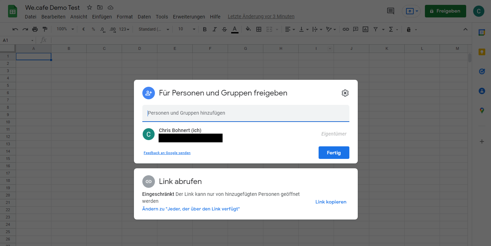

# Aktivieren von AEM Screens für Ihre Demo-Site {#enable-screens}

Erfahren Sie mehr über die Schritte zur Aktivierung des vollständigen AEM Screens as a Cloud Service-Erlebnisses auf Ihrer Demo-Site.

>[!NOTE]
>
>Für die AEM Screens-Demo muss das Screens-Add-on zum Cloud Manager-Programm hinzugefügt werden. Unter [Hinzufügen von Screens als Add-on zu einem neuen Programm in Cloud Manager](/help/screens-cloud/onboarding-screens-cloud/add-on-new-program-screens-cloud.md) erfahren Sie, wie das Hinzufügen funktioniert.

## Ihre bisherige Tour {#story-so-far}

Im vorherigen Dokument der Tour zum AEM-Referenzdemo-Add-on, [Erstellen einer Demo-Site](create-site.md), haben Sie eine Demo-Site basierend auf den Vorlagen des Referenzdemo-Add-ons erstellt. Sie sollten jetzt:

* Verstehen, wie Sie auf die AEM Authoring-Umgebung zugreifen.
* Wissen, wie Sie eine Site basierend auf einer Vorlage erstellen.
* Die Grundlagen der Navigation in der Site-Struktur und der Bearbeitung einer Seite verstehen.

Jetzt, wo Sie Ihre eigene Demo-Site erkunden können und die Tools zur Verwaltung Ihrer Demo-Sites kennen, können Sie das vollständige AEM Screens as a Cloud Service-Erlebnis für Ihre Demo-Sites aktivieren.

## Ziel {#objective}

Das AEM-Referenzdemo-Add-on enthält AEM Screens-Inhalte für We.Cafe, ein vertikales Coffeeshop-Geschäft. In diesem Dokument erfahren Sie, wie Sie die Demoeinrichtung von We.Cafe im Kontext von AEM Screens ausführen. Nach dem Lesen sollten Sie Folgendes können:

* Die Grundlagen von AEM Screens kennen.
* Den Demoinhalt von We.Cafe verstehen.
* Wissen, wie man AEM Screens für We.Cafe konfiguriert.
   * Wissen, wie man ein Screens-Projekt für We.Cafe erstellt.
   * Einen simulierten Wetter-Service mit Google Sheets und APIs konfigurieren können.
   * Sich dynamisch ändernde Screens-Inhalte basierend auf Ihrem „Wetter-Service“ simulieren können.
   * Den Screens-Player installieren und verwenden können.

## Grundlegendes zu Screens {#understand-screens}

AEM Screens as a Cloud Service ist eine Digital Signage-Lösung, mit der Marketer digitale Erlebnisse skaliert erstellen und verwalten können. Mit AEM Screens as a Cloud Service können Sie ansprechende und dynamische Erlebnisse für Digital Signage erstellen, die in öffentlichen Räumen genutzt werden sollen.

>[!TIP]
>
>Die vollständigen Informationen zu AEM Screens as a Cloud Service finden Sie im Abschnitt [Zusätzliche Ressourcen](#additional-resources) am Ende dieses Dokuments.

Durch die Installation des AEM-Referenzdemo-Add-ons stehen Ihnen automatisch We.Cafe-Inhalte für AEM Screens in Ihrer Demo-Authoring-Umgebung zur Verfügung. Die im Abschnitt [Bereitstellen eines Demo-Screens-Projekts](#deploy-project) beschriebenen Schritte helfen Ihnen dabei, das vollständige AEM Screens-Erlebnis zu aktivieren, indem Sie diesen Inhalt veröffentlichen und auf Media-Playern usw. bereitstellen.

## Grundlegendes zum Demoinhalt {#demo-content}

Der Coffeeshop We.Cafe besteht aus drei Geschäften an drei Standorten in den USA. Alle drei Geschäfte bieten drei ähnliche Erlebnisse:

* Eine Menütafel über der Theke mit zwei oder drei vertikalen Feldern
* Ein Display am Eingang in Richtung Straße mit einem horizontalen oder vertikalen Feld, das die Kunden in das Geschäft einlädt
* Ein Kioskaufsteller zur schnellen Selbstbestellung, mit dem die Warteschlange umgangen werden kann, mit einem vertikalen Tablet

>[!NOTE]
>
>Nur das Display am Eingang kann in der aktuellen Version der Demo getestet werden. Andere Displays folgen in einer zukünftigen Version.
>
>Der Kiosk ist in der aktuellen Version der Demo nicht enthalten. Er wird in einer zukünftigen Version enthalten sein.

Es wird davon ausgegangen, dass der Standort in New York ein kleineres Geschäft ist, das nicht viel Platz hat, und daher:

* Die Menütafel nur zwei vertikale Felder anstelle von drei für San Francisco und San Jose hat 
* Das Display am Eingang vertikal statt horizontal positioniert ist

>[!NOTE]
>
>Wenn Sie sich für eine Verbindung mit dem Screens-Cloud Service im Abschnitt [Verbinden von Screens as a Cloud Service](#connect-screens) entscheiden, erstellen Sie die Standorte als Ordner unter „displays“. Weitere Informationen zu Displays finden Sie im Abschnitt [Zusätzliche Ressourcen](#additional-resources) am Ende dieses Dokuments.

### Café-Layouts {#care-layouts}

Die Standorte von We.Cafe haben die folgenden Layouts.


>[!NOTE]
>
>Die Abmessungen für die Bildschirme sind in Zoll angegeben.

### Eingang {#entrance}

Das Display am Eingang ist tageszeitabhängig und ändert nur das erste Bild von morgens auf nachmittags. Bei jedem Durchgang der Sequenz wird auch eine andere spezielle Kaffeezubereitung beworben, bei der jedes Mal eine getaktete eingebettete Sequenz verwendet wird, um immer ein anderes Element wiederzugeben.

Das letzte Bild auf den Eingangskanälen wird auch gezielt (d. h. dynamisch) auf der Grundlage der Außentemperatur verändert; dies kann wie im Abschnitt [Erstellen einer simulierten Datenquelle](#data-source) beschrieben simuliert werden.

## Bereitstellen eines Demo-Screens-Projekts {#deploy-project}

Um den Demoinhalt in der Sandbox zu verwenden, die Sie im Schritt [Programm erstellen](create-program.md) erstellt haben, muss eine Site basierend auf einer Vorlage erstellt werden.

Wenn Sie noch keine Demo-Site für We.Cafe erstellt haben, führen Sie einfach die gleichen Schritte wie im Abschnitt [Erstellen einer Demo-Site](create-site.md) durch. Wählen Sie bei der Auswahl der Vorlage einfach die **We.Cafe-Website-Vorlage**.


Wenn der Assistent abgeschlossen ist, finden Sie die bereitgestellten Inhalte unter „Sites“, und Sie können wie bei allen anderen Inhalten darin navigieren und suchen.


Nachdem Sie jetzt über Demoinhalte für We.Cafe verfügen, können Sie entscheiden, wie Sie AEM Screens testen möchten:

* Wenn Sie die Inhalte nur in der AEM Sites-Konsole erkunden möchten, können Sie einfach loslegen und mehr im Abschnitt [Zusätzliche Ressourcen](#additional-resources) entdecken. Es ist keine weitere Aktion erforderlich.
* Wenn Sie die vollen dynamischen Funktionen von AEM Screens erleben möchten, fahren Sie mit dem nächsten Abschnitt fort: [Dynamische Änderung von Screens-Inhalten](#dynamically-change).

## Dynamisches Ändern von Screens-Inhalten {#dynamically-change}

Genau wie AEM Sites kann auch AEM Screens Inhalte dynamisch und kontextabhängig ändern. In der Demo von We.Cafe sind Kanäle so konfiguriert, dass sie je nach aktueller Temperatur unterschiedliche Inhalte anzuzeigen. Um dieses Erlebnis zu simulieren, müssen Sie einen eigenen einfachen Wetterdienst erstellen.

### Erstellen einer simulierten Datenquelle {#data-source}

Da es sehr schwierig ist, das Wetter während einer Demo oder während des Tests zu ändern, müssen die Temperaturänderungen simuliert werden. Ein Wetterdienst wird simuliert, indem ein Temperaturwert in einer Google Sheet-Tabelle gespeichert wird, die vom AEM-ContextHub aufgerufen wird, um die Temperatur abzurufen.

#### Erstellen eines Google-API-Schlüssels {#create-api-key}

Zunächst müssen Sie einen Google-API-Schlüssel erstellen, um den Datenaustausch zu erleichtern.

1. Melden Sie sich bei einem Google-Konto an.
1. Öffnen Sie die Cloud-Konsole über den Link `https://console.cloud.google.com`.
1. Erstellen Sie ein Projekt, indem Sie auf den aktuellen Projektnamen oben links in der Symbolleiste hinter der Bezeichnung **Google Cloud Platform** klicken.

   

1. Klicken Sie im Dialogfeld „Projektauswahl“ auf **NEUES PROJEKT**.

   

1. Benennen Sie das Projekt und klicken Sie auf **ERSTELLEN**.

   

1. Vergewissern Sie sich, dass Ihr neues Projekt ausgewählt ist, und wählen Sie dann über das Hamburger-Menü im Dashboard der Cloud-Konsole **APIs und Dienste**.

   

1. Klicken Sie im linken Bereich des Fensters „APIs und Services“ oben im Fenster auf **Anmeldedaten** und anschließend auf **ANMELDEDATEN ERSTELLEN** und **API-Schlüssel**.

   

1. Kopieren Sie im Dialogfeld Ihren neuen API-Schlüssel und speichern Sie ihn zur späteren Verwendung. Klicken Sie auf **Schließen**, damit Sie das Dialogfeld verlassen können.

#### Aktivieren der Google Sheets-API {#enable-sheets}

Um den Austausch von Google Sheets-Daten mithilfe Ihres API-Schlüssels zu ermöglichen, müssen Sie die Google Sheets-API aktivieren.

1. Kehren Sie unter `https://console.cloud.google.com` zur Google Cloud-Konsole und zu Ihrem Projekt zurück und verwenden Sie dann das Hamburger-Symbol, um **APIs und Services > Bibliothek** auszuwählen.

   

1. Scrollen Sie im Bildschirm „API-Bibliothek“ zu Ihrer Suche nach der **Google Sheets-API** und klicken Sie darauf.

   

1. Klicken Sie im Fenster **Google Sheets-API** auf **Aktivieren**.

   

#### Erstellen einer Google Sheets-Tabelle {#create-spreadsheet}

Jetzt können Sie eine Google Sheets-Tabelle erstellen, in der Ihre Wetterdaten gespeichert werden.

1. Gehen Sie zu `https://docs.google.com` und erstellen Sie eine Google Sheets-Tabelle.
1. Legen Sie die Temperatur durch Eingabe von `32` in Zelle A2 fest.
1. Geben Sie das Dokument frei, indem Sie oben rechts im Fenster auf **Freigeben** und unter **Link erhalten** auf **Ändern** klicken.

   

1. Kopieren Sie den Link für den nächsten Schritt.

   

1. Suchen Sie die Tabellen-ID.

   * Die Tabellen-ID ist die zufällige Zeichenfolge im Tabellen-Link, die Sie nach `d/` und vor `/edit` kopiert haben.
   * Zum Beispiel:
      * Wenn Ihre URL `https://docs.google.com/spreadsheets/d/1cNM7j1B52HgMdsjf8frCQrXpnypIb8NkJ98YcxqaEP30/edit#gid=0` ist,
      * Lautet die Tabellen-ID `1cNM7j1B52HgMdsjf8frCQrXpnypIb8NkJ98YcxqaEP30`.

1. Kopieren Sie die Tabellen-ID für die zukünftige Verwendung.

#### Testen Ihres Wetter-Services {#test-weather-service}

Nachdem Sie Ihre Datenquelle als Google Sheets-Tabelle erstellt und den Zugriff über die API aktiviert haben, testen Sie sie, um sicherzustellen, dass Ihr „Wetter-Service“ zugänglich ist.

1. Öffnen Sie einen Webbrowser.

1. Geben Sie die folgende Anfrage ein und ersetzen Sie dabei die Tabellen-ID und API-Schlüsselwerte, die Sie zuvor gespeichert haben.

   ```
   https://sheets.googleapis.com/v4/spreadsheets/<yourSheetID>/values/Sheet1?key=<yourAPIKey>
   ```

1. Wenn Sie JSON-Daten ähnlich den folgenden erhalten, richten Sie sie ordnungsgemäß ein.

   ```json
   {
     "range": "Sheet1!A1:Z1000",
     "majorDimension": "ROWS",
     "values": [
       [],
       [
         "32"
       ]
     ]
   }
   ```

AEM Screens kann denselben Dienst verwenden, um auf die simulierten Wetterdaten zuzugreifen, die im nächsten Schritt konfiguriert wurden.

### Konfigurieren von ContextHub {#configure-contexthub}

AEM Screens kann Inhalte dynamisch und kontextabhängig ändern. Die Demo von We.Cafe verfügt über Kanäle, die so konfiguriert sind, dass je nach aktueller Temperatur unterschiedliche Inhalte angezeigt werden, indem AEM ContextHub genutzt wird.

>[!TIP]
>
>Die vollständigen Informationen zu ContextHub finden Sie im Abschnitt [Zusätzliche Ressourcen](#additional-resources) am Ende dieses Dokuments.

Wenn der Bildschirminhalt angezeigt wird, ruft ContextHub Ihren Wetterdienst auf, um die aktuelle Temperatur zu ermitteln und so zu bestimmen, welcher Inhalt angezeigt werden soll.

Zu Demozwecken können die Werte in der Tabelle geändert werden. ContextHub erkennt diese Tatsache, und der Inhalt passt sich im Kanal entsprechend der aktualisierten Temperatur an.

1. Wechseln Sie in der AEMaaCS-Autoreninstanz zu **Globale Navigation > Tools > Sites > ContextHub**.
1. Wählen Sie den Konfigurations-Container aus, der denselben Namen trägt, den Sie dem Projekt gegeben haben, als Sie das Screens-Projekt aus der **We.Cafe-Website-Vorlage** erstellt haben.
1. Wählen Sie **Konfiguration > ContextHub-Konfiguration > Google Sheets** und klicken Sie dann oben rechts auf **Weiter**.
1. Die Konfiguration sollte bereits über vorkonfigurierte JSON-Daten verfügen. Es gibt zwei Werte, die geändert werden müssen:
   1. Ersetzen Sie `[your Google Sheets id]` durch die Tabellen-ID, die [Sie zuvor gespeichert haben](#create-spreadsheet).
   1. Ersetzen Sie `[your Google API Key]` durch den API-Schlüssel, den [Sie zuvor gespeichert haben](#create-api-key).
1. Klicken Sie auf **Speichern**.

Jetzt können Sie den Temperaturwert in Ihrer Google Sheet-Tabelle ändern, und ContextHub aktualisiert Screens dynamisch, sobald es „die Wetteränderung sieht“.

### Testen dynamischer Daten {#test-dynamic}

Nachdem AEM Screens und ContextHub mit Ihrem Wetterdienst verbunden sind, können Sie ihn jetzt testen, um zu sehen, wie Screens Inhalte dynamisch aktualisieren kann.

1. Greifen Sie auf Ihre Sandbox-Autoreninstanz zu.
1. Gehen Sie über **Globale Navigation > Sites** zur Sites-Konsole und wählen Sie die folgende Seite: **Screens > &lt;Projektname> > Kanäle > Eintritt am Morgen (Hochformat)**.

   

1. Klicken Sie in der Symbolleiste auf **Bearbeiten** oder geben Sie den Tastaturbefehl `e` ein, damit Sie die Seite bearbeiten können.

1. Im Editor können Sie die Inhalte sehen. Ein Bild ist blau hervorgehoben, und in der Ecke befindet sich ein Zielsymbol.

   

1. Ändern Sie die Temperatur, die Sie in Ihre Tabelle eingegeben haben, von 32 auf 70 Grad Fahrenheit und beobachten Sie die Inhaltsänderung.

   

Aufgrund der Temperaturänderung von 32 °F (0 °C) zu angenehmen 70 °F (21 °C) wurde das Bild von einer wärmenden Teetasse zu einem kühlen Eiskaffee geändert.

>[!IMPORTANT]
>
>Verwenden Sie die beschriebene Google Sheets-Lösung nur zu Demozwecken. Adobe unterstützt die Verwendung von Google Sheets in Produktionsumgebungen nicht.

## Verbinden von Screens as a Cloud Service {#connect-screens}

Wenn Sie auch ein echtes Digital Signage-Erlebnis einrichten möchten, einschließlich eines Players, der auf einem Digital Signage-Gerät oder auf Ihrem Computer ausgeführt wird, führen Sie die nächsten Schritte aus.

Alternativ können Sie die Demo einfach im Kanal-Editor in AEMaaCS in der Vorschau anzeigen.

>[!TIP]
>
>Ausführliche Informationen zum Kanal-Editor finden Sie im Abschnitt [Zusätzliche Ressourcen](#additional-resources) am Ende dieses Dokuments.

### Konfiguration von AEM Screens as a Cloud Service {#configure-screens}

Zunächst müssen Sie Ihre Screens-Demoinhalte in AEM Screens as a Cloud Service veröffentlichen und den Service konfigurieren.

1. Veröffentlichen Sie die Inhalte Ihres Demo-Screens-Projekts.
1. Gehen Sie unter `https://experience.adobe.com/screens` zu Screens as a Cloud Service und melden Sie sich an.
1. Vergewissern Sie sich oben rechts im Bildschirm, dass Sie sich in der richtigen Organisation befinden.

   

1. Klicken Sie in der linken oberen Ecke auf das Zahnradsymbol **Einstellungen bearbeiten**.

   

1. Geben Sie die URLs der Authoring- und Publishing-Instanz von AEMaaCS an, in denen Sie Ihre Demo-Site erstellt haben, und klicken Sie auf **Speichern**.

   

1. Sobald Screens mit Ihren Demo-Instanzen verbunden ist, ruft es Ihre Kanalinhalte ab. Klicken Sie im linken Panel auf **Kanäle**, damit Sie Ihre veröffentlichten Kanäle sehen können. Es kann einen Moment dauern, bis die Informationen ausgefüllt sind. Sie können auf die blaue Schaltfläche **Synchronisieren** oben rechts auf dem Bildschirm klicken, um die Informationen zu aktualisieren.

   

1. Klicken Sie im linken Panel auf **Displays**. Sie haben noch keins für Ihre Demo erstellt. Sie können die Standorte von We.Cafe simulieren, indem Sie Ordner für jeden Standort erstellen. Klicken Sie auf **Erstellen** oben rechts auf dem Bildschirm und wählen Sie **Ordner**.

   

1. Geben Sie im Dialogfeld einen Ordnernamen wie **San José** an und klicken Sie auf **Erstellen**.

1. Öffnen Sie den Ordner durch Anklicken, klicken Sie dann oben rechts auf **Erstellen** und wählen Sie **Display** aus.

1. Geben Sie einen Namen für das Display ein und klicken Sie auf **Erstellen**.

   

1. Nachdem das Display erstellt wurde, klicken Sie auf den Namen des Displays, um den Bildschirm mit den Display-Details zu öffnen. Dem Display muss ein Kanal zugewiesen werden, der von Ihrem Demo-Standort aus synchronisiert wurde. Klicken Sie oben rechts auf dem Bildschirm auf **Kanal zuweisen**.

   

1. Wählen Sie im Dialogfeld den Kanal aus und klicken Sie auf **Zuweisen**.

   

Sie können diese Schritte für Ihre zusätzlichen Standorte und Displays wiederholen. Nach der Fertigstellung haben Sie Ihre Demo-Site mit AEM Screens verknüpft und die erforderliche Konfiguration abgeschlossen.

Sie können die Demovorschau einfach im Kanal-Editor in AEMaaCS anzeigen.

### Verwenden eines Screens-Players {#screens-player}

Um die Inhalte auf einem tatsächlichen Bildschirm anzuzeigen, können Sie den Player herunterladen und lokal einrichten. AEM Screens as a Cloud Service stellt Inhalte für Ihren Player bereit

#### Generieren eines Registrierungs-Codes {#registration-code}

Zunächst müssen Sie einen Registrierungs-Code erstellen, um einen Player sicher mit AEM Screens as a Cloud Service zu verbinden.

1. Gehen Sie unter `https://experience.adobe.com/screens` zu Screens as a Cloud Service und melden Sie sich an.
1. Vergewissern Sie sich oben rechts im Bildschirm, dass Sie sich in der richtigen Organisation befinden.

   

1. Klicken Sie im linken Bereich auf **Player-Verwaltung > Registrierungs-Codes** und klicken Sie anschließend oben rechts auf dem Bildschirm auf **Code erstellen**.


1. Geben Sie einen Namen für den Code ein und klicken Sie auf **Erstellen**.

   

1. Nachdem der Code erstellt wurde, wird er in der Liste angezeigt. Klicken Sie, um den Code zu kopieren.

   

#### Installieren und Konfigurieren eines Players {#install-player}

1. Laden Sie den Player für Ihre Plattform von `https://download.macromedia.com/screens/` herunter und installieren Sie ihn.
1. Führen Sie den Player aus und wechseln Sie dann zur Registerkarte **Konfiguration**.
1. Scrollen Sie nach unten, klicken Sie auf die beiden Optionen **Auf Werkseinstellungen zurücksetzen** und **Zum Cloud-Modus wechseln** und bestätigen Sie sie.

   

1. Der Player wechselt automatisch auf die Registerkarte **Player-Registrierung**. Geben Sie den zuvor generierten Code ein und klicken Sie auf **Registrieren**.

   

1. Wechseln Sie zur Registerkarte **Systeminformationen**, um zu bestätigen, dass der Player registriert wurde.

   

#### Zuweisen eines Players zu einem Display {#assign-player}

1. Gehen Sie unter `https://experience.adobe.com/screens` zu Screens as a Cloud Service und melden Sie sich an.
1. Vergewissern Sie sich oben rechts im Bildschirm, dass Sie sich in der richtigen Organisation befinden.

   

1. Klicken Sie in der linken Leiste auf **Player-Verwaltung > Player** und Sie sehen den Player, den Sie zuvor installiert und registriert haben.

   

1. Klicken Sie auf den Player-Namen, damit Sie die Details öffnen können. Klicken Sie auf **Zum Display zuweisen** oben rechts auf dem Bildschirm.

   

1. Wählen Sie im Dialogfeld das zuvor erstellte Display aus und klicken Sie auf **Auswählen**.

   

#### Wiedergabe! {#playback}

Nachdem Sie einem Player ein Display zugewiesen haben, stellt AEM Screens as a Cloud Service die Inhalte für Ihren Player dort bereit, wo er sichtbar ist.


## So geht es weiter {#what-is-next}

Nachdem Sie nun diesen Teil der Tour durch das AEM-Referenzdemo-Add-on abgeschlossen haben, sollten Sie:

* Die Grundlagen von AEM Screens kennen.
* Den Demoinhalt von We.Cafe verstehen.
* Wissen, wie man AEM Screens für We.Cafe konfiguriert.

Sie können jetzt die Funktionen von AEM Screens mit Ihren eigenen Demo-Standorten erkunden. Fahren Sie mit dem nächsten Abschnitt der Tour fort, [Verwalten Ihrer Demo-Sites](manage.md). Hier erfahren Sie mehr über die Tools, die Ihnen bei der Verwaltung Ihrer Demo-Sites zur Verfügung stehen, und darüber, wie Sie sie entfernen können.

Schauen Sie sich einige der zusätzlichen Ressourcen an, die im Abschnitt [Zusätzliche Ressourcen](#additional-resources) verfügbar sind, um mehr über die Funktionen zu erfahren, die Sie während dieser Tour gesehen haben.

## Zusätzliche Ressourcen {#additional-resources}

* [ContextHub-Dokumentation](/help/sites-cloud/authoring/personalization/contexthub.md): Erfahren Sie, wie ContextHub verwendet werden kann, um Inhalte basierend auf dem Benutzerkontext über Wetterbedingungen hinaus zu personalisieren.
* [Verwenden von API-Schlüsseln – Dokumentation zu Google](https://developers.google.com/maps/documentation/javascript/get-api-key): Eine praktische Referenz für Details zur Verwendung von Google-API-Schlüsseln.
* [Displays](/help/screens-cloud/creating-content/creating-displays-screens-cloud.md): Erfahren Sie mehr darüber, was ein Display in AEM Screens ist und was es tun kann.
* [Herunterladen eines Players](/help/screens-cloud/managing-players-registration/installing-screens-cloud-player.md): Erfahren Sie, wie man auf den Screens-Player zugreift und wie man ihn installiert.
* [Registrieren eines Players](/help/screens-cloud/managing-players-registration/registering-players-screens-cloud.md): Erfahren Sie, wie man einen Player für ein AEM Screens-Projekt einrichtet und registriert.
* [Zuweisen eines Players zu einer Anzeige](/help/screens-cloud/managing-players-registration/assigning-player-display.md): Konfigurieren eines Players für die Anzeige Ihrer Inhalte.
