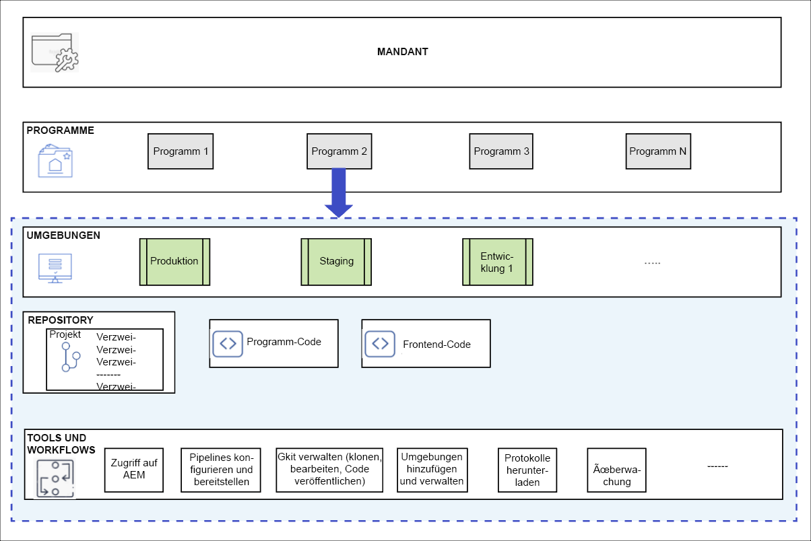
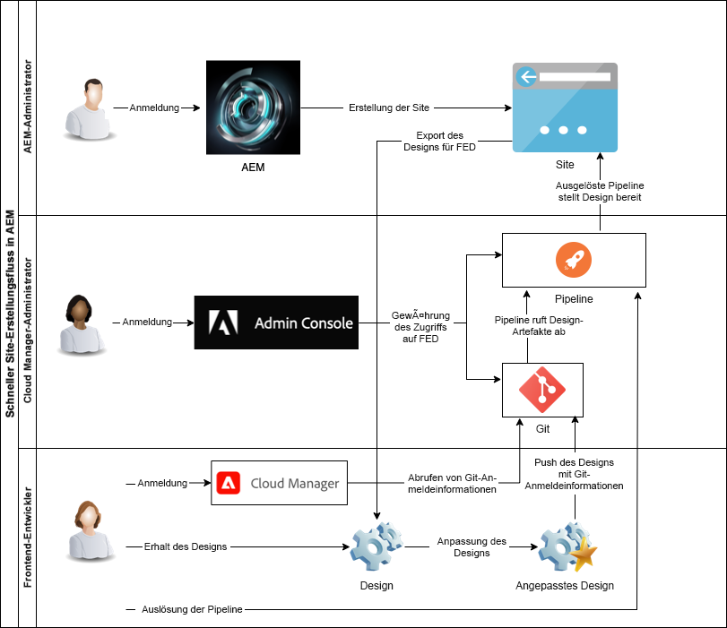

# Grundlegendes zu Cloud Manager und dem Workflow von Quick Site Creation {#understand-cloud-manager}

Erfahren Sie mehr über Cloud Manager und sie Verbindung zum neuen Prozess von Quick Site Creation.

>[!TIP]
>
>Wenn es sich bei Ihrer Rolle ausschließlich um Frontend-Entwicklung handelt, können Sie in dieser Tour zum Artikel [Abrufen von Git-Repository-Zugriffsinformationen](retrieve-access.md) springen.
>
>Wenn Sie AEM-Administrator, Cloud Manager-Administrator, für die Frontend-Entwicklungs- und Administratoraufgaben verantwortlich sind oder einfach den End-to-End-Prozess für die Frontend-Entwicklung in AEM verstehen möchten, lesen Sie das aktuelle Dokument weiter und fahren Sie mit dieser Tour fort.

## Ziel {#objective}

In diesem Dokument erfahren Sie, wie das Tool AEM Quick Site Creation funktioniert, und erhalten einen Überblick über den gesamten End-to-End-Prozess. Nach dem Lesen sollten Sie:

* Wissen, wie AEM Sites und Cloud Manager zusammenarbeiten, um die Frontend-Entwicklung zu erleichtern.
* Erfahren haben, dass der Frontend-Anpassungsschritt vollständig von AEM entkoppelt ist und keine AEM-Kenntnisse erfordert.

Dieses Dokument behandelt vorrangig die grundlegenden Bestandteile für die schnelle Site-Erstellung. Im nächsten Schritt der Tour beginnen Sie mit der Konfiguration.

Es wird empfohlen, diese Tour Schritt für Schritt durchzuführen. Wenn Sie aber bereits wissen, dass AEM Sites und Cloud Manager zusammenarbeiten, und Sie direkt mit der Konfiguration beginnen möchten, können Sie [zum nächsten Schritt der Tour springen](create-site.md).

## Verantwortliche Rolle {#responsible-role}

Dieser Teil der Tour richtet sich sowohl an den AEM-Administrator als auch an den Cloud Manager-Administrator.

## Anforderungen und Voraussetzungen {#requirements-prerequisites}

Es gibt mehrere Anforderungen, die erfüllt werden müssen, bevor Sie mit dem Tool Quick Site Creation Sites erstellen und anpassen können.

Da diese Tour sowohl für Frontend-Entwickler als auch für Administratoren und Kombinationen beider Rollen gedacht ist, sind die Anforderungen für beide hier aufgeführt.

Hierbei muss hervorgehoben werden, dass für Frontend-Entwickler kein AEM-Zugriff oder -Wissen erforderlich ist.

### Kenntnisse {#knowledge}

| Kenntnisse | Rolle |
|---|---|
| Grundlegendes zu den Standard-Tools und -prozessen der Frontend-Entwicklung | Frontend-Entwickler |
| Grundlegende Kenntnisse der Erstellung und Verwaltung von Sites in AEM | AEM-Administrator |
| Grundlegende Kenntnisse zu Cloud Manager | Cloud Manager-Administrator |

Für Frontend-Entwickler ist kein AEM-Wissen erforderlich.

### Tools {#tools}

| Tool | Rolle |
|---|---|
| Bevorzugte Frontend-Entwicklungsumgebung | Frontend-Entwickler |
| npm | Frontend-Entwickler |
| Webpack | Frontend-Entwickler |
| Zugriff auf Cloud Manager | Cloud Manager-Administrator |
| Mitglied der Rolle **Geschäftsinhaber** in Cloud Manager | Cloud Manager-Administrator |
| System-Administrator in Cloud Manager | Cloud Manager-Administrator |
| Zugang zur Admin Console | Cloud Manager-Administrator |
| Mitglied der Rolle **Bereitstellungs-Manager** in Cloud Manager | Cloud Manager-Administrator |
| Mitglied der Rolle **Bereitstellungs-Manager** in Cloud Manager | Frontend-Entwickler |

Für Frontend-Entwickler ist keine Verwendung von AEM erforderlich.

>[!TIP]
>
>Wenn Sie nicht mit Cloud Manager-Rollen und Rollenverwaltung vertraut sind, finden Sie weitere Informationen im Dokument „Rollenbasierte Berechtigungen“ im Abschnitt [Zusätzliche Ressourcen](#additional-resources).

## Cloud Manager {#cloud-manager}

Cloud Manager ist eine wesentliche Komponente von AEM as a Cloud Service und dient als zentraler Einstiegspunkt für die Plattform.

Um Kunden mit Unternehmens-Entwicklungs-Setups zu unterstützen, ist AEM as a Cloud Service vollständig mit Cloud Manager und den speziell dafür vorgesehenen CI/CD-Pipelines integriert. Das Werkzeug zur Schnellerstellung von Sites erweitert diese Funktionen, um spezielle Frontend-Entwicklungs-Pipelines zu unterstützen.

Für diese Journey sind keine vollständigen Kenntnisse zu Cloud Manager erforderlich. Grob gefasst, besteht Cloud Manager aus mehreren Strukturebenen.

* **MANDANT**: Jeder Kunde hat einen Mandanten.
* **PROGRAMME**: Jeder Mandant verfügt über ein oder mehrere Programme, die häufig die lizenzierten Lösungen des Kunden widerspiegeln.
* **UMGEBUNGEN**: Jedes Programm verfügt über mehrere Umgebungen, z. B. die Produktion für Live-Inhalte, eine für Staging und eine für Entwicklungszwecke.
* **REPOSITORY**: Die Umgebungen verfügen über Git-Repositorys, in denen Programm- und Frontend-Code verwaltet werden.
* **TOOLS UND WORKFLOWS**: Pipelines verwalten die Bereitstellung von Code aus den Repositorys in den Umgebungen.

Oft ist ein Beispiel hilfreich, um diese Hierarchie zu kontextualisieren.

* WKND Travel and Adventure Enterprises könnte ein **Mandant** sein, der sich auf Medien zum Thema Reisen konzentriert.
* Der Mandant WKND Travel and Adventure Enterprises könnte über zwei **Programme** verfügen: ein Sites-Programm für WKND Magazine und ein Assets-Programm für WKND Media.
* Die Programme WKND Magazine und WKND Media hätten beide Entwicklungs-, Staging- und Produktions-**Umgebungen**.

## Der Frontend-Entwicklungs-Fluss zu Quick Site Creation {#flow}

Der Gesamtfluss ist einfach und intuitiv, auch wenn Sie noch keine umfassende Erfahrung mit Cloud Manager haben.

1. Der AEM-Administrator meldet sich für eine AEM-Umgebung an und erstellt mithilfe einer Site-Vorlage eine neue Site.
1. Der Cloud Manager-Administrator erstellt in Cloud Manager eine Frontend-Pipeline. Die Pipeline koordiniert die Bereitstellung von Code aus einem Git-Repository in einer AEM-Umgebung.
1. Der AEM-Administrator exportiert das Site-Design aus der AEM-Instanz des Programms und stellt es dem Frontend-Entwickler bereit.
1. Der Cloud Manager-Administrator gewährt dem Frontend-Entwickler Zugriff auf das AEM-Git-Repository, in dem Anpassungen vorgenommen werden können.
1. Der Frontend-Entwickler ruft Zugriffsberechtigungen ab, um auf Git und die Pipeline zuzugreifen.
1. Der Frontend-Entwickler passt das Design an, testet es mithilfe eines Proxys mit tatsächlichem Inhalt von der Site und sendet die Änderungen an das Git-Repository.
1. Der Frontend-Entwickler führt die Pipeline aus, um die Design-Anpassungen in der Produktionsumgebung des Programms bereitzustellen.

Der Hauptvorteil der Verwendung des Tools Quick Site Creation besteht darin, dass der reine Frontend-Entwickler nur für die tatsächliche Anpassung verantwortlich ist. Der Frontend-Entwickler hat keine Interaktion mit AEM und benötigt keine Kenntnisse von AEM.

{{add-cm-allowlist-frontend-pipeline}}

## Wie geht es weiter {#what-is-next}

Nachdem Sie nun diesen Teil der AEM-Journey zur schnellen Site-Erstellung abgeschlossen haben, sollten Sie:

* Wissen, wie AEM Sites und Cloud Manager zusammenarbeiten, um die Frontend-Entwicklung zu erleichtern.
* Erfahren haben, dass der Frontend-Anpassungsschritt vollständig von AEM entkoppelt ist und keine AEM-Kenntnisse erfordert.

Bauen Sie auf diesem Wissen auf und fahren Sie mit der Tour zur schnellen AEM-Site-Erstellung fort, indem Sie als Nächstes das Dokument [Erstellen einer Site aus einer Vorlage](create-site.md) durchgehen, in dem Sie lernen, wie Sie eine neue AEM-Site mithilfe einer Vorlage schnell erstellen können.

## Zusätzliche Ressourcen {#additional-resources}

Es wird zwar empfohlen, mit dem nächsten Teil der Tour zu Quick Site Creation fortzufahren, indem Sie das Dokument [Erstellen einer Site aus einer Vorlage](create-site.md) durchgehen, Sie finden aber im Folgenden noch einige zusätzliche, optionale Ressourcen, die einige der in diesem Dokument erwähnten Konzepte vertiefen. Diese sind jedoch nicht zwingend erforderlich, um mit der Tour fortzufahren.

* [Dokumentation zu Cloud Manager](https://experienceleague.adobe.com/docs/experience-manager-cloud-service/content/onboarding/onboarding-concepts/cloud-manager-introduction.html?lang=de): Wenn Sie an weiteren Details zu den Funktionen von Cloud Manager interessiert sind, sollten Sie sich die ausführlichen technischen Dokumente direkt ansehen.
* [Rollenbasierte Berechtigungen](https://experienceleague.adobe.com/docs/experience-manager-cloud-manager/using/requirements/role-based-permissions.html?lang=de): Cloud Manager verfügt über vorkonfigurierte Rollen mit entsprechenden Berechtigungen. Weitere Informationen zu diesen Rollen und deren Verwaltung finden Sie in diesem Dokument.
* [npm](https://www.npmjs.com): AEM-Designs, die zum schnellen Erstellen von Sites verwendet werden, basieren auf npm.
* [webpack](https://webpack.js.org): AEM-Designs, die zum schnellen Erstellen von Sites verwendet werden, verwenden webpack.
