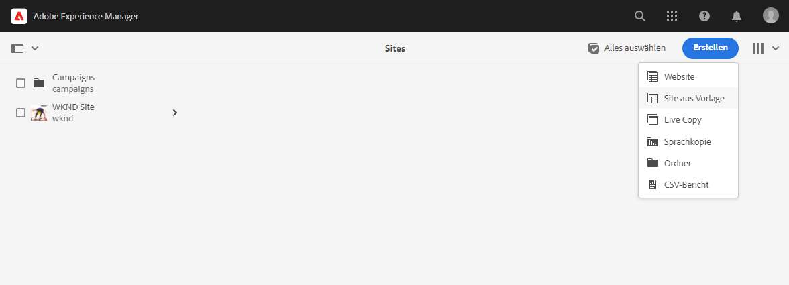
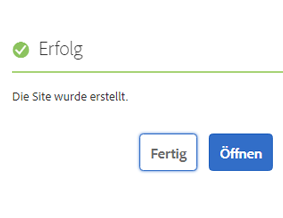
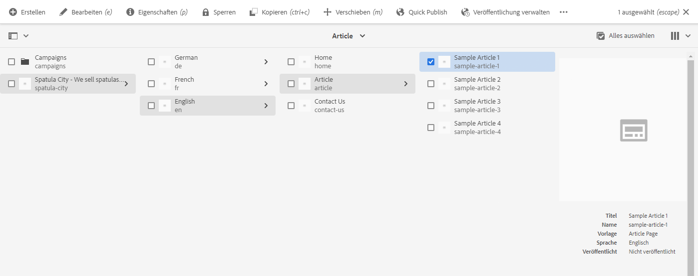
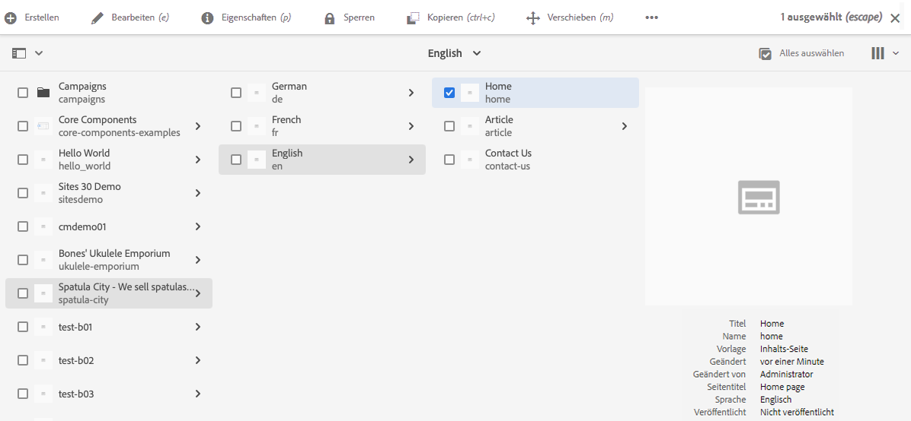
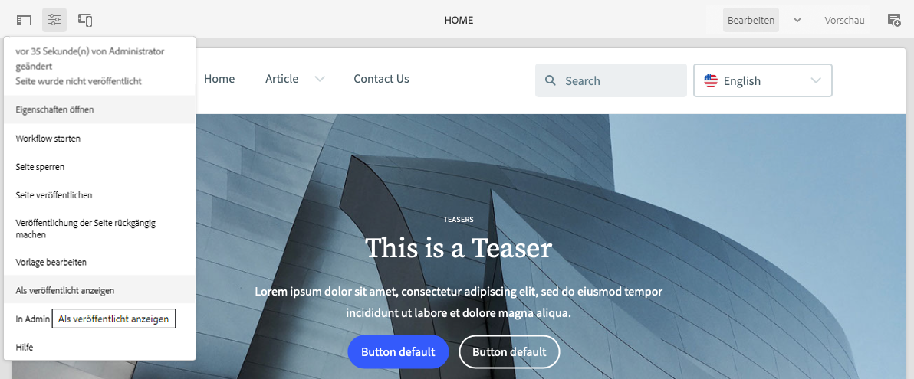
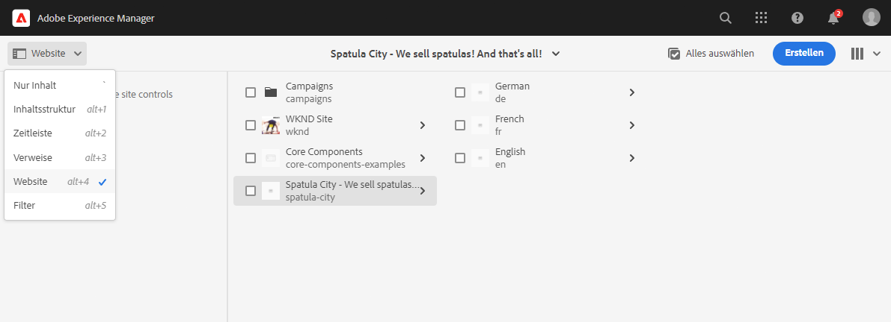
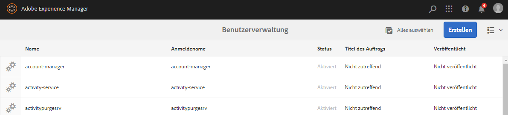
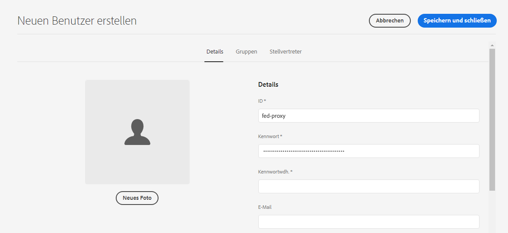
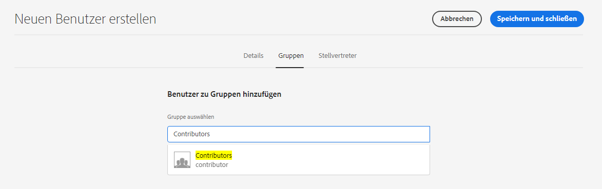

# Erstellen einer Site aus einer Vorlage {#create-site-from-template}

{{traditional-aem}}

Erfahren Sie, wie Sie mithilfe einer Site-Vorlage schnell eine neue AEM-Site erstellen können.

## Ihre bisherige Tour {#story-so-far}

Im vorherigen Dokument der AEM-Journey zur schnellen Site-Erstellung, [Grundlegendes zu Cloud Manager und zum Workflow für die schnelle Site-Erstellung](cloud-manager.md), haben Sie sich mit Cloud Manager vertraut gemacht und erfahren, wie sich der Prozess zur schnellen Site-Erstellung zusammensetzt. Sie sollten jetzt:

* Wissen, wie AEM Sites und Cloud Manager zusammenarbeiten, um die Frontend-Entwicklung zu erleichtern.
* Erfahren haben, dass der Frontend-Anpassungsschritt vollständig von AEM entkoppelt ist und keine AEM-Kenntnisse erfordert.

Dieser Artikel baut auf diesen Grundlagen auf. Sie können also den ersten Konfigurationsschritt durchführen und eine Site für eine Vorlage erstellen, die Sie später mithilfe von Frontend-Tools anpassen können.

## Ziel {#objective}

In diesem Dokument erfahren Sie, wie Sie mithilfe einer Site-Vorlage schnell eine AEM-Site erstellen können. Nach dem Lesen sollten Sie:

* wissen, wie Sie AEM-Site-Vorlagen abrufen,
* Wissen, wie Sie mit einer Vorlage eine neue Site erstellen.
* Erfahren haben, wie Sie die Vorlage von Ihrer neuen Site herunterladen, um sie für die Frontend-Entwicklung bereitzustellen.

## Verantwortliche Rolle {#responsible-role}

Dieser Teil der Journey gilt für den AEM-Administrator.

## Site-Vorlagen {#site-templates}

Site-Vorlagen bieten die Möglichkeit, grundlegende Site-Inhalte in einem handlichen und wiederverwendbaren Paket zu kombinieren. Site-Vorlagen enthalten in der Regel grundlegende Site-Inhalte und -Struktur sowie Site-Styling-Informationen, um neue Sites schnell live schalten zu können. Die eigentliche Struktur sieht wie folgt aus:

* `files`: Ordner mit dem Benutzeroberflächen-Kit, der XD-Datei und möglicherweise anderen Dateien
* `previews`: Ordner mit Screenshots der Site-Vorlage
* `site`: Inhaltspaket der Inhalte, die für jede aus dieser Vorlage erstellte Site kopiert werden, z. B. Seitenvorlagen und Seiten.
* `theme`: Quellen des Vorlagen-Designs, um das Aussehen der Site zu ändern, einschließlich CSS und JavaScript.

Vorlagen sind leistungsstark, da sie wiederverwendbar sind, sodass Ihre Inhaltsautoren schnell eine Site erstellen können. Und da Sie in Ihrer AEM-Installation mehrere Vorlagen zur Verfügung haben können, können Sie flexibel verschiedene geschäftliche Anforderungen erfüllen.

>[!NOTE]
>
>Die Site-Vorlage darf nicht mit Seitenvorlagen verwechselt werden. Die hier beschriebenen Site-Vorlagen definieren die Gesamtstruktur einer Site. Eine Seitenvorlage definiert die Struktur und den anfänglichen Inhalt einer einzelnen Seite.

## Abrufen einer Site-Vorlage {#obtaining-template}

Am einfachsten beginnen Sie, indem Sie [die neueste Version der AEM-Standard-Site-Vorlage aus dem GitHub-Repository herunterladen](https://github.com/adobe/aem-site-template-standard/releases).

Nach dem Herunterladen können Sie sie wie jedes andere Paket in Ihre AEM-Umgebung hochladen. Im Abschnitt [Zusätzliche Ressourcen](#additional-resources) finden Sie Details zur Arbeit mit Paketen, wenn Sie weitere Informationen zu diesem Thema benötigen.

>[!TIP]
>
>Die AEM-Standard-Site-Vorlage kann an die Anforderungen Ihres Projekts angepasst werden und die Notwendigkeit weiterer Anpassungen vermeiden. Dies sprengt jedoch den Rahmen dieser Journey. Weitere Informationen finden Sie in der GitHub-Dokumentation zur Standard-Site-Vorlage.

>[!TIP]
>
>Sie können die Vorlage auch als Teil Ihres Projekt-Workflows aus der Quelle erstellen. Dies sprengt jedoch den Rahmen dieser Journey. Weitere Informationen finden Sie in der GitHub-Dokumentation zur Standard-Site-Vorlage.

## Installieren einer Site-Vorlage {#installing-template}

Die Verwendung einer Vorlage zum Erstellen einer Site ist einfach.

1. Melden Sie sich bei Ihrer AEM-Authoring-Umgebung an und navigieren Sie zur Sites-Konsole

   * `https://<your-author-environment>.adobeaemcloud.com/sites.html/content`

1. Wählen Sie oben rechts im Bildschirm die Option **Erstellen** und dann aus dem Dropdown-Menü die Option **Site aus Vorlage** aus.

   

1. Wählen Sie im Assistenten zum Erstellen von Sites oben in der linken Spalte **Importieren** aus.

   

1. Suchen Sie im Datei-Browser nach der Vorlage, [die Sie zuvor heruntergeladen haben](#obtaining-template), und wählen Sie **Hochladen** aus.

1. Nach dem Hochladen wird sie in der Liste der verfügbaren Vorlagen angezeigt. Wählen Sie sie aus (dadurch werden auch Informationen über die Vorlage in der rechten Spalte angezeigt), und wählen Sie dann **Weiter** aus.

   

1. Geben Sie einen Titel für die Site ein. Der Name der Site kann angegeben oder aus dem Titel generiert werden, falls er weggelassen wird.

   * Der Titel der Site wird in der Titelleiste des Browsers angezeigt.
   * Der Site-Name wird Teil der URL.

1. Wählen Sie **Erstellen** aus. Die neue Site wird aus der Site-Vorlage erstellt.

   

1. Wählen Sie im angezeigten Bestätigungsdialogfeld **Fertig** aus.

   

1. In der Sites-Konsole sind die neuen Sites sichtbar und in ihnen kann navigiert werden, um die von der Vorlage definierte grundlegende Struktur zu untersuchen.

   

Inhaltsautoren können jetzt mit der Bearbeitung beginnen.

## Ist eine weitere Anpassung erforderlich? {#customization-required}

Site-Vorlagen sind sehr leistungsstark und flexibel und können in beliebiger Anzahl für ein Projekt erstellt werden, was eine einfache Erstellung von Site-Varianten ermöglicht. Je nachdem, welcher Grad von Anpassungen bereits an der von Ihnen verwendeten Site-Vorlage vorgenommen wurde, müssen Sie möglicherweise nicht einmal zusätzliche Front-End-Anpassungen vornehmen.

* Wenn Ihre Site keine zusätzliche Anpassung erfordert, haben Sie es geschafft. Ihre Journey endet hier!
* Wenn Sie noch weitere Anpassungen am Frontend benötigen, oder wenn Sie einfach den gesamten Prozess verstehen wollen, falls Sie zukünftige Anpassungen benötigen, lesen Sie weiter.

## Beispielseite {#example-page}

Wenn Sie eine zusätzliche Front-End-Anpassung benötigen, sollten Sie beachten, dass der Front-End-Entwickler möglicherweise nicht mit den Details Ihres Inhalts vertraut ist. Daher ist es empfehlenswert, dem Entwickler einen Pfad zu typischen Inhalten zur Verfügung zu stellen, die als Referenz verwendet werden können, wenn das Design angepasst wird. Ein typisches Beispiel ist die Startseite für die primäre Sprache der Site.

1. Navigieren Sie im Site-Browser zur Startseite der primären Sprache der Site, wählen Sie anschließend die Seite aus und wählen Sie dann in der Menüleiste **Bearbeiten** aus.

   

1. Wählen Sie im Editor in der Symbolleiste die Schaltfläche **Seiteninformationen** und dann **Als veröffentlicht anzeigen**.

   

1. Kopieren Sie in der sich öffnenden Registerkarte den Pfad des Inhalts aus der Adressleiste.  Er sieht in etwa so aus: `/content/<your-site>/en/home.html?wcmmode=disabled`. 

   

1. Speichern Sie den Pfad, um ihn später dem Front-End-Entwickler bereitzustellen.

## Herunterladen des Designs {#download-theme}

Nachdem die Site erstellt wurde, kann das von der Vorlage generierte Design der Site heruntergeladen und dem Front-End-Entwickler zur Anpassung bereitgestellt werden.

1. Zeigen Sie in der Sites-Konsole auf die **Site**-Leiste.

   

1. Wählen Sie den Stamm Ihrer neuen Site und anschließend **Design-Quellen herunterladen** in der Site-Leiste aus.

   

Sie haben jetzt eine Kopie der Quelldateien des Designs in Ihren Download-Dateien.

## Einrichten des Proxy-Benutzers {#proxy-user}

Damit der Front-End-Entwickler die Anpassungen anhand des tatsächlichen AEM-Inhalts von Ihrer Site in der Vorschau anzeigen kann, müssen Sie einen Proxy-Benutzer einrichten.

1. Navigieren Sie in der Hauptnavigation in AEM zu **Tools** > **Sicherheit** > **Benutzer**.
1. Wählen Sie in der User Management-Konsole die Option **Erstellen** aus.

   
1. Im Fenster **Neuen Benutzer erstellen** müssen Sie mindestens Folgendes angeben:
   * **ID** – Notieren Sie sich diesen Wert, da Sie ihn dem Front-End-Entwickler bereitstellen müssen.
   * **Passwort** – Speichern Sie diesen Wert sicher in einem Passwort-Vault, da Sie ihn dem Front-End-Entwickler bereitstellen müssen.

   

1. Fügen Sie auf der Registerkarte **Gruppen** den Proxy-Benutzer zur Gruppe `contributors` hinzu.
   * Durch die Eingabe des Begriffs `contributors` wird in AEM die Funktion zur automatischen Vervollständigung ausgelöst, damit die Gruppe leicht ausgewählt werden kann.

   

1. Wählen Sie **Speichern und schließen**.

Sie haben die Konfiguration abgeschlossen. Inhaltsautoren können jetzt mit der Erstellung von Inhalten auf der Site beginnen. Die Vorbereitung für die Front-End-Anpassung beginnt im nächsten Schritt der Journey.

## So geht es weiter {#what-is-next}

Nachdem Sie nun diesen Teil der AEM-Journey zur schnellen Site-Erstellung abgeschlossen haben, sollten Sie:

* wissen, wie Sie AEM-Site-Vorlagen abrufen,
* Wissen, wie Sie mit einer Vorlage eine neue Site erstellen.
* Erfahren haben, wie Sie die Vorlage von Ihrer neuen Site herunterladen, um sie für die Frontend-Entwicklung bereitzustellen.

Fahren Sie aufbauend auf diesen Kenntnissen mit der AEM-Tour zur schnellen Site-Erstellung fort, indem Sie als Nächstes das Dokument [Einrichten der Pipeline](pipeline-setup.md) lesen. Darin erfahren Sie, wie Sie eine Frontend-Pipeline erstellen, um die Anpassung des Designs Ihrer Site zu steuern.

## Zusätzliche Ressourcen {#additional-resources}

Es wird zwar empfohlen, mit dem nächsten Teil der Tour zur schnellen Site-Erstellung fortzufahren, indem Sie das Dokument [Einrichten der Pipeline](pipeline-setup.md) lesen. Im Folgenden finden Sie jedoch einige zusätzliche optionale Ressourcen, die einige in diesem Dokument erwähnte Konzepte vertiefen, die aber nicht erforderlich sind, um die Tour fortzusetzen.

* [AEM-Standard-Site-Vorlage](https://github.com/adobe/aem-site-template-standard) – Dies ist das GitHub-Repository der AEM-Standard-Site-Vorlage.
* [Organisieren von Seiten](/help/sites-cloud/authoring/sites-console/organizing-pages.md) – In dieser Anleitung wird beschrieben, wie Sie die Seiten Ihrer AEM-Site organisieren.
* [Erstellen von Seiten](/help/sites-cloud/authoring/sites-console/creating-pages.md) – In dieser Anleitung wird beschrieben, wie Sie neue Seiten zu Ihrer Site hinzufügen.
* [Verwalten von Seiten](/help/sites-cloud/authoring/sites-console/managing-pages.md) – In dieser Anleitung wird beschrieben, wie Sie die Seiten Ihrer Site verwalten, einschließlich Verschieben, Kopieren und Löschen.
* [Arbeiten mit Paketen](/help/implementing/developing/tools/package-manager.md) – Pakete ermöglichen den Import und Export von Repository-Inhalten. In diesem Dokument wird erläutert, wie Sie mit Paketen in AEM 6.5 arbeiten. Dies gilt auch für AEMaaCS.
* [Dokumentation zur Site-Administration](/help/sites-cloud/administering/site-creation/create-site.md) – Weitere Informationen zu den Funktionen des Tools für die schnelle Site-Erstellung finden Sie in den technischen Dokumenten zur Site-Erstellung.
* [Erstellen oder Hinzufügen von Formularen zu einer AEM Sites-Seite](/help/forms/create-or-add-an-adaptive-form-to-aem-sites-page.md): Lernen Sie Schritt für Schritt Techniken und Best Practices für die Integration von Formularen in Ihre Website kennen und optimieren Sie Ihre digitalen Erlebnisse für eine maximale Wirkung.
