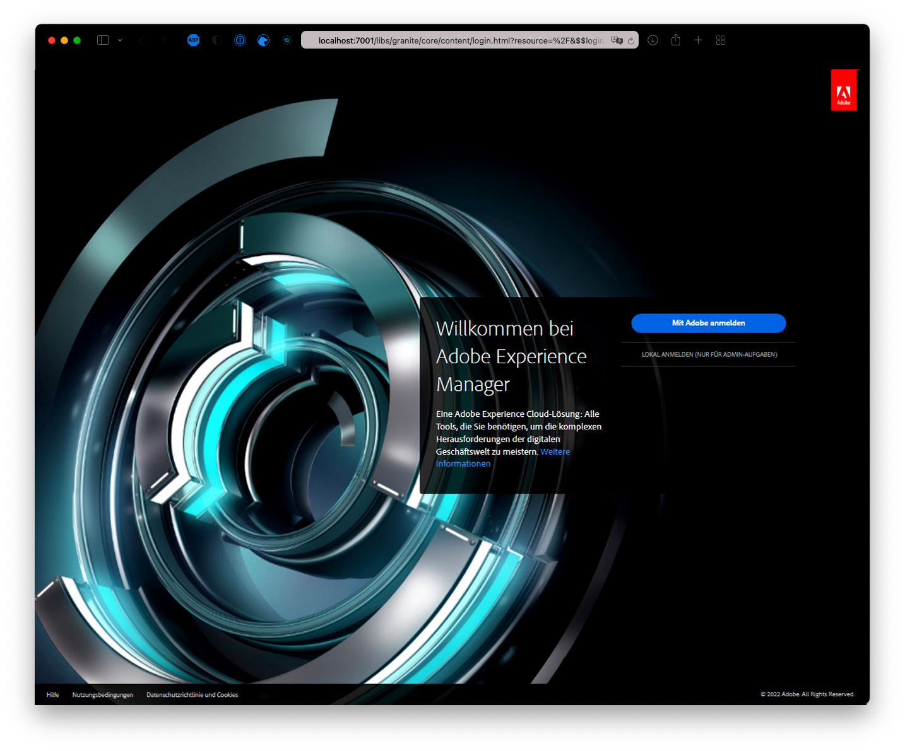
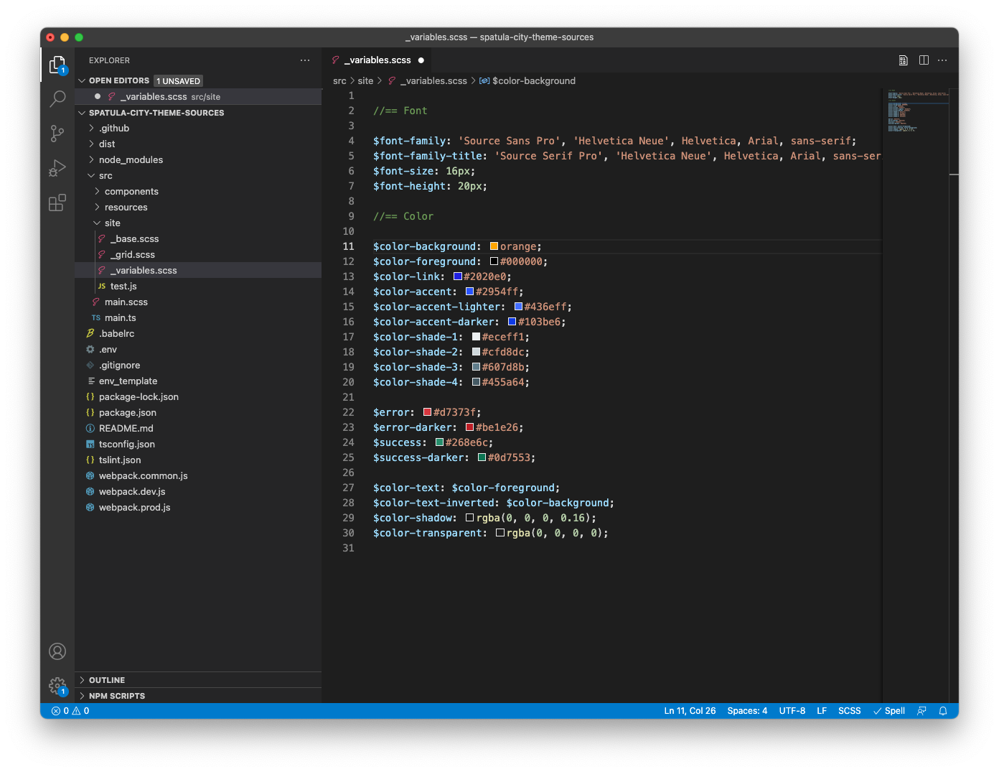

# Anpassen des Site-Designs {#customize-the-site-theme}

{{traditional-aem}}

Erfahren Sie, wie das Site-Design erstellt wird, wie Sie es anpassen und wie Sie es mit AEM-Live-Inhalten testen können.

## Ihre bisherige Tour {#story-so-far}

Im vorherigen Dokument der Tour zur schnellen AEM-Site-Erstellung, [Abrufen von Zugriffsinformationen zum Git-Repository](retrieve-access.md), haben Sie gelernt, wie Frontend-Entwickelnde Cloud Manager benutzen, um auf Git-Repository-Informationen zuzugreifen. Jetzt sollten Sie:

* Erfahren Sie ganz allgemein, was Cloud Manager ist.
* Rufen Sie Ihre Anmeldeinformationen ab, um auf AEM-Git zuzugreifen, damit Sie Ihre Anpassungen übernehmen können.

Dieser Teil der Tour geht einen Schritt weiter und konzentriert sich auf das Site-Design und zeigt Ihnen, wie Sie dieses anpassen und diese Anpassungen dann mit den von Ihnen abgerufenen Zugriffsdaten bestätigen.

## Ziel {#objective}

In diesem Dokument wird erläutert, wie das AEM-Site-Design erstellt wird, wie es angepasst wird und wie es mit AEM-Live-Inhalten getestet wird. Nach dem Lesen sollten Sie:

* Die grundlegende Struktur des Site-Designs und dessen Bearbeitung verstehen.
* Verstehen, wie Sie Ihre Design-Anpassungen mit echten AEM-Inhalten über einen lokalen Proxy testen können.
* Wissen, wie Sie Ihre Änderungen in das AEM Git-Repository übertragen.

## Verantwortliche Rolle {#responsible-role}

Dieser Teil der Journey gilt für Front-End-Entwickler.

## Die Grundlagen der Design-Struktur verstehen {#understand-theme}

Extrahieren Sie das vom AEM-Administrator bereitgestellte Design an die Stelle, an der Sie das Design bearbeiten möchten, und öffnen Sie Ihren bevorzugten Editor.


Sie sehen, dass das Design ein typisches Frontend-Projekt ist. Die wichtigsten Teile der Struktur sind:

* `src/main.ts`: Der Haupteinstiegspunkt Ihres JS- und CSS-Designs
* `src/site`: JS- und CSS-Dateien, die für die gesamte Site gelten
* `src/components`: JS- und CSS-Dateien, die für AEM-Komponenten spezifisch sind
* `src/resources`: Statische Dateien wie Symbole, Logos und Schriftarten

>[!TIP]
>
>Weitere Informationen zum standardmäßigen AEM-Site-Design finden Sie unter dem GitHub-Link im Abschnitt [Zusätzliche Ressourcen](#additional-resources) am Ende dieses Dokuments.

Sobald Sie sich mit der Struktur des Design-Projekts vertraut gemacht haben, starten Sie den lokalen Proxy, damit Sie alle Design-Anpassungen basierend auf dem tatsächlichen AEM-Inhalt in Echtzeit sehen können.

## Starten des lokalen Proxys {#starting-proxy}

1. Navigieren Sie in der Befehlszeile zum Stammverzeichnis des Designs auf Ihrem lokalen Computer.
1. Führen Sie `npm install` aus. npm ruft die Abhängigkeiten ab und installiert das Projekt.

   

1. Führen Sie `npm run live` aus. Der Proxy-Server wird gestartet.

   

1. Wenn der Proxy-Server gestartet wird, wird automatisch ein Browser mit `http://localhost:7001/` geöffnet. Wählen Sie **LOKAL ANMELDEN (NUR ADMINISTRATORAUFGABEN)** aus und melden Sie sich mit den von den AEM-Admins für Sie bereitgestellten Anmeldeinformationen einer Proxy-Benutzerin bzw. eines -Benutzers an.

   

   >[!TIP]
   >
   >Wenn Sie diese Anmeldeinformationen nicht haben, wenden Sie sich an Ihren Admin und verweisen Sie auf den [Abschnitt „Proxy-Benutzer einrichten“ des Artikels „Site aus Vorlage erstellen“](/help/journey-sites/quick-site/create-site.md#proxy-user) in dieser Journey.

1. Ändern Sie nach der Anmeldung die URL im Browser dahingehend, dass sie auf den Pfad zu den Beispielinhalten verweist, den der AEM-Administrator für Sie bereitgestellt hat.

   * Wenn der angegebene Pfad z. B. `/content/<your-site>/en/home.html?wcmmode=disabled` war
   * Würden Sie die URL zu `http://localhost:7001/content/<your-site>/en/home.html?wcmmode=disabled` ändern

   

Sie können auf der Site navigieren, um die Inhalte zu erkunden. Die Site wird live von der AEM-Live-Instanz abgerufen, damit Sie Ihre Design-Anpassungen an echten Inhalten vornehmen können.

## Anpassen des Designs {#customize-theme}

Jetzt können Sie mit der Anpassung des Designs beginnen. Im Folgenden finden Sie ein einfaches Beispiel, um zu veranschaulichen, wie Sie Ihre Änderungen live über den Proxy anzeigen können.

1. Öffnen Sie die Datei `<your-theme-sources>/src/site/_variables.scss` in Ihrem Editor

   

1. Bearbeiten Sie die Variable `$color-background` und legen Sie einen anderen Wert außer Weiß fest. In diesem Beispiel wird `orange` verwendet.

   

1. Wenn Sie die Datei speichern, sehen Sie, dass der Proxy-Server die Änderung über die Zeile `[Browsersync] File event [change]` erkennt.

   

1. Wenn Sie zum Browser des Proxy-Servers zurückkehren, ist die Änderung sofort sichtbar.

   

Sie können das Design weiterhin an die Anforderungen anpassen, die Sie vom AEM-Administrator erhalten haben.

## Bestätigen der Änderungen {#committing-changes}

Sobald Ihre Anpassungen abgeschlossen sind, können Sie diese im AEM-Git-Repository bestätigen. Zuerst müssen Sie das Repository auf Ihren lokalen Computer klonen.

1. Navigieren Sie über die Befehlszeile an die Stelle, an der Sie das Repository klonen möchten.
1. Führen Sie den Befehl aus, den Sie [zuvor aus Cloud Manager abgerufen haben](retrieve-access.md). Dieser sollte ähnlich wie `git clone https://git.cloudmanager.adobe.com/<my-org>/<my-program>/` sein. Verwenden Sie den Git-Benutzernamen und das Passwort, das [Sie im vorherigen Teil dieser Tour abgerufen haben](retrieve-access.md).

   

1. Verschieben Sie das Design-Projekt, das Sie bearbeitet haben, mit einem Befehl, der `mv <site-theme-sources> <cloned-repo>` ähnelt, in das geklonte Repository.
1. Im Verzeichnis des geklonten Repository bestätigen Sie mit den folgenden Befehlen die Design-Dateien, die Sie gerade hierhin verschoben haben.

   ```text
   git add .
   git commit -m "Adding theme sources"
   git push
   ```

1. Die Anpassungen werden an das AEM-Git-Repository gepusht.

   

Ihre Anpassungen werden jetzt sicher im AEM-Git-Repository gespeichert.

## So geht es weiter {#what-is-next}

Nachdem Sie nun diesen Teil der AEM-Journey zur schnellen Site-Erstellung abgeschlossen haben, sollten Sie:

* Die grundlegende Struktur des Site-Designs und dessen Bearbeitung verstehen.
* Verstehen, wie Sie Ihre Design-Anpassungen mit echten AEM-Inhalten über einen lokalen Proxy testen können.
* Wissen, wie Sie Ihre Änderungen in das AEM Git-Repository übertragen.

Bauen Sie auf diesem Wissen auf und fahren Sie mit der Tour zur schnellen AEM-Site-Erstellung fort, indem Sie das Dokument [Bereitstellen eines benutzerdefinierten Designs](deploy-theme.md) durchgehen. Darin erfahren Sie, wie Sie das Design mithilfe der Frontend-Pipeline bereitstellen.

## Zusätzliche Ressourcen {#additional-resources}

Es wird zwar empfohlen, mit dem nächsten Teil der Tour zur schnellen Site-Erstellung fortzufahren, indem Sie das Dokument [Bereitstellen eines benutzerdefinierten Designs](deploy-theme.md) lesen. Im Folgenden finden Sie jedoch einige zusätzliche optionale Ressourcen, die einige der in diesem Dokument erwähnten Konzepte vertiefen, aber nicht erforderlich sind, um die Tour fortzusetzen.

* [AEM-Site-Design](https://github.com/adobe/aem-site-template-standard-theme-e2e) - Dies ist das GitHub-Repository des AEM-Site-Designs.
* [npm](https://www.npmjs.com) - AEM-Designs, die zum schnellen Erstellen von Sites verwendet werden, die auf nmp basieren.
* [webpack](https://webpack.js.org): AEM-Designs, die zum schnellen Erstellen von Sites verwendet werden, verwenden webpack.
