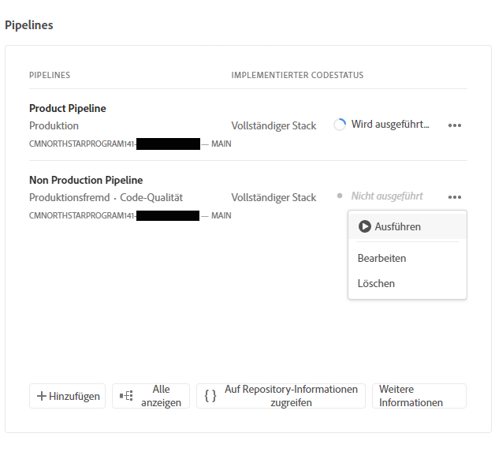
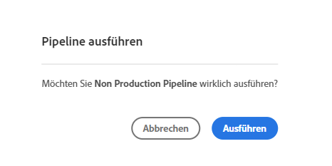
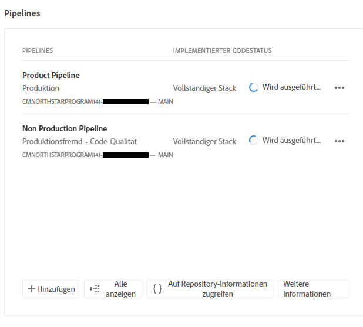
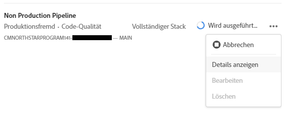
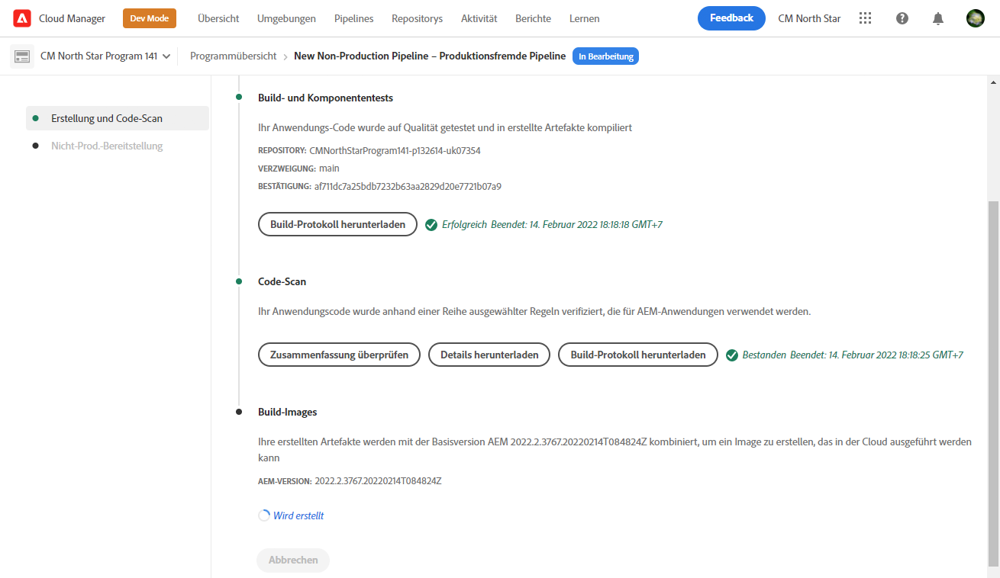
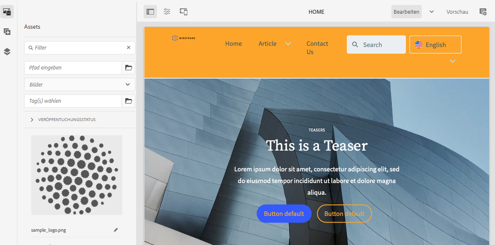

# Bereitstellen Ihres benutzerdefinierten Designs {#deploy-your-customized-theme}

Erfahren Sie, wie Sie das Site-Design mithilfe der Pipeline bereitstellen.

## Die bisherige Entwicklung {#story-so-far}

Im vorherigen Dokument der AEM Schnellsite-Journey [Anpassen des Site-Designs,](customize-theme.md) Sie haben gelernt, wie das Design erstellt wird, wie es angepasst wird und wie es mithilfe von Live-AEM-Inhalten getestet wird. Nun sollten Sie:

* Machen Sie sich mit der grundlegenden Struktur des Site-Designs und dessen Bearbeitung vertraut.
* Erfahren Sie, wie Sie Ihre Designanpassungen mit echten AEM über einen lokalen Proxy testen können.
* Erfahren Sie, wie Sie Ihre Änderungen in das AEM Git-Repository übertragen.

Sie können jetzt den letzten Schritt ausführen und die Pipeline verwenden, um sie bereitzustellen.

## Ziel {#objective}

In diesem Dokument wird erläutert, wie Sie das Design mithilfe der Pipeline bereitstellen. Nach dem Lesen sollten Sie:

* Erfahren Sie, wie Sie eine Pipeline-Bereitstellung Trigger haben.
* Erfahren Sie, wie Sie den Bereitstellungsstatus überprüfen.

## Verantwortliche Rolle {#responsible-role}

Dieser Teil der Journey gilt für den Frontend-Entwickler.

## Kann die Pipeline starten {#start-pipeline}

Nachdem Sie die Designanpassung an das AEM Git-Repository vorgenommen haben, können Sie [die vom Administrator erstellte Pipeline](pipeline-setup.md) um die Änderungen bereitzustellen.

1. Anmelden bei Cloud Manager [wie beim Abrufen Ihrer Git-Zugriffsinformationen](retrieve-access.md) Und greifen Sie auf Ihr Programm zu. Im **Übersicht** Registerkarte sehen Sie eine Karte für **Pipelines**.

   

1. Tippen oder klicken Sie auf das Auslassungszeichen neben der Pipeline, die Sie starten müssen. Wählen Sie aus dem Dropdown-Menü **Ausführen**.

   

1. Im **Pipeline ausführen** Bestätigungsdialogfeld durch Tippen oder Klicken **Ja**.

   

1. In der Liste der Pipelines zeigt die Statusspalte an, dass die Pipeline jetzt ausgeführt wird.

   

## Überprüfen des Pipeline-Status {#pipeline-status}

Sie können den Status der Pipeline überprüfen, um die Details des Fortschritts zu sehen.

1. Tippen oder klicken Sie auf das Auslassungszeichen neben der Pipeline.

   

1. Das Pipeline-Detailfenster zeigt die Aufschlüsselung des Pipeline-Fortschritts an.

   

>[!TIP]
>
>Im Fenster der Pipeline-Details können Sie auf **Download-Protokoll** für jeden Schritt der Pipeline zum Debugging, wenn ein Schritt fehlschlagen sollte. Das Debuggen der Pipeline geht über den Rahmen dieses Journey hinaus. Die technischen Dokumente für Cloud Manager finden Sie im Abschnitt [Zusätzliche Ressourcen](#additional-resources) auf dieser Seite.

## Überprüfen der bereitgestellten Anpassungen {#view-customizations}

Sobald die Pipeline abgeschlossen ist, können Sie den Administrator informieren, die Änderungen zu validieren. Der Administrator wird dann:

1. Öffnen Sie die AEM Authoring-Umgebung.
1. Navigieren Sie zu [die vom Administrator zuvor erstellte Site.](create-site.md)
1. Bearbeiten Sie eine der Inhaltsseiten.
1. Siehe angewendete Änderungen.

## Tour beendet? {#end-of-journey}

Herzlichen Glückwunsch! Sie haben die AEM Schnellsite-Journey abgeschlossen! Sie sollten jetzt:

* Erfahren Sie, wie Cloud Manager und die Front-End-Pipeline bei der Verwaltung und Bereitstellung von Frontend-Anpassungen funktionieren.
* Erfahren Sie, wie Sie eine AEM Site basierend auf einer Vorlage erstellen und wie Sie das Site-Design herunterladen.
* So integrieren Sie einen Frontend-Entwickler, damit er auf das AEM Git-Repository zugreifen kann.
* So können Sie ein Design mit proximiertem AEM anpassen und testen und diese Änderungen an AEM Git übertragen.
* So stellen Sie die Frontend-Anpassung mithilfe der Pipeline bereit.

Sie können jetzt die Designs Ihrer eigenen AEM-Site anpassen. Bevor Sie jedoch mit der Erstellung verschiedener Workflows mit mehreren Frontend-Pipelines beginnen, lesen Sie das Dokument [Entwickeln von Sites mit der Frontend-Pipeline.](/help/implementing/developing/introduction/developing-with-front-end-pipelines.md) So können Sie die Front-End-Entwicklung optimal nutzen:

* Erhaltung einer einzigen Quelle der Wahrheit.
* Aufrechterhaltung einer Trennung der Belange.

AEM ist ein leistungsstarkes Tool und es gibt viele zusätzliche Optionen. Schauen Sie sich einige der zusätzlichen Ressourcen an, die im Abschnitt [Zusätzliche Ressourcen](#additional-resources) verfügbar sind, um mehr über die Funktionen zu erfahren, die Sie während dieser Tour gesehen haben.

## Zusätzliche Ressourcen {#additional-resources}

Im Folgenden finden Sie einige zusätzliche Ressourcen, die näher auf einige der in diesem Dokument erwähnten Konzepte eingehen.

* [Verwenden der Site-Leiste zum Verwalten Ihres Site-Designs](/help/sites-cloud/administering/site-creation/site-rail.md) - Erfahren Sie mehr über die leistungsstarken Funktionen der Seitenleiste, mit denen Sie Ihr Site-Design einfach anpassen und verwalten können, einschließlich des Herunterladens von Themenquellen und der Verwaltung von Designversionen.
* [AEM as a Cloud Service technische Dokumentation](https://experienceleague.adobe.com/docs/experience-manager-cloud-service.html?lang=de) - Wenn Sie bereits über ein festes Verständnis der AEM verfügen, können Sie die ausführlichen technischen Dokumente direkt konsultieren.
* [Dokumentation zu Cloud Manager](https://experienceleague.adobe.com/docs/experience-manager-cloud-service/onboarding/onboarding-concepts/cloud-manager-introduction.html) - Wenn Sie weitere Details zu den Funktionen von Cloud Manager wünschen, sollten Sie sich die ausführlichen technischen Dokumente direkt ansehen.
* [Rollenbasierte Berechtigungen](https://experienceleague.adobe.com/docs/experience-manager-cloud-manager/using/requirements/role-based-permissions.html) - Cloud Manager verfügt über vorkonfigurierte Rollen mit entsprechenden Berechtigungen. Weitere Informationen zu diesen Rollen und deren Verwaltung finden Sie in diesem Dokument .
* [Cloud Manager-Repositorys](/help/implementing/cloud-manager/managing-code/cloud-manager-repositories.md) - Weitere Informationen zum Einrichten und Verwalten von Git-Repositorys für Ihr AEMaaCS-Projekt finden Sie in diesem Dokument.
* [Konfigurieren der CI/CD-Pipeline - Cloud Services](/help/implementing/cloud-manager/configuring-pipelines/introduction-ci-cd-pipelines.md) - Weitere Informationen zum Einrichten von Pipelines, sowohl für den vollständigen Stapel als auch für das Frontend, finden Sie in diesem Dokument.
* [AEM Standard-Site-Vorlage](https://github.com/adobe/aem-site-template-standard) - Dies ist das GitHub-Repository der AEM Standard-Site-Vorlage.
* [AEM Site-Design](https://github.com/adobe/aem-site-template-standard-theme-e2e) - Dies ist das GitHub-Repository des AEM Site-Designs.
* [npm](https://www.npmjs.com) - AEM Designs, die zum schnellen Erstellen von Sites verwendet werden, basieren auf npm.
* [Webpack](https://webpack.js.org) - AEM Themen, die zum schnellen Erstellen von Sites verwendet werden, basieren auf Webpack.
* [Erstellen und Organisieren von Seiten](/help/sites-cloud/authoring/fundamentals/organizing-pages.md) - In diesem Handbuch wird beschrieben, wie Sie Seiten Ihrer AEM-Site verwalten, wenn Sie sie nach der Erstellung aus der Vorlage weiter anpassen möchten.
* [Arbeiten mit Paketen](/help/implementing/developing/tools/package-manager.md) - Pakete ermöglichen den Import und Export von Repository-Inhalten. In diesem Dokument wird erläutert, wie Sie mit Paketen in AEM 6.5 arbeiten, was auch für AEMaaCS gilt.
* [Onboarding-Journey](/help/journey-onboarding/home.md) - Dieses Handbuch dient als Ausgangspunkt, um sicherzustellen, dass Ihre Teams eingerichtet sind und Zugriff auf AEM as a Cloud Service haben.
* [Dokumentation zu Adobe Experience Manager Cloud Manager](https://experienceleague.adobe.com/docs/experience-manager-cloud-manager/using/introduction-to-cloud-manager.html?lang=de) - Vollständige Details zu den Funktionen finden Sie in der Dokumentation zu Cloud Manager .
* [Dokumentation zur Site-Verwaltung](/help/sites-cloud/administering/site-creation/create-site.md) - Weitere Informationen zu den Funktionen des Tools für die schnelle Site-Erstellung finden Sie in den technischen Dokumenten zur Site-Erstellung .
* [Entwickeln von Sites mit der Frontend-Pipeline](/help/implementing/developing/introduction/developing-with-front-end-pipelines.md) - In diesem Dokument werden einige Überlegungen beschrieben, die Sie beachten sollten, um das gesamte Potenzial des Front-End-Entwicklungsprozesses mithilfe der Front-End-Pipeline optimal zu nutzen.
