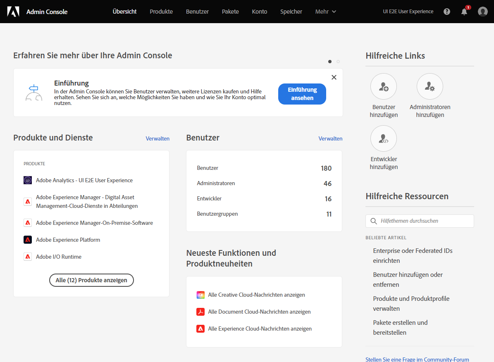
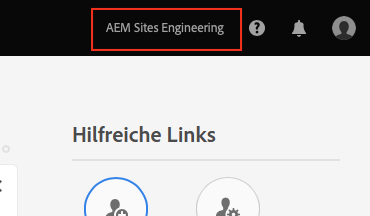
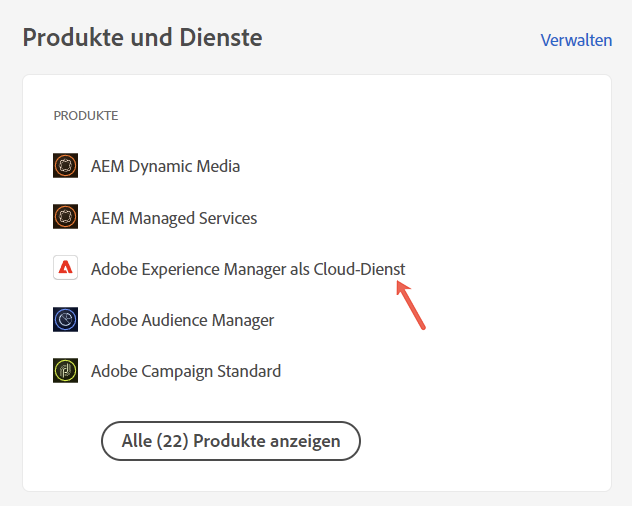
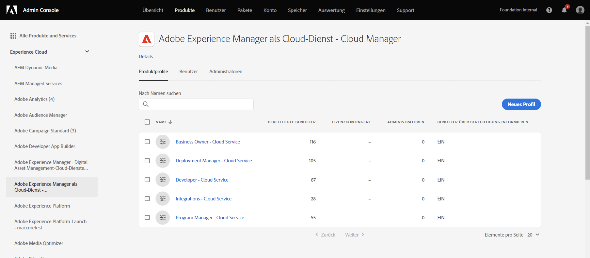
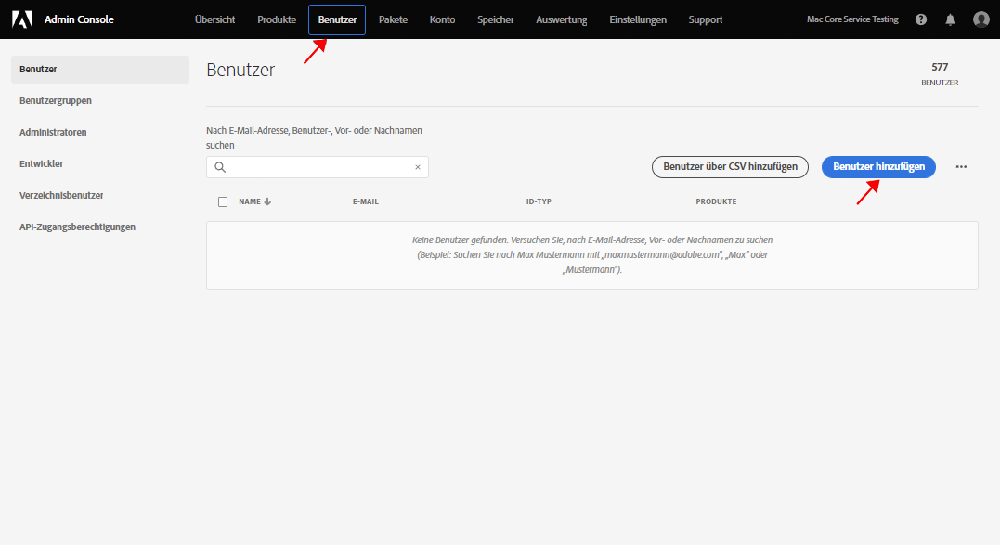
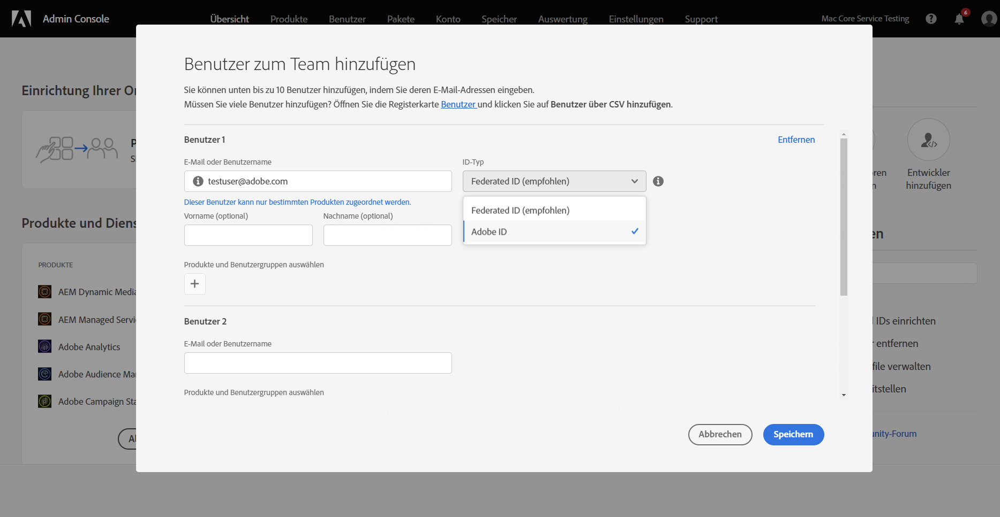
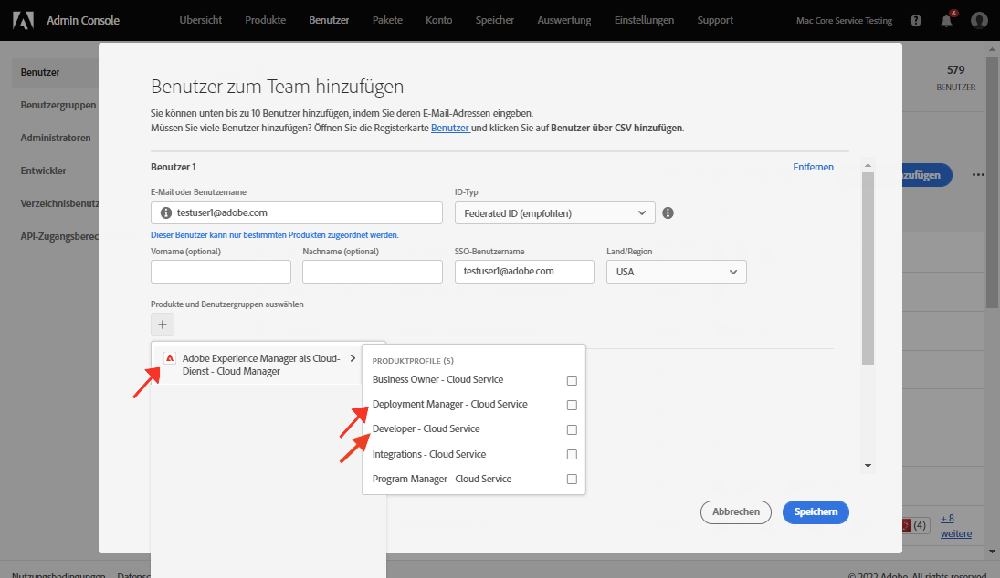

# Gewähren des Zugriffs für den Frontend-Entwickler {#grant-fed-access}

Integrieren Sie die Frontend-Entwickler in Cloud Manager, damit sie Zugriff auf das Git-Repository und die Pipeline der AEM-Site haben.

## Ihre bisherige Tour {#story-so-far}

Im vorherigen Dokument der Tour zur schnellen AEM-Site-Erstellung, [Einrichten der Pipeline](pipeline-setup.md), haben Sie gelernt, wie Sie eine Frontend-Pipeline erstellen, um die Anpassung des Designs Ihrer Site zu verwalten. Jetzt sollten Sie:

* Erfahren Sie, was eine Frontend-Pipeline ist.
* Erfahren Sie, wie Sie eine Frontend-Pipeline in Cloud Manager einrichten.

Sie müssen Ihrem Frontend-Entwickler jetzt über den Onboarding-Prozess Zugriff auf Cloud Manager gewähren, damit der Frontend-Entwickler auf das AEM-Git-Repository und die von Ihnen erstellte Pipeline zugreifen kann.

## Ziel {#objective}

Der Prozess zum Gewähren von Zugriff auf Cloud Manager und zum Zuweisen von Benutzerrollen zu Ihren Benutzern wird als Onboarding bezeichnet. In diesem Dokument erhalten Sie einen Überblick über die wichtigsten Schritte für das Onboarding eines Frontend-Entwicklers. Nach der Lektüre wissen Sie Folgendes:

* Wie ein Front-End-Entwickler als Benutzer hinzugefügt wird.
* Wie dem Front-End-Entwickler die erforderlichen Rollen zugewiesen werden.

>[!TIP]
>
>Es gibt in der Dokumentation eine vollständige Tour, die sich mit dem Onboarding eines Teams in AEM as a Cloud Service beschäftigt. Sie ist im Abschnitt [Zusätzliche Ressourcen](#additional-resources) dieses Dokuments aufgeführt, falls Sie zusätzliche Details zum Prozess benötigen.

## Verantwortliche Rolle {#responsible-role}

Dieser Teil der Tour gilt für den Cloud Manager-Administrator.

## Voraussetzungen {#requirements}

* Sie müssen Mitglied der Rolle **Geschäftsinhaber** in Cloud Manager sein.
* Sie müssen **Systemadministrator** in Cloud Manager sein.
* Sie müssen Zugriff auf die Admin Console haben.

## Hinzufügen des Frontend-Entwicklers als Benutzer {#add-fed-user}

Zuerst müssen Sie den Frontend-Entwickler mithilfe der Admin Console als Benutzer hinzufügen.

1. Melden Sie sich bei der Admin Console unter [https://adminconsole.adobe.com/](https://adminconsole.adobe.com/) an.

1. Nach der Anmeldung wird eine Übersichtsseite angezeigt, die der folgenden Abbildung ähnelt.

   

1. Stellen Sie sicher, dass Sie sich in der richtigen Organisation befinden, indem Sie den Organisationsnamen oben rechts auf dem Bildschirm überprüfen.

   

1. Wählen Sie **Adobe Experience Manager as a Cloud Service** auf der Karte **Produkte und Dienste** aus.

   

1. Sie sehen die Liste der vorkonfigurierten Cloud Manager-Produktprofile. Wenn diese Profile nicht angezeigt werden, wenden Sie sich an Ihren Cloud Manager-Administrator, da Sie möglicherweise nicht über die richtigen Berechtigungen in Ihrer Organisation verfügen.

   

1. Um die Frontend-Entwicklerin oder den Frontend-Entwickler den richtigen Profilen zuzuweisen, wählen Sie die Registerkarte **Benutzer** und dann die Schaltfläche **Benutzer hinzufügen** aus.

   

1. Geben Sie im Dialogfeld **Benutzer zum Team hinzufügen** die E-Mail-ID des Benutzers ein, den Sie hinzufügen möchten. Wählen Sie für den Kennungs-Typ Adobe ID aus, wenn die Federated ID für Ihre Team-Mitglieder noch nicht eingerichtet wurde.

   

1. Wählen Sie in der **Produktauswahl** das Pluszeichen und dann **Adobe Experience Manager as a Cloud Service** aus. Weisen Sie anschließend der Person die Produktprofile **Bereitstellungs-Manager** und **Entwickler** zu.

   

1. Wählen Sie **Speichern** aus. Daraufhin wird eine Begrüßungs-E-Mail an die Frontend-Entwicklerin bzw. den Frontend-Entwickler gesendet, die bzw. den Sie mit der Benutzerrolle hinzugefügt haben.

Der eingeladene Frontend-Entwickler kann jetzt auf Cloud Manager zugreifen, indem er auf den Link in der Begrüßungs-E-Mail klickt und sich mithilfe seiner Adobe ID anmeldet.

## Übergabe an den Frontend-Entwickler {#handover}

Mit einer E-Mail-Einladung zu Cloud Manager an den Frontend-Entwickler können Sie und der AEM-Administrator dem Frontend-Entwickler jetzt die erforderlichen Informationen bereitstellen, um mit der Anpassung zu beginnen.

* Ein [Pfad zu typischen Inhalten](#example-page)
* Die Design-Quelle, die [Sie heruntergeladen haben](#download-theme)
* Die [Anmeldeinformationen des Proxy-Benutzers](#proxy-user)
* Der Name des Programms oder die URL für das Programm [kopiert aus Cloud Manager](pipeline-setup.md#login)
* Die Anforderungen an das Frontenddesign

## So geht es weiter {#what-is-next}

Nachdem Sie nun diesen Teil der Tour zu AEM Quick Site Creation abgeschlossen haben, sollten Sie:

* Wie ein Front-End-Entwickler als Benutzer hinzugefügt wird.
* Wie dem Front-End-Entwickler die erforderlichen Rollen zugewiesen werden.

Bauen Sie auf diesem Wissen auf und fahren Sie mit der Tour zur schnellen AEM-Site-Erstellung fort, indem Sie als Nächstes das Dokument [Abrufen von Git-Repository-Zugriffsinformationen](retrieve-access.md) durchgehen. Hier wird die Perspektive ausschließlich auf Frontend-Entwickelnde gelegt und erklärt, wie sie Cloud Manager verwenden können, um auf Git-Repository-Informationen zuzugreifen.

## Zusätzliche Ressourcen {#additional-resources}

Es wird zwar empfohlen, mit dem nächsten Teil der Tour zur schnellen Site-Erstellung fortzufahren, indem Sie das Dokument [Abrufen von Git-Repository-Zugriffsinformationen](retrieve-access.md) durchgehen. Im Folgenden finden Sie jedoch einige zusätzliche optionale Ressourcen, die einige der in diesem Dokument erwähnten Konzepte vertiefen, aber nicht erforderlich sind, um die Tour fortzusetzen.

* [Onboarding-Tour](/help/journey-onboarding/overview.md) – Dieses Handbuch dient als Ausgangspunkt, um sicherzustellen, dass Ihre Teams eingerichtet sind und Zugriff auf AEM as a Cloud Service haben.
