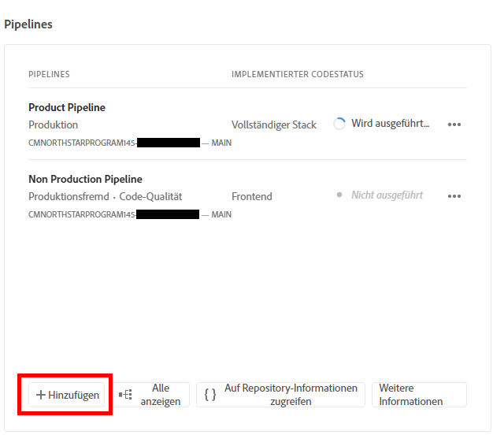
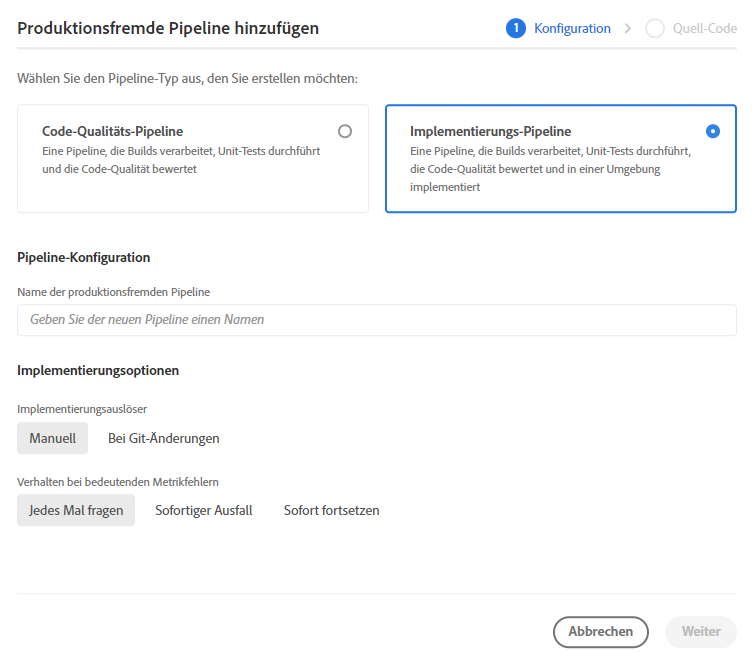
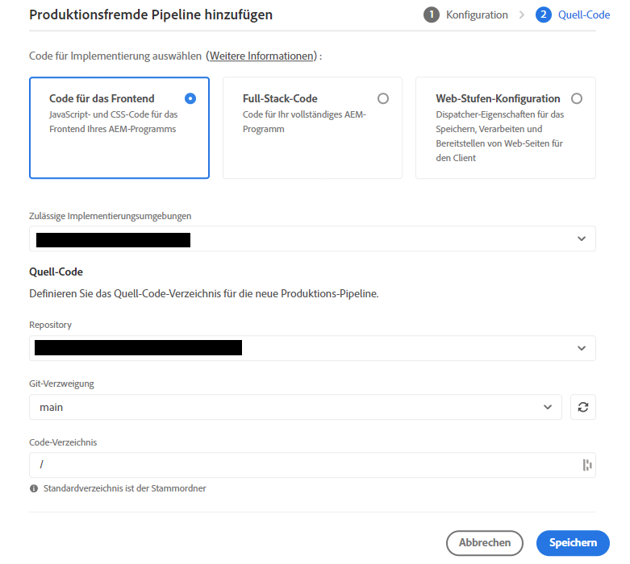
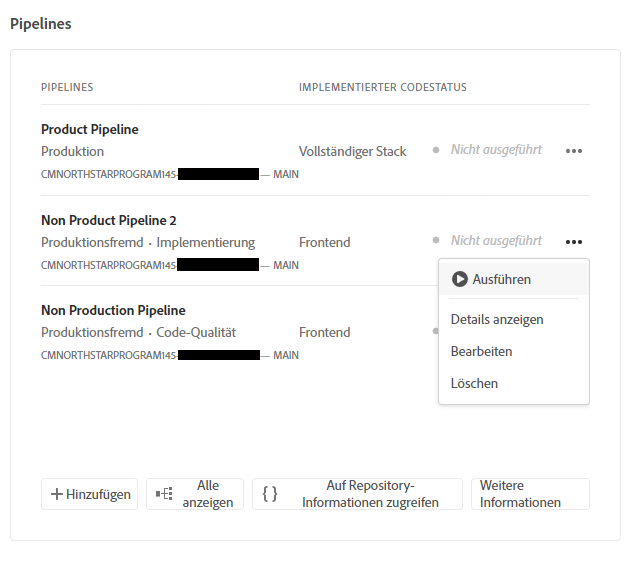

# Einrichten der Pipeline {#set-up-your-pipeline}

Erstellen Sie eine Frontend-Pipeline, um die Anpassung des Designs Ihrer Site zu verwalten.

## Die bisherige Entwicklung {#story-so-far}

Im vorherigen Dokument der Tour zu AEM Quick Site Creation, [Erstellen einer Site aus einer Vorlage](create-site.md), haben Sie gelernt, wie Sie mit einer Site-Vorlage schnell eine AEM-Site erstellen können, die mithilfe von Frontend-Tools weiter angepasst werden kann. Jetzt sollten Sie:

* Wissen, wie Sie AEM-Site-Vorlagen abrufen.
* Wissen, wie Sie mit einer Vorlage eine neue Site erstellen.
* Erfahren haben, wie Sie die Vorlage von Ihrer neuen Site herunterladen, um sie für den Front-End-Entwickler bereitzustellen.

Dieser Artikel baut auf diesen Grundlagen auf, sodass Sie eine Frontend-Pipeline einrichten können, die der Frontend-Entwickler später zur Bereitstellung von Frontend-Anpassungen verwendet.

## Ziel {#objective}

In diesem Dokument erfahren Sie mehr über Frontend-Pipelines und die Erstellung einer Pipeline zur Verwaltung der Implementierung des angepassten Designs Ihrer Site. Nachdem Sie dies gelesen haben, sollten Sie:

* Wissen, was eine Frontend-Pipeline ist.
* Wissen, wie Sie eine Frontend-Pipeline in Cloud Manager einrichten.

## Verantwortliche Rolle {#responsible-role}

Dieser Teil der Tour gilt für den Cloud Manager-Administrator.

## Voraussetzungen {#requirements}

* Sie benötigen Zugriff auf Cloud Manager.
* Sie müssen Mitglied der Rolle **Implementierungs-Manager** in Cloud Manager sein.
* In Cloud Manager muss ein Git-Repository für die AEM-Umgebung eingerichtet werden.
   * Dies ist im Allgemeinen bereits bei allen aktiven Projekten der Fall. Ist dies nicht der Fall, lesen Sie die Dokumentation zu Cloud Manager-Repositorys, die im Abschnitt [Zusätzliche Ressourcen](#additional-resources) verfügbar ist.

## Was ist eine Frontend-Pipeline? {#front-end-pipeline}

Die Frontend-Entwicklung umfasst die Anpassung von JavaScript, CSS und statischen Ressourcen, die den Stil Ihrer AEM-Site definieren. Frontend-Entwickler arbeiten in ihren eigenen lokalen Umgebungen, um diese Anpassungen vorzunehmen. Sobald sie fertig sind, werden die Änderungen an das AEM-Git-Repository übertragen. Sie werden jedoch nur in den Quell-Code übertragen. Sie sind noch nicht in der Umgebung aktiv.

Die Frontend-Pipeline übernimmt diese zugewiesenen Anpassungen und stellt sie in einer AEM-Umgebung bereit, im Allgemeinen in Produktionsumgebungen oder produktionsfremden Umgebungen.

Auf diese Weise kann die Frontend-Entwicklung getrennt von und parallel zu jeder Full-Stack-Backend-Entwicklung in AEM arbeiten, die über eigene Implementierungs-Pipelines verfügt.

>[!NOTE]
>
>Die Frontend-Pipelines können nur JavaScript-, CSS- und statische Ressourcen bereitstellen, um Ihre AEM-Site zu gestalten. Site-Inhalte wie Seiten oder Assets können nicht in einer Pipeline bereitgestellt werden.

## Zugreifen auf Cloud Manager {#login}

1. Melden Sie sich unter [my.cloudmanager.adobe.com](https://my.cloudmanager.adobe.com/) bei Adobe Cloud Manager an.

1. Cloud Manager listet die verschiedenen verfügbaren Programme auf. Tippen oder klicken Sie auf das Element, das Sie verwalten möchten. Wenn Sie gerade erst mit AEM as a Cloud Service beginnen, haben Sie wahrscheinlich nur ein Programm zur Verfügung.

   

Jetzt sehen Sie einen Überblick über Ihr Programm. Ihre Seite sieht anders aus, ähnelt aber diesem Beispiel.

Notieren Sie den Namen des Programms, auf das Sie zugegriffen haben, oder kopieren Sie die URL. Sie müssen dies später dem Frontend-Entwickler bereitstellen.

## Erstellen einer Frontend-Pipeline {#create-front-end-pipeline}

Nachdem Sie auf Cloud Manager zugegriffen haben, können Sie eine Pipeline für die Frontend-Implementierung erstellen.

1. Tippen oder klicken Sie im Abschnitt **Pipelines** auf der Seite „Cloud Manager“ auf die Schaltfläche **Hinzufügen**.

   

1. Im Popup-Menü, das unter der Schaltfläche **Hinzufügen** angezeigt wird, wählen Sie für die Zwecke dieser Tour **Produktionsfremde Pipeline hinzufügen** aus.

1. Auf der Registerkarte **Konfiguration** des Dialogfelds **Produktionsfremde Pipeline hinzufügen**, das geöffnet wird, führen Sie folgende Schritte aus:
   * Wählen Sie **Implementierungs-Pipeline** aus.
   * Geben Sie der Pipeline im Feld **Name der produktionsfremden Pipeline** einen Namen.

   

1. Tippen oder klicken Sie auf **Weiter**.

1. Auf der Registerkarte **Quell-Code**:
   * Wählen Sie **Code für das Frontend** als Typ des bereitzustellenden Codes aus.
   * Stellen Sie sicher, dass die richtige Umgebung unter **Zulässige Implementierungsumgebungen** ausgewählt ist.
   * Wählen Sie das richtige **Repository** aus.
   * Festlegen, mit welcher **Git-Verzweigung** die Pipeline verknüpft werden soll.
   * Definieren des **Code-Verzeichnis**, wenn sich die Frontend-Entwicklung unter einem bestimmten Pfad im ausgewählten Repository befindet. Der Standardwert ist der Stamm des Repositorys, aber häufig befinden sich die Frontend-Entwicklung und das Backend unter verschiedenen Pfaden.

   

1. Tippen oder klicken Sie auf **Speichern**.

Die neue Pipeline wird erstellt und im Abschnitt **Pipelines** im Cloud Manager-Fenster angezeigt. Wenn Sie auf die Punkte nach dem Pipeline-Namen klicken, werden Optionen zum weiteren Bearbeiten oder Anzeigen von Details angezeigt.

>[!TIP]
>
>Wenn Sie bereits mit Pipelines in AEMaaCS vertraut sind und mehr über die Unterschiede zwischen den verschiedenen Pipelines erfahren möchten, einschließlich weiterer Informationen zur Frontend-Pipeline, lesen Sie bitte die Informationen unter „Konfigurieren der CI/CD-Pipeline – Cloud Services“, worauf im Abschnitt [Zusätzliche Ressourcen](#additional-resources) unten verlinkt wird.

## Wie geht es weiter {#what-is-next}

Nachdem Sie nun diesen Teil der AEM-Journey zur schnellen Site-Erstellung abgeschlossen haben, sollten Sie:

* Erfahren Sie, was eine Frontend-Pipeline ist.
* Erfahren Sie, wie Sie eine Frontend-Pipeline in Cloud Manager einrichten.

Bauen Sie auf diesem Wissen auf und setzen Sie Ihre Tour zu AEM Quick Site Creation fort, indem Sie als Nächstes das Dokument [Gewähren des Zugriffs für den Frontend-Entwickler](grant-access.md) durchlesen, in dem Sie erfahren, wie Sie Frontend-Entwickler in Cloud Manager einbinden, damit sie Zugriff auf das Git-Repository und die Pipeline Ihrer AEM-Site haben.

## Zusätzliche Ressourcen {#additional-resources}

Es wird empfohlen, mit dem nächsten Teil der Tour zu Quick Site Creation fortzufahren, indem Sie das Dokument [Anpassen des Site-Themas](customize-theme.md) lesen. Im Folgenden finden Sie einige zusätzliche, optionale Ressourcen, die einige der in diesem Dokument erwähnten Konzepte vertiefen, aber nicht erforderlich sind, um die Tour fortzusetzen.

* [Dokumentation zu Cloud Manager](https://experienceleague.adobe.com/docs/experience-manager-cloud-service/content/onboarding/onboarding-concepts/cloud-manager-introduction.html?lang=de): Wenn Sie an weiteren Details zu den Funktionen von Cloud Manager interessiert sind, sollten Sie sich die ausführlichen technischen Dokumente direkt ansehen.
* [Cloud Manager-Repositorys](/help/implementing/cloud-manager/managing-code/cloud-manager-repositories.md): Weitere Informationen zum Einrichten und Verwalten von Git-Repositorys für Ihr AEMaaCS-Projekt finden Sie in diesem Dokument.
* [Konfigurieren der CI/CD-Pipeline – Cloud Services](/help/implementing/cloud-manager/configuring-pipelines/introduction-ci-cd-pipelines.md): Weitere Informationen zum Einrichten von Pipelines, sowohl für den Full Stack als auch für das Frontend, finden Sie in diesem Dokument.
