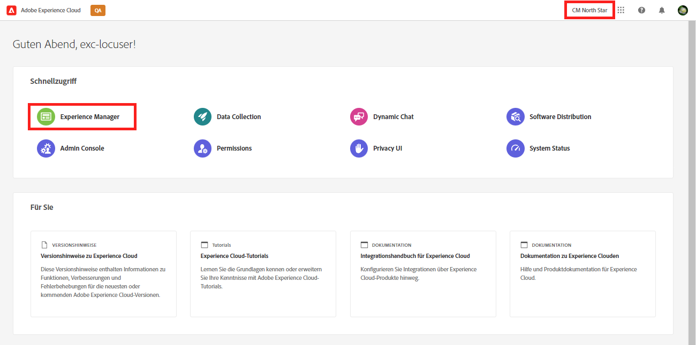
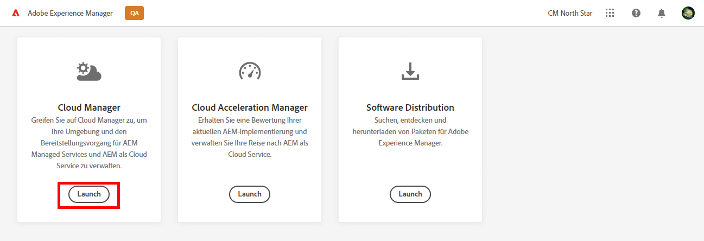

# Git-Repository-Zugriffsinformationen abrufen {#retrieve-access}

Erfahren Sie, wie der Frontend-Entwickler Cloud Manager verwendet, um auf Git-Repository-Informationen zuzugreifen.

>[!CAUTION]
>
>Das Tool für die schnelle Site-Erstellung ist derzeit eine technische Vorschau. Sie wird zu Test- und Evaluierungszwecken bereitgestellt und ist nicht zur Verwendung in der Produktion bestimmt, es sei denn, sie wurde mit der Adobe Support vereinbart.

## Die bisherige Entwicklung {#story-so-far}

Wenn Sie ein Frontend-Entwickler sind, der nur für die Anpassung des Site-Designs verantwortlich ist, benötigen Sie keine Kenntnisse darüber, wie AEM eingerichtet wurde, und können zum [Ziel](#objective) Abschnitt dieses Dokuments.

Wenn Sie auch die Rolle von Cloud Manager oder AEM Administrator sowie Frontend-Entwickler erfüllen, haben Sie im vorherigen Dokument der Journey zur AEM Schnellseitenerstellung gelernt. [Gewähren von Zugriff für Frontend-Entwickler,](grant-access.md) wie Sie den Frontend-Entwickler integrieren, damit er Zugriff auf das Git-Repository hat, und Sie sollten jetzt wissen:

* So fügen Sie einen Frontend-Entwickler als Benutzer hinzu.
* So gewähren Sie dem Frontend-Entwickler die erforderlichen Rollen.

In diesem Artikel wird im nächsten Schritt gezeigt, wie der Frontend-Entwickler den Cloud Manager-Zugriff nutzt, um Anmeldeinformationen für den Zugriff auf das AEM Git-Repository abzurufen.

Da nun eine Site basierend auf einer Vorlage erstellt wird, eine Pipeline eingerichtet ist, der Frontend-Entwickler integriert ist und alle benötigten Informationen enthält, verschiebt dieser Artikel die Perspektive weg von den Administratoren und ausschließlich hin zur Frontend-Entwicklerrolle.

## Ziel {#objective}

In diesem Dokument wird erläutert, wie Sie als Frontend-Entwickler auf Cloud Manager zugreifen und Zugriffsberechtigungen für das AEM Git-Repository abrufen können. Nach dem Lesen werden Sie:

* Erfahren Sie auf hoher Ebene, was Cloud Manager ist.
* Sie haben Ihre Anmeldeinformationen abgerufen, um auf das AEM Git zuzugreifen, damit Sie Ihre Anpassungen übernehmen können.

## Verantwortliche Rolle {#responsible-role}

Dieser Teil der Journey gilt für den Frontend-Entwickler.

## Voraussetzungen {#requirements}

Das Tool zur schnellen Site-Erstellung ermöglicht es Frontend-Entwicklern, unabhängig zu arbeiten, ohne über AEM oder dessen Einrichtung zu verfügen. Der Cloud Manager-Administrator muss jedoch den Frontend-Entwickler in das Projektteam integrieren und der AEM Administrator muss Ihnen einige erforderliche Informationen zur Verfügung stellen. Stellen Sie sicher, dass Sie über die folgenden Informationen verfügen, bevor Sie fortfahren.

* Vom AEM Administrator:
   * Quelldateien für Designs zum Anpassen
   * Pfad zu einer Beispielseite, die als Referenz verwendet werden soll
   * Proxy-Benutzeranmeldeinformationen zum Testen Ihrer Anpassungen für Live-AEM
   * Anforderungen an die Frontend-Konstruktion
* Vom Cloud Manager-Administrator:
   * Eine Begrüßungs-E-Mail von Cloud Manager, die Sie über den Zugriff informiert
   * Der Name des Programms oder die URL zu diesem innerhalb von Cloud Manager

Wenn eines dieser Elemente fehlt, wenden Sie sich an den AEM Administrator oder Cloud Manager-Administrator.

Es wird davon ausgegangen, dass der Frontend-Entwickler über umfassende Erfahrung mit Front-End-Entwicklungs-Workflows sowie allgemeinen installierten Tools verfügt, darunter:

* Git
* npm
* Webpack
* Bevorzugter Editor

## Grundlegendes zu Cloud Manager {#understanding-cloud-manager}

Mit Cloud Manager können Unternehmen AEM in der Cloud selbst verwalten. Das umfasst ein Framework für die fortlaufende Integration und Bereitstellung (CI/CD), mit dem IT-Teams und Implementierungspartner die Bereitstellung von Anpassungen oder Aktualisierungen beschleunigen können, ohne die Leistung oder Sicherheit zu beeinträchtigen.

Für den Frontend-Entwickler ist dies das Gateway zu:

* Greifen Sie auf AEM Git-Repository-Informationen zu, damit Sie Ihre Frontend-Anpassungen übernehmen können.
* Starten Sie die Bereitstellungs-Pipeline, um Ihre Anpassungen bereitzustellen.

Der Cloud Manager-Administrator hat Sie als Cloud Manager-Benutzer integriert. Sie sollten eine Begrüßungs-E-Mail ähnlich der folgenden erhalten haben.

Wenn Sie diese E-Mail nicht erhalten haben, wenden Sie sich an den Cloud Manager-Administrator.

## Zugriff auf Cloud Manager {#access-cloud-manager}

1. Melden Sie sich bei Adobe Experience Cloud an unter [my.cloudmanager.adobe.com](https://my.cloudmanager.adobe.com/) oder klicken Sie auf den in der Begrüßungs-E-Mail angegebenen Link.

1. Stellen Sie nach der Anmeldung sicher, dass Sie sich in der richtigen Organisation befinden, indem Sie sie in der oberen rechten Ecke des Bildschirms überprüfen. Wenn Sie nur Mitglied einer Organisation sind, ist dieser Schritt nicht erforderlich. Tippen oder klicken Sie dann auf **Experience Manager**.

   

1. Tippen oder klicken Sie auf der nächsten Seite auf die **Launch** Schaltfläche zum Starten **Cloud Manager** App.

   

1. Auf der nächsten Seite werden die verschiedenen verfügbaren Programme aufgelistet. Tippen oder klicken Sie auf das Element, auf das Sie zugreifen müssen, wie vom Cloud Manager-Administrator bereitgestellt. Wenn dies Ihr erstes Frontend-Projekt für AEMaaCS ist, ist wahrscheinlich nur ein Programm verfügbar.

   

Jetzt wird eine Übersicht über Ihren Cloud Manager angezeigt. Ihre Seite sieht anders aus, ähnelt aber diesem Beispiel.

## Abrufen von Repository-Zugriffsinformationen {#repo-access}

1. Im **Pipelines** Tippen oder klicken Sie auf der Seite &quot;Cloud Manager&quot;auf die **Zugriff auf Repo Info** Schaltfläche.

   

1. Die **Repository-Informationen** wird geöffnet.

   

1. Tippen oder klicken Sie auf **Kennwort generieren** -Schaltfläche, um ein Kennwort für sich selbst zu erstellen.

1. Speichern Sie das generierte Kennwort in einem sicheren Kennwortmanager. Das Kennwort wird nie wieder angezeigt.

1. Kopieren Sie außerdem die **Benutzername** und **Git-Befehlszeile** -Felder. Sie werden diese Informationen später verwenden, um auf das Repo zuzugreifen.

1. Tippen oder klicken Sie auf **Schließen**.

## Wie geht es weiter {#what-is-next}

Nachdem Sie diesen Teil der Journey zur AEM Schnellseitenerstellung abgeschlossen haben, sollten Sie Folgendes tun:

* Erfahren Sie auf hoher Ebene, was Cloud Manager ist.
* Sie haben Ihre Anmeldeinformationen abgerufen, um auf das AEM Git zuzugreifen, damit Sie Ihre Anpassungen übernehmen können.

Machen Sie sich mit diesem Wissen vertraut und fahren Sie mit der Journey zur AEM SchnellSite-Erstellung fort, indem Sie das Dokument erneut überprüfen. [Anpassen des Site-Designs,](customize-theme.md) Hier erfahren Sie, wie das Site-Design erstellt wird, wie es angepasst wird und wie es mit Live-AEM getestet wird.

## Zusätzliche Ressourcen {#additional-resources}

Es wird empfohlen, zum nächsten Teil der Journey zur Schnellseitenerstellung zu wechseln, indem Sie das Dokument lesen [Anpassen des Site-Designs,](customize-theme.md) Im Folgenden finden Sie einige zusätzliche optionale Ressourcen, die einen tieferen Einblick in einige der in diesem Dokument erwähnten Konzepte ermöglichen, aber nicht auf dem Journey weiterarbeiten müssen.

* [Dokumentation zu Adobe Experience Manager Cloud Manager](https://experienceleague.adobe.com/docs/experience-manager-cloud-manager/using/introduction-to-cloud-manager.html?lang=de) - Vollständige Details zu den Funktionen finden Sie in der Dokumentation zu Cloud Manager .
