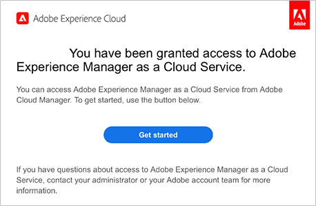

# Abrufen von Zugriffsinformationen zum Git-Repository {#retrieve-access}

{{traditional-aem}}

Erfahren Sie, wie der Front-End-Entwickler Cloud Manager verwendet, um auf Git-Repository-Informationen zuzugreifen.

## Ihre bisherige Tour {#story-so-far}

Wenn Sie ein Front-End-Entwickler sind, der nur für die Anpassung des Sitedesigns verantwortlich ist, benötigen Sie keine Kenntnisse darüber, wie AEM eingerichtet wurde, und können zum Abschnitt [Ziel](#objective) dieses Dokuments wechseln.

Wenn Sie auch in der Rolle von Cloud Manager- oder AEM-Admins sowie von Frontend-Entwickelnden arbeiten, haben Sie im vorherigen Dokument der Tour zur schnellen AEM-Site-Erstellung, [Gewähren des Zugriffs für Frontend-Entwickelnde](grant-access.md), gelernt, wie Sie Frontend-Entwickelnde integrieren, damit sie Zugriff auf das Git-Repository hat, und Sie sollten jetzt Folgendes wissen:

* Wie ein Front-End-Entwickler als Benutzer hinzugefügt wird.
* Wie dem Front-End-Entwickler die erforderlichen Rollen zugewiesen werden.

In diesem Artikel wird der nächste Schritt gemacht und gezeigt, wie der Front-End-Entwickler den Cloud Manager-Zugriff nutzt, um Anmeldeinformationen für den Zugriff auf das AEM-Git-Repository abzurufen.

Da nun eine Site basierend auf einer Vorlage erstellt wurde, eine Pipeline eingerichtet ist, die Frontend-Entwickelnden eingebunden wurden und alle benötigten Informationen haben, wird in diesem Artikel die Perspektive weg von den Admins und ausschließlich hin zur Frontend-Entwicklerrolle verschoben.

## Ziel {#objective}

In diesem Dokument wird erläutert, wie Sie als Front-End-Entwickler auf Cloud Manager zugreifen und Zugriffsberechtigungen für das AEM-Git-Repository abrufen können. Nach dem Lesen sollten Sie:

* Erfahren Sie ganz allgemein, was Cloud Manager ist.
* Rufen Sie Ihre Anmeldeinformationen ab, um auf AEM-Git zuzugreifen, damit Sie Ihre Anpassungen übernehmen können.

## Verantwortliche Rolle {#responsible-role}

Dieser Teil der Journey gilt für Front-End-Entwickler.

## Voraussetzungen {#requirements}

Das Tools zur schnellen Site-Erstellung ermöglicht es Front-End-Entwicklern, unabhängig zu arbeiten, ohne über Kenntnisse zu AEM oder dessen Einrichtung verfügen zu müssen. Der Cloud Manager-Administrator muss jedoch den Front-End-Entwickler in das Projekt-Team aufnehmen und der AEM-Administrator muss Ihnen einige erforderliche Informationen zur Verfügung stellen. Stellen Sie sicher, dass Sie über die folgenden Informationen verfügen, bevor Sie fortfahren.

* Vom AEM-Administrator:
   * Quelldateien für Designs zum Anpassen
   * Pfad zu einer Beispielseite, die als Referenz verwendet werden soll
   * Proxy-Benutzeranmeldeinformationen zum Testen Ihrer Anpassungen mit Live-AEM-Inhalt
   * Anforderungen an das Front-End-Design
* Vom Cloud Manager-Administrator:
   * Eine Begrüßungs-E-Mail von Cloud Manager, die Sie über den Zugriff informiert
   * Name des Programms oder dessen URL innerhalb von Cloud Manager

Wenn eines dieser Elemente fehlt, wenden Sie sich an die AEM- oder Cloud Manager-Admins.

Es wird davon ausgegangen, dass die Frontend-Entwicklungsperson über umfassende Erfahrungen mit Frontend-Entwicklungs-Workflows sowie gängigen installierten Tools verfügt, darunter:

* Git
* npm
* Webpack
* Bevorzugter Editor

## Grundlegendes zu Cloud Manager {#understanding-cloud-manager}

Cloud Manager ermöglicht Unternehmen die Selbstverwaltung von AEM in der Cloud. Das umfasst ein Framework für die fortlaufende Integration und Bereitstellung (CI/CD), mit dem IT-Teams und Implementierungspartner die Bereitstellung von Anpassungen oder Aktualisierungen beschleunigen können, ohne die Leistung oder Sicherheit zu beeinträchtigen.

Der Front-End-Entwickler hat dadurch folgende Möglichkeiten:

* Zugreifen auf AEM-Git-Repository-Informationen, damit Sie Ihre Front-End-Anpassungen übernehmen können.
* Starten der Bereitstellungs-Pipeline, um Ihre Anpassungen bereitzustellen.

Der Cloud Manager-Administrator hat Sie als Cloud Manager-Benutzer integriert. Sie sollten eine Begrüßungs-E-Mail wie die folgende erhalten haben.

Wenn Sie diese E-Mail nicht erhalten haben, wenden Sie sich an die Cloud Manager-Admins.

## Zugreifen auf Cloud Manager {#access-cloud-manager}

1. Melden Sie sich bei Adobe Experience Cloud unter [my.cloudmanager.adobe.com](https://my.cloudmanager.adobe.com/) an oder klicken Sie auf den in der Begrüßungs-E-Mail angegebenen Link.

1. Cloud Manager listet die verschiedenen verfügbaren Programme auf. Wählen Sie das Programm aus, auf das Sie zugreifen müssen, wie von den Cloud Manager-Admins angegeben. Wenn dies Ihr erstes Front-End-Projekt für AEMaaCS ist, ist wahrscheinlich nur ein Programm verfügbar.

   

Jetzt sehen Sie einen Überblick über Ihr Programm. Ihre Seite sieht anders aus, ähnelt aber diesem Beispiel.

## Abrufen von Repository-Zugriffsinformationen {#repo-access}

1. Wählen Sie im Abschnitt **Pipelines** auf der Cloud Manager-Seite die Schaltfläche **Auf Repository-Informationen zugreifen** aus.

   

1. Das Dialogfeld **Repository-Informationen** wird geöffnet.

   

1. Wählen Sie die Schaltfläche **Passwort generieren**, um ein Passwort für sich selbst zu erstellen.

1. Speichern Sie das generierte Passwort in einem sicheren Passwort-Manager. Das Passwort wird nicht wieder angezeigt.

1. Kopieren Sie außerdem die Felder **Benutzername** und **Git-Befehlszeile**. Sie nutzen diese Informationen später, um auf das Repository zuzugreifen.

1. Wählen Sie **Schließen** aus.

## So geht es weiter {#what-is-next}

Nachdem Sie nun diesen Teil der AEM-Journey zur schnellen Site-Erstellung abgeschlossen haben, sollten Sie:

* Erfahren Sie ganz allgemein, was Cloud Manager ist.
* Rufen Sie Ihre Anmeldeinformationen ab, um auf AEM-Git zuzugreifen, damit Sie Ihre Anpassungen übernehmen können.

Bauen Sie auf diesem Wissen auf und fahren Sie mit der Tour zur schnellen AEM-Site-Erstellung fort, indem Sie das Dokument [Anpassen des Site-Designs](customize-theme.md) durchgehen. Hier erfahren Sie, wie das Site-Design erstellt, angepasst und mit Live-AEM-Inhalten getestet werden kann.

## Zusätzliche Ressourcen {#additional-resources}

Es wird zwar empfohlen, mit dem nächsten Teil der Tour zur schnellen Site-Erstellung fortzufahren, indem Sie das Dokument [Anpassen des Site-Designs](customize-theme.md) durchgehen. Im Folgenden finden Sie jedoch einige zusätzliche optionale Ressourcen, die einige der in diesem Dokument erwähnten Konzepte vertiefen, aber nicht erforderlich sind, um die Tour fortzusetzen.

* [Dokumentation zu Adobe Experience Manager Cloud Manager](https://experienceleague.adobe.com/docs/experience-manager-cloud-manager/using/introduction-to-cloud-manager.html?lang=de) – Vollständige Details zu den Funktionen finden Sie in der Dokumentation zu Cloud Manager.
