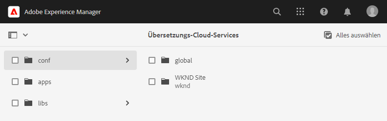
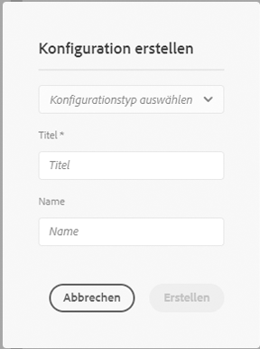
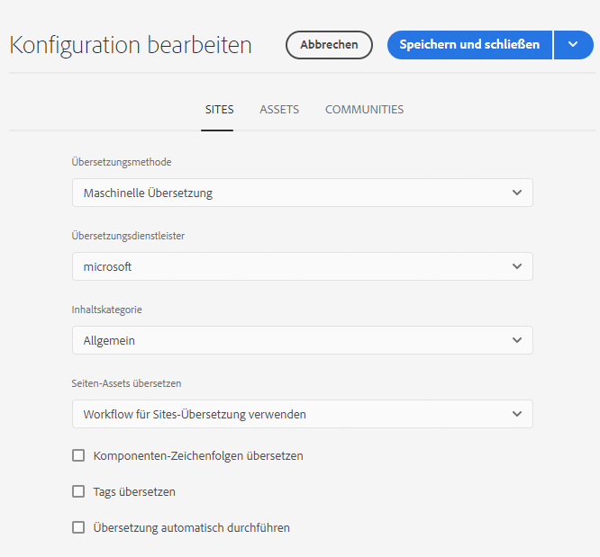
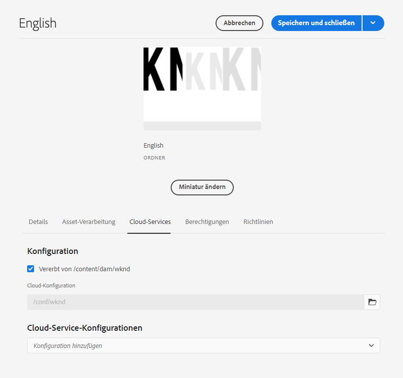

# Konfigurieren des Übersetzungs-Connectors {#configure-connector}

Erfahren Sie, wie Sie AEM mit einem Übersetzungsdienst verbinden.

## Ihre bisherige Tour {#story-so-far}

Im vorherigen Dokument der AEM Sites-Übersetzungs-Tour, [Erste Schritte mit der AEM Sites-Übersetzung](learn-about.md), haben Sie gelernt, wie Sie Ihre Inhalte organisieren und wie Übersetzungs-Tools von AEM funktionieren. Sie sollten jetzt:

* die Bedeutung der Inhaltsstruktur für die Übersetzung verstehen.
* verstehen, wie AEM Inhalte speichert.
* mit den Übersetzungs-Tools von AEM vertraut sein.

Dieser Artikel baut auf diesen Grundlagen auf, damit Sie den ersten Konfigurationsschritt durchführen und einen Übersetzungsdienst einrichten können, den Sie später in der Tour verwenden werden, um Ihre Inhalte zu übersetzen.

## Ziel {#objective}

In diesem Dokument erfahren Sie, wie Sie einen AEM-Connector für Ihren ausgewählten Übersetzungsdienst einrichten. Nach dem Lesen sollten Sie:

* die wichtigen Parameter des Translation Integration Framework in AEM verstehen.
* In der Lage sein, Ihre eigene Verbindung zu Ihrem Übersetzungsdienst einzurichten.

## Das Translation Integration Framework {#tif}

Das Framework für die Übersetzungsintegration (Translation Integration Framework, TIF) integriert Übersetzungsdienste von Drittanbietern, um die Übersetzung von AEM-Inhalten zu orchestrieren. Dies umfasst drei grundlegende Schritte.

1. Verbinden Sie sich mit Ihrem Übersetzungsdienstleister.
1. Erstellen Sie eine Framework-Konfiguration für die Übersetzungsintegration.
1. Verknüpfen Sie die Konfiguration mit Ihren Inhalten.

Die folgenden Abschnitte beschreiben diese Schritte detaillierter.

## Herstellen einer Verbindung zu einem Übersetzungsdienstleister {#connect-translation-provider}

Der erste Schritt besteht darin, den gewünschten Übersetzungsdienst auszuwählen. Es gibt viele Möglichkeiten für menschliche und maschinelle Übersetzungen, die in AEM zur Verfügung stehen. Die meisten Anbieter bieten ein Übersetzungspaket zur Installation an. Im Abschnitt [Zusätzliche Ressourcen](#additional-resources) finden Sie eine Auswahl der verfügbaren Optionen.

>[!NOTE]
>
>Der Übersetzungsspezialist ist in der Regel für die Auswahl des zu verwendenden Übersetzungsdienstes verantwortlich. Der Administrator ist jedoch in der Regel für die Installation des erforderlichen Übersetzungs-Connector-Pakets zuständig.

Für diese Tour verwenden wir den Microsoft Translator, der von AEM vorkonfiguriert mit einer Testlizenz geliefert wird. Weitere Informationen über diesen Anbieter finden Sie im Abschnitt [Zusätzliche Ressourcen](#additional-resources).

Wenn Sie einen anderen Anbieter auswählen, muss Ihr Administrator das Connector-Paket gemäß den Anweisungen des Übersetzungsdienstes installieren.

>[!NOTE]
>
>Die Verwendung des vorkonfigurierten Microsoft Translator in AEM erfordert keine zusätzliche Einrichtung und funktioniert wie gewohnt ohne zusätzliche Connector-Konfiguration.
>
>Wenn Sie den Microsoft Translator-Connector zu Testzwecken verwenden, müssen Sie die Schritte in den folgenden beiden Abschnitten nicht ausführen: [Erstellen einer Konfiguration für die Übersetzungsintegration](#create-config) und [Verknüpfen der Konfiguration mit Ihren Inhalten](#associate). Es wird jedoch empfohlen, sie zu lesen, damit Sie mit den Schritten vertraut sind, mit denen Sie Ihren bevorzugten Connector konfigurieren müssen.
>
>Die Testlizenz des Microsoft Translator-Connectors ist nicht für Produktionszwecke gedacht. Wenn Sie sich für eine Lizenzierung entscheiden, muss die bzw. der Systemadmin die im Abschnitt [Zusätzliche Ressourcen](#additional-resources) am Ende dieses Dokuments beschriebenen Schritte ausführen, um diese Lizenz zu konfigurieren.

## Erstellen einer Konfiguration für die Übersetzungsintegration {#create-config}

Nachdem das Connector-Paket für Ihren bevorzugten Übersetzungsdienst installiert wurde, müssen Sie eine Konfiguration für das Translation Integration Framework für diesen Dienst erstellen. Die Konfiguration enthält die folgenden Informationen:

* welcher Übersetzungsanbieter eingesetzt werden soll
* ob eine menschliche oder maschinelle Übersetzung erfolgen soll
* ob weitere Inhalte übersetzt werden sollen, die den Seiten zugeordnet sind, beispielsweise Tags

So erstellen Sie eine Übersetzungskonfiguration:

1. Wählen Sie im globalen Navigationsmenü **Tools** > **Cloud-Services** > **Übersetzungs-Cloud-Services** aus.
1. Navigieren Sie zu der Stelle in Ihrer Inhaltsstruktur, an der Sie die Konfiguration erstellen möchten. Diese bezieht sich oft auf ein bestimmted Projekt oder kann global sein.
   * In diesem Fall kann beispielsweise eine Konfiguration global vorgenommen werden, um sie auf alle Inhalte oder nur auf das WKND-Projekt anzuwenden.

   

1. Wählen Sie **Erstellen** in der Symbolleiste aus, um die neue Konfiguration zu erstellen.
1. Geben Sie die folgenden Informationen in die Felder ein und wählen Sie dann **Erstellen** aus.
   1. Wählen Sie **Konfigurationstyp** in der Dropdown-Liste aus. Wählen Sie **Übersetzungsintegration** aus der Liste aus.
   1. Geben Sie einen **Titel** für Ihre Konfiguration ein. Durch den **Titel** wird die Konfiguration in der **Cloud Services**-Konsole und in Dropdown-Listen mit den Seiteneigenschaften identifiziert.
   1. Geben Sie optional einen **Namen** für den Repository-Knoten ein, auf dem die Konfiguration gespeichert wird.

   

1. Wählen Sie **Erstellen** aus. Daraufhin wird das Fenster **Konfiguration bearbeiten** angezeigt, in dem Sie die Konfigurationseigenschaften konfigurieren können.

1. Da Ihre Inhalte als Sites verwaltet werden, wählen Sie die Registerkarte **Sites** aus.



1. Geben Sie die folgenden Informationen ein.

   1. **Übersetzungsmethode** – Wählen Sie **Maschinelle Übersetzung** oder **Menschliche Übersetzung** aus, abhängig von Ihrem Übersetzungsanbieter. Für diese Tour gehen wir von maschineller Übersetzung aus.
   1. **Übersetzungsanbieter** – Wählen Sie in der Liste den Connector aus, den Sie für Ihren Übersetzungsdienst installiert haben.
   1. **Inhaltskategorie** –Wählen Sie die am besten geeignete Kategorie aus, um die Übersetzung gezielter durchzuführen (nur für maschinelle Übersetzung).
   1. **Seiten-Assets übersetzen** – Wählen Sie **Verwenden des Übersetzungs-Workflows für Sites** aus, um die mit den Website-Seiten verknüpften Assets zu übersetzen.
   1. **Komponentenzeichenfolgen übersetzen** – Markieren Sie diese Option, um Komponenteninformationen zu übersetzen.
   1. **Tags übersetzen** – Markieren Sie diese Option, um Tags zu übersetzen, die mit der Seite verknüpft sind.
   1. **Übersetzung automatisch ausführen** – Markieren Sie diese Eigenschaft, wenn Übersetzungen automatisch an Ihren Übersetzungsdienst gesendet werden sollen.

1. Wählen Sie **Speichern und schließen**.

Sie haben jetzt den Connector für Ihren Übersetzungsdienst konfiguriert.

## Verknüpfen der Konfiguration mit Ihren Inhalten {#associate}

AEM ist ein flexibles und leistungsstarkes Tool und unterstützt über mehrere Connectoren und mehrere Konfigurationen mehrere, gleichzeitige Übersetzungsdienste. Die Einrichtung einer solchen Konfiguration sprengt den Rahmen dieser Tour. Diese Flexibilität bedeutet jedoch, dass Sie angeben müssen, welche Connectoren und Konfigurationen für die Übersetzung Ihrer Inhalte verwendet werden sollen, indem Sie diese Konfiguration mit Ihren Inhalten verknüpfen.

Gehen Sie dazu zum Sprachstamm Ihrer Inhalte. Für unsere Beispielzwecke ist dies

```text
/content/<your-project>/en
```

1. Gehen Sie zur globalen Navigation und dann zu **Navigation** > **Assets** > **Dateien**.
1. Wählen Sie in der Assets-Konsole den zu konfigurierenden Sprachstamm und anschließend **Eigenschaften** aus.
1. Wählen Sie die Registerkarte **Cloud-Services** aus.
1. Wählen Sie unter **Cloud Service-Konfigurationen** in der Dropdown-Liste **Konfiguration hinzufügen** Ihren Connector aus. Er sollte in der Dropdown-Liste erscheinen, wenn Sie das Paket [wie oben beschrieben](#connect-translation-provider) installiert haben.
1. Wählen Sie unter **Cloud Service-Konfigurationen** in der Dropdown-Liste **Konfiguration hinzufügen** auch Ihre Konfiguration aus.
1. Wählen Sie **Speichern und schließen**.



## So geht es weiter {#what-is-next}

Nachdem Sie nun diesen Teil der AEM Sites-Übersetzungs-Tour abgeschlossen haben, sollten Sie:

* die wichtigen Parameter des Translation Integration Framework in AEM verstehen.
* In der Lage sein, Ihre eigene Verbindung zu Ihrem Übersetzungsdienst einzurichten.

Bauen Sie auf diesem Wissen auf und fahren Sie mit der AEM Sites-Übersetzungs-Tour fort, indem Sie als Nächstes das Dokument [Konfigurieren von Übersetzungsregeln](translation-rules.md) lesen, in dem Sie erfahren, wie Sie festlegen, welche Inhalte übersetzt werden sollen.

## Zusätzliche Ressourcen {#additional-resources}

Es wird zwar empfohlen, zum nächsten Teil der Übersetzungs-Tour voranzuschreiten, indem Sie das Dokument [Übersetzungsregeln konfigurieren](translation-rules.md) lesen. Im Folgenden finden Sie einige zusätzliche optionale Ressourcen, die einige in diesem Dokument erwähnte Konzepte vertiefen. Aber sie sind nicht erforderlich, um mit der Tour fortzufahren.

* [Konfigurieren des Translation Integration Framework](/help/sites-cloud/administering/translation/integration-framework.md) – Sehen Sie sich eine Liste ausgewählter Übersetzungs-Connectoren an und erfahren Sie, wie Sie das Translation Integration Framework für die Integration mit Übersetzungsdiensten von Drittanbietern konfigurieren können.
* [Verbindung zum Microsoft Translator herstellen](/help/sites-cloud/administering/translation/connect-ms-translator.md) – AEM bietet ein Testkonto für den Microsoft Translator.
