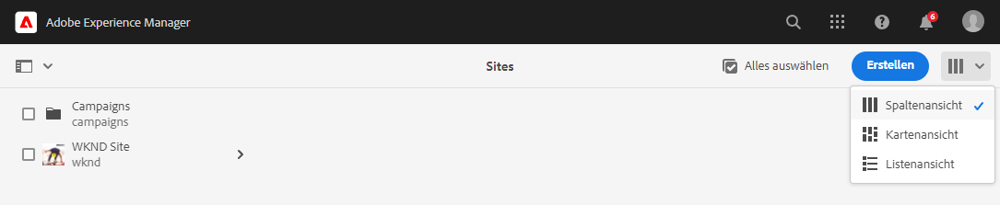
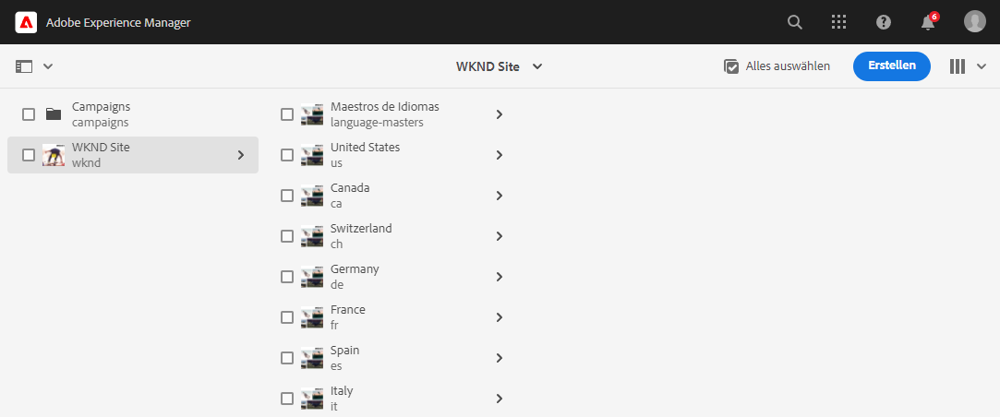
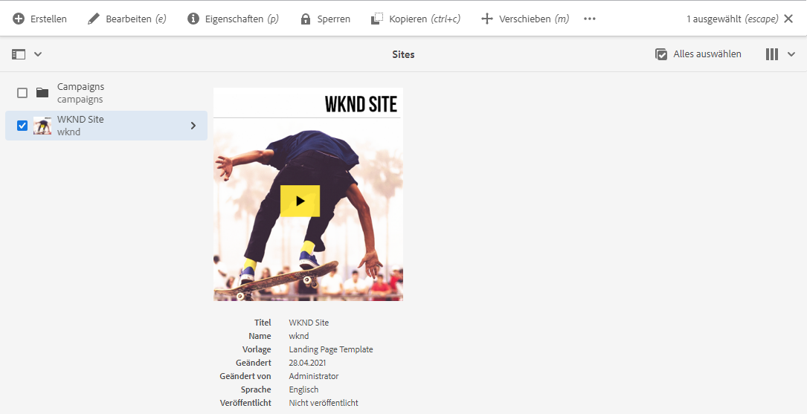
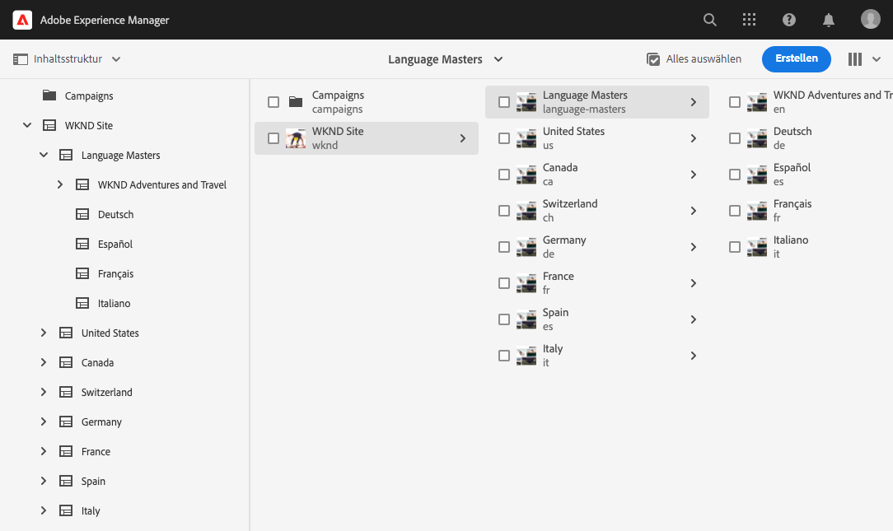
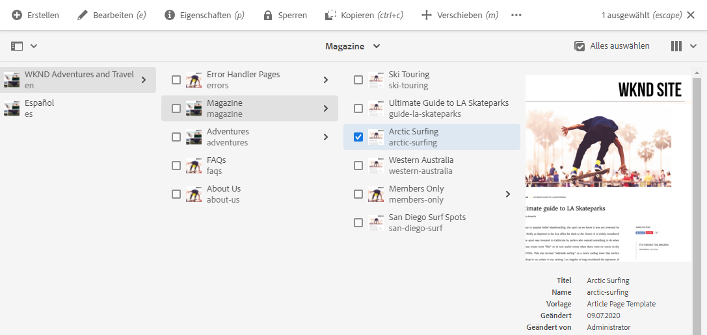
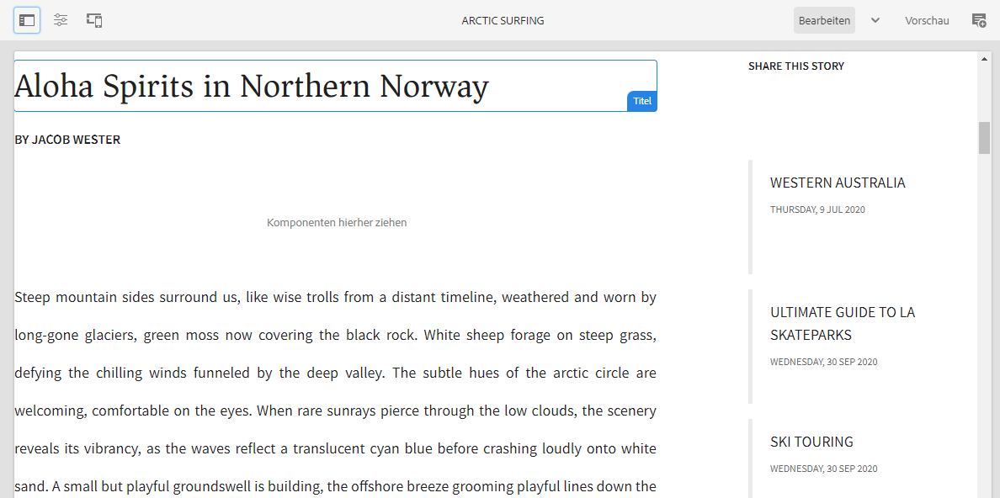

# Erste Schritte mit Übersetzungen in AEM Sites {#getting-started}

Lernen Sie, wie Sie Ihre AEM Sites-Inhalte organisieren und wie die Übersetzungs-Tools von AEM funktionieren.

## Die bisherige Entwicklung {#story-so-far}

Im vorherigen Dokument der AEM Sites-Übersetzungs-Tour [Informationen zu AEM Sites-Inhalten und zur Übersetzung in AEM](learn-about.md) haben Sie die Grundtheorie von AEM Sites kennengelernt und sollten jetzt:

* die grundlegenden Konzepte der Inhaltserstellung in AEM Sites verstehen.
* damit vertraut sein, wie AEM die Übersetzung unterstützt.

Dieser Artikel baut auf diesen Grundlagen auf, sodass Sie verstehen, wie AEM Inhalte speichert und verwaltet und wie Sie die Übersetzungs-Tools von AEM verwenden können, um diese Inhalte zu übersetzen.

## Ziel {#objective}

In diesem Dokument erfahren Sie, wie Sie mit der Übersetzung von Website-Inhalten in AEM beginnen. Nach dem Lesen sollten Sie:

* die Bedeutung der Inhaltsstruktur für die Übersetzung verstehen.
* verstehen, wie AEM Inhalte speichert.
* mit den Übersetzungs-Tools von AEM vertraut sein.

## Anforderungen und Vorbedingungen {#requirements-prerequisites}

Bevor Sie mit der Übersetzung Ihrer AEM-Inhalte beginnen, müssen Sie eine Reihe von Anforderungen erfüllen.

### Kenntnisse {#knowledge}

* Erfahrung mit der Übersetzung von Inhalten in einem CMS
* Erfahrung mit der Verwendung von grundlegenden Funktionen eines umfangreichen CMS
* Grundlegende Kenntnisse der Handhabung von AEM
* Verständnis des von Ihnen genutzten Übersetzungs-Service
* Ein grundlegendes Verständnis der zu übersetzenden Inhalte

>[!TIP]
>
>Wenn Sie nicht mit der Verwendung eines umfangreichen CMS wie AEM vertraut sind, sollten Sie die Dokumentation [Grundlegende Handhabung](/help/sites-cloud/authoring/getting-started/basic-handling.md) lesen, bevor Sie fortfahren. Die Dokumentation „Grundlegende Handhabung“ ist nicht Teil der Tour. Kehren Sie also nach Abschluss der Lektüre zu dieser Seite zurück.

### Tools {#tools}

* Sandbox-Zugriff zum Testen der Übersetzung Ihrer Inhalte
* Anmeldedaten für die Verbindung mit Ihrem bevorzugten Übersetzungs-Service
* Mitglied der Gruppe `project-administrators` in AEM

## Speichern von Inhalten AEM {#content-in-aem}

Für den Übersetzungsspezialisten ist es nicht wichtig, die Art und Weise, wie AEM Inhalte verwaltet, genau zu verstehen. Wenn Sie jedoch mit den grundlegenden Konzepten und der Terminologie vertraut sind, wird dies bei der späteren Verwendung der AEM-Übersetzungs-Tools hilfreich sein. Vor allem müssen Sie Ihre eigenen Inhalte und ihre Struktur verstehen, um sie effektiv übersetzen zu können.

### Sites-Konsole {#sites-console}

Die Sites-Konsole bietet einen Überblick über die Struktur Ihrer Inhalte, sodass Sie mühelos in Ihren Inhalten navigieren und sie verwalten können, indem Sie neue Seiten erstellen, Seiten verschieben und kopieren sowie Inhalte veröffentlichen.

So greifen Sie auf die Sites-Konsole zu:

1. Klicken oder tippen Sie im globalen Navigationsmenü auf **Navigation** > **Sites**.
1. Die Sites-Konsole wird auf der obersten Ebene Ihrer Inhalte geöffnet.
1. Stellen Sie sicher, dass die Option **Spaltenansicht** mithilfe der Ansichtsauswahl oben rechts im Fenster ausgewählt ist.

   

1. Durch Tippen oder Klicken auf ein Element in einer Spalte wird der darunter liegende Inhalt in der Hierarchie in der Spalte rechts angezeigt.

   

1. Durch Tippen oder Klicken auf das Kontrollkästchen eines Elements in einer Spalte wird dieses Element ausgewählt, die Details des ausgewählten Elements werden rechts in der Spalte angezeigt. Außerdem wird eine Reihe von Aktionen angezeigt, die für das ausgewählte Element in der Symbolleiste oben verfügbar sind.

   

1. Durch Tippen oder Klicken auf die Auswahlleiste oben links können Sie auch die Ansicht **Inhaltsstruktur** für eine Baumstrukturübersicht Ihres Inhalts anzeigen.

   

Mithilfe dieser einfachen Tools können Sie intuitiv durch Ihre Inhaltsstruktur navigieren.

>[!NOTE]
>
>Der Inhaltsarchitekt definiert normalerweise die Inhaltsstruktur, während die Inhaltsautoren die Inhalte in dieser Struktur erstellen.
>
>Ein Übersetzungsspezialist muss verstehen, wie man durch diese Struktur navigiert und wo sich die Inhalte befinden.

### Seiteneditor {#page-editor}

Die Sites-Konsole ermöglicht Ihnen die Navigation in Ihren Inhalten und bietet einen Überblick über deren Struktur. Um die Details einer Einzelseite anzuzeigen, müssen Sie den Website-Editor verwenden.

So bearbeiten Sie eine Seite:

1. Verwenden Sie die Sites-Konsole, um eine Seite zu suchen und auszuwählen. Denken Sie daran, dass Sie auf das Kontrollkästchen einer Einzelseite tippen oder klicken müssen, um sie auszuwählen.

   

1. Tippen Sie in der Symbolleiste auf die Option **Bearbeiten**.
1. Der Website-Editor wird geöffnet, wobei die ausgewählte Seite in einem neuen Browser-Tab zur Bearbeitung geladen wird.
1. Wenn Sie den Mauszeiger über den Inhalt bewegen oder darauf tippen, werden Selektoren für einzelne Komponenten angezeigt. Komponenten sind die Drag-and-Drop-Bausteine, aus denen die Seite besteht.

   

Sie können jederzeit zur Sites-Konsole zurückkehren, indem Sie in Ihrem Browser zu diesem Tab zurückkehren. Mit dem Sites-Editor können Sie die Inhalte der Seite schnell so anzeigen, wie die Inhaltsautoren und Ihre Zielgruppe sie sehen werden.

>[!NOTE]
>
>Die Inhaltsautoren erstellen Ihre Website-Inhalte mit dem Website-Editor.
>
>Ein Übersetzungsspezialist muss verstehen, wie die Details dieser Inhalte mit dem Website-Editor angezeigt werden.

## Struktur ist entscheidend {#content-structure}

Inhalte in AEM werden durch ihre Struktur gesteuert. AEM stellt nur wenige Anforderungen an die Inhaltsstruktur, doch kann eine sorgfältige Berücksichtigung Ihrer Inhaltshierarchie im Rahmen der Projektplanung die Übersetzung erheblich vereinfachen.

>[!TIP]
>
>Planen Sie die Übersetzung am Anfang Ihres AEM-Projekts ein. Arbeiten Sie frühzeitig mit dem Projekt-Manager und den Inhaltsarchitekten zusammen.
>
>Es kann erforderlich sein, einen Internationalisierungs-Projekt-Manager als separate Rolle hinzuzuziehen, dessen Aufgabe es ist zu definieren, welche Inhalte übersetzt werden sollen und welche nicht und welche übersetzten Inhalte von regionalen oder lokalen Inhaltserstellern geändert werden können.

## Empfohlene Inhaltsstruktur {#recommended-structure}

Arbeiten Sie wie zuvor empfohlen mit Ihrem Inhaltsarchitekten zusammen, um die geeignete Inhaltsstruktur für Ihr eigenes Projekt zu ermitteln. Das Folgende ist jedoch eine bewährte, einfache und intuitive Struktur, die sehr effektiv ist.

Definieren Sie unter `/content` einen Basisordner für Ihr Projekt.

```text
/content/<your-project>
```

Die Sprache, in der Ihre Inhalte erstellt werden, wird als Sprachstamm bezeichnet. In unserem Beispiel ist es Englisch und die Inhalte sollten unter diesem Pfad liegen.

```text
/content/<your-project>/en
```

Alle Projektinhalte, die möglicherweise lokalisiert werden müssen, sollten unter dem Sprachstamm platziert werden.

```text
/content/<your-project>/en/<your-project-content>
```

Übersetzungen sollten als gleichrangige Ordner neben dem Sprachstamm erstellt werden, wobei ihr Ordnername den ISO-2-Sprach-Code der Sprache darstellt. Beispielsweise hätte Deutsch den folgenden Pfad.

```text
/content/<your-project>/de
```

>[!NOTE]
>
>Der Inhaltsarchitekt ist im Allgemeinen für die Erstellung dieser Sprachordner verantwortlich. Wenn sie nicht erstellt werden, können in AEM später keine Übersetzungsaufträge erstellt werden.

Die endgültige Struktur kann etwa wie folgt aussehen:

```text
/content
    |- your-project
        |- en
            |- some
            |- exciting
            |- sites
            |- content
        |- de
        |- fr
        |- it
        |- ...
    |- another-project
    |- ...
```

Notieren Sie sich den spezifischen Pfad Ihrer Inhalte, da er später zur Konfiguration Ihrer Übersetzung erforderlich ist.

>[!NOTE]
>
>In der Regel ist es Aufgabe des Inhaltsarchitekten, die Inhaltsstruktur zu definieren, oft in Zusammenarbeit mit dem Übersetzungsspezialisten.
>
>Sie wird hier der Vollständigkeit halber detailliert beschrieben.

## AEM-Übersetzungs-Tools {#translation-tools}

Nachdem Sie nun die Sites-Konsole und den Website-Editor sowie die Bedeutung der Inhaltsstruktur kennen, können wir uns ansehen, wie Inhalte übersetzt werden. Die Übersetzungs-Tools in AEM sind sehr leistungsstark, aber auf einer allgemeinen Ebene einfach zu verstehen.

* **Übersetzungs-Connector**: Der Connector ist die Verknüpfung zwischen AEM und dem von Ihnen verwendeten Übersetzungs-Service.
* **Übersetzungsregeln**: Regeln definieren, welche Inhalte unter bestimmten Pfaden übersetzt werden sollen.
* **Übersetzungsprojekte**: Übersetzungsprojekte sammeln Inhalte, die als einzelner Übersetzungsaufwand angesprochen werden sollten, und verfolgen den Fortschritt der Übersetzung. Sie stellen eine Verbindung mit dem Connector her, damit die zu übersetzenden Inhalte übertragen und vom Übersetzungsdienstleister zurückerhalten werden können.

Normalerweise richten Sie Ihren Connector nur einmal für Ihre Instanz und Regeln pro Projekt ein. Danach verwenden Sie Übersetzungsprojekte, um Ihre Inhalte zu übersetzen und die Übersetzungen laufend auf dem neuesten Stand zu halten.

## Wie geht es weiter {#what-is-next}

Nachdem Sie nun diesen Teil der AEM Sites-Übersetzungs-Tour abgeschlossen haben, sollten Sie:

* die Bedeutung der Inhaltsstruktur für die Übersetzung verstehen.
* verstehen, wie AEM Inhalte speichert.
* mit den Übersetzungs-Tools von AEM vertraut sein.

Bauen Sie auf diesem Wissen auf und setzen Sie Ihre AEM Sites-Übersetzungs-Tour fort, indem Sie als Nächstes das Dokument [Konfigurieren des Übersetzungs-Connectors](configure-connector.md) lesen, in dem Sie lernen, wie Sie AEM mit einem Übersetzungsdienstleister verbinden.

## Zusätzliche Ressourcen {#additional-resources}

Es wird empfohlen, zum nächsten Teil der Übersetzungs-Tour voranzuschreiten, indem Sie das Dokument [Konfigurieren des Übersetzungs-Connectors](configure-connector.md) lesen. Im Folgenden finden Sie einige zusätzliche optionale Ressourcen, die einige in diesem Dokument erwähnte Konzepte vertiefen. Sie sind jedoch nicht erforderlich, um mit der Tour fortzufahren.

* [Grundlegende Handhabung von AEM](/help/sites-cloud/authoring/getting-started/basic-handling.md): Lernen Sie die Grundlagen der AEM-Benutzeroberfläche kennen, um bequem navigieren und wichtige Aufgaben wie das Auffinden von Inhalten ausführen zu können.
* [Ermitteln von zu übersetzenden Inhalten](/help/sites-cloud/administering/translation/rules.md): Erfahren Sie, wie Übersetzungsregeln Inhalte ermitteln, die übersetzt werden müssen.
* [Konfigurieren des Frameworks für die Übersetzungsintegration](/help/sites-cloud/administering/translation/integration-framework.md): Erfahren Sie, wie Sie das Translation Integration Framework (TIF) für die Integration mit Übersetzungs-Services von Drittanbietern konfigurieren.
* [Verwalten von Übersetzungsprojekten](/help/sites-cloud/administering/translation/managing-projects.md): Erfahren Sie, wie Sie sowohl maschinelle als auch menschliche Übersetzungsprojekte in AEM erstellen und verwalten.
