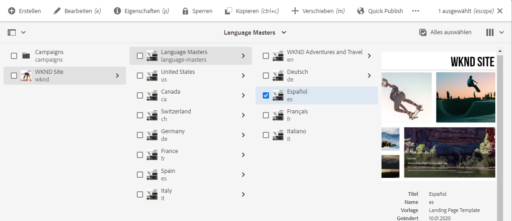
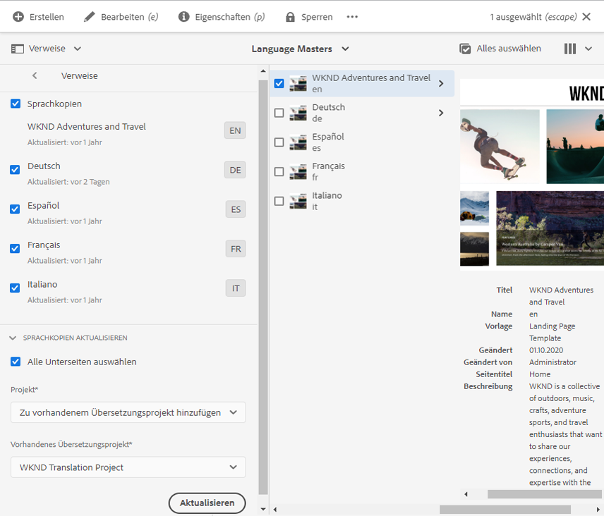
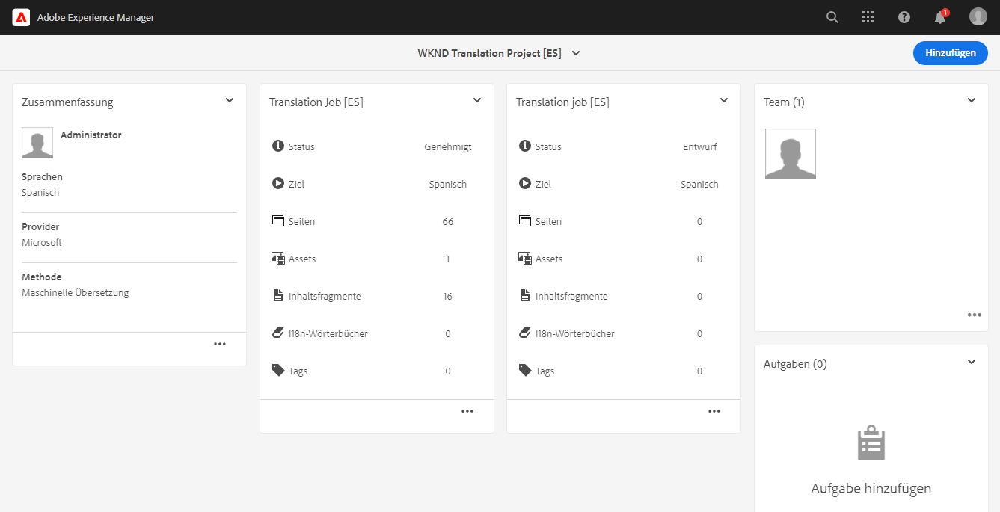
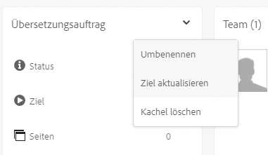
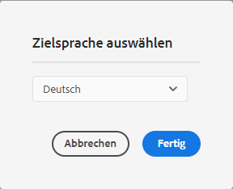

# Veröffentlichen übersetzter Inhalte {#publish-content}

Erfahren Sie, wie Sie Ihre übersetzten Inhalte veröffentlichen und die Übersetzungen aktualisieren, wenn die Inhalte sich ändern.

## Ihre bisherige Tour {#story-so-far}

Im vorherigen Dokument der AEM Sites-Übersetzungs-Tour, [Übersetzen von Inhalten](configure-connector.md), haben Sie gelernt, wie Sie mit AEM-Übersetzungsprojekten Inhalte übersetzen können. Sie sollten jetzt:

* Verstehen, was ein Übersetzungsprojekt ist.
* Neue Übersetzungsprojekte erstellen können.
* Ihre Inhalte mithilfe von Übersetzungsprojekten übersetzen können.

Nun, da Ihre erste Übersetzung abgeschlossen ist, führt Sie dieser Artikel durch den nächsten Schritt zur Veröffentlichung dieser Inhalte und dazu, wie Sie Ihre Übersetzungen aktualisieren können, wenn sich die zugrunde liegenden Inhalte im Sprachstamm ändern.

## Ziel {#objective}

In diesem Dokument erfahren Sie, wie Sie Inhalte in AEM veröffentlichen und einen kontinuierlichen Workflow erstellen, um Ihre Übersetzungen auf dem neuesten Stand zu halten. Nach Lesen dieses Dokuments sollten Sie Folgendes können:

* das Author-Publish-Modell von AEM verstehen.
* wissen, wie Sie Ihre übersetzten Inhalte veröffentlichen können.
* in der Lage sein, ein kontinuierliches Aktualisierungsmodell für Ihre übersetzten Inhalte zu implementieren.

## Author-Publish-Modell von AEM {#author-publish}

Bevor Sie Ihre Inhalte veröffentlichen, sollten Sie das Author-Publish-Modell von AEM verstehen. Vereinfacht ausgedrückt: AEM unterteilt Benutzer des Systems in zwei Gruppen.

1. Diejenigen, die die Inhalte und das System erstellen und verwalten
1. Diejenigen, die die Inhalte aus dem System konsumieren

AEM ist daher physisch in zwei Instanzen unterteilt.

1. Die **Autoreninstanz** ist das System, in dem Inhaltsautorinnen und -autoren und Admins Inhalte erstellen und verwalten.
1. Die **Veröffentlichungsinstanz** ist das System, das die Inhalte für die Verbraucher bereitstellt.

Sobald Inhalte in der Autoreninstanz erstellt wurden, müssen sie in die Veröffentlichungsinstanz übertragen werden, damit sie zur Nutzung verfügbar sind. Der Prozess der Übertragung von der Autoren- zur Veröffentlichungsinstanz wird als **Veröffentlichung** bezeichnet.

## Veröffentlichen der übersetzten Inhalte {#publishing}

Sobald Sie mit dem Status Ihrer übersetzten Inhalte zufrieden sind, müssen diese veröffentlicht werden, damit sie zugänglich werden und genutzt werden können. Diese Aufgabe fällt normalerweise nicht in die Zuständigkeit des Übersetzungsspezialisten, sondern wird hier nur dokumentiert, um den gesamten Workflow zu veranschaulichen.

>[!NOTE]
>
>Nach Abschluss der Übersetzung informiert im Allgemeinen der Übersetzungsspezialist den Inhaltsverantwortlichen darüber, dass die Übersetzungen veröffentlicht werden können. Die Inhaltsverantwortlichen veröffentlichen sie dann.
>
>Die folgenden Schritte sind nur der Vollständigkeit halber aufgeführt.

Die einfachste Möglichkeit, die Übersetzungen zu veröffentlichen, besteht darin, zum Projektordner zu navigieren.

```text
/content/<your-project>/
```

Unter diesem Pfad befinden sich Unterordner für jede Übersetzungssprache und Sie können auswählen, welche veröffentlicht werden sollen.

1. Gehen Sie zu **Navigation** > **Sites** > **Dateien** und öffnen Sie den Projektordner.
1. Hier sehen Sie den Ordner für den Sprachstamm und alle anderen Sprachordner. Wählen Sie die zu veröffentlichenden lokalisierten Sprachen aus.
   
1. Wählen Sie **Veröffentlichung verwalten** aus.
1. Vergewissern Sie sich im Fenster **Veröffentlichung verwalten**, dass unter **Aktion** automatisch **Veröffentlichen** ausgewählt wird und unter **Planung** **Jetzt** ausgewählt ist. Wählen Sie **Weiter** aus.
   
1. Bestätigen Sie im nächsten Fenster, **Veröffentlichung verwalten**, dass die richtigen Pfade ausgewählt sind. Wählen Sie **Veröffentlichen** aus.
   
1. AEM bestätigt die Veröffentlichungsaktion mit einer Popup-Meldung am unteren Bildschirmrand.
   

Ihre übersetzten Inhalte sind jetzt veröffentlicht! Sie können jetzt aufgerufen und genutzt werden.

>[!TIP]
>
>Sie können bei der Veröffentlichung mehrere Elemente (d. h. mehrere Sprachordner) auswählen, um mehrere Übersetzungen gleichzeitig zu veröffentlichen.

Es gibt zusätzliche Optionen bei der Veröffentlichung Ihrer Inhalte, z. B. die Planung einer Veröffentlichungszeit, was aber den Rahmen dieser Tour sprengt. Weitere Informationen finden Sie im Abschnitt [Zusätzliche Ressourcen](#additional-resources) am Ende des Dokuments.

## Aktualisieren Ihrer übersetzten Inhalte {#updating-translations}

Übersetzen ist selten eine einmalige Angelegenheit. In der Regel fügen Ihre Inhaltsautoren regelmäßig Inhalte im Sprachstamm hinzu und ändern sie, nachdem die Erstübersetzung abgeschlossen ist. Dies bedeutet, dass Sie auch Ihre übersetzten Inhalte aktualisieren müssen.

Spezifische Projektanforderungen definieren, wie oft Sie Ihre Übersetzungen aktualisieren müssen und welcher Entscheidungsprozess befolgt wird, bevor Sie eine Aktualisierung durchführen. Sobald Sie sich entschieden haben, Ihre Übersetzungen zu aktualisieren, ist der Prozess in AEM sehr einfach. Da die ursprüngliche Übersetzung auf einem Übersetzungsprojekt basierte, gilt dies auch für alle Aktualisierungen.

Der Prozess unterscheidet sich jedoch geringfügig, je nachdem, ob Sie sich für die automatische oder die manuelle Erstellung Ihres Übersetzungsprojekts entschieden haben.

### Aktualisieren eines automatisch erstellten Übersetzungsprojekts {#updating-automatic-project}

1. Gehen Sie zu **Navigation** > **Assets** > **Dateien**.  Beachten Sie, dass Inhalte in AEM unter `/content` gespeichert werden.
1. Wählen Sie den Sprachstamm Ihres Projekts aus. In diesem Fall haben wir `/content/wknd/en` ausgewählt.
1. Wählen Sie die Leistenauswahl aus und zeigen Sie das Bedienfeld **Verweise** an.
1. Wählen Sie **Sprachkopien** aus.
1. Aktivieren Sie das Kontrollkästchen **Sprachkopien**.
1. Erweitern Sie den Abschnitt **Sprachkopien aktualisieren** unten im Bereich „Verweise“.
1. Wählen Sie in der Dropdown-Liste **Projekt** die Option **Zu vorhandenem Übersetzungsprojekt hinzufügen** aus.
1. Wählen Sie in der Dropdown-Liste **Vorhandenes Übersetzungsprojekt** das Projekt aus, das für die Erstübersetzung erstellt wurde.
1. Wählen Sie **Aktualisieren** aus.



Die Inhalte werden zum vorhandenen Übersetzungsprojekt hinzugefügt. So zeigen Sie das Übersetzungsprojekt an:

1. Gehen Sie zu **Navigation** > **Projekte**.
1. Wählen Sie das soeben aktualisierte Projekt aus.
1. Wählen Sie die Sprache oder eine der Sprachen aus, die Sie aktualisiert haben.

Sie sehen, dass dem Projekt eine neue Auftragskarte hinzugefügt wurde. In diesem Beispiel wurde eine weitere spanische Übersetzung hinzugefügt.



Sie werden feststellen, dass die auf der neuen Karte aufgeführten Statistiken unterschiedlich sind. Dies liegt daran, dass AEM erkennt, was sich seit der letzten Übersetzung geändert hat, und nur die Inhalte einschließt, die übersetzt werden müssen. Dazu gehören die erneute Übersetzung aktualisierter Inhalte sowie die Erstübersetzung neuer Inhalte.

Von diesem Punkt an [beginnen und verwalten Sie Ihren Übersetzungsauftrag genauso wie den ursprünglichen Auftrag](translate-content.md#using-translation-project).

### Aktualisieren eines manuell erstellten Übersetzungsprojekts {#updating-manual-project}

Um eine Übersetzung zu aktualisieren, können Sie Ihrem vorhandenen Projekt einen neuen Auftrag hinzufügen, der für die Übersetzung der aktualisierten Inhalte verantwortlich ist.

1. Gehen Sie zu **Navigation** > **Projekte**.
1. Wählen Sie das Projekt aus, das Sie aktualisieren müssen.
1. Wählen Sie oben im Fenster die Schaltfläche **Hinzufügen** aus.
1. Wählen Sie im Fenster **Kachel hinzufügen** die Option **Übersetzungsauftrag** und dann **Absenden** aus.

   

1. Wählen Sie oben auf der Karte des neuen Übersetzungsauftrags die Schaltfläche mit dem Pfeil und dann **Ziel aktualisieren** aus, um die Zielsprache des neuen Auftrags zu bestimmen.

   

1. Verwenden Sie im Dialogfeld **Zielsprache auswählen** die Dropdown-Liste, um die Sprache festzulegen, und wählen Sie **Fertig** aus.

   

1. Sobald die Zielsprache Ihres neuen Übersetzungsauftrags festgelegt ist, wählen Sie unten auf der Auftragskarte die Schaltfläche mit den Auslassungspunkten aus, um die Details des Auftrags anzuzeigen.
1. Der Auftrag ist beim ersten Erstellen leer. Fügen Sie Inhalte zum Auftrag hinzu, indem Sie auf die Schaltfläche **Hinzufügen** tippen oder klicken und den Pfad-Browser verwenden, [wie Sie es bereits bei der ursprünglichen Erstellung des Übersetzungsprojekts getan haben](translate-content.md##manually-creating).

>[!TIP]
>
>Die leistungsstarken Filter des Pfad-Browsers können wieder nützlich sein, um nur die aktualisierten Inhalte zu finden.
>
>Weitere Informationen zum Pfad-Browser finden Sie im [Abschnitt „Zusätzliche Ressourcen“](#additional-resources).

Von diesem Punkt an [beginnen und verwalten Sie Ihren Übersetzungsauftrag genauso wie den ursprünglichen Auftrag](translate-content.md#using-translation-project).

## Tour beendet? {#end-of-journey}

Herzlichen Glückwunsch! Sie haben die AEM Sites-Übersetzungs-Tour abgeschlossen! Sie sollten jetzt:

* über ein grundlegendes Verständnis der Inhaltsverwaltungsfunktionen in AEM verfügen.
* verstehen, wie die Übersetzungsfunktionen von AEM funktionieren und wie sie mit den Inhalten Ihrer Website zusammenhängen.
* Beginnen Sie mit der Übersetzung Ihrer eigenen Inhalte.

Jetzt können Sie Ihre eigenen Inhalte in AEM übersetzen. AEM ist ein leistungsfähiges Tool und es stehen viele zusätzliche Optionen zur Verfügung. Schauen Sie sich einige der zusätzlichen Ressourcen an, die im Abschnitt [Zusätzliche Ressourcen](#additional-resources) verfügbar sind, um mehr über die Funktionen zu erfahren, die Sie während dieser Tour gesehen haben.

## Zusätzliche Ressourcen {#additional-resources}

* [Verwalten von Übersetzungsprojekten](/help/sites-cloud/administering/translation/managing-projects.md) – Erfahren Sie mehr über die Einzelheiten von Übersetzungsprojekten und über zusätzliche Funktionen wie Workflows für menschliche Übersetzung und mehrsprachige Projekte.
* [Authoring-Konzepte](/help/sites-cloud/authoring/author-publish.md) – Weitere Informationen zum Author-Publish-Modell von AEM. Dieses Dokument konzentriert sich nicht auf Inhaltsfragmente, sondern auf das Authoring von Seiten, aber die Theorie gilt weiterhin.
* [Veröffentlichen von Seiten](/help/sites-cloud/authoring/sites-console/publishing-pages.md) – Erfahren Sie mehr über die zusätzlichen Funktionen, die beim Veröffentlichen von Inhalten verfügbar sind. Dieses Dokument konzentriert sich nicht auf Inhaltsfragmente, sondern auf das Authoring von Seiten, aber die Theorie gilt weiterhin.
* [Autorenumgebung und Tools](/help/sites-cloud/authoring/path-selection.md#path-selection) – AEM bietet verschiedene Mechanismen für die Organisation und Bearbeitung von Inhalten, einschließlich eines robusten Pfad-Browsers.
