# Inhalte übersetzen {#translate-content}

Verwenden Sie den Übersetzungs-Connector und die Regeln, um Ihre Inhalte zu übersetzen.

## Ihre bisherige Tour {#story-so-far}

Im vorherigen Dokument der AEM Sites-Übersetzungs-Tour, [Übersetzungsregeln konfigurieren](translation-rules.md), haben Sie gelernt, wie Sie die Übersetzungsregeln von AEM verwenden, um Ihre zu übersetzenden Inhalte zu ermitteln. Sie sollten jetzt:

* Verstehen, was die Übersetzungsregeln bewirken.
* Eigene Übersetzungsregeln definieren können.

Nachdem Ihr Connector und die Übersetzungsregeln eingerichtet sind, führt Sie dieser Artikel durch den nächsten Schritt zur Übersetzung Ihrer AEM Sites-Inhalte.

## Ziel {#objective}

In diesem Dokument erfahren Sie, wie Sie AEM-Übersetzungsprojekte zusammen mit dem Connector und Ihren Übersetzungsregeln verwenden können, um Inhalte zu übersetzen. Nach dem Lesen dieses Dokuments sollten Sie Folgendes können:

* Verstehen, was ein Übersetzungsprojekt ist.
* neue Übersetzungsprojekte erstellen können.
* Verwenden Sie Übersetzungsprojekte, um Ihre AEM Sites-Inhalte zu übersetzen.

## Übersetzungsprojekt erstellen {#creating-translation-project}

Mithilfe von Übersetzungsprojekten können Sie die Übersetzung von AEM-Inhalten verwalten. Ein Übersetzungsprojekt sammelt die zu übersetzenden Inhalte an einem Ort, um einen zentralen Überblick über den Übersetzungsaufwand zu erhalten.

Wenn einem Übersetzungsprojekt Inhalte hinzugefügt werden, wird ein Übersetzungsauftrag für sie erstellt. Aufträge beinhalten Befehle und Statusinformationen, mit denen Sie die Workflows für menschliche und maschinelle Übersetzungen, die für die Ressourcen ausgeführt werden, verwalten.

Übersetzungsprojekte können auf zwei Arten erstellt werden:

1. Wählen Sie den Sprachstamm des Inhalts aus und lassen Sie AEM das Übersetzungsprojekt automatisch basierend auf dem Inhaltspfad erstellen.
1. Erstellen Sie ein leeres Projekt und wählen Sie manuell die Inhalte aus, die zum Übersetzungsprojekt hinzugefügt werden sollen.

Beide Ansätze unterscheiden sich in der Regel nur je nach der Rolle, die die Übersetzung durchführt:

* Der Übersetzungsprojekt-Manager (TPM) benötigt häufig die Flexibilität, die Inhalte manuell für das Übersetzungsprojekt auszuwählen.
* Wenn der Inhaltsverantwortliche auch für die Übersetzung verantwortlich ist, ist es oft einfacher, das Projekt anhand des ausgewählten Inhaltspfads automatisch von AEM erstellen zu lassen.

Auf beide Ansätze wird in den folgenden Abschnitten eingegangen.

### Automatisches Erstellen eines Übersetzungsprojekts basierend auf dem Inhaltspfad {#automatically-creating}

Für Inhaltsverantwortliche, die auch für die Übersetzung verantwortlich ist, ist es oft einfacher, das Projekt anhand des ausgewählten Inhaltspfads automatisch von AEM erstellen zu lassen. Gehen Sie wie folgt vor, um von AEM automatisch ein Übersetzungsprojekt auf der Grundlage Ihres Inhaltspfads erstellen zu lassen:

1. Gehen Sie zu **Navigation** > **Sites** und wählen Sie Ihr Projekt aus.
1. Suchen Sie den Sprachstamm Ihres Projekts. Wenn Ihr Sprachstamm beispielsweise Englisch ist, `/content/<your-project>/en`.
   * Vor der ersten Übersetzung sind die anderen Sprachordner leere Platzhalter. Diese werden normalerweise vom Inhaltsarchitekten erstellt.
1. Suchen Sie den Sprachstamm Ihres Projekts.
1. Wählen Sie die Leistenauswahl aus und zeigen Sie das Bedienfeld **Verweise** an.
1. Wählen Sie **Sprachkopien** aus.
1. Aktivieren Sie das Kontrollkästchen **Sprachkopien**.
1. Erweitern Sie den Abschnitt **Sprachkopien aktualisieren** unten im Bereich „Verweise“.
1. Wählen Sie in der Dropdown-Liste **Projekt** die Option **Übersetzungsprojekt(e) erstellen** aus.
1. Geben Sie einen passenden Titel für Ihr Übersetzungsprojekt an.
1. Wählen Sie **Aktualisieren** aus.

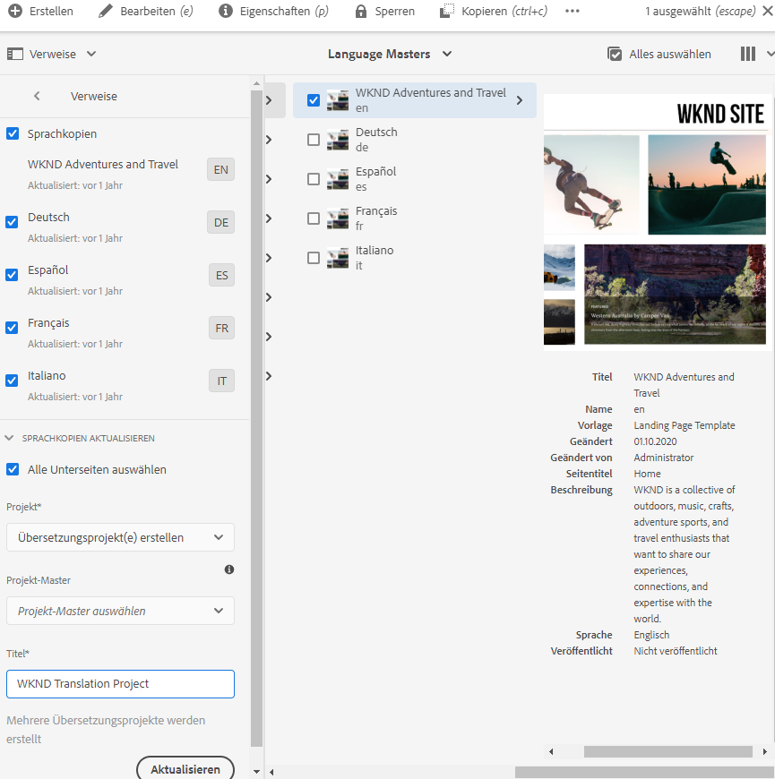

Sie erhalten eine Nachricht, dass das Projekt erstellt wurde.

>[!NOTE]
>
>Es wird davon ausgegangen, dass die für die Sprachen der Übersetzungen erforderliche Sprachstruktur bereits im Rahmen der [Definition der Inhaltsstruktur erstellt wurde](getting-started.md#content-structure). Dies sollte in Zusammenarbeit mit der Inhaltsarchitektin bzw. dem Inhaltsarchitekten erfolgen.
>
>Wenn die Sprachordner nicht vorab erstellt werden, können Sie keine Sprachkopien, wie in den vorherigen Schritten beschrieben, erstellen.

### Manuelles Erstellen eines Übersetzungsprojekts durch Auswahl von Inhalten {#manually-creating}

Für Übersetzungsprojekt-Manager ist es oft erforderlich, bestimmte Inhalte, die in ein Übersetzungsprojekt aufgenommen werden sollen, manuell auszuwählen. Um ein solches manuelles Übersetzungsprojekt zu erstellen, müssen Sie zunächst ein leeres Projekt erstellen und dann die hinzuzufügenden Inhalte auswählen.

1. Gehen Sie zu **Navigation** > **Projekte**.
1. Wählen Sie **Erstellen** > **Ordner** aus, um einen Ordner für Ihre Projekte zu erstellen.
   * Dies ist optional, aber hilfreich, um Ihre Übersetzungsarbeit zu organisieren.
1. Fügen Sie im Fenster **Projekt erstellen** einen **Titel** für den Ordner hinzu und wählen Sie dann **Erstellen** aus.

   

1. Wählen Sie den Ordner aus, um den Ordner zu öffnen.
1. Wählen Sie in Ihrem neuen Projektordner die Option **Erstellen** > **Projekt** aus.
1. Projekte basieren auf Vorlagen. Wählen Sie die Vorlage **Übersetzungsprojekt** aus und anschließend **Weiter**.

   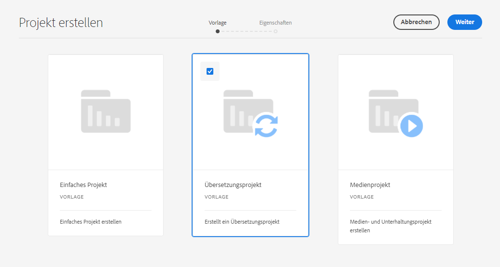

1. Geben Sie in der Registerkarte **Allgemein** einen Namen für Ihr neues Projekt ein.

   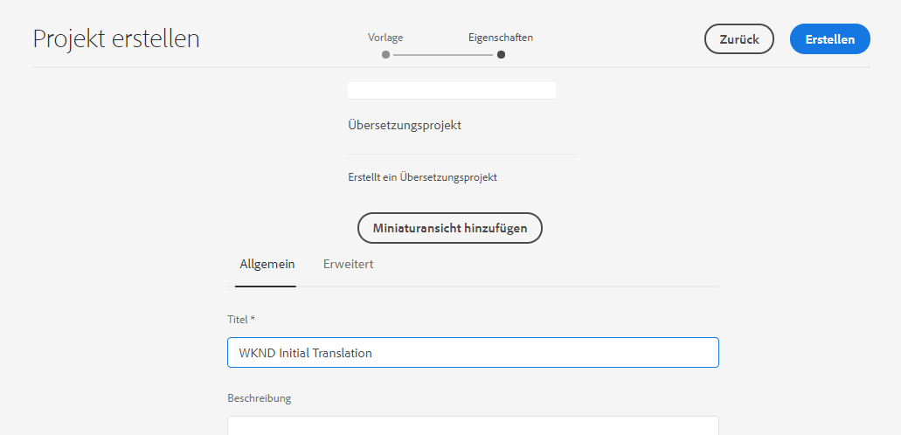

1. Verwenden Sie auf der Registerkarte **Erweitert** die Dropdown-Liste **Zielsprache**, um die Sprachen auszuwählen, in die die Inhalte übersetzt werden sollen. Wählen Sie **Erstellen** aus.

   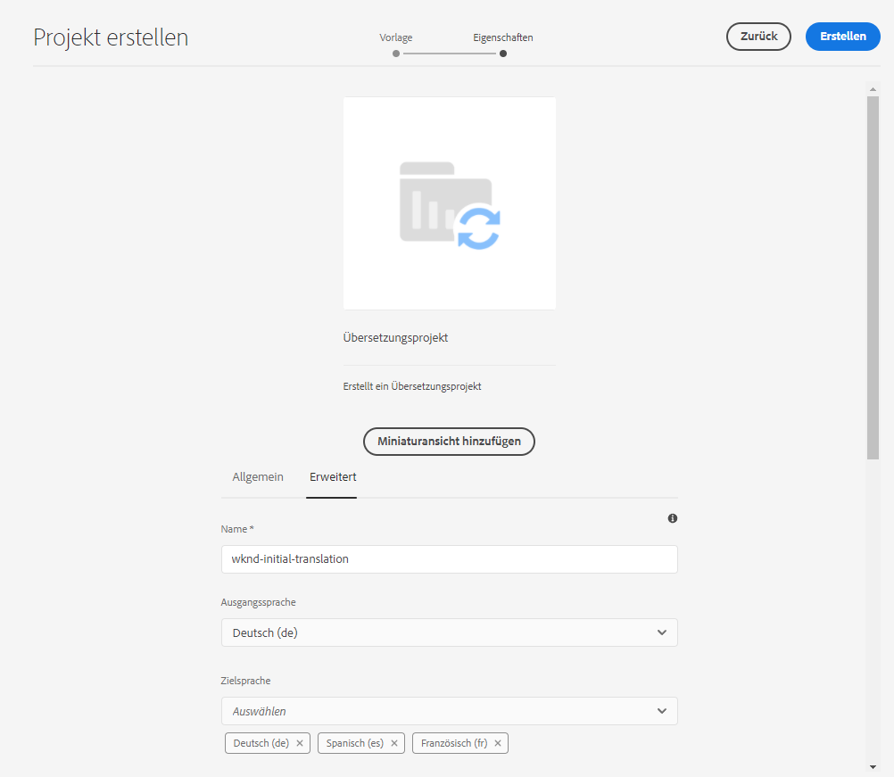

1. Wählen Sie im Bestätigungsdialogfeld die Option **Öffnen** aus.

   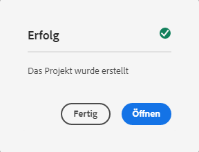

Das Projekt wurde erstellt, enthält jedoch keine zu übersetzenden Inhalte. Im nächsten Abschnitt wird beschrieben, wie das Projekt strukturiert ist und wie Inhalte hinzugefügt werden.

## Verwenden eines Übersetzungsprojekts {#using-translation-project}

Übersetzungsprojekte dienen dazu, alle Inhalte und Aufgaben im Zusammenhang mit einer Übersetzung zentral zu erfassen, damit die Übersetzung einfach verwaltet werden kann.

So zeigen Sie das Übersetzungsprojekt an:

1. Gehen Sie zu **Navigation** > **Projekte**.
1. Wählen Sie das Projekt aus, das im vorherigen Abschnitt erstellt wurde (entweder [Automatisches Erstellen eines Übersetzungsprojekts basierend auf dem Inhaltspfad](#automatically-creating) oder [Manuelles Erstellen eines Übersetzungsprojekts durch Auswahl der Inhalte](#manually-creating), je nach Ihrer Situation).

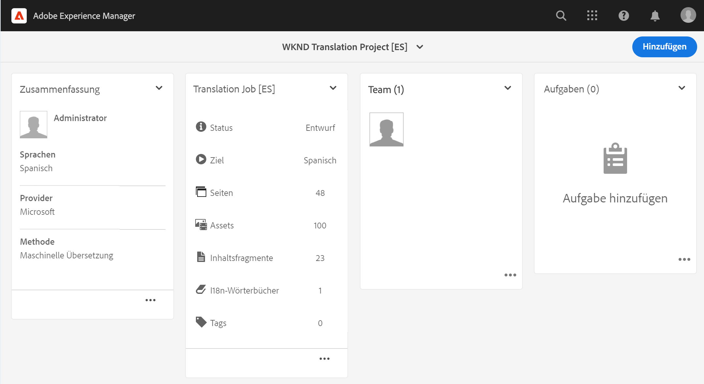

Das Projekt ist in mehrere Karten unterteilt.

* **Zusammenfassung**: Diese Karte zeigt die grundlegenden Kopfzeileninformationen des Projekts, einschließlich des Verantwortlichen, der Sprache und des Übersetzungsdienstleisters.
* **Übersetzungsauftrag**: Diese Karten bieten einen Überblick über den tatsächlichen Übersetzungsauftrag, einschließlich Status, Anzahl der Assets usw. Im Allgemeinen gibt es pro Sprache einen Auftrag, wobei der ISO-2-Sprach-Code an den Auftragsnamen angehängt wird.
   * Wenn [automatisch Übersetzungsaufträge erstellt werden](#automatically-creating), erstellt AEM die Aufträge asynchron und sie erscheinen möglicherweise nicht sofort im Projekt.
* **Team**: Auf dieser Karte werden die Benutzer angezeigt, die an diesem Übersetzungsprojekt mitarbeiten. Diese Tour behandelt dieses Thema nicht.
* **Aufgaben**: Zusätzliche Aufgaben im Zusammenhang mit der Übersetzung der Inhalte, z. B. zum Erstellen von Elementen oder Workflow-Elementen. Diese Tour behandelt dieses Thema nicht.

Um den Übersetzungsfluss in AEM besser zu verstehen, ist eine Änderung an den Projekteinstellungen nützlich. Dieser Schritt ist nicht für Produktionsübersetzungen erforderlich, sondern hilft beim Verständnis des Prozesses.

1. Wählen Sie unten auf der Karte **Zusammenfassung** die Schaltfläche mit den Auslassungspunkten aus.
1. Deaktivieren Sie auf der Registerkarte **Erweitert** die Option **Launch nach Weiterleitung löschen**.

   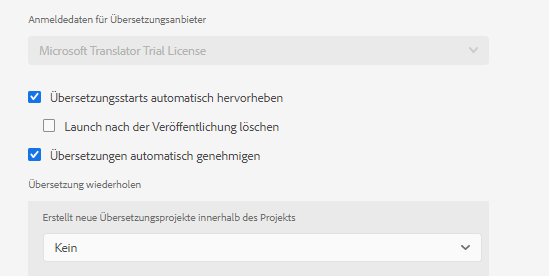

1. Wählen Sie **Speichern und schließen**.

Jetzt können Sie Ihr Übersetzungsprojekt verwenden. Wie Sie ein Übersetzungsprojekt verwenden, hängt davon ab, wie es erstellt wurde: entweder automatisch durch AEM oder manuell.

### Verwenden eines automatisch erstellten Übersetzungsprojekts {#using-automatic-project}

Beim automatischen Erstellen des Übersetzungsprojekts bewertet AEM die Inhalte unter dem von Ihnen ausgewählten Pfad anhand der zuvor definierten Übersetzungsregeln. Basierend auf dieser Auswertung extrahiert es den Inhalt, der übersetzt werden muss, in ein neues Übersetzungsprojekt.

So sehen Sie die Details der in diesem Projekt enthaltenen Inhalte:

1. Wählen Sie unten auf der Karte **Übersetzungsauftrag** die Schaltfläche mit den Auslassungspunkten aus.
1. Im Fenster **Übersetzungsauftrag** werden alle Elemente des Auftrags aufgelistet.

   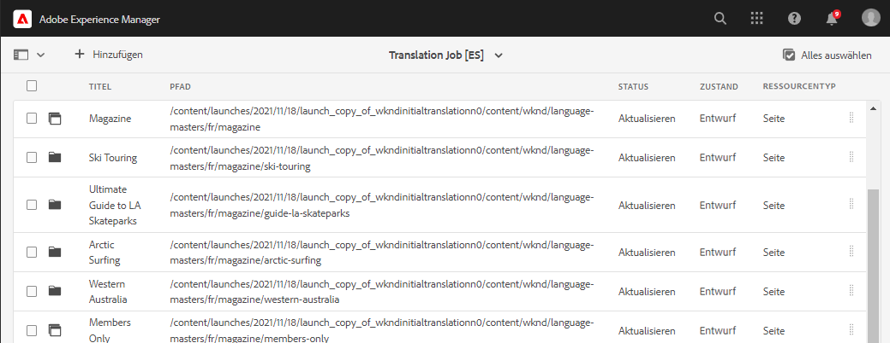

1. Wählen Sie eine Zeile aus, um ihre Details anzuzeigen. Dabei ist zu beachten, dass eine Zeile mehrere zu übersetzende Inhaltselemente darstellen kann.
1. Wählen Sie das Auswahl-Kontrollkästchen für ein Zeilenelement aus, um weitere Optionen anzuzeigen, z. B. die Option, es aus dem Auftrag zu löschen oder es in der Sites-Konsole anzuzeigen.

   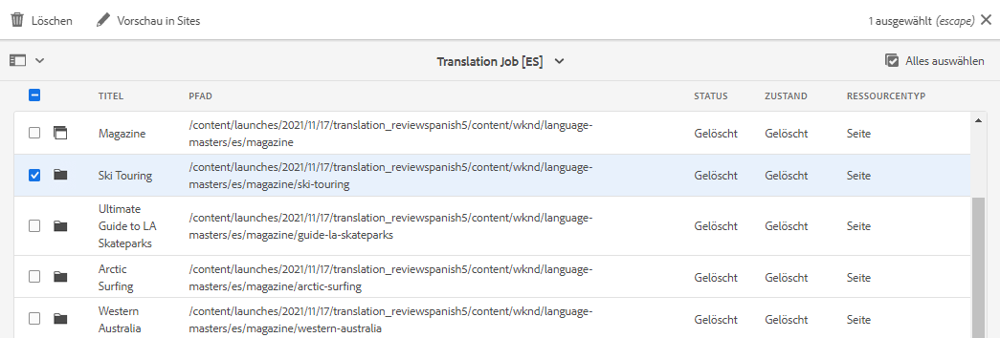

Normalerweise beginnt der Inhalt des Übersetzungsauftrags im Status **Entwurf**, wie in der Spalte **Status** im Fenster **Übersetzungsauftrag** angegeben.

Um den Übersetzungsauftrag zu starten, kehren Sie zur Übersicht des Übersetzungsprojekts zurück und wählen Sie die Pfeil-Schaltfläche oben in der Karte **Übersetzungsauftrag** und dann **Starten** aus.

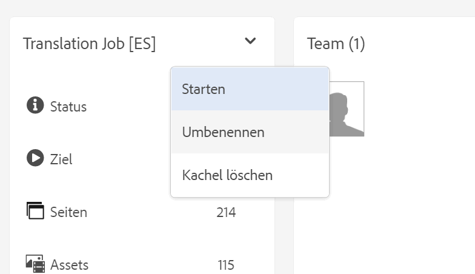

AEM kommuniziert nun mit Ihrer Übersetzungskonfiguration und dem Connector, um den Inhalt an den Übersetzungsdienstleister zu senden. Sie können den Fortschritt der Übersetzung verfolgen, indem Sie zum Fenster **Übersetzungsauftrag** zurückkehren und in der Spalte **Status** der Einträge nachsehen.

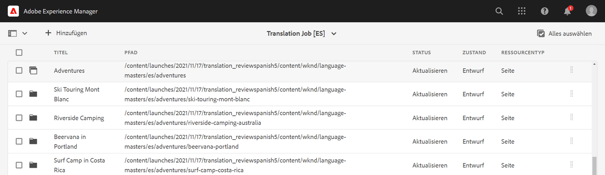

Maschinelle Übersetzungen werden automatisch mit dem Status **Genehmigt** zurückgegeben. Die menschliche Übersetzung ermöglicht mehr Interaktion, aber das würde den Rahmen dieser Tour sprengen.

>[!TIP]
>
>Die Verarbeitung eines Übersetzungsauftrags kann einige Zeit in Anspruch nehmen. Möglicherweise wechseln Ihre Übersetzungselemente vom Status **Entwurf** nach **Übersetzung läuft** und zu **Bereit zur Überprüfung**, bevor sie den Status **Genehmigt** erhalten. Dies ist zu erwarten.

>[!NOTE]
>
>Wenn Sie die Projektoption **Launch nach der Veröffentlichung löschen** nicht deaktiviert haben, wie [im vorherigen Abschnitt beschrieben](#using-translation-project), erscheinen übersetzte Elemente mit dem Status **Gelöscht**. Dies ist normal, da AEM die Übersetzungseinträge automatisch verwirft, sobald die übersetzten Elemente eintreffen. Die übersetzten Elemente wurden als Sprachkopien importiert, nur die Übersetzungseinträge wurden gelöscht, da sie nicht mehr benötigt werden.
>
>Machen Sie sich keine Gedanken, wenn das unklar ist. Dies sind ausführliche Details, wie AEM funktioniert und beeinflussen nicht Ihr Verständnis der Tour. Wenn Sie mehr darüber erfahren möchten, wie AEM Übersetzungen verarbeitet, lesen Sie den Abschnitt [Zusätzliche Ressourcen](#additional-resources) am Ende dieses Artikels.

### Verwenden eines manuell erstellten Übersetzungsprojekts {#using-manual-project}

Beim manuellen Erstellen eines Übersetzungsprojekts erstellt AEM die erforderlichen Aufträge, wählt jedoch nicht automatisch die Inhalte aus, die in diese Aufträge aufgenommen werden sollen. Dadurch kann der Übersetzungsprojekt-Manager flexibel entscheiden, welche Inhalte übersetzt werden sollen.

So fügen Sie einem Übersetzungsauftrag Inhalte hinzu:

1. Wählen Sie die Schaltfläche mit den Auslassungszeichen unten auf einer der Karten **Übersetzungsauftrag** aus.
1. Stellen Sie sicher, dass der Auftrag keinen Inhalt enthält. Wählen Sie die Schaltfläche **Hinzufügen** oben im Fenster aus und wählen Sie dann aus der Dropdown-Liste **Assets/Seiten** aus.

   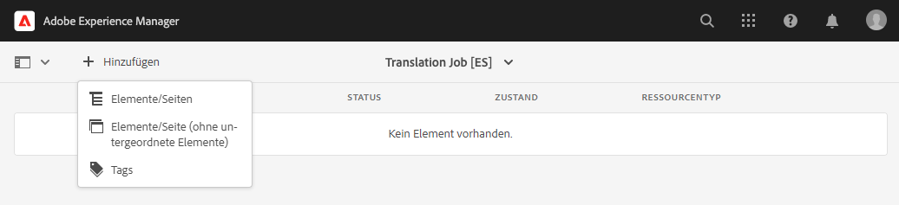

1. Ein Pfad-Browser wird geöffnet, in dem Sie auswählen können, welche Inhalte hinzugefügt werden sollen. Suchen Sie den Inhalt und wählen Sie ihn aus.

   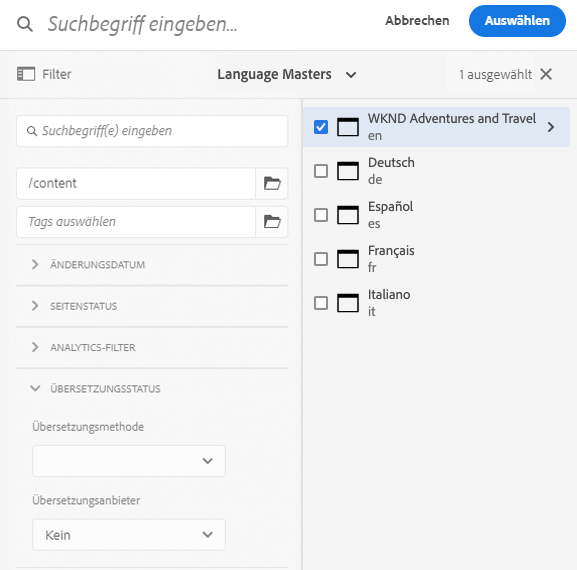

1. Wählen Sie **Auswählen** aus, um die ausgewählten Inhalte zum Auftrag hinzuzufügen.
1. Geben Sie im Dialogfeld **Übersetzen** an, dass Sie eine **Sprachkopie erstellen** möchten.

   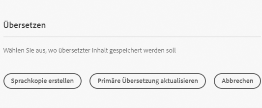

1. Der Inhalt ist jetzt im Auftrag enthalten.

   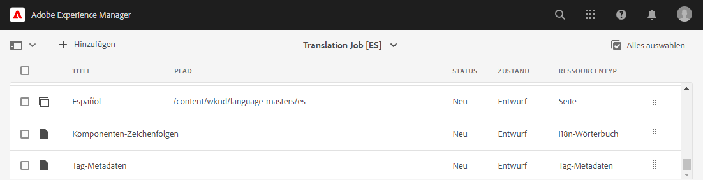

1. Wählen Sie das Auswahl-Kontrollkästchen für ein Zeilenelement aus, um weitere Optionen anzuzeigen, z. B. die Option, es aus dem Auftrag zu löschen oder es in der Sites-Konsole anzuzeigen.

   

1. Wiederholen Sie diese Schritte, um alle erforderlichen Inhalte in den Auftrag einzuschließen.

>[!TIP]
>
>Der Pfad-Browser ist ein leistungsstarkes Tool, mit dem Sie Inhalte suchen, filtern und darin navigieren können. Wählen Sie die Schaltfläche **Nur Inhalt/Filter** zum Umschalten des Seitenbereichs und zum Einblenden erweiterter Filter wie **Änderungsdatum** oder **Übersetzungsstatus**.
>
>Weitere Informationen zum Pfad-Browser finden Sie im [Abschnitt „Zusätzliche Ressourcen“](#additional-resources).

Sie können die vorherigen Schritte verwenden, um die erforderlichen Inhalte zu allen Sprachen (Aufträgen) für das Projekt hinzuzufügen. Nachdem Sie alle Inhalte ausgewählt haben, können Sie mit der Übersetzung beginnen.

Normalerweise beginnt der Inhalt des Übersetzungsauftrags im Status **Entwurf**, wie in der Spalte **Status** im Fenster **Übersetzungsauftrag** angegeben.

Um den Übersetzungsauftrag zu starten, kehren Sie zur Übersicht des Übersetzungsprojekts zurück und wählen Sie die Pfeil-Schaltfläche oben in der Karte **Übersetzungsauftrag** und dann **Starten** aus.


AEM kommuniziert nun mit Ihrer Übersetzungskonfiguration und dem Connector, um den Inhalt an den Übersetzungsdienstleister zu senden. Sie können den Fortschritt der Übersetzung verfolgen, indem Sie zum Fenster **Übersetzungsauftrag** zurückkehren und in der Spalte **Status** der Einträge nachsehen.


Maschinelle Übersetzungen werden automatisch mit dem Status **Genehmigt** zurückgegeben. Die menschliche Übersetzung ermöglicht mehr Interaktion, aber das würde den Rahmen dieser Tour sprengen.

>[!TIP]
>
>Die Verarbeitung eines Übersetzungsauftrags kann einige Zeit in Anspruch nehmen. Möglicherweise wechseln Ihre Übersetzungselemente vom Status **Entwurf** nach **Übersetzung läuft** und zu **Bereit zur Überprüfung**, bevor sie den Status **Genehmigt** erhalten. Dies ist zu erwarten.

>[!NOTE]
>
>Wenn Sie die Projektoption **Launch nach der Veröffentlichung löschen** nicht deaktiviert haben, wie [im vorherigen Abschnitt beschrieben](#using-translation-project), erscheinen übersetzte Elemente mit dem Status **Gelöscht**. Dies ist normal, da AEM die Übersetzungseinträge automatisch verwirft, sobald die übersetzten Elemente eintreffen. Die übersetzten Elemente wurden als Sprachkopien importiert, nur die Übersetzungseinträge wurden gelöscht, da sie nicht mehr benötigt werden.
>
>Machen Sie sich keine Gedanken, wenn das unklar ist. Dies sind ausführliche Details, wie AEM funktioniert und beeinflussen nicht Ihr Verständnis der Tour. Wenn Sie mehr darüber erfahren möchten, wie AEM Übersetzungen verarbeitet, lesen Sie den Abschnitt [Zusätzliche Ressourcen](#additional-resources) am Ende dieses Artikels.

## Überprüfen übersetzter Inhalte {#reviewing}

[Wie bereits erwähnt](#using-translation-project), fließen maschinell übersetzte Inhalte mit dem Status **Genehmigt** zurück in AEM, da davon ausgegangen wird, dass aufgrund der maschinellen Übersetzung kein menschliches Eingreifen erforderlich ist. Es ist jedoch noch möglich, die übersetzten Inhalte zu überprüfen.

Wechseln Sie einfach zum abgeschlossenen Übersetzungsauftrag und wählen Sie ein Zeilenelement aus, indem Sie auf das Kontrollkästchen tippen oder klicken. Das Symbol **Vorschau in Sites** wird in der Symbolleiste angezeigt.

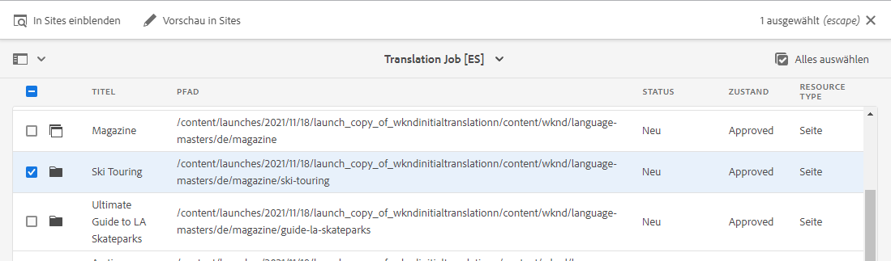

Wählen Sie dieses Symbol, um die übersetzten Inhalte in der Konsole zu öffnen und die Details der übersetzten Inhalte anzuzeigen.

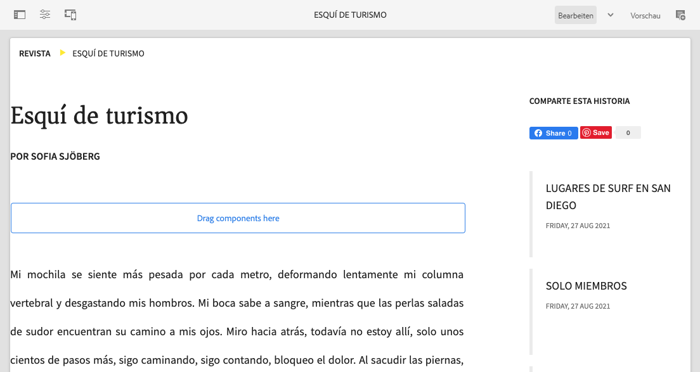

Sie können die übersetzten Inhalte nötigenfalls weiter verändern, vorausgesetzt Sie verfügen über die entsprechenden Berechtigungen, aber die Bearbeitung von Inhalten sprengt den Rahmen dieser Tour. Weitere Informationen zu diesem Thema finden Sie im Abschnitt [Zusätzliche Ressourcen](#additional-resources) am Ende dieses Dokuments.

Ziel des Projekts ist es, alle Ressourcen, die mit einer Übersetzung verbunden sind, an einem Ort zu sammeln, um einen einfachen Zugriff und einen klaren Überblick zu erhalten. Wie Sie jedoch sehen können, indem Sie die Details eines übersetzten Elements anzeigen, fließen die Übersetzungen selbst zurück in den Sites-Ordner der Übersetzungssprache. In diesem Beispiel lautet der Ordner

```text
/content/<your-project>/es
```

Wenn Sie über **Navigation** > **Sites** zu diesem Ordner wechseln, sehen Sie die übersetzten Inhalte.

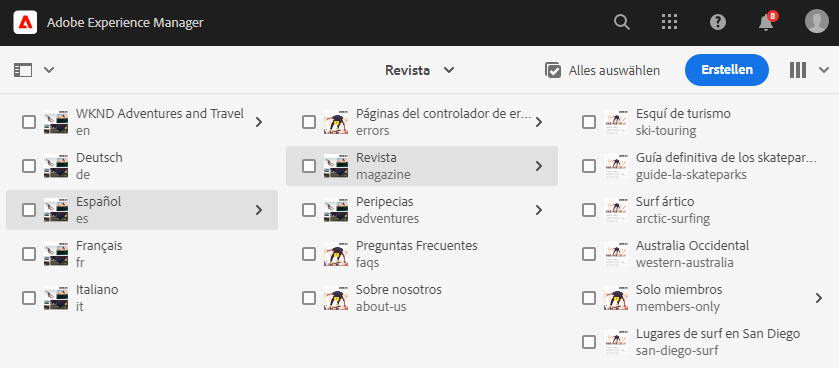

Das AEM-Übersetzungs-Framework erhält die Übersetzungen vom Übersetzungs-Connector und erstellt dann automatisch die Inhaltsstruktur basierend auf dem Sprachstamm und unter Verwendung der vom Connector bereitgestellten Übersetzungen.

Es ist wichtig zu verstehen, dass diese Inhalte nicht veröffentlicht werden und daher nicht für den Verbrauch verfügbar sind. Im nächsten Schritt der Übersetzungs-Journey lernen Sie diese Author-/Publish-Struktur kennen und erfahren, wie Sie die übersetzten Inhalte veröffentlichen.

## Menschliche Übersetzung {#human-translation}

Wenn Ihr Übersetzungsdienstleister menschliche Übersetzung bereitstellt, bietet der Überprüfungsprozess mehr Optionen. Übersetzungen gelangen beispielsweise mit dem Status **Entwurf** zurück in das Projekt und müssen manuell überprüft und genehmigt oder abgelehnt werden.

Die menschliche Übersetzung sprengt den Rahmen dieser Tour zur Lokalisierung. Weitere Informationen zu diesem Thema finden Sie im Abschnitt [Zusätzliche Ressourcen](#additional-resources) am Ende dieses Dokuments. Abgesehen von den zusätzlichen Genehmigungsoptionen ist der Workflow für menschliche Übersetzungen mit dem für maschinelle Übersetzungen identisch, wie in dieser Tour beschrieben.

## So geht es weiter {#what-is-next}

Nachdem Sie nun diesen Teil der AEM Sites-Übersetzungs-Tour abgeschlossen haben, sollten Sie:

* verstehen, was ein Übersetzungsprojekt ist.
* Neue Übersetzungsprojekte erstellen können.
* Ihre Inhalte mithilfe von Übersetzungsprojekten übersetzen können.

Bauen Sie auf diesem Wissen auf und setzen Sie Ihre AEM Sites-Übersetzungs-Journey fort, indem Sie als Nächstes das Dokument [Veröffentlichen von übersetzten Inhalten](publish-content.md) lesen, in dem Sie lernen, wie Sie Ihre übersetzten Inhalte veröffentlichen und wie Sie diese Übersetzungen aktualisieren, wenn sich Ihr Sprachstamminhalt ändert.

## Zusätzliche Ressourcen {#additional-resources}

Es wird zwar empfohlen, mit dem nächsten Teil der Übersetzungs-Tour fortzufahren, indem Sie das Dokument [Veröffentlichen übersetzter Inhalte](publish-content.md) lesen. Im Folgenden finden Sie jedoch einige zusätzliche optionale Ressourcen, die einige der in diesem Dokument erwähnten Konzepte vertiefen, aber nicht erforderlich sind, um die Tour fortzusetzen.

* [Verwalten von Übersetzungsprojekten](/help/sites-cloud/administering/translation/managing-projects.md) – Erfahren Sie mehr über die Einzelheiten von Übersetzungsprojekten und über zusätzliche Funktionen wie Workflows für menschliche Übersetzung und mehrsprachige Projekte.
* [Autorenumgebung und Tools](/help/sites-cloud/authoring/path-selection.md#path-selection) – AEM bietet verschiedene Mechanismen für die Organisation und Bearbeitung von Inhalten, einschließlich eines robusten Pfad-Browsers.
