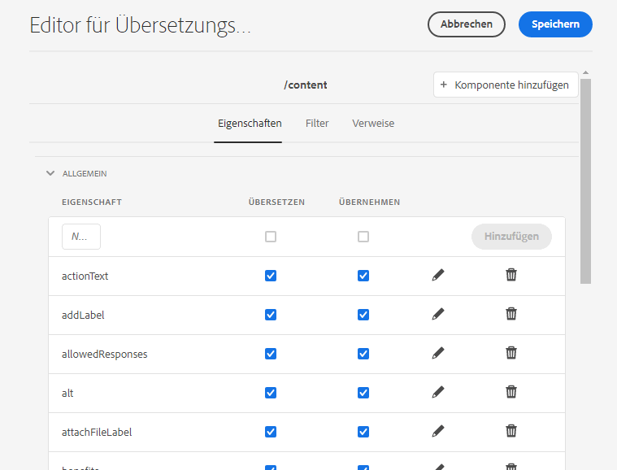

# Konfigurieren von Übersetzungsregeln {#configure-translation-rules}

Erfahren Sie, wie Sie Übersetzungsregeln definieren, um zu übersetzende Inhalte zu identifizieren.

## Die bisherige Entwicklung {#story-so-far}

Im vorherigen Dokument der AEM Sites-Übersetzungs-Tour, [Konfigurieren des Übersetzungs-Connectors](configure-connector.md), haben Sie gelernt, wie Sie Ihren Übersetzungs-Connector installieren und konfigurieren, und sollten jetzt:

* die wichtigen Parameter des Translation Integration Framework in AEM verstehen.
* in der Lage sein, Ihre eigene Verbindung zu Ihrem Übersetzungs-Service einzurichten.

Nachdem Sie Ihren Connector eingerichtet haben, führt Sie dieser Artikel durch den nächsten Schritt, um herauszufinden, welche Inhalte übersetzt werden müssen.

## Ziel {#objective}

In diesem Dokument erfahren Sie, wie Sie die Übersetzungsregeln von AEM zur Identifizierung Ihres Übersetzungsinhalts nutzen. Nach dem Lesen dieses Dokuments sollten Sie Folgendes können:

* Verstehen, was die Übersetzungsregeln bewirken.
* Eigene Übersetzungsregeln definieren können.

## Übersetzungsregeln {#translation-rules}

AEM Sites-Seiten können viele Informationen enthalten. Entsprechend Ihren Projektanforderungen müssen wahrscheinlich nicht alle Informationen auf einer Seite übersetzt werden.

Übersetzungsregeln identifizieren die Inhalte, die in Übersetzungsprojekten enthalten oder von diesen ausgeschlossen sind. Wenn Inhalte übersetzt werden, extrahiert AEM den Inhalt oder sammelt ihn anhand dieser Regeln. Auf diese Weise werden nur Inhalte an den Übersetzungs-Service gesendet, die übersetzt werden müssen.

Die Übersetzungsregeln umfassen die folgenden Informationen:

* Den Pfad der Inhalte, auf die die Regel angewendet wird
   * Die Regel gilt auch für die nachfolgenden Elemente der Inhalte
* Die Namen der Eigenschaften, die die zu übersetzenden Inhalte enthalten
   * Die Eigenschaft kann sich speziell auf einen bestimmten Ressourcentyp oder auf alle Ressourcentypen beziehen

AEM erstellt automatisch Übersetzungsregeln für Seiten von Websites. Da jedoch die Anforderungen jedes Projekts unterschiedlich sind, ist es wichtig, dass Sie wissen, wie Sie die Regeln überprüfen und an Ihr Projekt anpassen können.

## Erstellen von Übersetzungsregeln {#creating-rules}

Es können mehrere Regeln erstellt werden, um komplexe Übersetzungsanforderungen zu unterstützen. Beispielsweise müssen für ein Projekt, an dem Sie arbeiten, alle Seiteninformationen übersetzt werden. Auf einer anderen Seite dürfen jedoch nur Beschreibungen übersetzt werden, während Titel unübersetzt bleiben.

Übersetzungsregeln sind für solche Szenarien konzipiert. In diesem Beispiel veranschaulichen wir jedoch, wie Regeln erstellt werden, indem wir uns auf eine einfache, einzelne Konfiguration konzentrieren.

Es gibt eine **Übersetzungskonfigurations**-Konsole, die zum Konfigurieren von Übersetzungsregeln verfügbar ist.

So können Sie darauf zugreifen:

1. Gehen Sie zu **Tools** > **Allgemein**.
1. Wählen Sie **Übersetzungskonfiguration** aus.

AEM erstellt automatisch Übersetzungsregeln für alle Inhalte. So zeigen Sie diese Regeln an:

1. Wählen Sie den Kontext `/content` aus.
1. Wählen Sie in der Symbolleiste die Option **Bearbeiten** aus.
1. Der Editor für Übersetzungsregeln wird mit den Regeln geöffnet, die automatisch für den Pfad `/content` erstellt wurden.

   

1. Seiteneigenschaften, die übersetzt werden, befinden sich unter dem Abschnitt **Allgemein** der Liste. Sie können bestehende Eigenschaftsnamen, die Sie explizit in die Übersetzung einbeziehen möchten, hinzufügen oder aktualisieren.
   1. Geben Sie den Eigenschaftsnamen in das Feld **Neue Eigenschaft** ein. Die Optionen **Übersetzen** und **Übernehmen** werden automatisch aktiviert.
   1. Wählen Sie **Hinzufügen**.
   1. Wiederholen Sie diese Schritte für alle Felder, die Sie übersetzen müssen.
   1. Wählen Sie **Speichern** aus.

Sie haben jetzt Ihre Übersetzungsregeln konfiguriert.

>[!NOTE]
>
>AEM erstellt Übersetzungsregeln automatisch. Für eine einfache Einrichtung einer Überstzung oder zum Testen eines Übersetzungs-Workflows ist es nicht erforderlich, neue Regeln zu erstellen oder die vorhandenen, automatisch erstellten Regeln zu ändern. Die Details dieser Schritte werden vorgestellt, um die Funktionsweise der Regeln zu erläutern und den Kontext zu verdeutlichen, wie AEM Übersetzungen verarbeitet.

>[!TIP]
>
>Es ist auch möglich, Regeln nur für Ihren bestimmten Pfad oder Projekt zu erstellen, indem Sie auf die Schaltfläche **Kontext hinzufügen** in der Übersetzungskonfigurationskonsole klicken. Dies sprengt jedoch den Rahmen dieser Tour.

## Erweiterte Verwendung {#advanced-usage}

Es gibt verschiedene weitere Eigenschaften, die als Teil Ihrer Übersetzungsregeln konfiguriert werden können. Darüber hinaus können Sie Ihre Regeln manuell als XML spezifizieren, was mehr Spezifität und Flexibilität ermöglicht.

Diese Funktionen sind im Allgemeinen nicht erforderlich, um mit der Lokalisierung Ihrer Inhalte zu beginnen. Sie können sie jedoch im Abschnitt [Zusätzliche Ressourcen](#additional-resources) nachlesen, wenn Sie Interesse haben.

## Wie geht es weiter {#what-is-next}

Nachdem Sie nun diesen Teil der AEM Sites-Übersetzungs-Tour abgeschlossen haben, sollten Sie:

* Verstehen, was die Übersetzungsregeln bewirken.
* Eigene Übersetzungsregeln definieren können.

Bauen Sie auf diesem Wissen auf und setzen Sie Ihre Übersetzungs-Tour durch AEM Sites fort, indem Sie als Nächstes das Dokument [Inhalte übersetzen](translate-content.md) lesen. Dort erfahren Sie, wie Ihr Connector und Ihre Regeln zusammenarbeiten, um Inhalte zu übersetzen.

## Zusätzliche Ressourcen {#additional-resources}

Es wird zwar empfohlen, mit dem nächsten Teil der Übersetzungs-Journey fortzufahren, indem Sie das Dokument [Inhalte übersetzen](translate-content.md) lesen. Im Folgenden finden Sie einige zusätzliche optionale Ressourcen, die einige in diesem Dokument erwähnte Konzepte vertiefen. Sie sind jedoch nicht erforderlich, um mit der Journey fortzufahren.

* [Ermitteln von zu übersetzenden Inhalten](/help/sites-cloud/administering/translation/rules.md): Erfahren Sie, wie Übersetzungsregeln Inhalte ermitteln, die übersetzt werden müssen.
