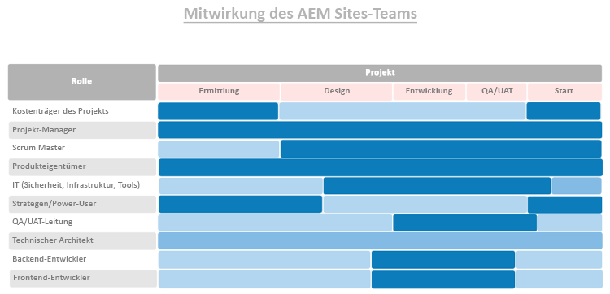
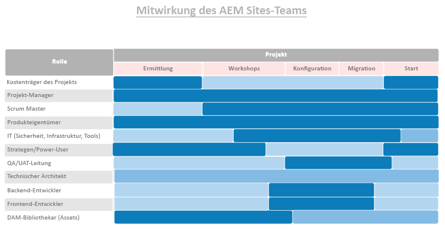

# **Zuerst die richtigen Menschen in die richtigen Rollen bringen**

>[!CONTEXTUALHELP]
>id="aemcloud_chooseteam"
>title="Wählen Sie das rechte Team"
>abstract="Stellen Sie die richtigen Mitarbeiter in die richtigen Positionen ein, um Ihre Adobe Experience Manager-Bereitstellung erfolgreich zu gestalten."
>additional-url="https://experienceleague.adobe.com/docs/experience-manager-cloud-service/onboarding/best-practices/aligning-kpis.html?lang=en" text="KPIs ausrichten"
>additional-url="https://experienceleague.adobe.com/docs/experience-manager-cloud-service/onboarding/best-practices/assessing-kpis.html?lang=en" text="Bewertung der KPIs"

Es besteht die Möglichkeit, dass in Ihrer Organisation mehrere Abteilungen unterschiedliche Aspekte der digitalen Erfahrung besitzen. Ohne Regierungsführung ist die Bühne für endlose Debatten, Machtkämpfe und Verwirrung gerüstet.

Digital Governance-Beginn, die herausfinden, wer für welche Aufgabe verantwortlich ist und wer welche Aufgabe mit digitaler Ausrichtung macht. Möglicherweise müssen Sie strategisch etwas einstellen, um die erforderlichen Fähigkeiten hinzuzufügen. Eine noch größere Herausforderung ist es, einen Kulturwandel voranzutreiben — breite Unterstützung für die neue Technologie zu schaffen und Menschen dabei zu helfen, sich an neue Methoden der Daseinsvorsorge zu gewöhnen. Ein wichtiger Teil dieser Bemühungen ist die Schaffung einer digitalen Gemeinschaft, die es den Menschen ermöglicht, voneinander zu lernen und sich gegenseitig zu unterstützen.

Vorerst konzentrieren wir uns darauf, die richtigen Mitarbeiter in die richtigen Positionen zu stellen, um Ihre Adobe Experience Manager-Implementierung voranzutreiben. Für jedes Kernprodukt — Experience Manager-Sites und Experience Manager-Assets — Wir haben eine Liste von Rollen, die Sie erfüllen müssen, zusammen mit den Fähigkeiten, dem Kenntnisstand und den Attributen, die Menschen in den verschiedenen Rollen effektiv machen.

Diese Woche haben Sie die Aufgabe, beide Listen mit Ihrem Implementierungsteam zu überprüfen und sicherzustellen, dass Sie über entsprechende Qualifikationen für jede Rolle verfügen.

## **Schlüsselrollen für AEM Experience Manager-Sites**

Ein erfolgreiches Team braucht neun Personen auf den richtigen Plätzen — genau wie Ihr Bereitstellungsteam. Ihr Erfolg bei Adobe Experience Manager Sites hängt von der Stärke Ihrer Teammitglieder und von der Kooperationsbereitschaft ab. Vergewissern Sie sich, dass diesen neun Rollen
für Personen mit den vorgeschlagenen Qualifikationen.

| Rolle | Fähigkeiten | Leistungsstufe | Qualität |
|--- |--- |--- |--- |
| Projektmanager | PMP-Zertifizierung, Agile-Zertifizierung, Erfahrung im Risikomanagement | Experte | Faire, konsequente, rechenschaftspflichtige, organisierte, positive, anständige, willkürliche, den Wandel akzeptable |
| Scrum Übergeordnet | ScrumMaster-Zertifizierung, Agile-Zertifizierung, Erleichterung | Experte | Konsistent, kreativ |
| Produkteigentümer | Agile Zertifizierung, tiefes Verständnis der Geschäftsanforderungen | Experte | Ausgewogen, selbstbewusst |
| IT-Interessenten für Sicherheit, Infrastruktur, Werkzeuge | CISM-Zertifizierung, Adobe Experience Manager Component Developer-Zertifizierung | Experte | Detailorientiert |
| Strategen/Power-Benutzer | Kompetenz in Adobe Experience Manager Sites | Hinweise zum Experten | Tenaciös, neugierig, gründlich, aufgeschlossen, bereit, Veränderung anzunehmen, kooperativ |
| QA/UAT-Interessent | Agile-Zertifizierung, Kenntnisse von SDLC | Hinweise zum Zwischenspeichern | Detail-orientiert, Prozessantrieb, konsistent |
| Technischer Architekt | Erfahrung in der IT-Infrastruktur | Experte | Detail-orientiert, prozessgesteuert, konsistent |
| Back-End-Entwickler | Agile Zertifizierung, Erfahrung in der Computerprogrammierung und Informatik | Hinweise zum Zwischenspeichern | Detail-orientiert, prozessgesteuert, konsistent |
| Front-End-Entwickler | Agile-Zertifizierung, Verständnis von HTML, CSS und JavaScript | Hinweise zum Zwischenspeichern | Detail-orientiert, prozessgesteuert, konsistent |

Nachdem Sie wissen, welche Rollen erforderlich sind, sehen Sie sich das folgende Diagramm an, um zu sehen, wann jede Rolle im Implementierungsprozess zum Tragen kommt.

 

**Überprüfen Sie diese Liste mit Ihrem Implementierungsteam und stellen Sie sicher, dass Sie in jeder Rolle über entsprechende Qualifikationen verfügen.** Teammitglieder, die mit Adobe Experience Cloud weniger vertraut sind, können [Experience League](https://experienceleague.adobe.com/#recommended/solutions/experience-manager)-Lernressourcen verwenden, um sich über [Adobe Digital Learning](https://learning.adobe.com/certification.html) zertifizieren zu lassen.

## **Schlüsselrollen für AEM Experience Manager-Assets**

Vom Architekten bis zum ScrumMaster ist jede Rolle in diesem Team unverzichtbar — — einschließlich der DAM-Bibliothek.

Möglicherweise benötigen Sie bereits die meisten Personen, um eine erfolgreiche Implementierung von Adobe Experience Manager Assets durchzuführen. Diese Liste ähnelt der für Adobe Experience Manager Sites mit einer wichtigen Ergänzung: Sie benötigen eine Bibliothek, um sicherzustellen, dass Ihre digitalen Assets so organisiert und beschriftet sind, dass sie leicht zu finden sind.

| Rolle | Fähigkeiten | Leistungsstufe | Qualität |
|--- |--- |--- |--- |
| Projektmanager | PMP-Zertifizierung, Agile-Zertifizierung, Erfahrung im Risikomanagement | Experte | Faire, konsequente, rechenschaftspflichtige, organisierte, positive, anständige, willkürliche, den Wandel akzeptable |
| Scrum Übergeordnet | ScrumMaster-Zertifizierung, Agile-Zertifizierung, Erleichterung | Experte | Konsistent, kreativ |
| Produkteigentümer | Agile Zertifizierung, tiefes Verständnis der Geschäftsanforderungen | Experte | Ausgewogen, selbstbewusst |
| IT-Interessenten für Sicherheit, Infrastruktur, Werkzeuge | CISM-Zertifizierung, Adobe Experience Manager Component Developer-Zertifizierung | Experte | Detailorientiert |
| Strategen/Power-Benutzer | Kompetenz in Adobe Experience Manager Sites | Hinweise zum Experten | Tenaciös, neugierig, gründlich, aufgeschlossen, bereit, Veränderung anzunehmen, kooperativ |
| QA/UAT-Interessent | Agile-Zertifizierung, Kenntnisse von SDLC | Hinweise zum Zwischenspeichern | Detail-orientiert, Prozessantrieb, konsistent |
| Technischer Architekt | Erfahrung in der IT-Infrastruktur | Experte | Detail-orientiert, prozessgesteuert, konsistent |
| Back-End-Entwickler | Agile Zertifizierung, Erfahrung in der Computerprogrammierung und Informatik | Hinweise zum Zwischenspeichern | Detail-orientiert, prozessgesteuert, konsistent |
| Front-End-Entwickler | Agile-Zertifizierung, Verständnis von HTML, CSS und JavaScript | Hinweise zum Zwischenspeichern | Detail-orientiert, prozessgesteuert, konsistent |
| DAM Librarian | Bibliothekswissenschaften - Hintergrund und Hochschulabschluss | Experte | Detail-orientiert, prozessgesteuert, organisiert |

Nachdem Sie wissen, welche Rollen erforderlich sind, sehen Sie sich das folgende Diagramm an, um zu sehen, wann jede Rolle im Implementierungsprozess zum Tragen kommt.

 

>[!TIP]
>
> Erfahren Sie mehr über Adobe Experience Cloud und nutzen Sie Ressourcen auf [Experience League](https://experienceleague.adobe.com/#recommended/solutions/experience-manager) und erhalten Sie eine Zertifizierung durch [Adobe Digital Learning](https://learning.adobe.com/certification.html).