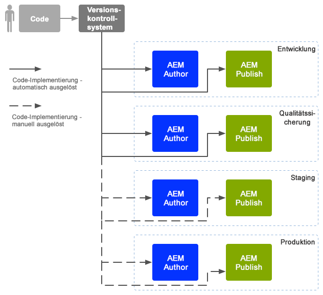
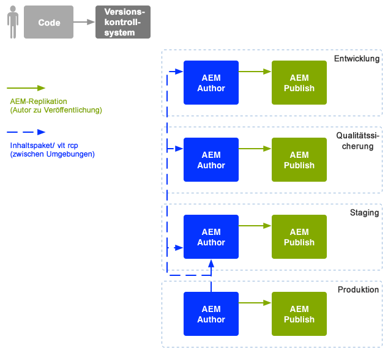

# DevOp-Strategien für Unternehmen{#enterprise-devops}

DevOp-Strategien umfassen die notwendigen Prozesse, Methoden und die Kommunikation für Folgendes:

* Erleichterung der Bereitstellung der Software über die verschiedenen Umgebungen hinweg;
* Vereinfachung der Zusammenarbeit zwischen der Entwicklungs-, Test- und Bereitstellungsteams.

DevOp-Strategien sollen unter anderem zur Vermeidung folgender Probleme beitragen:

* Manuelle Fehler;
* Vergessene Elemente, beispielsweise Dateien, Konfigurationsdetails.
* Diskrepanzen, beispielsweise zwischen der lokalen Umgebung des Entwicklers und anderen Umgebungen.

## Umgebungen {#environments}

Adobe Experience Manager (AEM) als Cloud-Dienst besteht in der Regel aus mehreren Umgebung, die auf verschiedenen Ebenen für unterschiedliche Zwecke verwendet werden:

* [Entwicklung](#development)
* [Qualitätssicherung](#quality-assurance)
* [Staging](#staging)
* [Produktion](#production-author-and-publish)

>[!NOTE]
>
>Die Produktionsumgebung muss mindestens eine Autoren- und eine Veröffentlichungsumgebung umfassen.
>
>Es wird empfohlen, alle anderen Umgebungen ebenfalls mit einer Autoren- und einer Veröffentlichungsumgebung zu gestalten, um die Produktionsumgebung widerzuspiegeln und frühe Test zu ermöglichen.

### Entwicklung {#development}

Die Entwickler sind für die Entwicklung und Anpassung des vorgeschlagenen Projekts mit sämtlichen geforderten Funktionalitäten verantwortlich (z. B. Website, App, DAM-Umsetzung). Sie:

* entwickeln und passen die notwendigen Elemente an, beispielsweise Vorlagen, Komponenten, Arbeitsabläufe, Anwendungen;
* Design realisieren
* die erforderlichen Dienste und Skripten zur Implementierung der erforderlichen Funktionalität entwickeln

Die Konfiguration der [Entwicklungsumgebung](/help/implementing/developing/introduction/development-guidelines.md) ist von verschiedenen Faktoren abhängig, besteht aber gewöhnlicherweise aus:

* einem integrierten Entwicklungssystem mit Versionssteuerung, um eine integrierte Codebasis zur Verfügung zu stellen. Dies wird dazu verwendet, die von den jeweiligen Entwicklern in der jeweiligen Entwicklungsumgebung verwendete Programmierung zusammenzuführen und zu konsolidieren;
* eine persönliche Umgebung für jeden Entwickler, für gewöhnlich auf einem lokalen Rechner. In geeigneten Intervallen wird der Code mit dem Versionskontrollsystem synchronisiert

Je nach Größe Ihres Systems kann die Entwicklungsumgebung sowohl über Autoren- als auch Veröffentlichungsinstanzen verfügen.

### Qualitätssicherung {#quality-assurance}

Diese Umgebung wird vom Qualitätssicherungsteam verwendet, um Ihr neues System umfassend zu testen. Design und Funktion. Sie sollte über eine Autoren- und eine Veröffentlichungsumgebung mit geeignetem Inhalt verfügen und sämtliche notwendigen Dienste zur Durchführung einer Reihe von Tests bereitstellen.

### Staging {#staging}

Die Staging-Umgebung sollte ein Spiegelbild der Produktionsumgebung sein - Konfiguration, Code und Inhalte:

* Sie wird zum Testen von Skripten verwendet, die zur Umsetzung der eigentlichen Bereitstellung genutzt werden.
* Sie kann für abschließende Tests (Design, Funktionalität und Schnittstellen) vor der Bereitstellung für die Produktionsumgebungen verwendet werden.
* Obwohl es nicht immer möglich ist, die Staging-Umgebung völlig identisch mit der Produktionsumgebung zu gestalten, sollten die beiden so ähnlich wie möglich sein, um Leistungs- und Belastungstests zu ermöglichen.

### Produktion - Autoren- und Veröffentlichungsumgebung {#production-author-and-publish}

The production environment consists of the environments needed to actually [author and publish](/help/sites-cloud/authoring/getting-started/concepts.md) your implementation.

Eine Produktions-Umgebung besteht aus mindestens einer Autoreninstanz und einer Veröffentlichungsinstanz:

* [Autoreninstanz](#author) für die Eingabe von Inhalt;
* A [publish](#publish) instance for content made available to your visitors/users.

Je nach Größe des Projekts besteht die Produktionsumgebung häufig aus mehreren Autoren- und Veröffentlichungsinstanzen. Auf niedrigerer Ebene kann das Repository in mehrere Instanzen gebündelt werden.

#### Autor {#author}

Autoreninstanzen befinden sich meist hinter der internen Firewall. Das ist die Umgebung, in der Sie und Ihre Kollegen Autorenaufgaben erledigen, wie etwa:

* Verwalten des gesamten Systems;
* Eingeben von Inhalten;
* Konfigurieren des Layouts und Designs des Inhalts;
* Aktivieren der Inhalte in der Veröffentlichungsumgebung.

Aktivierte Inhalte werden gebündelt und in der Replikationswarteschlange der Autorenumgebung abgelegt. Der Replikationsprozess überträgt den Inhalt dann in die Veröffentlichungsumgebung.

Um die in der Veröffentlichungsumgebung erstellten Daten umgekehrt zu replizieren, durchsucht ein Replikations-Listener in der Autorenumgebung die Veröffentlichungsumgebung und fragt solche Inhalte aus dem Postausgang für die umgekehrte Replikation der Veröffentlichungsumgebung ab.

#### Veröffentlichen {#publish}

Die Veröffentlichungsumgebung befindet sich normalerweise innerhalb der demilitarisierten Zone (DMZ). Dies ist die Umgebung, in der die Besucher auf Ihren Inhalt zugreifen (beispielsweise über die Website oder über eine App) und damit interagieren, sei es öffentlich oder innerhalb Ihres Intranets. Die Veröffentlichungsumgebung:

* enthält alle aus der Autorenumgebung replizierten Inhalte;
* macht Inhalte für Besucher zugänglich;
* speichert Benutzerdaten, die von den Besuchern erstellt werden, wie Kommentare oder andere Formen von Beiträgen;
* kann so konfiguriert werden, dass solche Benutzerdaten einem Postausgang für die umgekehrte Replikation in die Autorenumgebung hinzugefügt werden.

Die Veröffentlichungsumgebung erzeugt Ihren Inhalt dynamisch in Echtzeit und ermöglicht die Personalisierung des Inhalts für jeden einzelnen Benutzer.

## Codeverschiebung {#code-movement}

Der Code sollte immer von unten nach oben propagiert werden:

* Der Code wird zunächst in der lokalen Umgebung entwickelt und dann in die Entwicklungsumgebungen integriert,
* gefolgt von gründlichen Tests in den QA-Umgebungen,
* und wird dann abermals in den Staging-Umgebungen getestet.
* Nur dann sollte Code für die Produktions-Umgebung bereitgestellt werden

Der Code (z. B. angepasste Funktionalitäten und Design-Vorlagen von Webanwendungen) wird normalerweise durch den Ex- und Import von Datenpaketen zwischen den Inhaltsspeichern übertragen. Wo angemessen, kann die Replikation als automatischer Prozess konfiguriert werden.

AEM als Cloud-Dienstprojekte lösen oft die Codebereitstellung aus:

* Automatisch: zur Übertragung an die Entwicklungs- und QA-Umgebungen.
* Manuell: Die Bereitstellung für die Staging- und Produktionsumgebungen wird auf stärker gesteuerte Art und Weise und häufig manuell durchgeführt, obgleich eine Automatisierung, falls notwendig, möglich ist.

## Inhaltsverschiebung {#content-movement}

Inhalte, die für die Produktion erstellt werden, sollten **immer** in der Autoreninstanz der Produktion verfasst werden.

Die Inhaltsverschiebung sollte nicht der Codeverschiebung von niedrigeren zu höheren Umgebungen folgen, da die Erstellung von Inhalten durch Autoren auf lokalen Rechnern oder in niedrigeren Umgebungen und die darauffolgende Verschiebung in die Produktionsumgebung kein optimales Verfahren darstellt und wahrscheinlich zu Fehlern und Unstimmigkeiten führt.

Die Produktionsinhalte sollten von der Produktionsumgebung in die Staging-Umgebung verschoben werden, um zu gewährleisten, dass die Staging-Umgebung eine effiziente und genaue Testumgebung bietet.

>[!NOTE]
>
>Dies bedeutet nicht, dass die Staging-Inhalte kontinuierlich mit der Produktion synchronisiert werden müssen. Regelmäßige Updates reichen aus, jedoch sollten diese besonders vor Tests und vor der Einführung von neuem Code erfolgen. Die Inhalte in den QA- und Entwicklungsumgebungen müssen nicht gleich häufig aktualisiert werden, sie sollten lediglich die Produktionsinhalte gut widerspiegeln.

Inhalte können übertragen werden:

* zwischen verschiedenen Umgebungen - durch den Export und Import von Paketen;
* Zwischen verschiedenen Instanzen - durch direkte Replizierung (AEM als Cloud-Service-Replikation) des Inhalts (über eine HTTP- oder HTTPS-Verbindung).

