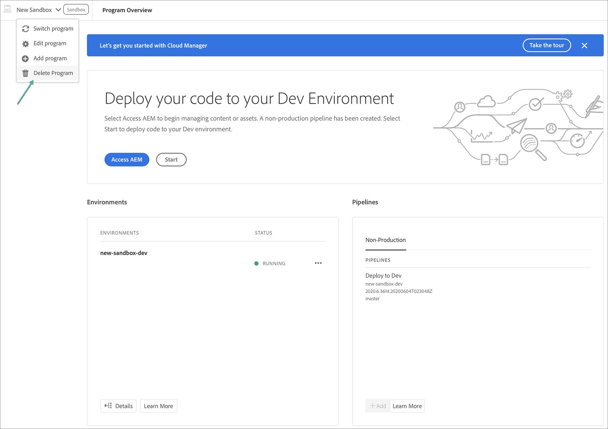

# Löschen eines Sandbox-Programms {#delete-sandbox-program}

Ein Sandbox-Programmbenutzer mit der Rolle *Business Owner* oder *Deployment Manager* in Cloud Manager kann seinen Satz an Produktions- und Staging-Umgebungen löschen, der über die Cloud Manager-Benutzeroberfläche festgelegt wurde.

>[!NOTE]
>Durch Auswahl der Löschoption für die Produktions- oder Staging-Umgebung wird die jeweils andere Umgebung im Satz auch gelöscht.

Die Löschoption ist auf der Landingpage verfügbar, wie unten dargestellt:

Oder

Wählen Sie **Programm** aus der Seite **Programmübersicht** löschen , um Ihr Sandbox-Programm zu löschen.

