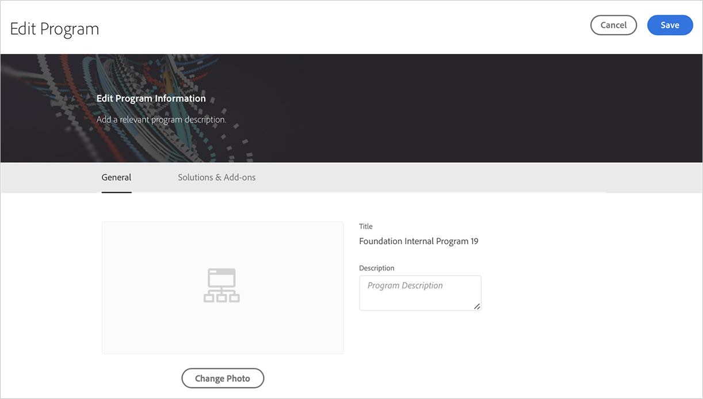

# Bearbeiten eines Produktionsprogramms {#create-production-program}

Benutzer mit den erforderlichen Berechtigungen können jetzt ein Produktionsprogramm bearbeiten, sodass sie Folgendes selbstständig ausführen können:

* Fügen Sie Sites-Lösungen zu einem vorhandenen Programm mit Assets hinzu (oder umgekehrt).
* Entfernen von Sites (oder Assets) aus einem vorhandenen Programm mit sowohl Sites als auch Assets.
* Hinzufügen einer zweiten, nicht verwendeten Lösungsberechtigung entweder für ein vorhandenes Programm oder als neues Programm.

   >[!NOTE]
   >Ein Benutzer in der Rolle „Geschäftsinhaber“ muss angemeldet sein, um das Programm erfolgreich bearbeiten zu können.

Gehen Sie wie folgt vor, um ein Produktionsprogramm zu bearbeiten:

1. Klicken Sie auf der Seite *Überblick* von Cloud Manager auf die Option **Programm bearbeiten** .

   

1. Auf der Seite **Programm bearbeiten** werden zwei Registerkarten **Allgemein** und **Lösungen und Add-ons** angezeigt.

   Navigieren Sie zur Registerkarte **Allgemein** , um die Programmbeschreibung zu bearbeiten.

   

   Auf der Registerkarte **Lösungen und Add-ons** werden zwei Optionen angezeigt, z. B. **Sites** und **Assets** für Produktions- und Sandbox-Programme. Sie können auch die Add-On-Option **Commerce** auswählen, die unter **Sites** verfügbar ist, wie in der folgenden Abbildung dargestellt.

   

   >[!NOTE]
   >Mindestens eine Lösung muss für ein Programm ausgewählt sein, d. h. der Benutzer darf die Auswahl nicht für alle Lösungen während des Bearbeitungs-Programm-Workflows aufheben.

1. Klicken Sie auf **Save** , um den Workflow des Bearbeitungsprogramms abzuschließen.

## Überlegungen beim Bearbeiten eines Programms {#considerations-editing}

Beim Bearbeiten eines Programms müssen einige Überlegungen angestellt werden:

* Mindestens eine Lösung muss für ein Programm ausgewählt sein, d. h. der Benutzer darf die Auswahl nicht für alle Lösungen während des Bearbeitungs-Programm-Workflows aufheben.

* Wenn Sie auf die Schaltfläche **Speichern** klicken und die ausgewählten Lösungen geändert wurden, werden Lösungsaktualisierungen an Umgebungen nach der nächsten Bereitstellung wirksam.
