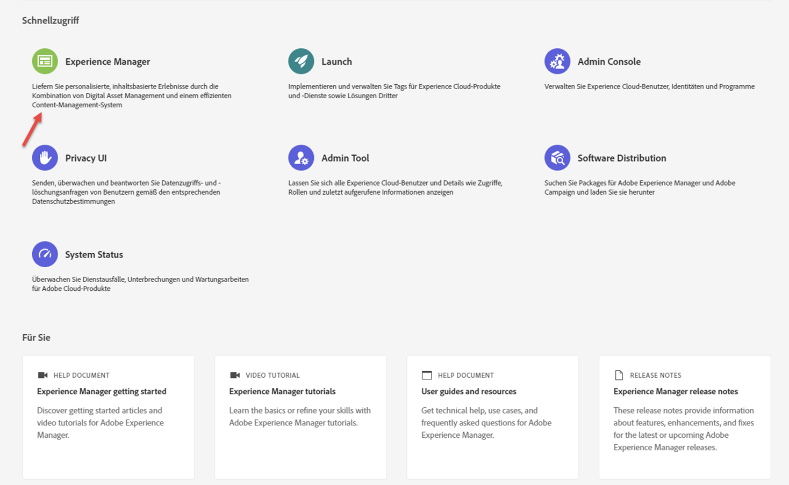
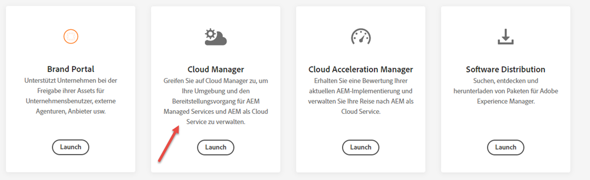
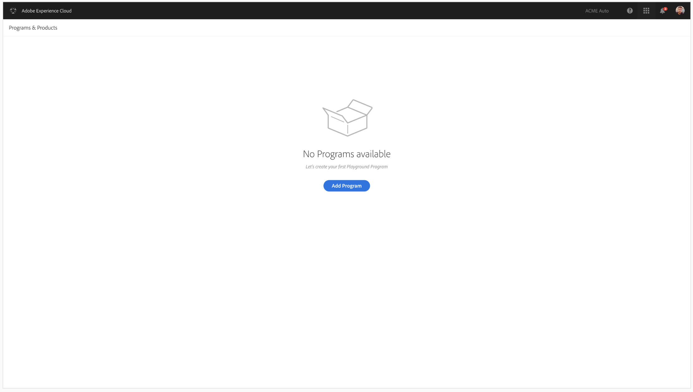

# Cloud Manager-Homepage {#first-time-login}

So greifen Sie auf Cloud Manager zu:

1. Navigieren Sie mit Ihrem Adobe ID zu [Experience Cloud](https://experience.adobe.com/).
1. Wählen Sie **Experience Manager**.
   

1. Klicken Sie auf **Launch** von der Cloud Manager-Karte.
Nachdem Sie sich erfolgreich bei [!UICONTROL Cloud Manager] angemeldet haben, können Sie die Benutzeroberfläche verwenden.
   

   >[!NOTE]
   >
   >Je nach den in [!UICONTROL Cloud Manager] zugewiesenen Rollen und dem Anwendungsstatus werden bei der Verwendung der [!UICONTROL Cloud Manager]-Benutzeroberfläche unterschiedliche Bildschirme angezeigt.

## Cloud Manager-Landingpage {#landing-page}

Nachdem Sie sich erfolgreich bei [!UICONTROL Cloud Manager] angemeldet haben, zeigt die Landingpage die Karte für alle vorhandenen Programm in Ihrer Organisation an.

>[!NOTE]
>
>Programme, die sich in Cloud Service befinden, werden durch den Untertitel **Experience Manager Cloud** (im Gegensatz zu **Experience Manager** bei AMS-Programmen) angezeigt (wie unten dargestellt).

Je nach Ihren Umständen sehen Sie eine der beiden Optionen:

* **Es gibt keine Programme in Cloud Manager**

* **In Cloud Manager gibt es bereits Programme**

## Hinzufügen eines neuen Programms in Cloud Service ohne vorhandene Programme {#no-program}

Die Landingpage weist Sie dazu an, Ihr erstes Programm zu erstellen, wie in der folgenden Abbildung dargestellt.

## Hinzufügen eines neuen Programms in Cloud Service bei vorhandenen Programmen {#existing-program}

1. Melden Sie sich bei **Adobe [!UICONTROL Experience Cloud]** an und sehen Sie sich die Liste der **Programme und Produkte** an.

   

   Programme, die sich in Cloud Service befinden, sind durch den Untertitel **Experience Manager Cloud** gekennzeichnet (im Gegensatz zu **Experience Manager** bei AMS-Programmen).

   >[!NOTE]
   >Im folgenden Screenshot ist **We.Retail Global** ein AMS-Programm, während **We.Retail-Prod-Programm - Prod** ein Programm ist, das über Cloud Service verfügbar ist.

1. Informationen zum Hinzufügen eines Programms aus dem Bildschirm **Programm und Produkte** zum Erstellen eines neuen Programms in Cloud Service finden Sie unter:

   * [Erstellen eines Production-Programms](/help/onboarding/getting-access-to-aem-in-cloud/creating-production-program.md)
   * [Erstellen eines Sandbox-Programms](/help/onboarding/getting-access-to-aem-in-cloud/creating-sandbox-program.md)

