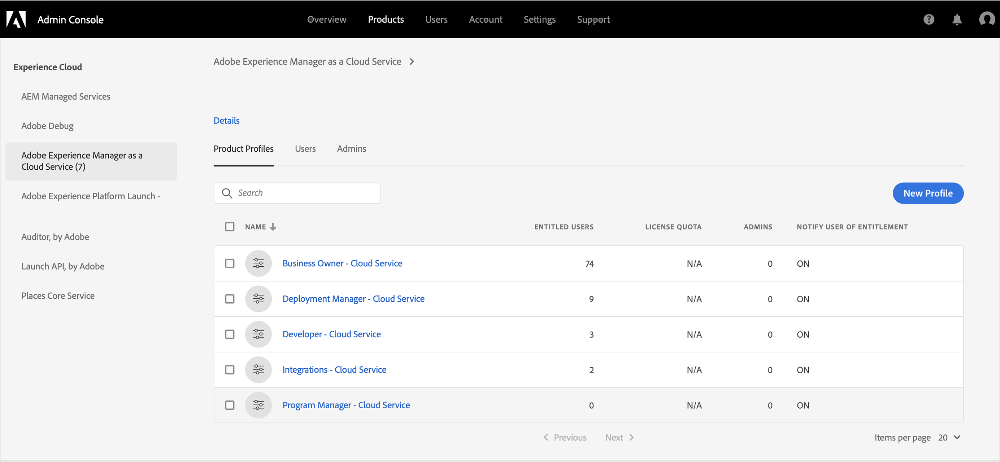

# Zugriff auf Cloud Manager für AEM als Cloud Service {#navigation}

Sobald Ihr Systemadministrator Ihnen Zugriff auf Cloud Manager gewährt hat, erhalten Sie eine E-Mail, mit der Sie zur Anmeldeseite von Cloud Manager gelangen, auf die Sie auch über [Adobe Experience Cloud](https://my.cloudmanager.adobe.com/) zugreifen können.

Nach erfolgreicher Anmeldung werden Sie wie unten gezeigt zur Landingpage von Cloud Manager weitergeleitet.

## SysAdmin-Aufgaben {#sysadmin-tasks}

Ein Benutzer in der SysAdmin-Rolle kann **Zugriff verwalten** auswählen, um direkt auf die Admin Console zuzugreifen, um Rollen und Berechtigungen zu verwalten und Zugriff auf AEM Instanzen zu erhalten.

### Verwalten von Rollen {#manage-roles}

Als Benutzer in der Rolle &quot;SysAdmin&quot;haben Sie 1-Klick Zugriff auf den Speicherort in **Admin Console**, von dem aus Benutzerrollen oder Berechtigungen für Cloud Manager verwaltet werden.

Weitere Informationen zum Hinzufügen von Benutzern zu einem Profil finden Sie unter [Zugriff auf Cloud Manager](https://docs.adobe.com/content/help/en/experience-manager-cloud-service/security/ims-support.html#accessing-cloud-manager).

>[!NOTE]
>Für einige Organisationen, die vor Januar 2020 Zugang zu AEM als Cloud Service erhalten haben, werden diese in die Adobe Admin Console gebracht und das Produkt- und Umgebung-Profil ausgewählt.

1. Navigieren Sie zur Landingpage des Cloud-Managers und klicken Sie auf **Zugriff verwalten**.

   

1. Wenn Sie auf **Zugriff verwalten** klicken, navigieren Sie zu **Admin Console**, von wo Sie die Benutzerrollen oder Berechtigungen für Cloud Manager verwalten können.

   

### Zugriff auf Autorinstanz verwalten {#manage-access-aem}

Als Benutzer in der Rolle &quot;SysAdmin&quot;haben Sie 1-Klick Zugriff auf die Admin Console **a1/>, von der aus Sie direkt zur Autoreninstanz navigieren und den Zugriff verwalten können.**

>[!NOTE]
>Für einige Organisationen, die vor Januar 2020 Zugang zu AEM als Cloud Service erhalten haben, werden diese in die Adobe Admin Console gebracht und das Produkt- und Umgebung-Profil ausgewählt.

Weitere Informationen finden Sie unter Zugriff auf eine Instanz in AEM als Cloud Service](https://docs.adobe.com/content/help/en/experience-manager-cloud-service/security/ims-support.html#accessing-instance-cloud-service).[

1. Navigieren Sie zur Karte **Umgebung** von **Programm-Übersicht** und klicken Sie auf **Zugriff verwalten**.

   

   Oder

   **Verwalten Sie** Accessis auch über die  **** Registerkarte Management verfügbar, wenn Sie auf  **** Details aus der  **** Umgebungskarte klicken.

   

1. Nachdem Sie auf **Zugriff verwalten** geklickt haben, navigieren Sie zu **Admin Console**, von wo aus Sie Zugriff auf die Autoreninstanz der Umgebung haben.

   

## Für bestehende AMS-Kunden {#existing-aem}

Wenn Sie bereits AMS-Kunde (Adobe Managed Services) sind und Zugriff auf Cloud Service haben, werden Ihre vorhandenen Programm und die Schaltfläche **Hinzufügen Programm** oben rechts auf der Landingpage angezeigt.

Wenn Sie die Schaltfläche **Hinzufügen Programm** nicht sehen und Fragen zum Zugriff auf Cloud Service haben, wenden Sie sich bitte an Ihren Kundenbetreuer.

Weitere Informationen finden Sie unter [Hinzufügen eines neuen Programms in Cloud Service mit vorhandenen Programmen](/help/onboarding/getting-access-to-aem-in-cloud/first-time-login.md#existing-program).

## Für neue Cloud Service {#new-cloud-services}

Wenn Sie Neukunde sind, sehen Sie die Schaltfläche **Hinzufügen Programm** oben rechts in einer leeren Landingpage. Sie möchten Ihrem Cloud Service ein neues Programm hinzufügen.

Weitere Informationen finden Sie unter [Hinzufügen eines neuen Programms in Cloud Service ohne vorhandene Programm](/help/onboarding/getting-access-to-aem-in-cloud/first-time-login.md#no-program).

