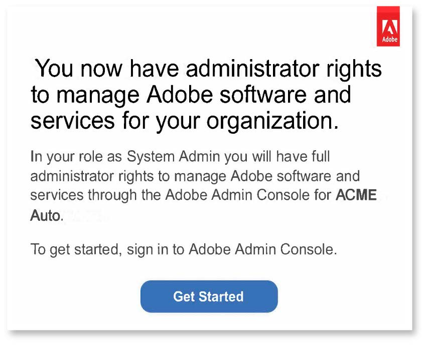

# AEM as a Cloud Service: Onboarding und Zugriff

Auf dieser Seite finden Sie Selbsthilfe-Ressourcen zum Bereitstellungsprozess für Experience Manager as a Cloud Service.

## Übersicht über den Bereitstellungsprozess von AEM as a Cloud Service

Dieser Abschnitt behandelt wichtige Artikel zu folgenden Themen:

* Zugriff auf AEM as a Cloud Service
* Onboarding- und Bereitstellungsprozess für Adobe Experience Manager as a Cloud Service
* Hilfe und Ressourcen

### Zugriff auf AEM as a Cloud Service

Nachdem die automatische Bereitstellung abgeschlossen ist:

* Gewährte Zugriffsrechte – Adobe erstellt eine Organisation innerhalb Adobe Identity Management System (IMS).
* Der entsprechende Administrator hat standardmäßig Administratorberechtigungen.
* Der Administrator kann über Admin Console Benutzer und Rollen für weitere Team-Mitglieder hinzufügen.
* Prüfen Sie rollenbasierte Berechtigungen für Benutzer und weisen Sie in Cloud Manager welche zu.

> 

Weitere Informationen finden Sie unter [Onboarding in Experience Manager as a Cloud Service auf Experience League](https://experienceleague.adobe.com/docs/experience-manager-cloud-service/onboarding/home.html?lang=de).

### Ressourcen und Links

• [IMS-Unterstützung für AEM as a Cloud Service](https://experienceleague.adobe.com/docs/experience-manager-cloud-service/security/ims-support.html?lang=de)\
• [Rollenbasierte Berechtigungen in Cloud Manager](https://experienceleague.adobe.com/docs/experience-manager-cloud-service/onboarding/what-is-required/role-based-permissions.html?lang=de#what-is-required)\
• [Zugriff auf Experience Manager as a Cloud Service](https://experienceleague.adobe.com/docs/experience-manager-cloud-service/onboarding/getting-access/navigation.html?lang=de#getting-access)

## Onboarding-Prozess für Adobe Experience Manager as a Cloud Service

### 1. Durch die Bestellung wird Adobe Experience Manager as a Cloud Service automatisch bereitgestellt.

### 2. Onboarden von Organisationen in Adobe Admin Console:

>   
* Systemadministrator:
   * Stellt AEM-Programme und -Umgebungen bereit
   * Navigiert zu Admin Console für administrative Aufgaben
   * Fordert eine Domain zur Bestätigung der Inhaberschaft der jeweiligen Domain an
   * Richtet Benutzerordner ein
   * IDP-Konfiguration.
* AEM-Administrator:
   * Verwaltet lokale Gruppen und Berechtigungen

### 3. Onboarden von Benutzern und Verwalten des Zugriffs auf Admin Console:

>   

Je nach Größe und Präferenz gibt es drei Methoden zum Onboarden von Benutzern:
* Manuelles Erstellen von Benutzern in Admin Console
* Hochladen einer .csv-Datei
* Synchronisieren von Benutzern im Enterprise Active Directory

### 4. Der Administrator konfiguriert die Organisation und gewährt Benutzern und Gruppen Zugriff auf die Umgebungen.

## Hilfe und Ressourcen

* [Erstmalige Anmeldung – Cloud Service](https://experienceleague.adobe.com/docs/experience-manager-cloud-service/onboarding/getting-access/cloud-service-programs/first-time-login.html?lang=de#getting-access)
* [Konfigurieren des Zugriffs auf AEM as a Cloud Service](https://experienceleague.adobe.com/docs/experience-manager-learn/cloud-service/accessing/overview.html?lang=de#accessing)
