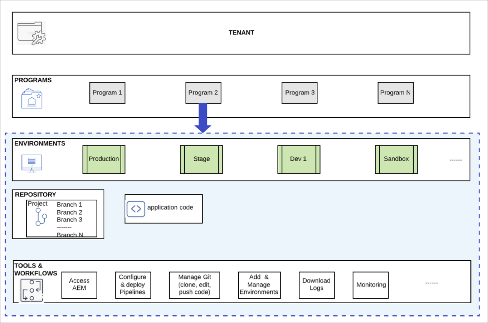

# Programme und Programmtypen {#understanding-programs}

In Cloud Manager befindet sich die Mandant-Entität ganz oben, die mehrere Programme enthalten kann.  Jedes Programm kann nicht mehr als eine Produktionsumgebung und mehrere Nicht-Produktionsumgebungen enthalten.

Das folgende Diagramm zeigt die Hierarchie der Entitäten in Cloud Manager.

## Programmtypen {#program-types}

Ein Benutzer kann eine **Sandbox** oder ein **reguläres** Programm erstellen.

Eine *Sandbox* wird normalerweise für Schulungszwecke, die Ausführung von Demos, die Aktivierung, POCs oder Dokumentation erstellt. Es soll keinen Live-Traffic transportieren, und es werden auch Beschränkungen gelten, die ein reguläres Programm nicht hat. Es umfasst Sites und Assets und wird automatisch mit einer Git-Verzweigung geliefert, die Beispielcode, eine Dev-Umgebung und eine Nicht-Produktion-Pipeline enthält.

Ein *reguläres Programm* wird erstellt, um Live-Traffic zum richtigen Zeitpunkt in der Zukunft zu aktivieren.