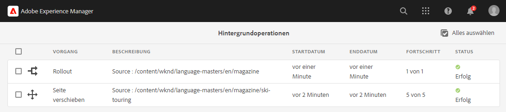

# Asynchrone Vorgänge {#asynchronous-operations}

Um negative Auswirkungen auf die Leistung einzuschränken, werden bestimmte lang laufende und ressourcenintensive Vorgänge in Adobe Experience Manager asynchron im Hintergrund verarbeitet. Die asynchrone Verarbeitung umfasst den Aufbau einer Warteschlange mit mehreren Aufträgen und schließlich deren serielle Ausführung gemäß der Verfügbarkeit von Systemressourcen.

Zu diesen Vorgängen gehören:

* Löschen vieler Assets
* Verschieben vieler Assets oder Assets mit vielen Verweisen
* Exportieren/Importieren von Asset-Metadaten in großen Mengen
* Abrufen von Assets, die über dem festgelegten Schwellenwert liegen, aus einer Remote-AEM-Bereitstellung
* Ausrollen von Live Copies

Sie können den Status von asynchronen Aufträgen im Dashboard **[!UICONTROL Hintergrundvorgänge]** unter **Globale Navigation** > **Tools** > **Allgemein** > **Aufträge** einsehen.

>[!NOTE]
>
>Standardmäßig werden asynchrone Aufträge parallel ausgeführt. Wenn die Anzahl der CPU-Kerne *`n`* ist, können standardmäßig *`n/2`* Aufträge parallel ausgeführt werden. Um benutzerdefinierte Einstellungen für die Auftragswarteschlange zu verwenden, ändern Sie die **[!UICONTROL Standardwarteschlangenkonfiguration für asynchrone Vorgänge]** und die **Konfiguration für Seitenverschiebung und Rollout von asynchronen Vorgängen** in der Web-Konsole.
>
>Weitere Informationen finden Sie unter [Warteschlangenkonfigurationen](https://sling.apache.org/documentation/bundles/apache-sling-eventing-and-job-handling.html#queue-configurations).

## Überwachen des Status asynchroner Vorgänge {#monitor-the-status-of-asynchronous-operations}

Wenn AEM einen Vorgang asynchron verarbeitet, erhalten Sie eine Benachrichtigung in Ihrem [Posteingang](/help/sites-cloud/authoring/inbox.md) und per E-Mail (falls aktiviert).

Um den Status der asynchronen Vorgänge detailliert anzuzeigen, navigieren Sie zur Seite **[!UICONTROL Hintergrundvorgänge]**.

1. Wählen Sie in der Benutzeroberfläche von Experience Manager die Option **Globale Navigation** > **Tools** > **Allgemein** > **Aufträge** aus.

1. Überprüfen Sie die Details für die Vorgänge auf der Seite **[!UICONTROL Hintergrundvorgänge]**.

   

   Den Fortschritt einzelner Vorgänge finden Sie als Wert in der Spalte **[!UICONTROL Status]**. Je nach Fortschritt wird einer der folgenden Status angezeigt:

   * **[!UICONTROL Aktiv]**: Der Vorgang wird verarbeitet

   * **[!UICONTROL Erfolg]**: Der Vorgang ist abgeschlossen.

   * **[!UICONTROL Fehlschlag]** oder **[!UICONTROL Fehler]**: Der Vorgang konnte nicht bearbeitet werden.

   * **[!UICONTROL Geplant]**: Die Verarbeitung des Vorgangs ist für einen späteren Zeitpunkt geplant

1. Um einen aktiven Vorgang abzubrechen, wählen Sie ihn in der Liste aus und tippen/klicken Sie auf das Symbol **[!UICONTROL Stopp]** in der Symbolleiste.

   

1. Um zusätzliche Details anzuzeigen, beispielsweise eine Beschreibung und Protokolle, wählen Sie den Vorgang aus und klicken Sie in der Symbolleiste auf **[!UICONTROL Öffnen]**.

   

   Die Detailseite für den Auftrag wird angezeigt.

   

1. Um den Vorgang aus der Liste zu löschen, wählen Sie die Option **[!UICONTROL Löschen]** in der Symbolleiste aus. Um die Details als CSV-Datei herunterzuladen, tippen/klicken Sie auf **[!UICONTROL Herunterladen]**.

   >[!NOTE]
   >
   >Sie können einen Auftrag nicht löschen, wenn er **Aktiv** ist oder sich **In der Warteschlange** befindet.

## Konfigurieren der Optionen für die asynchrone Auftragsverarbeitung {#configure}

Es gibt verschiedene Optionen für asynchrone Aufträge, die konfiguriert werden können. Die folgenden Beispiele zeigen, wie dies mit dem Konfigurations-Manager in einem lokalen Entwicklungssystem durchgeführt werden kann.

>[!NOTE]
>
>[OSGi-Konfigurationen](/help/implementing/deploying/configuring-osgi.md#creating-osgi-configurations) werden als veränderliche Inhalte betrachtet, und solche Konfigurationen müssen als Inhaltspaket für eine Produktionsumgebung implementiert werden.

### Bereinigen von abgeschlossenen Aufträgen {#purging-completed-jobs}

AEM führt jede Nacht um 01:00 Uhr einen Bereinigungsauftrag aus, um abgeschlossene asynchrone Aufträge zu löschen, die älter als einen Tag sind.

Sie können den Zeitplan für den Bereinigungsauftrag bearbeiten. Außerdem können Sie anpassen, wie lange die Details zu abgeschlossenen Aufträgen gespeichert werden sollen, bevor sie gelöscht werden. Darüber hinaus können Sie die maximale Anzahl abgeschlossener Aufträge konfigurieren, deren Details zu einem beliebigen Zeitpunkt gespeichert werden.

1. Melden Sie sich bei der AEM-Web-Konsole von AEM SDK Quickstart Jar unter `https://<host>:<port>/system/console` als Admin-Benutzerin bzw. -Benutzer an.
1. Navigieren Sie zu **OSGi** > **Konfiguration**
1. Öffnen Sie den Auftrag **[!UICONTROL Adobe Granite – Geplante Bereinigung asynchroner Aufträge]**.
1. Geben Sie Folgendes an:
   * Den Schwellenwert der Tage, nach denen abgeschlossene Aufträge gelöscht werden.
   * Die maximale Anzahl von Aufträgen, für die Details im Verlauf beibehalten werden.
   * Der Cron-Ausdruck für den Zeitpunkt, an dem die Bereinigung laufen soll.

   

1. Speichern Sie die Änderungen.

### Konfigurieren von asynchronen Vorgängen zum Löschen von Assets {#configuring-synchronous-delete-operations}

Wenn die Anzahl der Assets oder der zu löschenden Ordner den Schwellenwert überschreitet, wird der Löschvorgang asynchron ausgeführt.

1. Melden Sie sich bei der AEM-Web-Konsole von AEM SDK Quickstart Jar unter `https://<host>:<port>/system/console` als Admin-Benutzerin bzw. -Benutzer an.
1. Navigieren Sie zu **OSGi** > **Konfiguration**
1. Öffnen Sie in der Web-Konsole den **[!UICONTROL Standardmäßige Warteschlangenkonfiguration für asynchrone Prozesse]**.
1. Legen Sie im Feld **[!UICONTROL Schwellenwert für Assets]** den Schwellenwert für die Anzahl von Assets/Ordnern für die asynchrone Verarbeitung von Löschvorgängen an.

   

1. Aktivieren Sie die Option **E-Mail-Benachrichtigung aktivieren**, um E-Mail-Benachrichtigungen für diesen Auftragsstatus zu erhalten. Beispiel: Erfolg, fehlgeschlagen.
1. Speichern Sie die Änderungen.

### Konfigurieren von asynchronen Vorgängen zum Verschieben von Assets {#configuring-asynchronous-move-operations}

Wenn die Anzahl der zu verschiebenden Anlagen/Ordner oder Referenzen den Schwellenwert übersteigt, wird der Verschiebevorgang asynchron ausgeführt.

1. Melden Sie sich bei der AEM-Web-Konsole von AEM SDK Quickstart Jar unter `https://<host>:<port>/system/console` als Admin-Benutzerin bzw. -Benutzer an.
1. Navigieren Sie zu **OSGi** > **Konfiguration**
1. Öffnen Sie in der Web-Konsole die **[!UICONTROL Konfiguration Verarbeitung von asynchronen]**&quot;.
1. Legen Sie im Feld **[!UICONTROL Schwellenwert für Assets/Verweise]** den Schwellenwert für Assets/Ordner oder Verweise für die asynchrone Verarbeitung von Verschiebevorgängen fest.

   

1. Aktivieren Sie die Option **E-Mail-Benachrichtigung aktivieren**, um E-Mail-Benachrichtigungen für diesen Auftragsstatus zu erhalten. Beispiel: Erfolg, fehlgeschlagen.
1. Speichern Sie die Änderungen.

### Konfigurieren asynchroner MSM-Vorgänge {#configuring-asynchronous-msm-operations}

1. Melden Sie sich bei der AEM-Web-Konsole von AEM SDK Quickstart Jar unter `https://<host>:<port>/system/console` als Admin-Benutzerin bzw. -Benutzer an.
1. Navigieren Sie zu **OSGi** > **Konfiguration**
1. Öffnen Sie in der Web-Konsole die **[!UICONTROL Konfiguration Verarbeitung von asynchronen Seitenverschiebungsvorgängen]**.
1. Aktivieren Sie die Option **E-Mail-Benachrichtigung aktivieren**, um E-Mail-Benachrichtigungen für diesen Auftragsstatus zu erhalten. Beispiel: Erfolg, fehlgeschlagen.

   

1. Speichern Sie die Änderungen.

>[!MORELIKETHIS]
>
>* [Verwalten von Seiten](/help/sites-cloud/authoring/sites-console/managing-pages.md)
>* [Importieren und Exportieren von Asset-Metadaten in großen Mengen](/help/assets/metadata-import-export.md).
>* [Verwenden Sie verbundene Assets, um DAM-Assets aus Remote-Bereitstellungen freizugeben](/help/assets/use-assets-across-connected-assets-instances.md).
