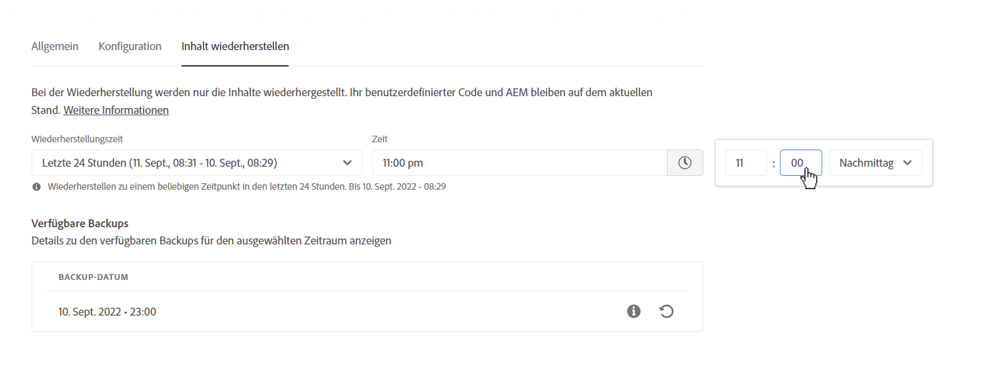
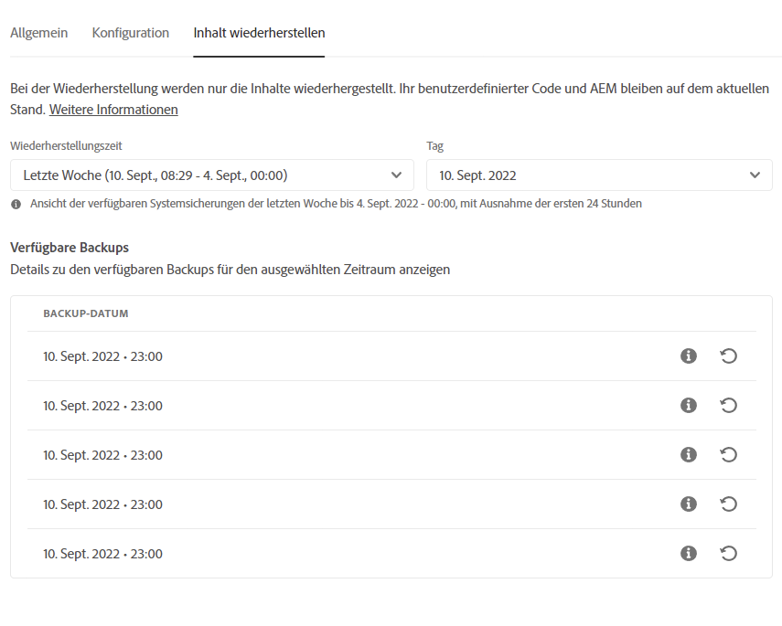
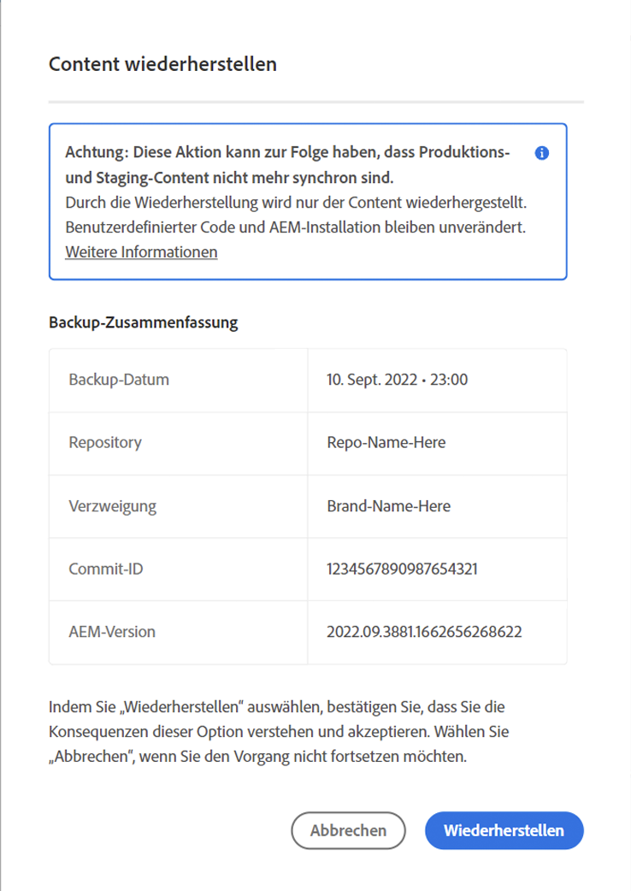
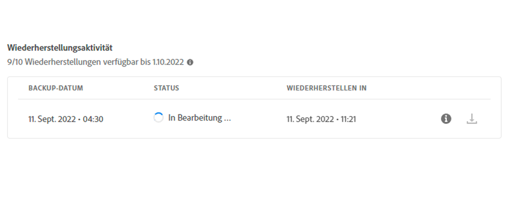

# Inhaltserstellung in AEM as a Cloud Service {#content-restore}

>[!CONTEXTUALHELP]
>id="aemcloud_golive_backuprestore"
>title="Backup und Wiederherstellung"
>abstract="Erfahren Sie, wie Sie mithilfe von Cloud Manager AEM as a Cloud Service Inhalte aus der Sicherung wiederherstellen können."

Erfahren Sie, wie Sie mithilfe von Cloud Manager AEM as a Cloud Service Inhalte aus der Sicherung wiederherstellen können.

## Übersicht {#overview}

Der Self-Service-Wiederherstellungsprozess von Cloud Manager kopiert Daten aus Adobe-Systemsicherungen und stellt sie in der Originalumgebung wieder her. Eine Wiederherstellung wird durchgeführt, um Daten zurückzugeben, die verloren gegangen, beschädigt oder versehentlich in den ursprünglichen Zustand gelöscht wurden.

Der Wiederherstellungsprozess wirkt sich nur auf Inhalte aus, sodass Ihr Code und Ihre Version von AEM unverändert bleiben. Sie können jederzeit einen Wiederherstellungsvorgang für einzelne Umgebungen starten.

Cloud Manager bietet zwei Arten von Sicherungen, mit denen Sie Inhalte wiederherstellen können.

* **Point-in-Time (PIT):** Dieser Typ wird aus den Systemsicherungen der letzten 24 Stunden ab der aktuellen Zeit zurückgewonnen.
* **Letzte Woche:** Dieser Typ wird aus den Systemsicherungen der letzten sieben Tage ohne die vorherigen 24 Stunden wiederhergestellt.

In beiden Fällen bleibt die Version Ihres benutzerspezifischen Codes und AEM unverändert.

>[!TIP]
>
>Es ist auch möglich, Backups wiederherzustellen [Verwendung der öffentlichen API.](https://developer.adobe.com/experience-cloud/cloud-manager/reference/api/)

## Beschränkungen {#limitations}

Die Verwendung des Self-Service-Wiederherstellungsmechanismus unterliegt den folgenden Einschränkungen.

* Wiederherstellungsvorgänge sind auf sieben Tage beschränkt, d. h. es ist nicht möglich, einen Snapshot wiederherzustellen, der älter als sieben Tage ist.
* Maximal zehn erfolgreiche Wiederherstellungen sind in allen Umgebungen eines Programms pro Kalendermonat zulässig.
* Nach der Erstellung der Umgebung dauert es sechs Stunden, bis der erste Backup-Schnappschuss erstellt wurde. Bis diese Momentaufnahme erstellt wurde, kann keine Wiederherstellung in der Umgebung durchgeführt werden.
* Ein Wiederherstellungsvorgang wird nicht initiiert, wenn derzeit eine vollständige Stack- oder Web-Tier-Konfigurationspipeline für die Umgebung ausgeführt wird.
* Eine Wiederherstellung kann nicht initiiert werden, wenn bereits eine andere Wiederherstellung in derselben Umgebung ausgeführt wird.
* In seltenen Fällen kann das ausgewählte Backup aufgrund der Beschränkung von 24 Stunden/7 Tagen bei Backups aufgrund einer Verzögerung zwischen dem Zeitpunkt der Auswahl und dem Beginn der Wiederherstellung nicht mehr verfügbar sein.
* Daten gelöschter Umgebungen sind dauerhaft verloren und können nicht wiederhergestellt werden.

## Wiederherstellen von Inhalten {#restoring-content}

Bestimmen Sie zunächst den Zeitrahmen des Inhalts, den Sie wiederherstellen möchten. Führen Sie diese Schritte aus, um den Inhalt Ihrer Umgebung aus einer Sicherung wiederherzustellen.

>[!NOTE]
>
>Ein Benutzer mit der **Business Owner** oder **Bereitstellungsmanager** -Rolle muss angemeldet sein, um einen Wiederherstellungsvorgang zu starten.

1. Melden Sie sich unter [my.cloudmanager.adobe.com](https://my.cloudmanager.adobe.com/) bei Cloud Manager an und wählen Sie die entsprechende Organisation aus.

1. Klicken Sie auf das Programm, für das Sie eine Wiederherstellung starten möchten.

1. Aus dem **Programmübersicht** in der **Umgebungen** -Karte, klicken Sie auf die Schaltfläche mit den Auslassungspunkten neben der Umgebung, für die Sie eine Wiederherstellung starten möchten, und wählen Sie **Inhalt wiederherstellen**.

   

   * Alternativ können Sie direkt zur **Inhalt wiederherstellen** auf der Seite mit den Umgebungsdetails einer bestimmten Umgebung.

1. Im **Inhalt wiederherstellen** auf der Seite mit den Umgebungsdetails den Zeitrahmen der Wiederherstellung unter der **Wiederherstellungszeit** Dropdown-Liste.

   1. Wenn Sie **Letzte 24 Stunden** Nachbarn **Zeit** können Sie die genaue Zeit innerhalb der letzten 24 Stunden angeben, die wiederhergestellt werden sollen.

      

   1. Wenn Sie **Letzte Woche** Nachbarn **Tag** -Feld können Sie ein Datum innerhalb der letzten sieben Tage auswählen, mit Ausnahme der letzten 24 Stunden.

      

1. Sobald Sie ein Datum oder eine Uhrzeit ausgewählt haben, wird die **Verfügbare Backups** Im folgenden Abschnitt finden Sie eine Liste der verfügbaren Sicherungen, die wiederhergestellt werden können.

   

1. Suchen Sie mithilfe des Informationssymbols nach der Sicherung, die Sie wiederherstellen möchten, um Informationen zur Version des Codes und AEM Version anzuzeigen, die in dieser Sicherung enthalten sind, und berücksichtigen Sie die Auswirkungen einer Wiederherstellung, wenn [Wählen Sie das Backup aus.](#choosing-the-right-backup)

   

   * Beachten Sie, dass der für die Wiederherstellungsoptionen angezeigte Zeitstempel alle auf der Zeitzone des Computers des Benutzers basieren.

1. Klicken Sie auf **Wiederherstellen** -Symbol am rechten Ende der Zeile, die das Backup darstellt, das Sie wiederherstellen möchten, um den Wiederherstellungsprozess zu starten.

1. Überprüfen Sie die Details zum **Inhalt wiederherstellen** Dialogfeld vor der Bestätigung Ihrer Anforderung durch Klicken auf **Wiederherstellen**.

   

Der Backup-Prozess wird initiiert und Sie können seinen Status im **[Aktivität wiederherstellen](#restore-activity)** Tabelle. Die für den Abschluss eines Wiederherstellungsvorgangs erforderliche Zeit hängt von der Größe und dem Profil des wiederhergestellten Inhalts ab.

Wenn die Wiederherstellung erfolgreich abgeschlossen wurde, wird die Umgebung wie folgt ausgeführt:

* Führen Sie denselben Code und AEM Release aus wie zum Zeitpunkt der Initiierung des Wiederherstellungsvorgangs.
* Sie verfügen über denselben Inhalt, der beim Zeitstempel des ausgewählten Snapshots verfügbar war, wobei die Indizes neu erstellt wurden, um dem aktuellen Code zu entsprechen.

## Auswählen der richtigen Sicherung {#choosing-backup}

Stellt nur den Inhalt wieder AEM. Aus diesem Grund müssen Sie Codeänderungen, die zwischen dem gewünschten Wiederherstellungspunkt und der aktuellen Zeit vorgenommen wurden, sorgfältig prüfen, indem Sie den Commitverlauf zwischen der aktuellen Commit-ID und der wiederhergestellten überprüfen.

Es gibt mehrere Szenarien.

* Der benutzerdefinierte Code in der Umgebung und die Wiederherstellung befinden sich im selben Repository und in derselben Verzweigung.
* Der benutzerdefinierte Code in der Umgebung und die Wiederherstellung befinden sich im selben Repository, jedoch in einer anderen Verzweigung mit einem gemeinsamen Commit.
* Der benutzerdefinierte Code in der Umgebung und die Wiederherstellung befinden sich in verschiedenen Repositorys.
   * In diesem Fall wird keine Commit-ID angezeigt.
   * Es wird dringend empfohlen, beide Repositorys zu klonen und ein Vergleichstool zu verwenden, um die Verzweigungen zu vergleichen.

Beachten Sie außerdem, dass eine Wiederherstellung dazu führen kann, dass Ihre Produktions- und Staging-Umgebungen nicht mehr synchronisiert sind. Sie sind für die Folgen der Wiederherstellung von Inhalten verantwortlich.

## Wiederherstellungsaktivität wiederherstellen {#restore-activity}

Die **Aktivität wiederherstellen** zeigt den Status der zehn letzten Wiederherstellungsanfragen einschließlich aller aktiven Wiederherstellungsvorgänge an.

Wenn Sie auf das Informationssymbol für ein Backup klicken, können Sie Protokolle für dieses Backup herunterladen und die Codedetails einschließlich der Unterschiede zwischen dem Snapshot und den Daten zum Zeitpunkt der Wiederherstellung überprüfen.

## Offsite-Sicherung {#offsite-backup}

Regelmäßige Backups decken das Risiko von versehentlichem Löschen oder technischen Fehlern in AEM Cloud Services ab, doch können zusätzliche Risiken durch das Fehlschlagen einer Region entstehen. Neben der Verfügbarkeit besteht das größte Risiko bei solchen Ausfällen in einem Datenverlust.

AEM as a Cloud Service reduziert dieses Risiko für alle AEM Produktionsumgebungen, indem alle AEM Inhalte kontinuierlich in eine Remote-Region kopiert und für einen Zeitraum von drei Monaten zur Wiederherstellung bereitgestellt werden. Diese Funktion wird als Offsite-Backup bezeichnet.

Die Wiederherstellung von AEM Cloud Services für Staging- und Produktionsumgebungen aus Offsite-Backups wird von AEM Service Reliability Engineering im Fall von Ausfällen in der Datenregion durchgeführt.
