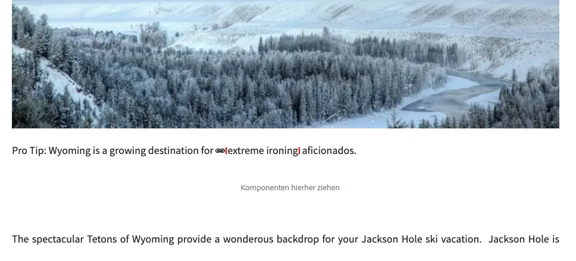
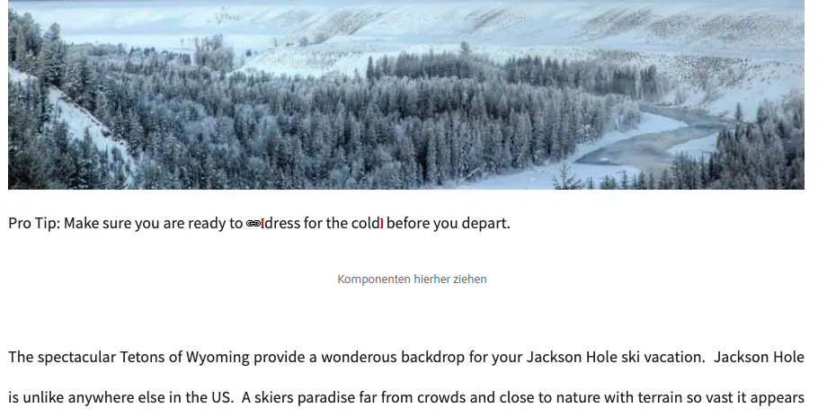
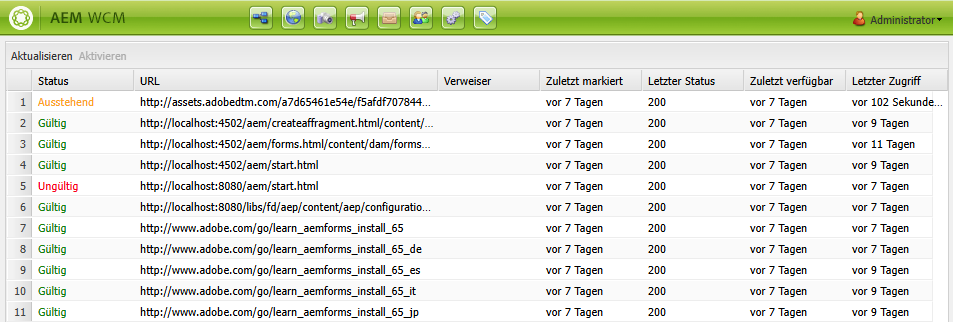

# Link-Prüfer {#link-checker}

Erfahren Sie, wie der Link-Prüfer Autorinnen und Autoren dabei hilft, Links beim Hinzufügen zu Inhalten zu validieren, und welche Konfigurationsoptionen er bietet.

## Überblick {#overview}

Inhaltsautorinnen und -autoren sollten sich nicht mit der Validierung aller Links befassen müssen, die sie in ihre Inhalte aufnehmen. Der Link-Checker wird automatisch ausgeführt, um Autorinnen und Autoren von Inhalten bei ihren Links zu unterstützen, darunter:

* Validieren von Links beim Hinzufügen zu Inhalten
* Anzeigen einer Liste aller externen Links im Inhalt
* Durchführen von Linktransformationen

Der Link-Prüfer verfügt über verschiedene [Konfigurationsoptionen](#configuring), wie das Definieren der Validierung interner Links, das Auslassen der Validierung für bestimmte Links oder Link-Muster oder das Neuschreiben von Umschreibungsregeln für Links.

Der Link-Checker überprüft sowohl [interne Links](#internal) als auch [externe Links](#external).

>[!NOTE]
>
>Da der Link-Checker die Links jeder Inhaltsseite überprüft, kann der Link-Checker bei großen Repositorys die Leistung beeinträchtigen. In solchen Fällen müssen Sie möglicherweise [konfigurieren, wie oft der Link Checker ausgeführt wird](#configuring) oder [ihn deaktivieren](#disabling).

## Prüfung interner Links {#internal}

Interne Links sind Links zu anderen Inhalten in Ihrem AEM-Repository. Interne Links können mit der Pfadauswahl des dem Rich-Text-Editor oder mithilfe einer benutzerdefinierten Komponente hinzugefügt werden. Zum Beispiel:

* Sie erstellen die Seite `/content/wknd/us/en/adventures/ski-touring`.
* Diese Seite enthält einen Link zu `/content/wknd/us/en/adventures/extreme-ironing` in einer [Textkomponente](https://experienceleague.adobe.com/de/docs/experience-manager-core-components/using/wcm-components/text).

Interne Links werden validiert, sobald Inhaltsautorinnen oder -autoren interne Links zu einer Seite hinzufügen. Wenn der Link ungültig wird:

* wird er aus der Veröffentlichungebene entfernt: 
   * Der Link selbst wird entfernt.
   * Der Text des Links bleibt erhalten.
* wird er in der Authoring-Oberfläche als defekter Link angezeigt.

## Überprüfung externer Links {#external}

Externe Links sind Links zu Inhalten außerhalb Ihres AEM-Repositorys. Externe Links können mit dem Rich-Text-Editor oder mithilfe einer benutzerdefinierten Komponente hinzugefügt werden. Zum Beispiel:

* Sie erstellen die Seite `/content/wknd/us/en/adventures/ski-touring`.
* Diese Seite enthält einen Link zu `https://bunwarmerthermalunderwear.com` in einer [Textkomponente](https://experienceleague.adobe.com/de/docs/experience-manager-core-components/using/wcm-components/text).

Externe Links werden auf Syntax und Verfügbarkeit überprüft. Diese Prüfung wird asynchron in einem konfigurierbaren Intervall durchgeführt. Wenn der Link-Checker einen externen Link für ungültig befindet:

* wird er aus der Veröffentlichungebene entfernt: 
   * Der Link selbst wird entfernt.
   * Der Text des Links bleibt erhalten.
* wird er in der Authoring-Oberfläche als defekter Link angezeigt.

### Funktionsweise des Prüfers für externe Links {#external-details}

Der Prüfer für externe Links ist auf eine Reihe von Diensten angewiesen. Wenn Sie verstehen, wie diese funktionieren, können Sie den [Link-Prüfer Ihren Anforderungen entsprechend konfigurieren](#configuring).

1. Wenn eine Inhaltsautorin oder ein Inhaltsautor einen Link zu einer Seite speichert, wird ein Ereignis-Handler ausgelöst.
1. Der Ereignis-Handler durchläuft alle Inhalte unter `/content` und sucht nach neuen oder aktualisierten Links und fügt sie einem Cache für den Link-Prüfer hinzu.
1. Der **Day CQ Link Checker Service** wird dann nach einem regulären Zeitplan ausgeführt, um die Einträge im Cache auf gültige Syntax zu überprüfen.
1. Die durch die Syntax validierten Links erscheinen dann im Fenster [Prüfer für externe Links. ](#external-using) Sie befinden sich jedoch im Status **Ausstehend**.
1. Die **Day CQ Link Checker Task** wird dann regelmäßig ausgeführt, um die Links durch einen GET-Aufruf zu validieren.
1. Die **Day CQ Link Checker Task** aktualisiert dann die Einträge im Fenster [Prüfer für externe Links](#external-using) mit den Ergebnissen der GET-Aufrufe.

### Verwenden des Prüfers für externe Links {#external-using}

Der Prüfer für externe Links ist eine Konsole, die einen Überblick über alle externen Links in Ihren AEM-Inhalten liefert. So verwenden Sie den Prüfer für externe Links:

1. Wählen Sie in der globalen Navigation die Option **Tools** > **Sites** aus.
1. Wählen Sie **Prüfer für externe Links**. Eine Liste aller externen Links wird erstellt.

Jeder Eintrag in der Tabelle stellt einen externen Link dar, der vom Dienst „Link-Prüfer“ erkannt wurde. Die folgenden Spalten werden angezeigt:

* **Status**: Der Validierungsstatus des Links, der einer der folgenden sein kann:
   * **Gültig**: Der externe Link kann vom Link-Prüfer erreicht werden.
   * **Ausstehend**: Der externe Link wurde zum Site-Inhalt hinzugefügt, aber noch nicht vom Link-Prüfer validiert.
   * **Ungültig**: Der externe Link kann vom Link-Prüfer nicht erreicht werden.
* **URL**: Der externe Link.
* **Referrer**: Die Inhaltsseite, die den externen Link enthält.
   * Dies wird nur ausgefüllt, [falls konfiguriert](#configuring).
* **Zuletzt aktiviert**: Das letzte Mal, dass der Link-Checker den externen Link validiert hat.
   * Wie oft Links überprüft werden, [ist konfigurierbar](#configuring).
* **Letzter Status**: Der letzte HTML-Status-Code, der zurückgegeben wurde, als der Link-Checker den externen Link zuletzt überprüft hat.
* **Zuletzt verfügbar**: Zeit, seit der Link zuletzt für den Link-Checker verfügbar war.
* **Letzter Zugriff**: Zeit seit dem letzten Zugriff auf die Seite mit dem externen Link in der Authoring-Oberfläche.

Sie können den Inhalt des Fensters mithilfe der beiden Schaltflächen oben in der Liste der Links bearbeiten:

* **Aktualisieren**: Aktualisieren des Listeninhalts
* **Überprüfen**: Zum Prüfen eines einzelnen externen Links, der in der Liste ausgewählt ist.

Alle anderen Symbole im Fenster „Prüfer für externe Links“ sind inaktiv.

## Konfigurieren des Link-Checkers {#configuring}

Der Link-Checker ist in AEM automatisch vorkonfiguriert verfügbar. Es gibt jedoch verschiedene OSGi-Konfigurationen, die geändert werden können, um sein Verhalten zu ändern:

* **Day CQ Link Checker Info Storage Service**: Dieser Dienst definiert die Größe des Link-Checker-Cache im Repository.
* **Day CQ Link Checker Service**: Dieser Dienst führt eine asynchrone Überprüfung der Syntax externer Links durch. 
   * Sie können unter anderem den Prüfzeitraum festlegen und festlegen, welche Links vom Prüfer übersprungen werden sollen.
* **Day CQ Link Checker Task**: Dieser Dienst führt die GET-Validierung externer Links durch.
   * Er ermöglicht unter anderem separate Definitionen von Intervallen, um fehlerhafte und gute Links zu überprüfen.
* **Day CQ Link Checker Transformer**: Dieser Dienst konvertiert Links basierend auf einem benutzerdefinierten Regelsatz.

Weitere Informationen zum Ändern von OSGi-Einstellungen finden Sie unter [Konfigurieren von OSGi](/help/implementing/deploying/configuring-osgi.md).

## Deaktivieren des Link-Checkers {#disabling}

Sie können den Link-Checker vollständig deaktivieren. Gehen Sie dazu wie folgt vor:

1. Öffnen Sie die OSGi-Konsole.
1. Bearbeiten Sie den **Day CQ Link Checker Transformer**.
1. Markieren Sie die Option(en), die Sie deaktivieren möchten:
   * **Überprüfung deaktivieren**: zur Deaktivierung der Validierung von Links
   * **Umschreiben deaktivieren**: zur Deaktivierung von Linktransformationen
