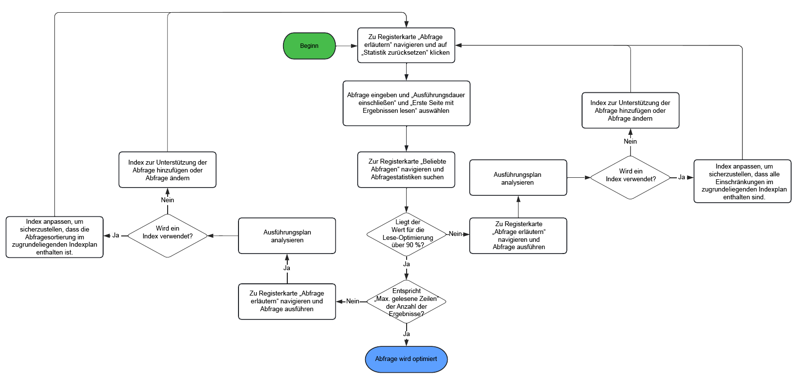
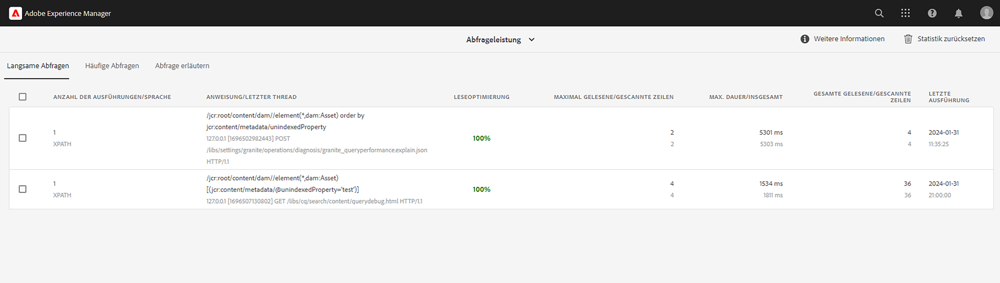
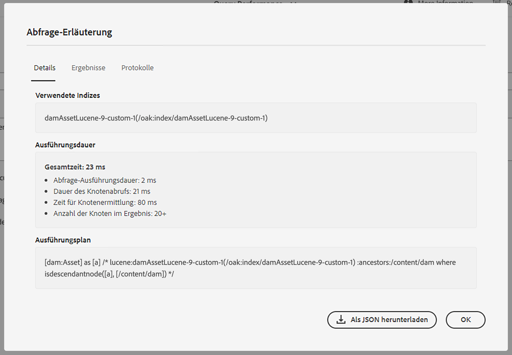

# Best Practices für Abfragen und Indizierung {#query-and-indexing-best-practices}

In AEM as a Cloud Service sind alle operativen Aspekte der Indizierung automatisiert. Dadurch können sich Personen, die mit der Entwicklung befasst sind, auf das Erstellen effizienter Abfragen und der entsprechenden Indexdefinitionen konzentrieren.

## Verwenden von Abfragen {#when-to-use-queries}

Abfragen sind eine Möglichkeit, auf Inhalte zuzugreifen, aber nicht die einzige. In vielen Fällen ist der Zugriff auf Inhalte im Repository auf eine andere Weise effektiver. Sie sollten überlegen, ob Abfragen der beste und effizienteste Weg sind, für Ihren Anwendungsfall auf Inhalte zuzugreifen.

### Repository- und Taxonomie-Design {#repository-and-taxonomy-design}

Bei der Erstellung der Taxonomie eines Repositorys müssen mehrere Faktoren berücksichtigt werden. Hierzu gehören die Zugriffssteuerung, Lokalisierung, Vererbung von Komponenten- und Seiteneigenschaften und vieles mehr.

In einem Taxonomie-Design, in dem diese Punkte berücksichtigt werden, muss zudem auch die „Durchlauffähigkeit“ des Index-Designs beachtet werden. In diesem Zusammenhang ist die Durchlauffähigkeit die Fähigkeit einer Taxonomie, einen vorhersehbaren Zugriff auf Inhalte auf der Grundlage ihres Pfads zu ermöglichen. Dies ermöglicht ein effizienteres System, das einfacher zu verwalten ist als ein System, für das mehrere Abfragen ausgeführt werden müssen.

Darüber hinaus muss beim Entwerfen einer Taxonomie bedacht werden, ob eine Sortierung wichtig ist. Wenn auf eine explizite Sortierung verzichtet werden kann und eine große Anzahl gleichgeordneter Knoten erwartet wird, sind unsortierte Knotentypen wie `sling:Folder` oder `oak:Unstructured` vorzuziehen. Ist eine Sortierung erforderlich, wären `nt:unstructured` und `sling:OrderedFolder` besser geeignet.

### Abfragen in Komponenten {#queries-in-components}

Da Abfragen zu den stärker belastenden Vorgängen in einem AEM-System gehören können, empfiehlt es sich, diese in Ihren Komponenten zu vermeiden. Wenn beim Rendern einer Seite mehrere Abfragen gleichzeitig ausgeführt werden, kann dies die Leistung des Systems beeinträchtigen. Es gibt zwei Strategien, mit denen sich beim Rendering von Komponenten die Ausführung von Abfragen vermeiden lässt: **[Durchlaufen von Knoten](#traversing-nodes)** und **[Vorabrufen von Ergebnissen](#prefetching-results)**.

### Durchlaufen von Knoten {#traversing-nodes}

Wenn das Repository so konzipiert ist, dass eine vorherige Kenntnis des Speicherorts der erforderlichen Daten möglich ist, kann Code, der diese Daten aus den erforderlichen Pfaden abruft, bereitgestellt werden, ohne erst Abfragen ausführen zu müssen, um sie zu finden.

Ein Beispiel hierfür wäre das Rendern von Inhalten, die zu einer bestimmten Kategorie passen. Ein Ansatz wäre, den Inhalt mit einer Kategorieeigenschaft zu organisieren, die abgefragt werden kann, um eine Komponente mit Elementen einer Kategorie aufzufüllen.

Ein besserer Ansatz wäre, diesen Inhalt in einer Taxonomie nach Kategorie zu strukturieren, damit er manuell abgerufen werden kann.

Nahmen wir beispielsweise an, der Inhalt wird in einer Taxonomie gespeichert ist, die Folgendem ähnelt:

```xml
/content/myUnstructuredContent/parentCategory/childCategory/contentPiece
```

In diesem Fall lässt sich der Knoten `/content/myUnstructuredContent/parentCategory/childCategory` einfach abrufen und seine untergeordneten Elemente können analysiert und zum Rendern der Komponente verwendet werden.

Wenn Sie es mit einem kleinen oder homogenen Ergebnissatz zu tun haben, kann es außerdem schneller sein, das Repository zu durchlaufen und die erforderlichen Knoten zu sammeln, anstatt eine Abfrage zu erstellen, die denselben Ergebnissatz zurückgibt. Generell gilt, dass Abfragen nach Möglichkeit vermieden werden sollten.

### Vorabruf von Ergebnissen {#prefetching-results}

Mitunter lassen die Inhalte oder Anforderungen im Zusammenhang mit der Komponente nicht zu, dass Knoten zum Abrufen der erforderlichen Daten durchlaufen werden. In solchen Fällen müssen die erforderlichen Abfragen vor dem Rendern der Komponente ausgeführt werden, damit eine optimale Leistung sichergestellt werden kann.

Sofern die für die Komponente erforderlichen Ergebnisse zum Zeitpunkt der Erstellung ermittelt werden können und nicht zu erwarten ist, dass sich der Inhalt ändert, kann die Abfrage nach einer Änderung ausgeführt werden.

Wenn sich die Daten oder Inhalte regelmäßig ändern, kann die Abfrage planmäßig oder über einen Listener für Aktualisierungen der zugrunde liegenden Daten ausgeführt werden. Anschließend können die Ergebnisse an einen freigegebenen Speicherort im Repository geschrieben werden. Alle Komponenten, die diese Daten benötigen, können dann die Werte aus diesem einzelnen Knoten beziehen, ohne eine Abfrage zur Laufzeit auszuführen.

Eine ähnliche Strategie kann verwendet werden, um das Ergebnis in einem Arbeitsspeicher-Cache zu speichern, der beim Start gefüllt und bei jeder Änderung aktualisiert wird (mithilfe eines JCR-Elements `ObservationListener` oder eines Sling-Elements `ResourceChangeListener`).

## Optimieren von Abfragen {#optimizing-queries}

Die Oak-Dokumentation bietet [allgemeine Übersicht über die Ausführung von Abfragen](https://jackrabbit.apache.org/oak/docs/query/query-engine.html#query-processing). Dies bildet die Grundlage für alle in diesem Dokument beschriebenen Optimierungsaktivitäten.

AEM as a Cloud Service bietet das [Abfrageleistungs-Werkzeug](#query-performance-tool), das die Implementierung effizienter Abfragen unterstützt.

* Dabei werden bereits ausgeführte Abfragen mit ihren jeweiligen Leistungsmerkmalen und dem Abfrageplan angezeigt.
* Die Durchführung von Ad-hoc-Abfragen ist auf verschiedenen Ebenen möglich, von der bloßen Anzeige des Abfrageplans bis zur Ausführung der vollständigen Abfrage.

Das Abfrageleistungs-Tool kann über die [Developer Console in Cloud Manager aufgerufen ](https://experienceleague.adobe.com/docs/experience-manager-learn/cloud-service/debugging/debugging-aem-as-a-cloud-service/developer-console.html?lang=de#queries). Das Abfrageleistungs-Tool von AEM as a Cloud Service liefert mehr Informationen über die Details der Abfrageausführung als die AEM-Version 6.x.

Dieses Diagramm zeigt den allgemeinen Ablauf zur Verwendung des Abfrageleistungs-Tools zur Optimierung von Abfragen.



### Verwenden eines Index {#use-an-index}

Jede Abfrage sollte einen Index verwenden, um eine optimale Leistung zu erzielen. In den meisten Fällen sollten die vorhandenen, vordefinierten Indizes für die Verarbeitung von Abfragen ausreichen.

Manchmal müssen jedoch benutzerdefinierte Eigenschaften zu einem vorhandenen Index hinzugefügt werden, damit zusätzliche Einschränkungen mithilfe des Index abgefragt werden können. Weitere Informationen finden Sie im Dokument [Inhaltssuche und -indizierung](/help/operations/indexing.md#changing-an-index). Der Abschnitt [JCR-Abfrage-Schnellübersicht](#jcr-query-cheatsheet) dieses Dokuments beschreibt, wie eine Eigenschaftsdefinition in einem Index aussehen muss, um einen bestimmten Abfragetyp zu unterstützen.

### Verwenden der richtigen Kriterien {#use-the-right-criteria}

Die primäre Beschränkung für jede Abfrage sollte eine Eigenschaftsübereinstimmung sein, da dies der effizienteste Typ ist. Durch das Hinzufügen von mehr Eigenschaftsbeschränkungen wird das Ergebnis weiter eingeschränkt.

Die Abfrage-Engine berücksichtigt nur einen einzigen Index. Das bedeutet, dass ein vorhandener Index angepasst werden kann und sollte, indem weitere benutzerdefinierte Indexeigenschaften hinzugefügt werden.

Im Abschnitt [JCR-Abfrage-Schnellübersicht](#jcr-query-cheatsheet) dieses Dokuments werden die verfügbaren Einschränkungen aufgelistet. Außerdem wird erläutert, wie eine Indexdefinition aussehen muss, damit sie aufgenommen wird. Verwenden Sie das [Abfrageleistungs-Tool](#query-performance-tool), um die Abfrage zu testen und sicherzustellen, dass der richtige Index verwendet wird und dass die Abfrage-Engine keine Begrenzungen außerhalb des Index auswerten muss.

### Reihenfolge {#ordering}

Wenn für das Ergebnis eine bestimmte Reihenfolge angefordert wird, gibt es zwei Möglichkeiten, dies durch die Abfrage-Engine zu erreichen:

1. Der Index kann das Ergebnis vollständig und in der richtigen Reihenfolge liefern.
   * Dies funktioniert, wenn die Eigenschaften, die für die Sortierung verwendet werden, in der Indexdefinition mit `ordered=true` annotiert sind.
1. Die Abfrage-Engine führt den Sortiervorgang durch.
   * Dies kann vorkommen, wenn die Abfrage-Engine die Filterung außerhalb des Index durchführt oder die Sortiereigenschaft nicht mit der Eigenschaft `ordered=true` annotiert ist.
   * Dies erfordert, dass der vollständige Ergebnissatz zum Sortieren in den Speicher gelesen wird, was viel langsamer ist als die erste Option.

### Beschränken der Ergebnisgröße {#restrict-result-size}

Die abgerufene Größe des Abfrageergebnisses ist ein wichtiger Faktor für die Abfrageleistung. Da das Abrufen des Ergebnisses nach einem wenig effektiven Verfahren erfolgt, gibt es einen Unterschied beim Abrufen der ersten 20 Ergebnisse im Vergleich zum Abrufen von 10.000 Ergebnissen, sowohl in Bezug auf die Laufzeit als auch den Speicherbedarf.

Dies bedeutet auch, dass die Größe der Ergebnismenge nur korrekt bestimmt werden kann, wenn alle Ergebnisse abgerufen werden. Aus diesem Grund sollte die Menge der abgerufenen Ergebnisse immer begrenzt werden, entweder durch Erweiterung der Abfrage (siehe die [JCR-Abfrage-Schnellübersicht](#jcr-query-cheatsheet) in diesem Dokument) oder durch Begrenzung der Lesezugriffe auf die Ergebnisse.

Eine solche Begrenzung verhindert auch, dass die Abfrage-Engine die **Ausnahmegrenze** von 100.000 Knoten erreicht, was zu einem erzwungenen Stopp der Abfrage führt.

Wenn eine potenziell große Ergebnismenge vollständig verarbeitet werden muss, lesen Sie den Abschnitt [Abfragen mit großen Ergebnismengen](#queries-with-large-result-sets) in diesem Dokument.

## Abfrageleistungs-Werkzeug {#query-performance-tool}

Das Abfrageleistungs-Werkzeug (platziert unter `/libs/granite/operations/content/diagnosistools/queryPerformance.html` und verfügbar über die [Entwicklerkonsole in Cloud Manager](https://experienceleague.adobe.com/docs/experience-manager-learn/cloud-service/debugging/debugging-aem-as-a-cloud-service/developer-console.html?lang=de#queries)) bietet:
* eine Liste aller „langsamen Abfragen“ (derzeit definiert als solche, die mehr als 5000 Zeilen lesen/scannen)
* eine Liste der „beliebten Abfragen“
* das Werkzeug „Abfrage erläutern“ zum Verständnis, wie eine bestimmte Abfrage von Oak ausgeführt wird.



Die Tabellen „Langsame Abfragen“ und „Beliebte Abfragen“ umfassen:
* die Abfrageanweisung selbst.
* Details des letzten Threads, der die Abfrage ausgeführt hat, sodass die Seite oder die Anwendungsfunktion identifiziert werden kann, die die Abfrage ausgeführt hat.
* einen „Leseoptimierungswert“ für die Abfrage.
   * Dies wird als Verhältnis zwischen der Anzahl der Zeilen/Knoten, die zur Ausführung der Abfrage gescannt wurden, und der Anzahl der gelesenen übereinstimmenden Ergebnisse berechnet.
   * Eine Abfrage, für die jede Einschränkung (und jede Reihenfolge) am Index verarbeitet werden kann, ergibt in der Regel 90 % oder mehr.
* Details zur maximalen Zeilenanzahl:
   * Gelesen: gibt an, dass eine Zeile Teil eines Ergebnissatzes war.
   * Gescannt: gibt an, dass eine Zeile in den Ergebnissen der zugrunde liegenden Indexabfrage enthalten war (im Fall einer indizierten Abfrage) oder aus dem Knotenspeicher gelesen wurde (im Falle einer Repository-Durchlaufphase).

Diese Tabellen helfen bei der Identifizierung von Abfragen, die nicht vollständig indiziert sind (siehe [Verwenden eines Index](#use-an-index)) oder die zu viele Knoten lesen (siehe auch [Repository-Durchlauf](#repository-traversal) und [Index-Durchlauf](#index-traversal)). Solche Abfragen werden hervorgehoben, wobei die entsprechenden Problembereiche rot markiert sind.

Die Option `Reset Statistics` steht zur Verfügung, um alle in den Tabellen erfassten vorhandenen Statistiken zu entfernen. Dies ermöglicht die Ausführung einer bestimmten Abfrage (entweder über die Anwendung selbst oder das Werkzeug „Abfrage erläutern“) und die Analyse der Ausführungsstatistiken.

### Abfrage erläutern

Mit dem Werkzeug „Abfrage erläutern“ können Entwickelnde den Ausführungsplan für Abfragen verstehen (siehe [Lesen des Abfrageausführungsplans](#reading-query-execution-plan)), einschließlich Details zu allen Indizes, die bei der Ausführung der Abfrage verwendet werden. Dies kann verwendet werden, um zu verstehen, wie effektiv eine Abfrage indiziert wird, um ihre Leistung vorherzusagen oder rückwirkend zu analysieren.

#### Erläutern einer Abfrage

Gehen Sie wie folgt vor, um eine Abfrage zu erläutern:

* Wählen Sie die entsprechende Abfragesprache mithilfe der Dropdown-Liste `Language` aus.
* Geben Sie die Abfrage-Anweisung in das Feld `Query` ein.
* Wählen Sie bei Bedarf mithilfe der Kontrollkästchen aus, wie die Abfrage ausgeführt werden soll.
   * Standardmäßig müssen keine JCR-Abfragen ausgeführt werden, um den Ausführungsplan für Abfragen zu identifizieren (dies ist bei QueryBuilder-Abfragen nicht der Fall).
   * Zur Ausführung der Abfrage stehen drei Optionen zur Verfügung:
      * `Include Execution Time`: Die Abfrage ausführen, jedoch nicht versuchen, Ergebnisse zu lesen.
      * `Read first page of results`: Die Abfrage ausführen und die erste „Seite“ mit 20 Ergebnissen lesen (Replikation der Best Practices für die Ausführung von Abfragen).
      * `Include Node Count`: die Abfrage ausführen und die gesamte Ergebnismenge lesen (im Allgemeinen wird dies nicht empfohlen – siehe [Indexdurchlauf](#index-traversal)).

#### Popup mit Erläuterung der Abfrage {#query-explanation-popup}



Nach Auswahl von `Explain`, wird den Benutzenden ein Popup angezeigt, in dem das Ergebnis der Erläuterung der Abfrage (und der Ausführung, falls ausgewählt) beschrieben wird.
Dieses Popup enthält Details zu:
* den Indizes, die bei der Ausführung der Abfrage verwendet werden (oder kein Index, wenn die Abfrage mit [Repository-Durchlauf](#repository-traversal) ausgeführt wird).
* der Ausführungszeit (wenn das Kontrollkästchen `Include Execution Time` aktiviert wurde) und Anzahl der gelesenen Ergebnisse (wenn die Kontrollkästchen `Read first page of results` oder `Include Node Count` aktiviert wurden).
* dem Ausführungsplan, der eine detaillierte Analyse der Ausführung der Abfrage ermöglicht – siehe [Lesen des Abfrageausführungsplans](#reading-query-execution-plan) für die Interpretation.
* den Pfaden der ersten 20 Abfrageergebnisse (wenn das Kontrollkästchen `Read first page of results` aktiviert wurde)
* den vollständigen Protokollen der Abfrageplanung, die die relativen Kosten der Indizes anzeigen, die für die Ausführung dieser Abfrage berücksichtigt wurden (der Index mit den niedrigsten Kosten ist der ausgewählte Index).

#### Lesen des Abfrageausführungsplans {#reading-query-execution-plan}

Der Abfrageausführungsplan enthält alle erforderlichen Informationen, um die Leistung einer bestimmten Abfrage vorherzusagen (oder zu erläutern). Anhand des Vergleichs von Einschränkungen und Reihenfolge in der ursprünglichen JCR- (oder Query Builder-)Abfrage mit der im zugrunde liegenden Index (Lucene, Elastic oder Property) ausgeführten Abfrage ermitteln Sie, wie effizient die Abfrage ausgeführt wird.

Betrachten Sie die folgende Abfrage:

```
/jcr:root/content/dam//element(*, dam:Asset) [jcr:content/metadata/dc:title = "My Title"] order by jcr:created
```

Sie enthält Folgendes:
* 3 Einschränkungen
   * Knotentyp (`dam:Asset`)
   * Pfad (untergeordnete Elemente von `/content/dam`)
   * Eigenschaft (`jcr:content/metadata/dc:title = "My Title"`)
* Anordnung nach der Eigenschaft `jcr:created`

Erläuterung dieser Abfrageergebnisse im folgenden Plan:

```
[dam:Asset] as [a] /* lucene:damAssetLucene-9(/oak:index/damAssetLucene-9) +:ancestors:/content/dam +jcr:content/metadata/dc:title:My Title ordering:[{ propertyName : jcr:created, propertyType : UNDEFINED, order : ASCENDING }] where ([a].[jcr:content/metadata/dc:title] = 'My Title') and (isdescendantnode([a], [/content/dam])) */
```

In diesem Plan lautet der Abschnitt, der die im zugrunde liegenden Index ausgeführte Abfrage beschreibt:

```
lucene:damAssetLucene-9(/oak:index/damAssetLucene-9) +:ancestors:/content/dam +jcr:content/metadata/dc:title:My Title ordering:[{ propertyName : jcr:created, propertyType : UNDEFINED, order : ASCENDING }]
```

In diesem Abschnitt des Plans wird Folgendes festgestellt:
* Für die Ausführung dieser Abfrage wird ein Index verwendet:
   * In diesem Fall wird der Lucene-Index `/oak:index/damAssetLucene-9` verwendet, sodass die verbleibenden Informationen sich in Lucene-Abfrage-Syntax befinden.
* Alle 3 Einschränkungen werden vom Index verarbeitet -
   * die Knotentyp-Einschränkung
      * implizit, weil `damAssetLucene-9` nur Knoten des Typs dam:Asset indiziert.
   * die Pfadbeschränkung
      * weil `+:ancestors:/content/dam` in der Lucene-Abfrage angezeigt wird.
   * Die Eigenschaftsbeschränkung
      * weil `+jcr:content/metadata/dc:title:My Title` in der Lucene-Abfrage angezeigt wird.
* Die Reihenfolge wird vom Index verarbeitet
   * weil `ordering:[{ propertyName : jcr:created, propertyType : UNDEFINED, order : ASCENDING }]` in der Lucene-Abfrage angezeigt wird.

Die Leistung einer solchen Abfrage ist wahrscheinlich gut, da die aus der Indexabfrage zurückgegebenen Ergebnisse in der Abfrage-Engine nicht weiter gefiltert werden (abgesehen von der Filterung der Zugriffskontrolle). Es ist jedoch weiterhin möglich, dass eine solche Abfrage langsam ausgeführt wird, wenn die Best Practices nicht befolgt werden – siehe [Index-Durchlauf](#index-traversal) unten.

Betrachten wir eine andere Abfrage:

```
/jcr:root/content/dam//element(*, dam:Asset) [jcr:content/metadata/myProperty = "My Property Value"] order by jcr:created
```

Sie enthält Folgendes:
* 3 Einschränkungen
   * Knotentyp (`dam:Asset`)
   * Pfad (untergeordnete Elemente von `/content/dam`)
   * Eigenschaft (`jcr:content/metadata/myProperty = "My Property Value"`)
* Anordnung nach der Eigenschaft `jcr:created`**

Erläuterung dieser Abfrageergebnisse im folgenden Plan:

```
[dam:Asset] as [a] /* lucene:damAssetLucene-9-custom-1(/oak:index/damAssetLucene-9-custom-1) :ancestors:/content/dam ordering:[{ propertyName : jcr:created, propertyType : UNDEFINED, order : ASCENDING }] where ([a].[jcr:content/metadata/myProperty] = 'My Property Value') and (isdescendantnode([a], [/content/dam])) */
```

In diesem Plan lautet der Abschnitt, der die im zugrunde liegenden Index ausgeführte Abfrage beschreibt:

```
lucene:damAssetLucene-9(/oak:index/damAssetLucene-9) :ancestors:/content/dam ordering:[{ propertyName : jcr:created, propertyType : UNDEFINED, order : ASCENDING }]
```

In diesem Abschnitt des Plans wird Folgendes festgestellt:
* Nur 2 (der 3) Einschränkungen werden vom Index verarbeitet, nämlich
   * die Knotentyp-Einschränkung
      * implizit, weil `damAssetLucene-9` nur Knoten des Typs dam:Asset indiziert.
   * die Pfadbeschränkung
      * weil `+:ancestors:/content/dam` in der Lucene-Abfrage angezeigt wird.
* Die Eigenschaftsbeschränkung `jcr:content/metadata/myProperty = "My Property Value"` wird nicht am Index ausgeführt, sondern als Abfrage-Engine-Filterung auf die Ergebnisse der zugrunde liegenden Lucene-Abfrage angewendet.
   * Dies liegt daran, dass `+jcr:content/metadata/myProperty:My Property Value` nicht in der Lucene-Abfrage angezeigt wird, da diese Eigenschaft nicht in dem für diese Abfrage verwendeten `damAssetLucene-9`-Index indiziert ist.

Dieser Abfrageausführungsplan führt dazu, dass jedes Asset unter `/content/dam` aus dem Index gelesen und dann weiter durch die Abfrage-Engine gefiltert wird (die nur diejenigen enthält, die mit der nicht indizierten Eigenschaftsbeschränkung im Ergebnissatz übereinstimmen).

Selbst wenn nur ein kleiner Prozentsatz der Assets mit der Beschränkung übereinstimmt `jcr:content/metadata/myProperty = "My Property Value"`, muss die Abfrage eine große Anzahl von Knoten lesen, um (zu versuchen) die angeforderte „Seite“ der Ergebnisse auszufüllen. Dies kann zu einer schlecht ausgeführten Abfrage führen, für die ein niedriger `Read Optimization`-Wert im Abfrageleistungs-Werkzeug angezeigt wird sowie zu WARN-Meldungen, die darauf hinweisen, dass große Anzahlen von Knoten durchlaufen werden (siehe [Index-Durchlauf](#index-traversal)).

Um die Leistung dieser zweiten Abfrage zu optimieren, erstellen Sie eine benutzerdefinierte Version des `damAssetLucene-9`-Indexes (`damAssetLucene-9-custom-1`) und fügen Sie die folgende Eigenschaftsdefinition hinzu:

```
"myProperty": {
  "jcr:primaryType": "nt:unstructured",
  "propertyIndex": true,
  "name": "jcr:content/metadata/myProperty"
}
```

## JCR-Abfrage-Schnellübersicht {#jcr-query-cheatsheet}

Um die Erstellung effizienter JCR-Abfragen und Indexdefinitionen zu unterstützen, kann die [JCR-Abfrage-Schnellübersicht](https://experienceleague.adobe.com/docs/experience-manager-65/deploying/practices/best-practices-for-queries-and-indexing.html?lang=de#jcrquerycheatsheet) heruntergeladen und während der Entwicklung als Referenz verwendet werden.

Sie enthält Beispielabfragen für QueryBuilder, XPath und SQL-2, die mehrere Szenarien abdecken, welche sich hinsichtlich der Abfrageleistung unterschiedlich verhalten. Sie enthält auch Empfehlungen zum Erstellen oder Anpassen von Oak-Indizes. Der Inhalt dieser Schnellübersicht gilt sowohl für AEM as a Cloud Service als auch für AEM 6.5.

## Best Practices für die Indexdefinition {#index-definition-best-practices}

Im Folgenden finden Sie einige Best Practices, die Sie beim Definieren oder Erweitern von Indizes beachten sollten.

* Ziehen Sie für Knotentypen mit vorhandenen Indizes (z. B. `dam:Asset` oder `cq:Page`) die Erweiterung von vorkonfigurierten Indizes dem Hinzufügen neuer Indizes vor.
   * Das Hinzufügen neuer Indizes – insbesondere Volltext-Indizes – im Knotentyp `dam:Asset` wird dringend empfohlen (siehe [diesen Hinweis](/help/operations/indexing.md##index-names-index-names)).
* Beim Hinzufügen neuer Indizes
   * Definieren Sie immer Indizes des Typs „Lucene“.
   * Verwenden Sie ein Index-Tag in der Indexdefinition (und der zugehörigen Abfrage) und `selectionPolicy = tag`, um sicherzustellen, dass der Index nur für die vorgesehenen Abfragen verwendet wird.
   * Stellen Sie sicher, dass `queryPaths` und `includedPaths` beide angegeben werden (normalerweise mit denselben Werten).
   * Verwenden Sie `excludedPaths`, um Pfade auszuschließen, die keine nützlichen Ergebnisse enthalten.
   * Verwenden Sie `analyzed`-Eigenschaften nur, wenn sie erforderlich sind, z. B. wenn Sie eine Volltext-Abfragebeschränkung nur für diese Eigenschaft verwenden müssen.
   * Geben Sie immer `async = [ async, nrt ] `, `compatVersion = 2` und `evaluatePathRestrictions = true` an.
   * Geben Sie `nodeScopeIndex = true` nur an, wenn Sie einen Volltext-Index für Knotenteile benötigen.

>[!NOTE]
>
>Weitere Informationen finden Sie in der [Dokumentation zum Oak Lucene-Index](https://jackrabbit.apache.org/oak/docs/query/lucene.html).

Durch die automatisierten Prüfungen der Cloud Manager-Pipeline werden einige der oben beschriebenen Best Practices erzwungen.

## Abfragen mit großen Ergebnismengen {#queries-with-large-result-sets}

Es wird empfohlen, Abfragen mit großen Ergebnismengen zu vermeiden. Es gibt jedoch Fälle, in denen große Ergebnismengen verarbeitet werden müssen. Oft ist die Menge der Ergebnisse nicht vorher bekannt, daher sollten einige Vorsichtsmaßnahmen getroffen werden, um die Verarbeitung zuverlässig durchführen zu können.

* Die Abfrage sollte nicht innerhalb einer Anfrage ausgeführt werden. Stattdessen sollte die Abfrage im Rahmen eines Sling-Vorgangs oder eines AEM-Workflows ausgeführt werden. Bei diesen Methoden bestehen keine Einschränkungen in Bezug auf ihre gesamte Laufzeit und werden neu gestartet, falls die Instanz während der Verarbeitung der Abfrage und ihrer Ergebnisse abstürzt.
* Um das Problem der Abfragegrenze von 100.000 Knoten zu vermeiden, sollten Sie eine [Keyset-Paginierung](https://jackrabbit.apache.org/oak/docs/query/query-engine.html#Keyset_Pagination) in Betracht ziehen und die Abfrage in mehrere Unterabfragen aufteilen.

## Repository-Durchlauf {#repository-traversal}

Abfragen, die das Repository durchlaufen, verwenden keinen Index und werden mit einer Meldung ähnlich der folgenden protokolliert.

```text
28.06.2022 13:32:52.804 *WARN* [127.0.0.1 [1656415972414] POST /libs/settings/granite/operations/diagnosis/granite_queryperformance.explain.json HTTP/1.1] org.apache.jackrabbit.oak.plugins.index.Cursors$TraversingCursor Traversed 98000 nodes with filter Filter(query=select [jcr:path], [jcr:score], * from [nt:base] as a /* xpath: //* */, path=*) called by com.adobe.granite.queries.impl.explain.query.ExplainQueryServlet.getHeuristics; consider creating an index or changing the query
```

Mit diesem Protokollausschnitt können Sie Folgendes bestimmen:

* Die Abfrage selbst: `//*`
* Den Java-Code, der diese Abfrage ausgeführt hat (`com.adobe.granite.queries.impl.explain.query.ExplainQueryServlet::getHeuristics`), um zu ermitteln, wer die Abfrage erstellt hat.

Mit diesen Informationen sind Sie in der Lage, diese Abfrage mit den Methoden zu optimieren, die im Abschnitt [Optimieren von Abfragen](#optimizing-queries) in diesem Dokument beschrieben sind.

### Index-Durchlauf {#index-traversal}

Abfragen, die einen Index verwenden, aber dennoch große Anzahlen von Knoten lesen, werden mit einer Meldung ähnlich der folgenden protokolliert (beachten Sie den Begriff `Index-Traversed` anstelle von `Traversed`).

```text
05.10.2023 10:56:10.498 *WARN* [127.0.0.1 [1696502982443] POST /libs/settings/granite/operations/diagnosis/granite_queryperformance.explain.json HTTP/1.1] org.apache.jackrabbit.oak.plugins.index.search.spi.query.FulltextIndex$FulltextPathCursor Index-Traversed 60000 nodes with filter Filter(query=select [jcr:path], [jcr:score], * from [dam:Asset] as a where isdescendantnode(a, '/content/dam') order by [jcr:content/metadata/unindexedProperty] /* xpath: /jcr:root/content/dam//element(*, dam:Asset) order by jcr:content/metadata/unindexedProperty */, path=/content/dam//*)
```

Dies kann aus verschiedenen Gründen geschehen:

1. Nicht alle Einschränkungen in der Abfrage können am Index verarbeitet werden.
   * In diesem Fall wird eine Obermenge der endgültigen Ergebnismenge aus dem Index gelesen und anschließend in der Abfrage-Engine gefiltert.
   * Dies ist um ein Vielfaches langsamer als das Anwenden von Einschränkungen in der zugrunde liegenden Indexabfrage.
1. Die Abfrage wird nach einer Eigenschaft sortiert, die im Index nicht als „geordnet“ markiert ist.
   * In diesem Fall müssen alle vom Index zurückgegebenen Ergebnisse von der Abfrage-Engine gelesen und im Arbeitsspeicher sortiert werden.
   * Dies ist um ein Vielfaches langsamer als das Anwenden einer Sortierung in der zugrunde liegenden Indexabfrage.
1. Beim Ausführen der Abfrage wird versucht, eine große Ergebnismenge zu iterieren.
   * Diese Situation kann aus verschiedenen Gründen eintreten, wie unten aufgeführt:

| Ursache | Abschwächung |
|----------|--------------|
| Die Auslassung von `p.guessTotal` (oder die Verwendung einer sehr großen guessTotal), was dazu führt, dass QueryBuilder eine große Anzahl von Ergebnissen iteriert | `p.guessTotal` mit einem geeigneten Wert angeben |
| Die Verwendung einer großen oder ungebundenen Beschränkung in QueryBuilder (d. h. `p.limit=-1`) | Einen geeigneten Wert für `p.limit` verwenden (idealerweise 1000 oder weniger) |
| Die Verwendung eines Filterprädikats in QueryBuilder, das eine große Anzahl von Ergebnissen aus der zugrunde liegenden JCR-Abfrage filtert. | Filtereigenschaften ersetzen mit Einschränkungen, die in der zugrunde liegenden JCR-Abfrage angewendet werden können |
| Die Verwendung einer vergleicherbasierten Sortierung in QueryBuilder | Durch eigenschaftsbasierte Reihenfolge in der zugrunde liegenden JCR-Abfrage ersetzen (unter Verwendung der als geordnet indizierten Eigenschaften) |
| Filtern einer großen Anzahl von Ergebnissen aufgrund der Zugriffskontrolle | Zusätzliche indizierte Eigenschaft oder Pfadbeschränkung auf die Abfrage anwenden, um die Zugriffskontrolle zu spiegeln |
| Die Verwendung von „Versatz-Seitennummerierung“ mit einem großen Versatz | Erwägen Sie die Verwendung der [Keyset-Seitennummerierung](https://jackrabbit.apache.org/oak/docs/query/query-engine.html#Keyset_Pagination) |
| Iteration einer großen oder ungebundenen Anzahl von Ergebnissen | Erwägen Sie die Verwendung der [Keyset-Seitennummerierung](https://jackrabbit.apache.org/oak/docs/query/query-engine.html#Keyset_Pagination) |
| Falscher Index ausgewählt | Tags in der Abfrage- und Indexdefinition verwenden, um sicherzustellen, dass der erwartete Index verwendet wird. |
